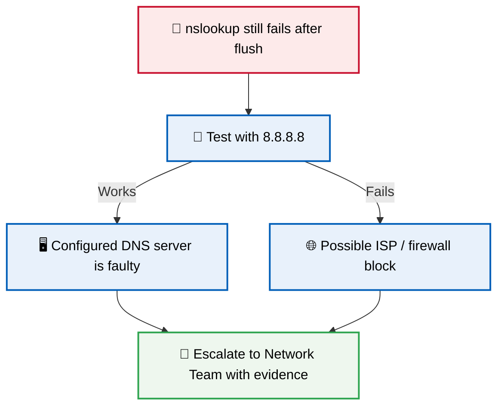
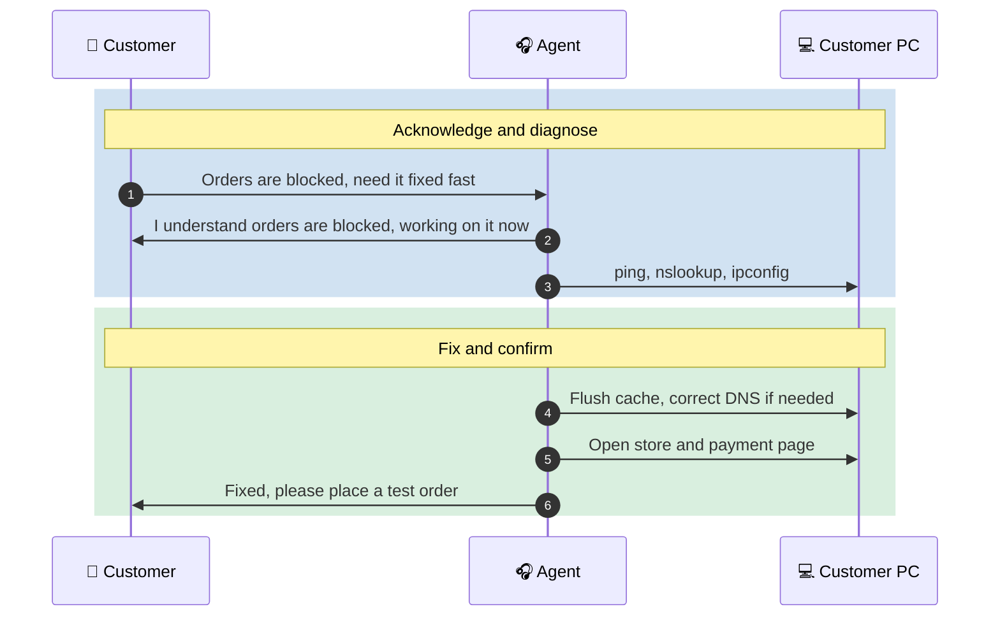
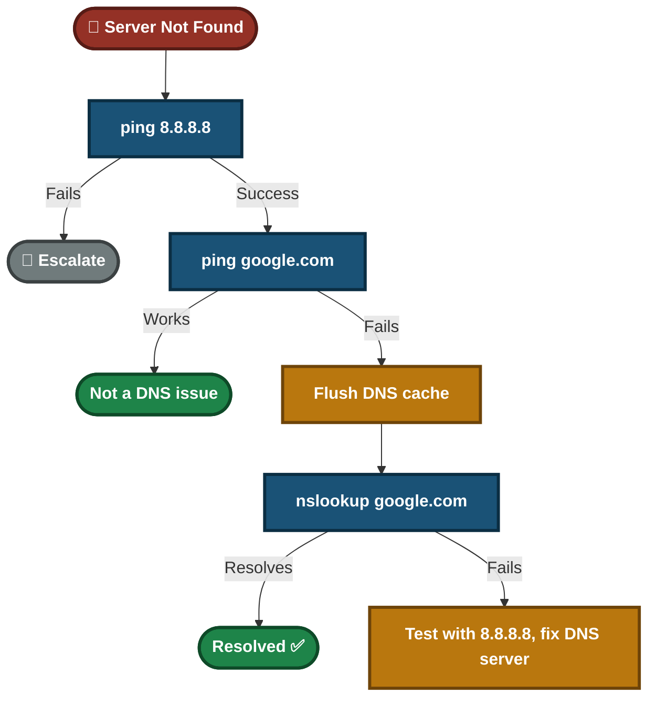

<div align="center">

# 🎥 DNS Resolution Issue — Video Script

**Video Knowledge Base — Script 01.1**

Windows Client · Network Diagnostics · Customer Communication


A customer sees "Server not found" on every website and cannot process store orders. This lab separates a DNS failure from a network outage, fixes it with built-in Windows tools, verifies the customer's real service, and shows how to talk to the customer while doing it.

</div>

---

## 📑 Table of Contents

1. [At a Glance](#at-a-glance)
2. [Project Background](#project-background)
3. [Environment](#environment)
4. [Project Flow](#project-flow)
5. [Module 1 — Issue Identification](#module-1)
6. [Where Name Lookup Can Break](#lookup-layers)
7. [Module 2 — Resolution & Verification](#module-2)
8. [Module 3 — Customer Interaction](#module-3)
9. [Decision Path](#decision-path)
10. [Video Script](#video-script)
11. [Project Summary](#project-summary)
12. [Challenges & Fixes](#challenges-fixes)
13. [Scope & Limitations](#scope-limitations)
14. [What I Learned](#what-i-learned)
15. [Skills Demonstrated](#skills-demonstrated)
16. [Screenshot Index](#screenshot-index)
17. [Repo Structure](#repo-structure)

---

<a id="at-a-glance"></a>
## 📊 At a Glance

| 🧩 Modules | 🖼️ Screenshots | 🔧 Tools Used | 👤 Customer Interactions |
|:---:|:---:|:---:|:---:|
| **3** | **5** | **5** | **1** |

---

<a id="project-background"></a>
## 📖 Project Background

"Server not found" can mean the internet is down, or it can mean only name lookup is broken. Guessing wastes time and business hours. This lab shows a repeatable way to tell the two apart and fix the real cause.

- **Module 1 — Issue Identification:** Prove whether the problem is DNS or general connectivity.
- **Module 2 — Resolution & Verification:** Clear the cache, test DNS, and confirm the customer's real service works.
- **Module 3 — Customer Interaction:** Keep the customer informed, without claiming a cause before it is proven.

> [!NOTE]
> The customer's business (an online store) was blocked, so the fix is not complete until the store and payment page work, not only `google.com`.

<div align="center">

### 🧩 Lab Setup at a Glance

<table>
<tr>
<td align="center" valign="top" width="42%">


**Affected Machine**<br>
<sub>Command Prompt (Administrator)<br>Cannot resolve domain names</sub>

</td>
<td align="center" valign="middle" width="16%">

**➜**<br>
<sub>lookup</sub>

</td>
<td align="center" valign="top" width="42%">


**Name Resolution**<br>
<sub>Configured DNS server<br>Test server: 8.8.8.8</sub>

</td>
</tr>
</table>

</div>

---

<a id="environment"></a>
## 🖧 Environment

| Item | Value |
|---|---|
| **Client OS** | Windows |
| **Shell** | Command Prompt (Run as Administrator) |
| **Commands** | `ping`, `nslookup`, `ipconfig /all`, `ipconfig /flushdns` |
| **Test DNS Server** | Google Public DNS (`8.8.8.8`) |

---

<a id="project-flow"></a>
## ⏱️ Project Flow


<p align="center"><em>Colors mark each stage of the support process.</em></p>

---

<a id="module-1"></a>
## 🔵 Module 1 — Issue Identification

**Objective:** Prove that the fault is in DNS, not in the network, before changing anything.

### Step 1 — Check the scope ✅

Ask whether other devices on the same network are also affected. One device points to a local problem. Many devices point to the DNS server or the network.

### Step 2 — Test raw connectivity ✅

```cmd
ping 8.8.8.8
```

### Step 3 — Test name resolution ✅

```cmd
ping google.com
```

<p align="center">
  <br>
  <em>Exhibit 1 — Ping to <code>8.8.8.8</code> succeeds, ping to <code>google.com</code> fails with "could not find host"</em>
</p>

🎯 **Result:** The network works but names do not resolve. This is a DNS problem.

| Check | Result |
|---|---|
| Other devices on same network | Confirm scope first |
| `ping 8.8.8.8` | Success — network connectivity confirmed |
| `ping google.com` | Failed — "could not find host" |
| Conclusion | DNS resolution issue, not a connectivity issue |

---

<a id="lookup-layers"></a>
## 🗺️ Where Name Lookup Can Break


- **Cache problem:** Flushing the cache fixes it.
- **DNS server problem:** Flushing does not fix it. The configured server must be corrected.
- The steps below tell the two apart, so the cause is proven and not guessed.

---

<a id="module-2"></a>
## 🟢 Module 2 — Resolution & Verification

**Objective:** Fix the resolution failure and prove the customer's real service works.

### Step 4 — Read the current DNS server ✅

```cmd
ipconfig /all
```

Note which DNS server the PC is using.

### Step 5 — Clear the DNS cache ✅

```cmd
ipconfig /flushdns
```

<p align="center">
  <br>
  <em>Exhibit 2 — DNS resolver cache flushed successfully</em>
</p>

### Step 6 — Test resolution ✅

```cmd
nslookup google.com
```

<p align="center">
  <br>
  <em>Exhibit 3 — <code>nslookup google.com</code> returns a valid IP address</em>
</p>

### Step 7 — If it still fails, test a second DNS server ✅

```cmd
nslookup google.com 8.8.8.8
```

If this works but the default lookup fails, the configured DNS server is the problem, not the cache.

> [!WARNING]
> Setting the PC to `8.8.8.8` is a temporary workaround only. On a business network a public DNS can break internal names (file servers, printers, domain login). Get approval and revert it once the real DNS server is fixed.

### Step 8 — Verify the customer's real service ✅

Open the online store and the payment page. Loading one website is not proof that orders work.

<p align="center">
  <br>
  <em>Exhibit 4 — Website and customer's store load correctly after the fix</em>
</p>

🎯 **Result:** Names resolve and the customer's service works.

| Check | Result |
|---|---|
| `nslookup google.com` | Resolves to valid IP ✅ |
| Browser reload | Site loads correctly ✅ |
| Customer's store and payment page | Loads correctly ✅ |

### 🔍 Analyst Note — What Happens If the Fix Does Not Work



- Attach the `ipconfig /all` output and the `nslookup` results to the ticket.
- Do not leave the temporary DNS change in place without documenting it.

---

<a id="module-3"></a>
## 🟠 Module 3 — Customer Interaction

**Objective:** Keep a stressed customer informed without over-promising or claiming a cause too early.

> *"Our online store couldn't process any orders while this was happening — I really need this fixed fast."*



**Agent response given:**
- **During the fix:** "I understand orders are blocked, and I'm working on it now. I'll confirm as soon as the store is working again."
- **After the fix:** "The issue is fixed. Please place a test order to confirm. If it happens again, contact us right away and I'll check the DNS server settings so it doesn't keep coming back."

---

<a id="decision-path"></a>
## 🧭 Decision Path



---

<a id="video-script"></a>
## 🎥 Video Script

**Title:** "Fix 'Server Not Found' Errors — DNS Resolution Explained"

<details>
<summary><b>Click to open the timed script</b></summary>

| Time | Section | What is said / shown |
|:---:|---|---|
| 0:00–0:20 | Introduction | "Today we're troubleshooting a DNS resolution failure. This happens when your computer can't convert a domain name like `google.com` into the IP address needed to reach it." |
| 0:20–1:00 | Issue Identification | Customer gets "Server not found" everywhere. Ping `8.8.8.8` works, ping `google.com` fails. This is DNS, not an outage. |
| 1:00–2:00 | Troubleshooting | Run `ipconfig /all`, `ipconfig /flushdns`, `nslookup google.com`. If it still fails, test `nslookup google.com 8.8.8.8`. |
| 2:00–2:30 | Verification | Ping again, open the site, then open the customer's store and payment page. |
| 2:30–3:00 | Customer Interaction | Customer says orders are blocked. Agent acknowledges, fixes, and asks for a test order. |

</details>

---

<a id="project-summary"></a>
## 📝 Project Summary

| Module | Tooling | Key Finding |
|---|---|---|
| Issue Identification | `ping` | Raw IP works, name fails, so the fault is DNS |
| Resolution & Verification | `ipconfig`, `nslookup` | Cache cleared, resolution restored, real service verified |
| Customer Interaction | Communication | Acknowledged impact, avoided unproven claims, asked for a test order |

---

<a id="challenges-fixes"></a>
## ⚠️ Challenges & Fixes

| ❌ Challenge | ✅ Fix |
|---|---|
| "Stale cache" was assumed as the cause without proof | Tested a second DNS server (`nslookup google.com 8.8.8.8`) to separate cache from DNS server |
| Loading `google.com` does not prove the customer's orders work | Opened the store and payment page as the final check |
| A public DNS workaround can break internal names on a business network | Marked it as temporary, approval required, and to be reverted |

---

<a id="scope-limitations"></a>
## 🚧 Scope & Limitations

- **Single client:** The lab covers one Windows machine.
- **Root cause of the bad cache is not proven.** The lab shows how to separate cache from DNS server, not why the cache went stale.
- **No internal DNS:** The lab does not include a domain network, so effects of a public DNS on internal names are described, not tested.

---

<a id="what-i-learned"></a>
## 🧠 What I Learned

- **Separate DNS from connectivity first.** A raw IP ping tells you which one you are dealing with.
- **Check the scope early.** One device and many devices point to different causes.
- **Prove the cause.** A second DNS server shows whether the problem is the cache or the server.
- **Verify the customer's real service.** A fixed search engine does not mean fixed orders.
- **Workarounds need a plan to revert.**

---

<a id="skills-demonstrated"></a>
## 🛠️ Skills Demonstrated

- Diagnosing DNS failures with `ping`, `nslookup` and `ipconfig`
- Separating cache problems from DNS server problems
- Verifying the customer's real service, not only a test site
- Communicating clearly with an urgent customer
- Documenting workarounds and escalation evidence

---

<a id="screenshot-index"></a>
## 🖼️ Screenshot Index

| # | File | Shows |
|:---:|---|---|
| 1 | `Exhibit1_ping_ip_success_vs_name_fail.png` | Ping to IP works, ping to name fails |
| 2 | `Exhibit2_flushdns.png` | DNS cache flushed |
| 3 | `Exhibit3_nslookup_resolves.png` | `nslookup` returns a valid IP |
| 4 | `Exhibit4_store_and_website_load.png` | Website and store load after the fix |
| 5 | `Exhibit5_ipconfig_all_dns_server.png` | Configured DNS server from `ipconfig /all` |

---

<a id="repo-structure"></a>
## 📁 Repo Structure

```text
DNS-Troubleshooting-Resolution/
|-- README.md
`-- screenshots/
    |-- Exhibit1_ping_ip_success_vs_name_fail.png
    |-- Exhibit2_flushdns.png
    |-- Exhibit3_nslookup_resolves.png
    |-- Exhibit4_store_and_website_load.png
    `-- Exhibit5_ipconfig_all_dns_server.png
```

<div align="center">

🌐 **[DNS Basics](https://www.cloudflare.com/learning/dns/what-is-dns/)** · 🪟 **[Windows Commands](https://learn.microsoft.com/windows-server/administration/windows-commands/windows-commands)** · 🛠️ **[Troubleshooting Flow](#decision-path)**

</div>
