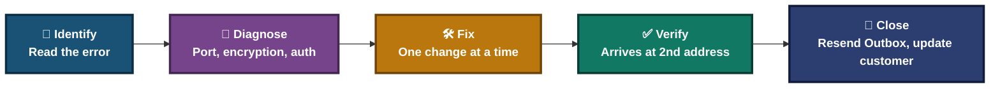
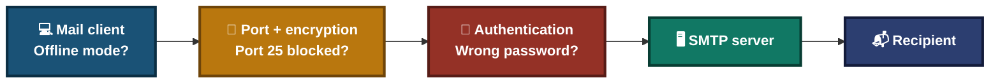
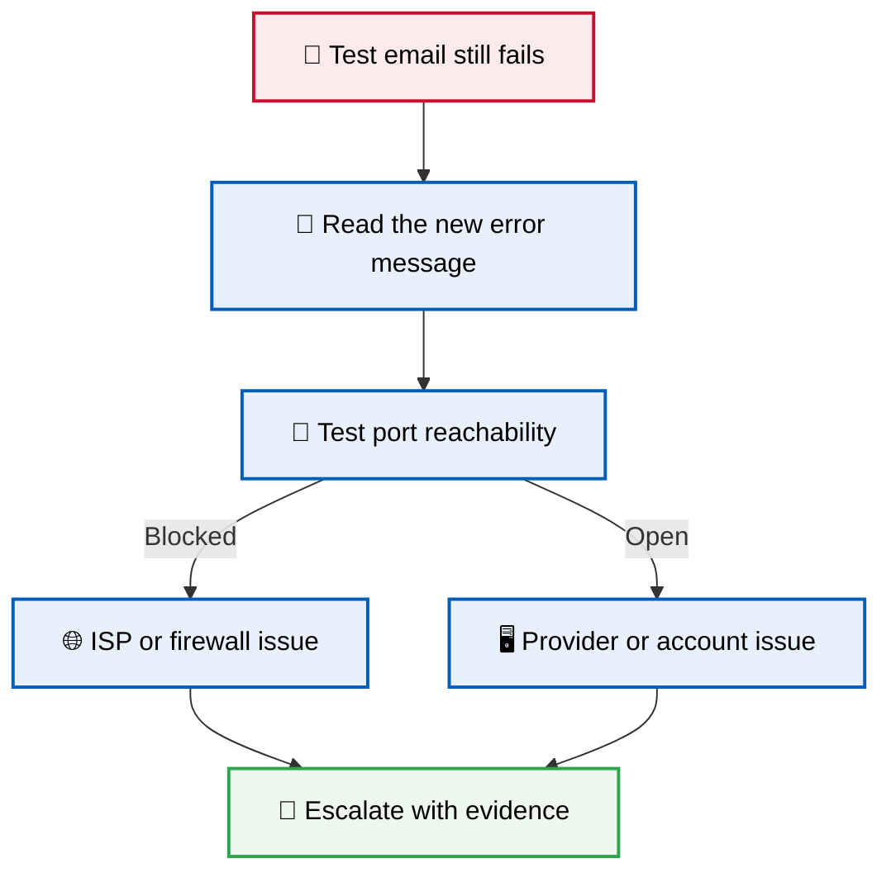
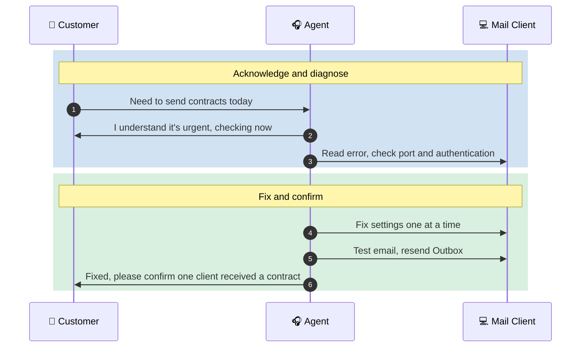
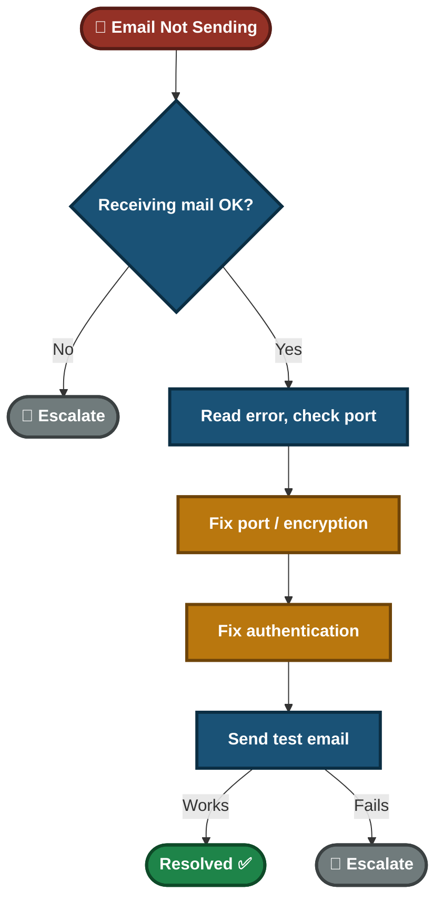

<div align="center">

# ✉️ Email Sending Failure — SMTP Troubleshooting & Customer Support

**Lab — IT Support Troubleshooting**

Mail Client · SMTP Configuration · Customer Communication


A customer can receive email but cannot send it, and contracts are stuck in the Outbox. This lab finds the real cause from the error message and outgoing settings, fixes one setting at a time, proves the mail arrived, and shows how to keep an urgent customer informed.

</div>

---

## 📑 Table of Contents

1. [At a Glance](#at-a-glance)
2. [Project Background](#project-background)
3. [Environment](#environment)
4. [Project Flow](#project-flow)
5. [Module 1 — Issue Identification](#module-1)
6. [Where Sending Can Break](#send-layers)
7. [Module 2 — Resolution & Verification](#module-2)
8. [Module 3 — Customer Interaction](#module-3)
9. [Decision Path](#decision-path)
10. [Video Script](#video-script)
11. [Project Summary](#project-summary)
12. [Challenges & Fixes](#challenges-fixes)
13. [Scope & Limitations](#scope-limitations)
14. [What I Learned](#what-i-learned)
15. [Skills Demonstrated](#skills-demonstrated)
16. [Screenshot Index](#screenshot-index)
17. [Repo Structure](#repo-structure)

---

<a id="at-a-glance"></a>
## 📊 At a Glance

| 🧩 Modules | 🖼️ Screenshots | 🔧 Settings Checked | 👤 Customer Interactions |
|:---:|:---:|:---:|:---:|
| **3** | **5** | **4** | **1** |

---

<a id="project-background"></a>
## 📖 Project Background

Receiving and sending email use different servers and settings. When only sending fails, the fault is usually in the outgoing (SMTP) configuration. Changing several settings at once hides which one was the cause. This lab uses a slow, one-change-at-a-time method.

- **Module 1 — Issue Identification:** Confirm inbound works, read the exact error, and ask what changed.
- **Module 2 — Resolution & Verification:** Fix the port, encryption and authentication, then prove the mail arrived.
- **Module 3 — Customer Interaction:** Handle an urgent customer who must send contracts today.

> [!NOTE]
> "Sent" on the customer's side is not proof of delivery. The fix is confirmed only when a test email arrives at a second address and the stuck Outbox emails are resent.

<div align="center">

### 🧩 Lab Setup at a Glance

<table>
<tr>
<td align="center" valign="top" width="42%">


**Customer's Mail Client**<br>
<sub>Outgoing mail stuck in Outbox<br>Incoming mail works</sub>

</td>
<td align="center" valign="middle" width="16%">

**➜**<br>
<sub>SMTP</sub>

</td>
<td align="center" valign="top" width="42%">


**Outgoing Mail Server**<br>
<sub>Port, encryption and<br>authentication settings</sub>

</td>
</tr>
</table>

</div>

---

<a id="environment"></a>
## 🖧 Environment

| Item | Value |
|---|---|
| **Mail Client** | Outlook (or the customer's mail client) |
| **Settings Reviewed** | Outgoing port, encryption, authentication, password |
| **Connection Test** | PowerShell `Test-NetConnection` |
| **Ports in Scope** | 25 (often blocked), 587 (STARTTLS), 465 (SSL/TLS) |

---

<a id="project-flow"></a>
## ⏱️ Project Flow


<p align="center"><em>Colors mark each stage of the support process.</em></p>

---

<a id="module-1"></a>
## 🔵 Module 1 — Issue Identification

**Objective:** Narrow the problem to outgoing mail using evidence, not a guess.

### Step 1 — Confirm inbound and outbound status ✅

<p align="center">
  <br>
  <em>Exhibit 1 — Outgoing emails stuck in the Outbox while incoming mail works</em>
</p>

### Step 2 — Read the exact error and check the basics ✅

- Note the exact error message or code.
- Check that Outlook is not in "Work Offline" mode.
- Ask what changed recently (password, new device, new network).

🎯 **Result:** The fault is isolated to outgoing mail.

| Check | Result |
|---|---|
| Inbound mail | Working normally ✅ |
| Outbound mail | Stuck in outbox ❌ |
| Exact error message | Recorded |
| Recent changes | Asked |
| Conclusion | Likely outgoing SMTP configuration, confirmed by the steps below |

---

<a id="send-layers"></a>
## 🗺️ Where Sending Can Break



- Each box is a place the message can fail.
- The error message usually points to one of them.

---

<a id="module-2"></a>
## 🟢 Module 2 — Resolution & Verification

**Objective:** Fix the cause with one change at a time, then prove delivery.

### Step 3 — Check the outgoing port and encryption ✅

Open Outlook → Account Settings → outgoing server.

| Setting | Recommended | Why |
|---|---|---|
| Port 25 | Avoid | Commonly blocked by ISPs |
| Port 587 | STARTTLS | Standard secure outgoing port |
| Port 465 | SSL/TLS | Alternative some providers require |

Always check the provider's own settings page for the correct values.

<p align="center">
  <br>
  <em>Exhibit 2 — Outgoing server settings before the change</em>
</p>

### Step 4 — Enable authentication and confirm the password ✅

Turn on "outgoing server requires authentication" and confirm the password is current. This is the most commonly missed setting.

### Step 5 — If it still fails, test the port ✅

```powershell
Test-NetConnection <smtp-server> -Port 587
```

This separates a wrong setting from a blocked connection.

<p align="center">
  <br>
  <em>Exhibit 3 — Outgoing server settings after the change</em>
</p>

> [!IMPORTANT]
> Change one setting at a time and test after each. If you change port and authentication together, you cannot say which one fixed it.

### Step 6 — Send a test email and confirm it arrives ✅

<p align="center">
  <br>
  <em>Exhibit 4 — Test email received at a second address</em>
</p>

### Step 7 — Resend the stuck Outbox emails ✅

<p align="center">
  <br>
  <em>Exhibit 5 — Outbox is empty after the stuck emails are resent</em>
</p>

🎯 **Result:** Outgoing mail works and the stuck emails were sent.

| Check | Result |
|---|---|
| Test email sent | Sent without error ✅ |
| Test email received at a second address | Arrived ✅ |
| Stuck Outbox emails | Resent ✅ |

### 🔍 Analyst Note — What Happens If the Fix Does Not Work



- Attach the error message and the port test result to the ticket.

---

<a id="module-3"></a>
## 🟠 Module 3 — Customer Interaction

**Objective:** Handle an urgent customer clearly and confirm the result with them.

> *"I need to send contracts to clients today — this is urgent."*



**Agent response given:** "I understand it's urgent. I've fixed the outgoing mail settings, sent a test email that arrived, and resent the emails that were stuck in your Outbox. Please check with one client that they received their contract. If sending stops again, contact me and tell me the exact error message."

---

<a id="decision-path"></a>
## 🧭 Decision Path



---

<a id="video-script"></a>
## 🎥 Video Script

**Title:** "Fix Email Not Sending Issues — SMTP Troubleshooting Guide"

<details>
<summary><b>Click to open the timed script</b></summary>

| Time | Section | What is said / shown |
|:---:|---|---|
| 0:00–0:20 | Introduction | "Email not sending? Let's find the real cause first, then fix it one change at a time." |
| 0:20–1:00 | Issue Identification | Customer can receive but not send. Read the exact error and ask what changed. |
| 1:00–2:00 | Troubleshooting | Check port and encryption, enable authentication, test the port if needed. |
| 2:00–2:30 | Verification | Send a test email, confirm it arrives at a second address, resend Outbox emails. |
| 2:30–3:00 | Customer Interaction | Customer needs to send contracts today. Agent fixes, confirms, and asks the customer to check with one client. |

</details>

---

<a id="project-summary"></a>
## 📝 Project Summary

| Module | Tooling | Key Finding |
|---|---|---|
| Issue Identification | Mail client, error message | Inbound works, outbound stuck, so the fault is in outgoing settings |
| Resolution & Verification | Outlook settings, `Test-NetConnection` | Settings fixed one at a time, delivery confirmed, Outbox resent |
| Customer Interaction | Communication | Acknowledged urgency and asked the customer to confirm with a client |

---

<a id="challenges-fixes"></a>
## ⚠️ Challenges & Fixes

| ❌ Challenge | ✅ Fix |
|---|---|
| Port and authentication were changed together, so the real cause was unclear | Change one setting at a time and test after each |
| Cause was assumed without reading the error message | Read the exact error before changing anything |
| "Delivered" was judged only from the sender's side | Sent a test email to a second address and confirmed it arrived |
| Contracts were still stuck in the Outbox after the fix | Resent the stuck emails and asked the customer to confirm with a client |

---

<a id="scope-limitations"></a>
## 🚧 Scope & Limitations

- **One mail client:** The lab covers Outlook only. Other clients use different menus.
- **Provider settings vary.** Some providers require 465, or modern sign-in instead of a password. Always check the provider's page.
- **Spam filtering and SPF/DKIM/DMARC are not covered.** A delivered email can still land in the recipient's spam folder.

---

<a id="what-i-learned"></a>
## 🧠 What I Learned

- **Inbound working does not prove outbound works.** They use separate servers and settings.
- **Read the exact error first.** It usually names the cause.
- **Change one setting at a time.** Otherwise the cause stays unknown.
- **Port 25 is often blocked by ISPs**, especially for home and remote workers.
- **Confirm the result.** A test email at a second address and a resent Outbox prove the fix.

---

<a id="skills-demonstrated"></a>
## 🛠️ Skills Demonstrated

- Diagnosing outgoing mail failures from error messages
- Configuring SMTP port, encryption and authentication
- Testing port reachability with PowerShell
- Verifying delivery instead of assuming it
- Communicating with an urgent customer

---

<a id="screenshot-index"></a>
## 🖼️ Screenshot Index

| # | File | Shows |
|:---:|---|---|
| 1 | `Exhibit1_outbox_stuck.png` | Emails stuck in the Outbox |
| 2 | `Exhibit2_smtp_settings_before.png` | Outgoing settings before the change |
| 3 | `Exhibit3_smtp_settings_after.png` | Outgoing settings after the change |
| 4 | `Exhibit4_test_email_received.png` | Test email received at a second address |
| 5 | `Exhibit5_outbox_cleared.png` | Outbox empty after resend |

---

<a id="repo-structure"></a>
## 📁 Repo Structure

```text
Email-Troubleshooting/
|-- README.md
`-- screenshots/
    |-- Exhibit1_outbox_stuck.png
    |-- Exhibit2_smtp_settings_before.png
    |-- Exhibit3_smtp_settings_after.png
    |-- Exhibit4_test_email_received.png
    `-- Exhibit5_outbox_cleared.png
```

<div align="center">

✉️ **[SMTP Basics](https://www.cloudflare.com/learning/email-security/what-is-smtp/)** · 💻 **[Outlook](https://support.microsoft.com/outlook)** · 🛠️ **[Troubleshooting Flow](#decision-path)**

</div>
