<div align="center">

# 🎥 Email Sending Failure — Video Script

**Video Knowledge Base — Script 01.2**

Thunderbird · Gmail (OAuth2) · Windows 10 · Customer Communication


A customer's email stays stuck in the Outbox and never reaches the recipient. This lab checks that receiving still works, finds why sending fails, fixes the outgoing (SMTP) settings step by step, proves the email arrives, and shows how to talk to the customer while doing it.

</div>

---

## 📑 Table of Contents

1. [At a Glance](#at-a-glance)
2. [Project Background](#project-background)
3. [Environment](#environment)
4. [Project Flow](#project-flow)
5. [Module 1 — Issue Identification](#module-1)
6. [Where Email Sending Can Break](#sending-layers)
7. [Module 2 — Resolution & Verification](#module-2)
8. [Module 3 — Customer Interaction](#module-3)
9. [Decision Path](#decision-path)
10. [Video Script](#video-script)
11. [Project Summary](#project-summary)
12. [Challenges & Fixes](#challenges-fixes)
13. [Scope & Limitations](#scope-limitations)
14. [What I Learned](#what-i-learned)
15. [Skills Demonstrated](#skills-demonstrated)
16. [Screenshot Index](#screenshot-index)
17. [Repo Structure](#repo-structure)

---

<a id="at-a-glance"></a>
## 📊 At a Glance

| 🧩 Modules | 🖼️ Screenshots | 🔧 Tools Used | 👤 Customer Interactions |
|:---:|:---:|:---:|:---:|
| **3** | **16** | **3** | **1** |

---

<a id="project-background"></a>
## 📖 Project Background

"My email won't send" can mean the account is broken, the network blocks the connection, or the outgoing settings are wrong. Guessing wastes time, and a stuck contract email can cost business. This lab shows a repeatable way to narrow it down and fix it, using only what the screen shows.

- **Module 1 — Issue Identification:** Check receiving, reproduce the stuck email, read the first error.
- **Module 2 — Resolution & Verification:** Test the network port, fix the port and security, read the new error, fix authentication, and confirm the email arrives.
- **Module 3 — Customer Interaction:** Keep the customer informed without claiming a cause before it is proven.

> [!NOTE]
> The outgoing settings were broken on purpose to reproduce the problem. The fix is not complete until the email arrives at the recipient, not only until the Outbox is empty.

<div align="center">

### 🧩 Lab Setup at a Glance

<table>
<tr>
<td align="center" valign="top" width="42%">


**Affected Machine**<br>
<sub>Windows 10<br>Email stuck in Outbox</sub>

</td>
<td align="center" valign="middle" width="16%">

**➜**<br>
<sub>SMTP</sub>

</td>
<td align="center" valign="top" width="42%">


**Outgoing Mail Server**<br>
<sub>smtp.gmail.com<br>Test Gmail account (OAuth2)</sub>

</td>
</tr>
</table>

</div>

---

<a id="environment"></a>
## 🖧 Environment

| Item | Value |
|---|---|
| **Client OS** | Windows 10 |
| **Mail client** | Mozilla Thunderbird |
| **Account** | Test Gmail account, sign-in with OAuth2 (no app password) |
| **Recipient** | A second personal address (hidden in screenshots) |
| **Network test** | PowerShell `Test-NetConnection` |
| **Original working values** | SMTP `smtp.gmail.com`, port 465, SSL/TLS, OAuth2 (found automatically by Thunderbird) |
| **Faulty values (lab setup)** | Port 25, connection security None, authentication No authentication |
| **Working values at the end** | Port 587, STARTTLS, OAuth2 |

> [!NOTE]
> An earlier version of this script used Outlook. This lab was done with Thunderbird and Gmail, so the steps and screenshots follow Thunderbird.

---

<a id="project-flow"></a>
## ⏱️ Project Flow

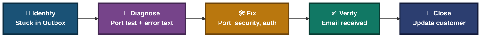
```mermaid
flowchart LR
    A["🔎 Identify<br/>Stuck in Outbox"]:::s1 --> B["🧪 Diagnose<br/>Port test + error text"]:::s2 --> C["🛠 Fix<br/>Port, security, auth"]:::s3 --> D["✅ Verify<br/>Email received"]:::s4 --> E["👤 Close<br/>Update customer"]:::s5

    classDef s1 fill:#1A5276,stroke:#0B2E43,stroke-width:3px,color:#FFFFFF,font-weight:bold
    classDef s2 fill:#76448A,stroke:#432752,stroke-width:3px,color:#FFFFFF,font-weight:bold
    classDef s3 fill:#B9770E,stroke:#6E4409,stroke-width:3px,color:#FFFFFF,font-weight:bold
    classDef s4 fill:#117864,stroke:#083D33,stroke-width:3px,color:#FFFFFF,font-weight:bold
    classDef s5 fill:#2C3E70,stroke:#131B3A,stroke-width:3px,color:#FFFFFF,font-weight:bold
```
<p align="center"><em>Colors mark each stage of the support process.</em></p>

> [!NOTE]
> Exhibit numbers 1 to 5 come from the original script. Exhibits 6 to 16 were added in this lab. They are shown below in the order the work was done, so the numbers are not always in sequence.

---

<a id="module-1"></a>
## 🔵 Module 1 — Issue Identification

**Objective:** Find out what is broken before changing anything.

### Step 1 — Set up the account ✅

Add the test Gmail account in Thunderbird. Thunderbird found the settings by itself and Google asked for permission through its sign-in page (OAuth2).

<p align="center">
  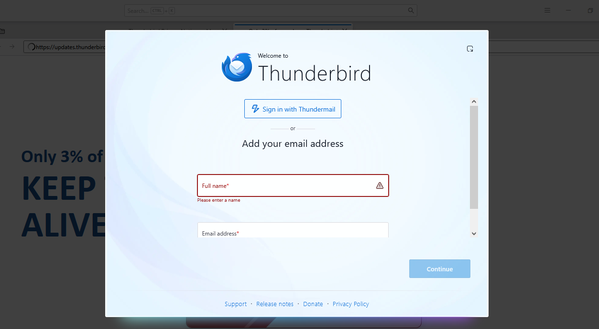<br>
  <em>Exhibit 12 — Thunderbird add-account screen. The red "Please enter a name" note only means the name field was still empty</em>
</p>

<p align="center">
  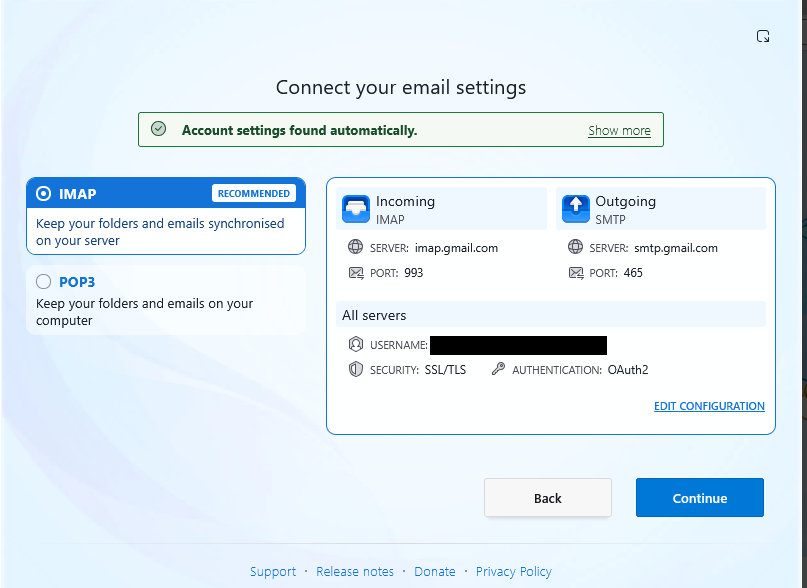<br>
  <em>Exhibit 13 — Settings found automatically: IMAP <code>imap.gmail.com</code> 993, SMTP <code>smtp.gmail.com</code> 465, SSL/TLS, OAuth2. These are the original working values (username hidden)</em>
</p>

<p align="center">
  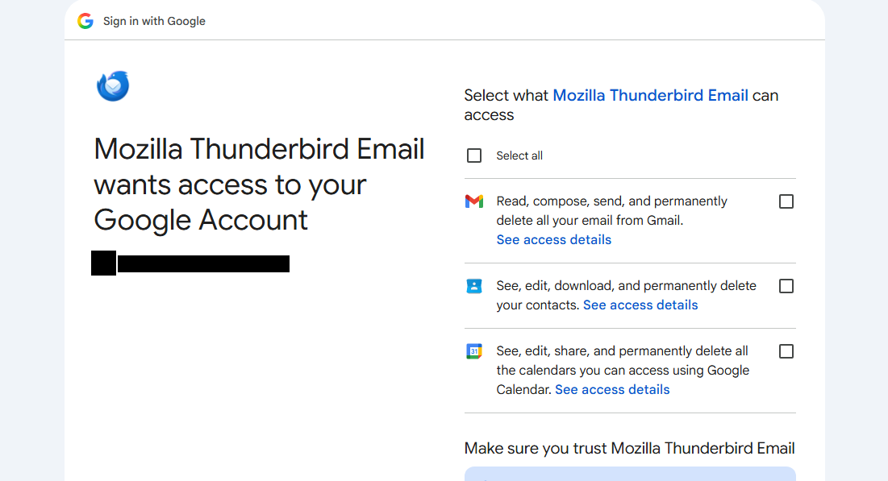<br>
  <em>Exhibit 14 — Google's permission screen for Mozilla Thunderbird Email (account name hidden, browser bar cropped)</em>
</p>

### Step 2 — Check that receiving works ✅

<p align="center">
  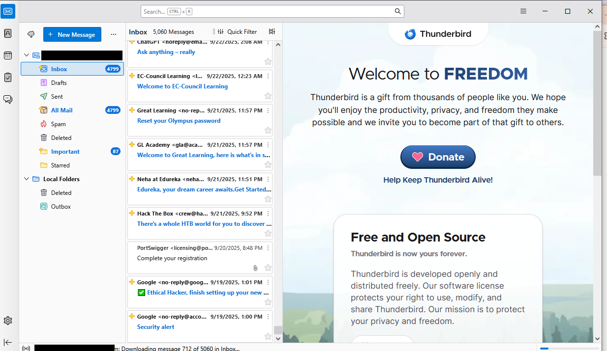<br>
  <em>Exhibit 6 — Inbox shows 5,060 messages and the status bar says it is still downloading (message 712 of 5,060). Incoming mail works. The sync was still running when this was taken</em>
</p>

If receiving works but sending fails, the account itself is fine and the problem is in the outgoing (SMTP) side.

### Step 3 — Set up the failure on purpose ✅

Open Account Settings > Outgoing Server > Edit and change the SMTP server to port 25, connection security None, authentication No authentication.

<p align="center">
  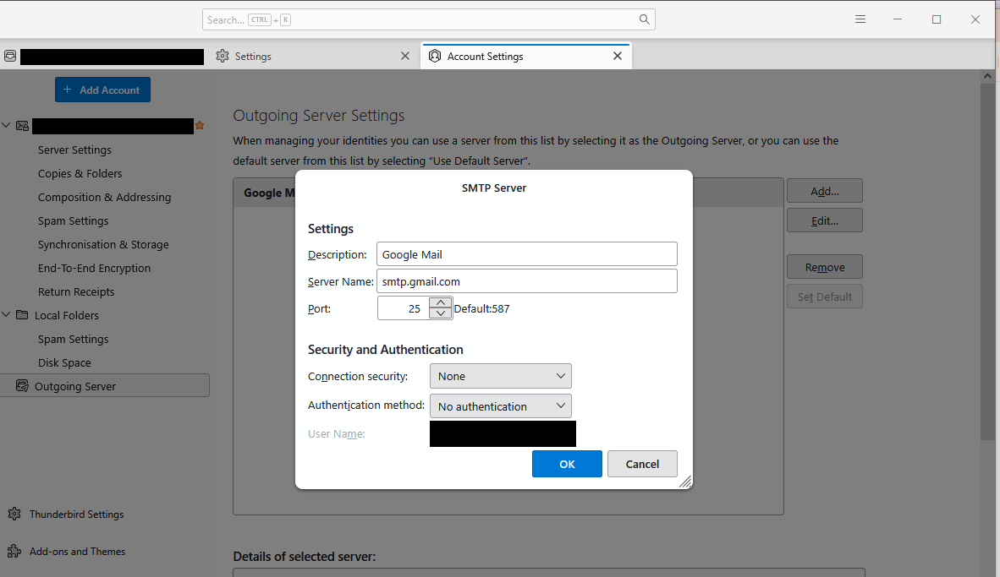<br>
  <em>Exhibit 2 — Broken SMTP settings, taken before clicking OK: Port 25, None, No authentication (username and account names hidden)</em>
</p>

### Step 4 — Send a test email and let it get stuck ✅

Write a short email (subject "Contract test") and use **File > Send Later**, so it waits in the Outbox.

<p align="center">
  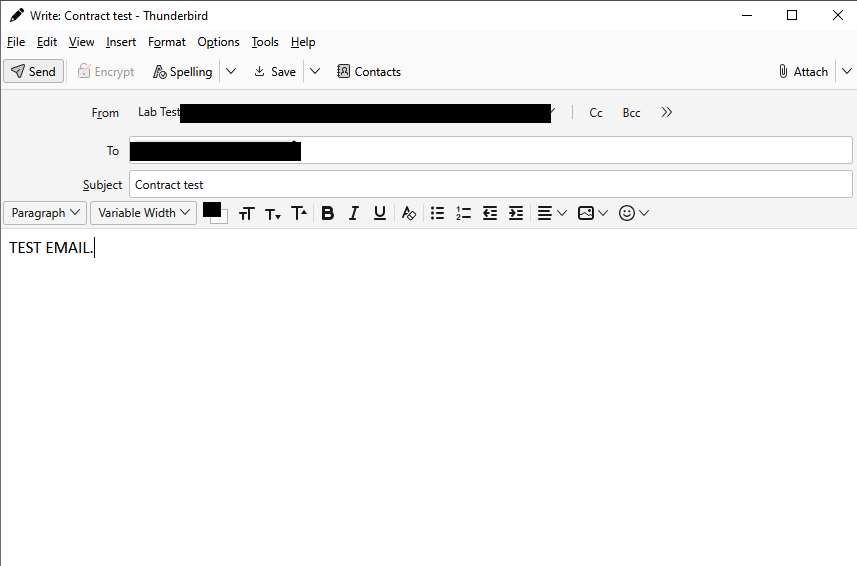<br>
  <em>Exhibit 11 — Test email "Contract test", body "TEST EMAIL." (addresses hidden)</em>
</p>

<p align="center">
  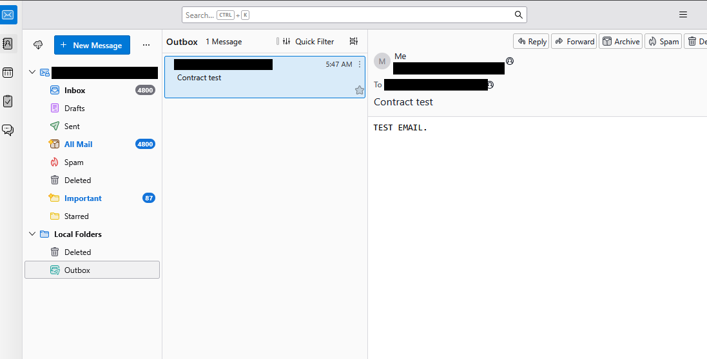<br>
  <em>Exhibit 1 — Outbox shows 1 message, "Contract test", waiting to be sent (addresses hidden)</em>
</p>

### Step 5 — Read the first error ✅

Outbox > menu (three lines, top right) > File > Send Unsent Messages. The error did not show at once. It appeared after waiting a moment.

<p align="center">
  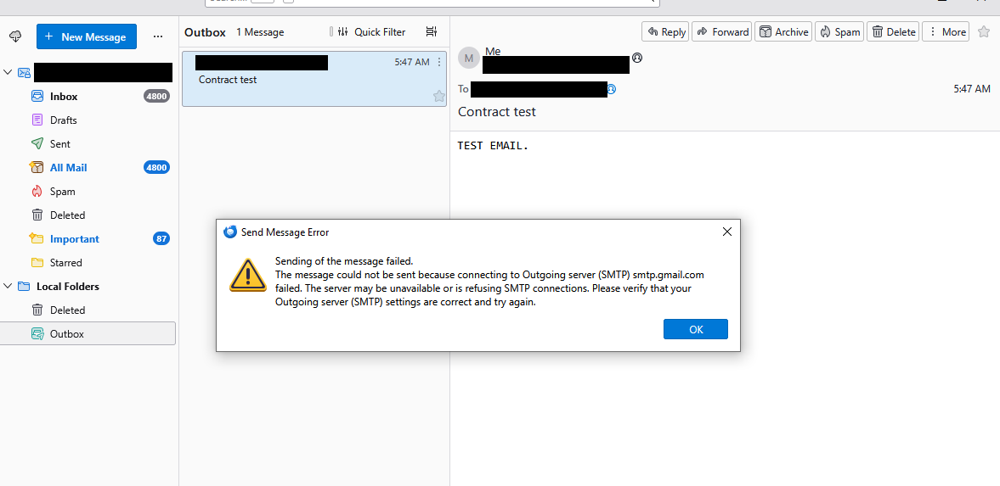<br>
  <em>Exhibit 8 — "Send Message Error": connecting to the outgoing server <code>smtp.gmail.com</code> failed, the server may be unavailable or refusing SMTP connections</em>
</p>

🎯 **Result:** Receiving works, sending fails at the connection to the outgoing server.

| Check | Result |
|---|---|
| Receiving (Inbox) | Works |
| Outbox | 1 message stuck |
| Error text | Connecting to outgoing server `smtp.gmail.com` failed |
| Conclusion | Problem is on the outgoing connection, cause not yet known |

---

<a id="sending-layers"></a>
## 🗺️ Where Email Sending Can Break

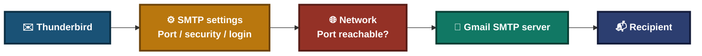
```mermaid
flowchart LR
    A["✉️ Thunderbird"]:::a --> B["⚙️ SMTP settings<br/>Port / security / login"]:::b --> C["🌐 Network<br/>Port reachable?"]:::c --> D["📮 Gmail SMTP server"]:::d --> E["📬 Recipient"]:::e

    classDef a fill:#1A5276,stroke:#0B2E43,stroke-width:3px,color:#FFFFFF,font-weight:bold
    classDef b fill:#B9770E,stroke:#6E4409,stroke-width:3px,color:#FFFFFF,font-weight:bold
    classDef c fill:#943126,stroke:#571C16,stroke-width:3px,color:#FFFFFF,font-weight:bold
    classDef d fill:#117864,stroke:#083D33,stroke-width:3px,color:#FFFFFF,font-weight:bold
    classDef e fill:#2C3E70,stroke:#131B3A,stroke-width:3px,color:#FFFFFF,font-weight:bold
```

- **Network problem:** The port cannot be reached at all. Changing mail settings will not help until a reachable port is used.
- **Settings problem:** The port is reachable but the server refuses the message. The server's reply says what it wants.
- The steps below tell the two apart, so the cause is read from evidence and not guessed.

---

<a id="module-2"></a>
## 🟢 Module 2 — Resolution & Verification

**Objective:** Fix the sending failure and prove the email arrives.

### Step 6 — Test the network port ✅

```powershell
Test-NetConnection smtp.gmail.com -Port 25
```

```powershell
Test-NetConnection smtp.gmail.com -Port 587
```

<p align="center">
  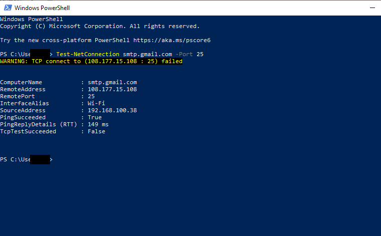<br>
  <em>Exhibit 7 — Port 25: ping works (<code>PingSucceeded True</code>) but <code>TcpTestSucceeded False</code> with "TCP connect failed". The server is reachable, port 25 is not (Windows username hidden)</em>
</p>

<p align="center">
  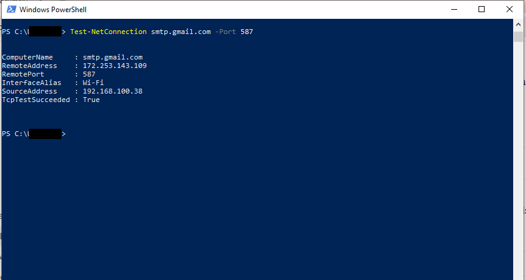<br>
  <em>Exhibit 10 — Port 587: <code>TcpTestSucceeded True</code> (Windows username hidden)</em>
</p>

Port 25 fails on this network and port 587 works at the connection level.

### Step 7 — Fix the port and security first ✅

Only the port (587) and connection security (STARTTLS) were changed. Authentication was left as it was.

<p align="center">
  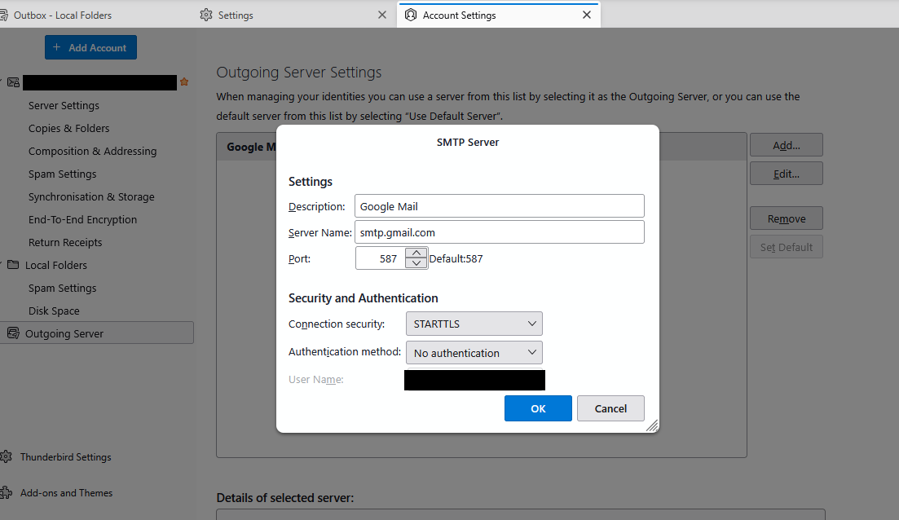<br>
  <em>Exhibit 9 — SMTP window after changing only port and security: Port 587, STARTTLS, authentication still "No authentication" (taken before OK, names hidden)</em>
</p>

<p align="center">
  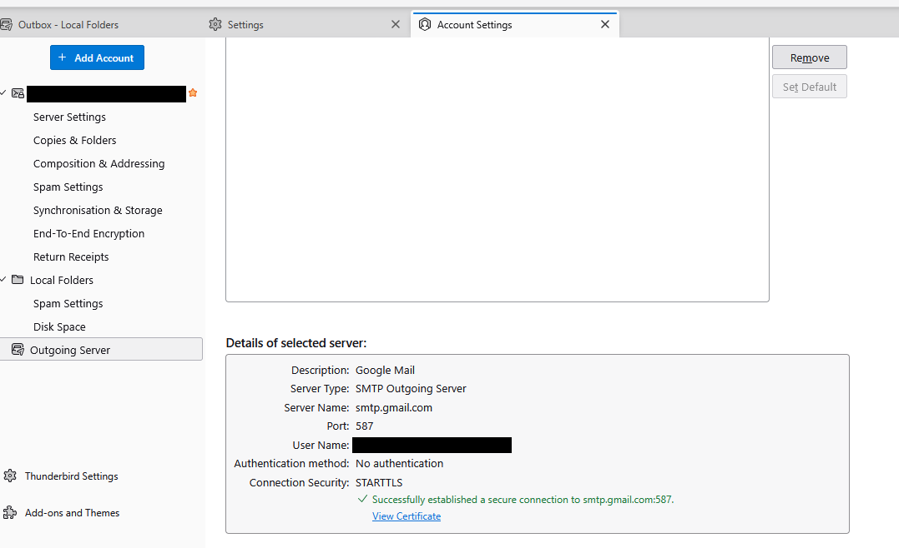<br>
  <em>Exhibit 15 — Outgoing Server details: port 587, STARTTLS, No authentication, and "Successfully established a secure connection to smtp.gmail.com:587" (username hidden)</em>
</p>

### Step 8 — Send again and read the new error ✅

<p align="center">
  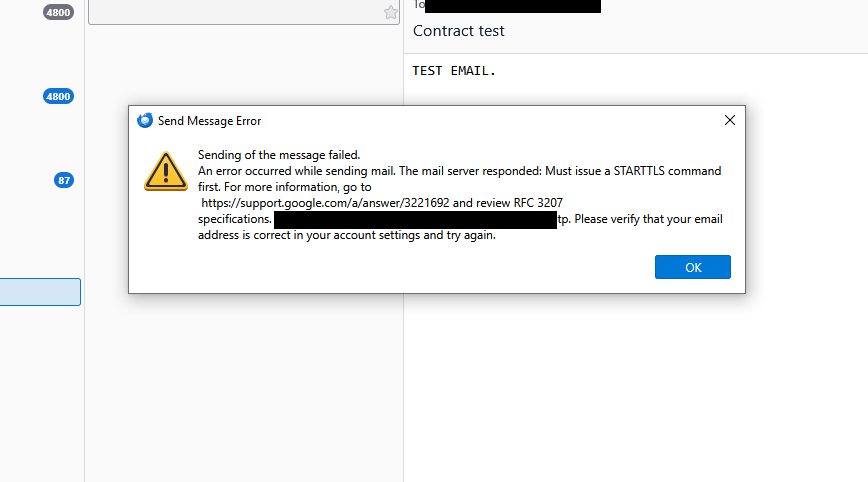<br>
  <em>Exhibit 16 — New error: "Must issue a STARTTLS command first" with a link to RFC 3207 (Google error ID and address hidden)</em>
</p>

The error changed, so the port fix did something. The message talks about STARTTLS even though STARTTLS was selected, and it does not mention authentication. The cause of this message was not proven in this lab. The next change tested was authentication.

### Step 9 — Fix authentication ✅

Set Authentication method to **OAuth2** and change nothing else. The User Name field must show the Gmail address.

<p align="center">
  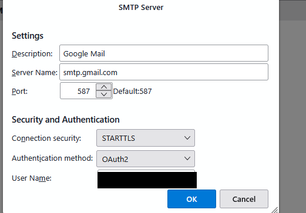<br>
  <em>Exhibit 3 — SMTP window before clicking OK: Port 587, STARTTLS, Authentication method OAuth2 (username hidden)</em>
</p>

### Step 10 — Send again and verify ✅

Outbox > menu > File > Send Unsent Messages. No error appeared and the Outbox emptied.

<p align="center">
  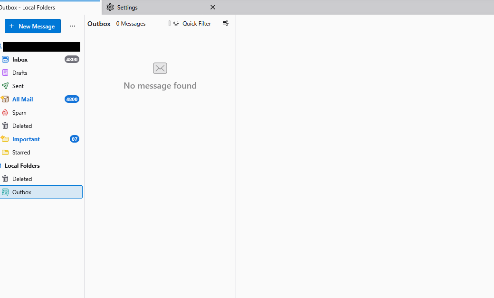<br>
  <em>Exhibit 5 — Outbox shows 0 messages after sending. An empty Outbox only means Thunderbird handed the mail off</em>
</p>

The real proof is on the recipient side:

<p align="center">
  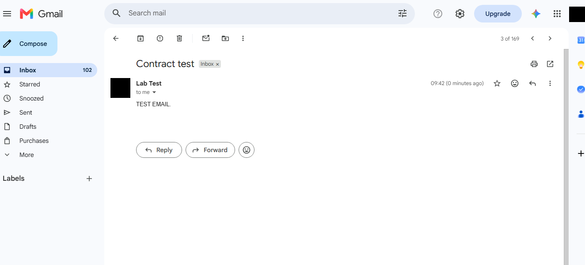<br>
  <em>Exhibit 4 — "Contract test" with body "TEST EMAIL." arrived in the recipient's Gmail Inbox (browser bar and profile pictures hidden)</em>
</p>

🎯 **Result:** The email was sent with port 587, STARTTLS and OAuth2, and it arrived.

| Check | Result |
|---|---|
| Port 25 TCP test | Failed ❌ |
| Port 587 TCP test | Succeeded ✅ |
| Port 587 + STARTTLS, no authentication | Sending failed with a STARTTLS error ❌ |
| Port 587 + STARTTLS + OAuth2 | Outbox emptied, no error ✅ |
| Recipient's Inbox | "Contract test" received ✅ |

### 🔍 Analyst Note — What Happens If the Fix Does Not Work

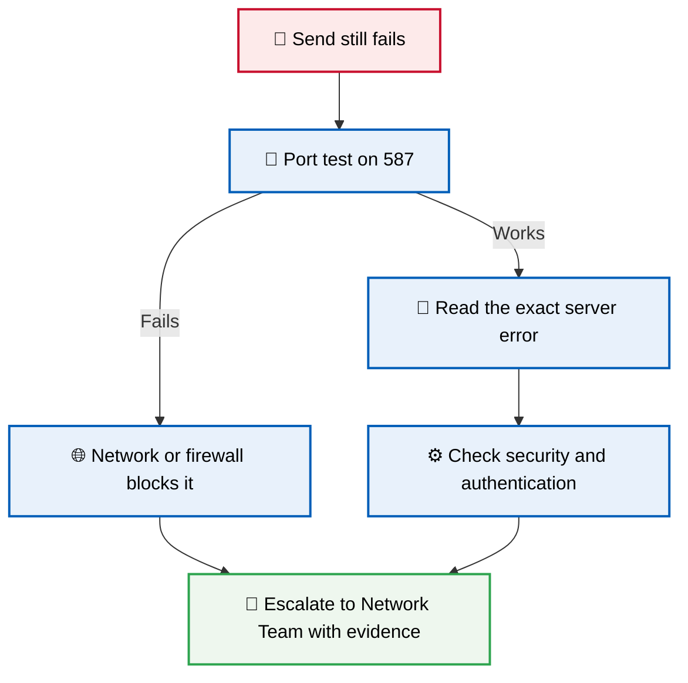
```mermaid
flowchart TD
    A["🚨 Send still fails"]:::alert --> B["🔎 Port test on 587"]:::work
    B -->|Fails| C["🌐 Network or firewall blocks it"]:::work
    B -->|Works| D["📖 Read the exact server error"]:::work
    D --> E["⚙️ Check security and authentication"]:::work
    C --> F["📨 Escalate to Network Team with evidence"]:::done
    E --> F

    classDef alert fill:#fdeaea,stroke:#C8102E,stroke-width:2px,color:#000
    classDef work fill:#e8f1fb,stroke:#005EB8,stroke-width:2px,color:#000
    classDef done fill:#eef7ee,stroke:#2ea44f,stroke-width:2px,color:#000
```

- Attach the exact error text and the port test results to the ticket.
- Do not leave temporary settings changes in place without documenting them.

> [!WARNING]
> Google sign-in and permission windows can expire if left open. Do the resend soon after changing the settings.

---

<a id="module-3"></a>
## 🟠 Module 3 — Customer Interaction

**Objective:** Keep a worried customer informed without over-promising or claiming a cause too early.

> *"My contract email to a client is stuck and won't send — I need it to go out today."*

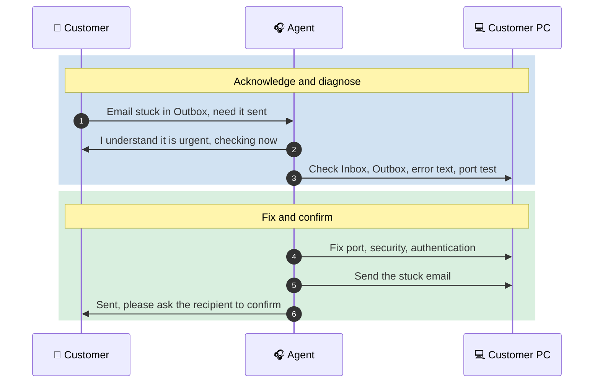
```mermaid
sequenceDiagram
    autonumber
    participant C as 👤 Customer
    participant A as 🎧 Agent
    participant P as 💻 Customer PC

    rect rgba(0, 94, 184, 0.18)
    Note over C,P: Acknowledge and diagnose
    C->>A: Email stuck in Outbox, need it sent
    A->>C: I understand it is urgent, checking now
    A->>P: Check Inbox, Outbox, error text, port test
    end

    rect rgba(46, 164, 79, 0.18)
    Note over C,P: Fix and confirm
    A->>P: Fix port, security, authentication
    A->>P: Send the stuck email
    A->>C: Sent, please ask the recipient to confirm
    end
```

**Agent response given:**
- **During the fix:** "I understand this email is important, and I'm working on it now. I'll tell you as soon as it is sent."
- **After the fix:** "The email has been sent. Please ask your client to confirm they received it. If it happens again, contact us right away and I'll check the outgoing mail settings."

> The customer conversation is a scripted example. It was not tested with a real customer.

---

<a id="decision-path"></a>
## 🧭 Decision Path

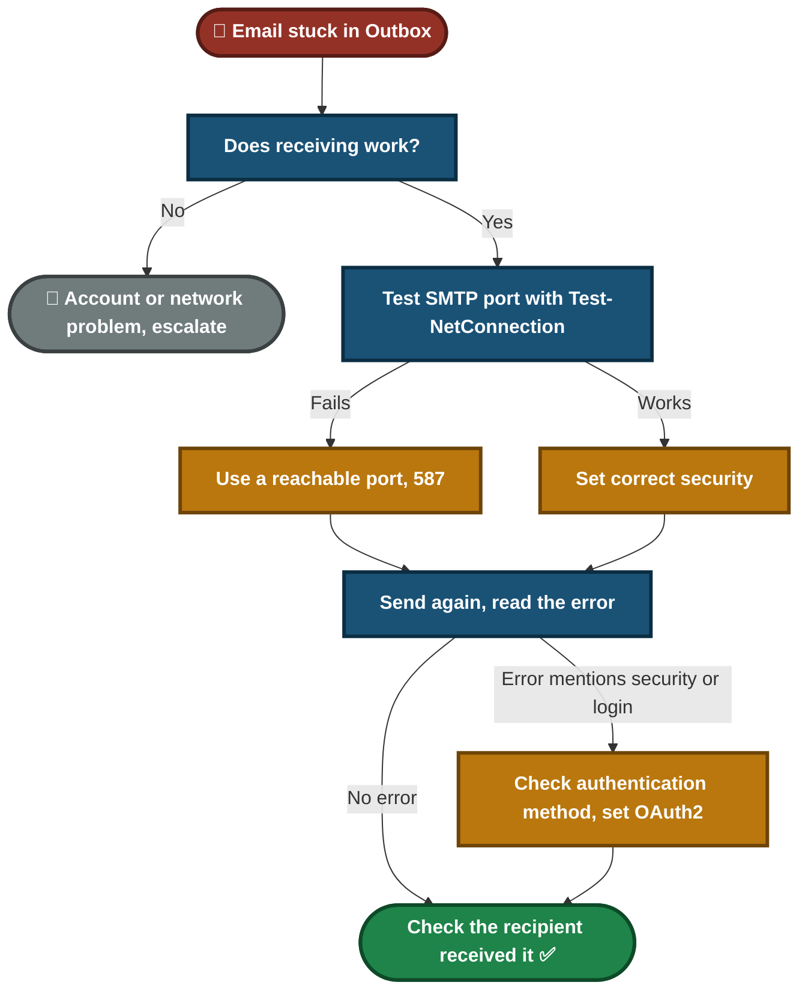
```mermaid
flowchart TD
    Start(["🚨 Email stuck in Outbox"]):::start --> A["Does receiving work?"]:::step
    A -->|No| C(["📨 Account or network problem, escalate"]):::esc
    A -->|Yes| B["Test SMTP port with Test-NetConnection"]:::step
    B -->|Fails| D["Use a reachable port, 587"]:::fix
    B -->|Works| E["Set correct security"]:::fix
    D --> F["Send again, read the error"]:::step
    E --> F
    F -->|Error mentions security or login| G["Check authentication method, set OAuth2"]:::fix
    F -->|No error| H(["Check the recipient received it ✅"]):::ok
    G --> H

    classDef start fill:#943126,stroke:#571C16,stroke-width:3px,color:#FFFFFF,font-weight:bold
    classDef step fill:#1A5276,stroke:#0B2E43,stroke-width:3px,color:#FFFFFF,font-weight:bold
    classDef fix fill:#B9770E,stroke:#6E4409,stroke-width:3px,color:#FFFFFF,font-weight:bold
    classDef ok fill:#1E8449,stroke:#0E4A28,stroke-width:3px,color:#FFFFFF,font-weight:bold
    classDef esc fill:#707B7C,stroke:#3B4142,stroke-width:3px,color:#FFFFFF,font-weight:bold
```

---

<a id="video-script"></a>
## 🎥 Video Script

**Title:** "Fix Email Stuck in Outbox — Email Sending Failure Explained"

<details>
<summary><b>Click to open the timed script</b></summary>

| Time | Section | What is said / shown |
|:---:|---|---|
| 0:00–0:20 | Introduction | "Today we're troubleshooting an email that will not send. It stays in the Outbox and never reaches the other person." |
| 0:20–1:00 | Issue Identification | Receiving works, but the email sits in the Outbox and an error appears when sending. The problem is on the outgoing side. |
| 1:00–2:00 | Troubleshooting | Test port 25 and port 587 with `Test-NetConnection`. Set port 587 and STARTTLS, send again, read the new error, then set authentication to OAuth2. |
| 2:00–2:30 | Verification | Send the stuck email, check the Outbox is empty, then confirm it arrived in the recipient's Inbox. |
| 2:30–3:00 | Customer Interaction | Customer says an important email is stuck. Agent acknowledges, fixes, and asks the customer's client to confirm. |

</details>

---

<a id="project-summary"></a>
## 📝 Project Summary

| Module | Tooling | Key Finding |
|---|---|---|
| Issue Identification | Thunderbird | Receiving works, sending fails at the outgoing server connection |
| Resolution & Verification | `Test-NetConnection`, SMTP settings | Port 25 failed, port 587 worked, STARTTLS error appeared, then OAuth2 sent the email and it arrived |
| Customer Interaction | Communication | Acknowledged urgency, avoided unproven claims, asked for confirmation from the recipient |

---

<a id="challenges-fixes"></a>
## ⚠️ Challenges & Fixes

| ❌ Challenge | ✅ Fix |
|---|---|
| The original script used Outlook, but this lab used Thunderbird with Gmail (OAuth2) | Rewrote the steps and environment for Thunderbird and Gmail |
| The normal **Send** button showed "Are you sure you are ready to send this message?". That would send at once and the email would not stay in the Outbox | Cancelled and used **File > Send Later** instead |
| After **Send Unsent Messages**, no error showed at first | Waited a moment. The error appeared after waiting. The menu is under the top-right three lines, then File |
| Opened the wrong settings page (Account Settings > Local Folders) while looking for SMTP | Went to **Outgoing Server** in the same left list instead |
| Port 25 failed at the TCP level (Exhibit 7) while port 587 worked (Exhibit 10) | Used port 587 with STARTTLS |
| After the port fix the send still failed with a different error (Exhibit 16) that talked about STARTTLS, not authentication | Wrote down only what the screen showed, then changed authentication to OAuth2 and sent again |
| An empty Outbox could be mistaken for success | Checked the recipient's Inbox as the real proof (Exhibit 4) |
| A second mail account in Thunderbird showed up while checking for the email | Not part of the lab. Used the browser to check the recipient's Inbox instead |

---

<a id="scope-limitations"></a>
## 🚧 Scope & Limitations

- **Thunderbird and Gmail only.** Outlook and other mail providers were not tested.
- **OAuth2 instead of a password.** The Gmail account signs in with OAuth2, no app password was used. A password-based setup may behave differently.
- **Failure was set up on purpose.** The faulty settings (port 25, no security, no authentication) were entered by hand to reproduce the problem.
- **Cause of the STARTTLS error is not proven.** The error appeared with STARTTLS selected and no authentication. Changing authentication to OAuth2 was followed by a successful send, but whether OAuth2 alone would have worked on another port was not tested.
- **Port 25 result depends on the network.** Port 25 failed on this network. The test does not show who blocks it, and it can be different on another network or ISP.
- **No SPF, DKIM or DMARC checks.** Delivery to the recipient's Inbox was confirmed once, but spam filtering and sender authentication were not tested.
- **Single test email, single recipient.** One message to one address.
- **Customer conversation is scripted.** It was not tested with a real customer.

---

<a id="what-i-learned"></a>
## 🧠 What I Learned

- **Check receiving first.** If receiving works, the account is fine and the fault is on the sending side.
- **Test the port before changing settings.** `Test-NetConnection` shows whether the network lets the connection through at all.
- **Read the exact error text.** A changed error message means the last change did something.
- **Change one thing at a time.** Port and security first, authentication second, made it clear which change did what.
- **An empty Outbox is not proof.** Check the recipient's Inbox.
- **Do not claim a cause that was not proven.** Write what the screen showed and mark the rest as untested.
- **Review what access you give an app.** Google's permission screen lists what Thunderbird can read and change, so remove access when the test is over.

---

<a id="skills-demonstrated"></a>
## 🛠️ Skills Demonstrated

- Diagnosing email sending failures from Outbox behavior and error messages
- Testing network ports with PowerShell `Test-NetConnection`
- Configuring SMTP port, connection security and OAuth2 authentication in Thunderbird
- Verifying delivery on the recipient side
- Communicating clearly with an urgent customer
- Documenting limits honestly and hiding private data in evidence

---

<a id="screenshot-index"></a>
## 🖼️ Screenshot Index

| # | File | Shows |
|:---:|---|---|
| 1 | `Exhibit1_outbox_stuck.png` | Outbox with 1 stuck message |
| 2 | `Exhibit2_smtp_settings_before.png` | Broken SMTP settings: port 25, None, No authentication |
| 3 | `Exhibit3_smtp_settings_after.png` | Port 587, STARTTLS, OAuth2 |
| 4 | `Exhibit4_test_email_received.png` | Test email in the recipient's Inbox |
| 5 | `Exhibit5_outbox_cleared.png` | Outbox empty after sending |
| 6 | `Exhibit6_inbound_works.png` | Inbox syncing, receiving works |
| 7 | `Exhibit7_port25_test.png` | Port 25 TCP test fails |
| 8 | `Exhibit8_send_error_dialog.png` | First send error dialog |
| 9 | `Exhibit9_port587_still_fails.png` | Port 587 and STARTTLS set, authentication unchanged |
| 10 | `Exhibit10_port587_test.png` | Port 587 TCP test succeeds |
| 11 | `Exhibit11_test_email_composed.png` | Test email "Contract test" |
| 12 | `Exhibit12_thunderbird_setup_welcome.png` | Thunderbird add-account screen |
| 13 | `Exhibit13_account_settings_found.png` | Original working settings found automatically |
| 14 | `Exhibit14_google_access_consent.png` | Google permission screen |
| 15 | `Exhibit15_smtp_details_587_secure.png` | Outgoing Server details, secure connection to 587 |
| 16 | `Exhibit16_port587_error_starttls.png` | "Must issue a STARTTLS command first" error |

---

<a id="repo-structure"></a>
## 📁 Repo Structure

```text
Email-Troubleshooting/
|-- README.md
`-- screenshots/
    |-- Exhibit1_outbox_stuck.png
    |-- Exhibit2_smtp_settings_before.png
    |-- Exhibit3_smtp_settings_after.png
    |-- Exhibit4_test_email_received.png
    |-- Exhibit5_outbox_cleared.png
    |-- Exhibit6_inbound_works.png
    |-- Exhibit7_port25_test.png
    |-- Exhibit8_send_error_dialog.png
    |-- Exhibit9_port587_still_fails.png
    |-- Exhibit10_port587_test.png
    |-- Exhibit11_test_email_composed.png
    |-- Exhibit12_thunderbird_setup_welcome.png
    |-- Exhibit13_account_settings_found.png
    |-- Exhibit14_google_access_consent.png
    |-- Exhibit15_smtp_details_587_secure.png
    `-- Exhibit16_port587_error_starttls.png
```

<div align="center">

📧 **[SMTP Basics](https://www.cloudflare.com/learning/email-security/what-is-smtp/)** · 🪟 **[Test-NetConnection](https://learn.microsoft.com/powershell/module/nettcpip/test-netconnection)** · 🛠️ **[Troubleshooting Flow](#decision-path)**

</div>
