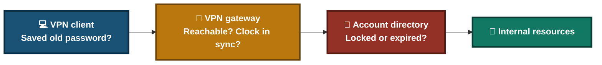
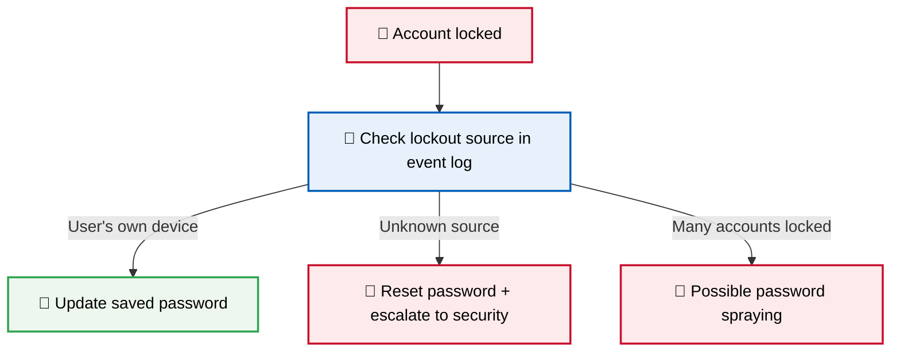
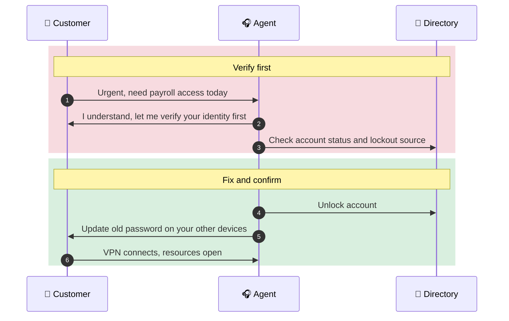
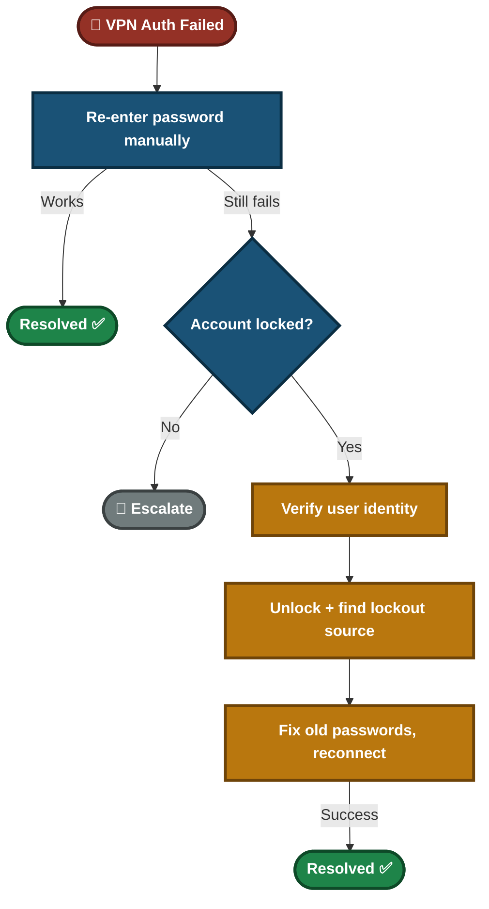

<div align="center">

# 🔐 VPN Authentication Failure — Troubleshooting & Customer Support

**Lab — IT Support Troubleshooting**

VPN Client · Active Directory · Account Lockout · Customer Communication


A customer sees "Authentication failed" on the VPN even with the correct password. This lab finds a locked account, unlocks it safely, finds why it locked, verifies access to internal resources, and handles an urgent payroll request without skipping security checks.

</div>

---

## 📑 Table of Contents

1. [At a Glance](#at-a-glance)
2. [Project Background](#project-background)
3. [Environment](#environment)
4. [Project Flow](#project-flow)
5. [Module 1 — Issue Identification](#module-1)
6. [Where VPN Login Can Break](#vpn-layers)
7. [Module 2 — Resolution & Verification](#module-2)
8. [Module 3 — Customer Interaction](#module-3)
9. [Decision Path](#decision-path)
10. [Video Script](#video-script)
11. [Project Summary](#project-summary)
12. [Challenges & Fixes](#challenges-fixes)
13. [Scope & Limitations](#scope-limitations)
14. [What I Learned](#what-i-learned)
15. [Skills Demonstrated](#skills-demonstrated)
16. [Screenshot Index](#screenshot-index)
17. [Repo Structure](#repo-structure)

---

<a id="at-a-glance"></a>
## 📊 At a Glance

| 🧩 Modules | 🖼️ Screenshots | 🔧 Tools Used | 👤 Customer Interactions |
|:---:|:---:|:---:|:---:|
| **3** | **5** | **3** | **1** |

---

<a id="project-background"></a>
## 📖 Project Background

"Authentication failed" with a correct password usually means the account is locked, the password is expired, or an old saved password is retrying in the background. Unlocking the account without finding the source means it locks again. Repeated failures can also be an attack, so the ticket needs a security check, not just an unlock.

- **Module 1 — Issue Identification:** Rule out typing and autofill, then check the account status.
- **Module 2 — Resolution & Verification:** Verify the user, unlock the account, find the source of the failed attempts, and confirm access.
- **Module 3 — Customer Interaction:** Handle an urgent payroll request without skipping identity checks.

> [!IMPORTANT]
> An urgent request for payroll or employee records is a common social-engineering pattern. Verify the caller's identity before unlocking or resetting anything.

<div align="center">

### 🧩 Lab Setup at a Glance

<table>
<tr>
<td align="center" valign="top" width="30%">


**User's Device**<br>
<sub>"Authentication failed"</sub>

</td>
<td align="center" valign="middle" width="5%">

**➜**

</td>
<td align="center" valign="top" width="30%">


**VPN Gateway**<br>
<sub>Checks the login</sub>

</td>
<td align="center" valign="middle" width="5%">

**➜**

</td>
<td align="center" valign="top" width="30%">


**Account Directory**<br>
<sub>Account locked</sub>

</td>
</tr>
</table>

</div>

---

<a id="environment"></a>
## 🖧 Environment

| Item | Value |
|---|---|
| **Identity System** | Active Directory account console |
| **Remote Access** | VPN client software |
| **Admin Actions** | Account status check and unlock |
| **Log Source (security check)** | Domain controller security events |

---

<a id="project-flow"></a>
## ⏱️ Project Flow

```mermaid
flowchart LR
    A["🔎 Identify<br/>Typing or lockout?"]:::s1 --> B["🔐 Verify<br/>Confirm the user"]:::s2 --> C["🛠 Fix<br/>Unlock account"]:::s3 --> D["🧪 Find Source<br/>Which device retries?"]:::s4 --> E["✅ Verify<br/>VPN + resources"]:::s5 --> F["👤 Close<br/>Update customer"]:::s6

    classDef s1 fill:#1A5276,stroke:#0B2E43,stroke-width:3px,color:#FFFFFF,font-weight:bold
    classDef s2 fill:#943126,stroke:#571C16,stroke-width:3px,color:#FFFFFF,font-weight:bold
    classDef s3 fill:#B9770E,stroke:#6E4409,stroke-width:3px,color:#FFFFFF,font-weight:bold
    classDef s4 fill:#76448A,stroke:#432752,stroke-width:3px,color:#FFFFFF,font-weight:bold
    classDef s5 fill:#117864,stroke:#083D33,stroke-width:3px,color:#FFFFFF,font-weight:bold
    classDef s6 fill:#2C3E70,stroke:#131B3A,stroke-width:3px,color:#FFFFFF,font-weight:bold
```


<p align="center"><em>Colors mark each stage of the support process.</em></p>

---

<a id="module-1"></a>
## 🔵 Module 1 — Issue Identification

**Objective:** Prove the cause before changing anything.

### Step 1 — Rule out typing and autofill ✅

Ask the user to type the password manually. Autofill and old saved passwords are common causes.

<p align="center">
  <br>
  <em>Exhibit 1 — VPN client showing "Authentication failed"</em>
</p>

### Step 2 — Check the account status ✅

Open the account in the Active Directory console and read the status.

<p align="center">
  <br>
  <em>Exhibit 2 — Account shown as locked in Active Directory</em>
</p>

🎯 **Result:** The password is not the problem. The account is locked.

| Check | Result |
|---|---|
| Password re-entered manually | Still fails ❌ |
| Account status in AD | Locked ❌ |
| Failed attempts | 5 in last 15 minutes |

> [!NOTE]
> Five failures in 15 minutes can be an old saved password or a real attack. Compare it with the lockout policy and check where the attempts came from (Module 2).

---

<a id="vpn-layers"></a>
## 🗺️ Where VPN Login Can Break



- **Client side:** Autofill or an old saved password.
- **Gateway side:** Wrong time, blocked connection, or MFA problems.
- **Directory side:** Locked, disabled, or expired account.
- In this lab the fault is on the directory side.

---

<a id="module-2"></a>
## 🟢 Module 2 — Resolution & Verification

**Objective:** Unlock safely, stop it from repeating, and prove the user has access.

### Step 3 — Verify the user's identity ✅

Confirm who is asking, using the company's verification process (for example a callback to a known number or a manager approval). Do this before any unlock or reset.

### Step 4 — Unlock the account ✅

<p align="center">
  <br>
  <em>Exhibit 3 — Account unlocked in Active Directory</em>
</p>

### Step 5 — Find where the failed attempts came from ✅

Check the domain controller security log for the account lockout event (Event ID `4740`) and failed logons (Event ID `4625`). The lockout event shows which computer caused the lockout.

| Source of failed attempts | Meaning | Action |
|---|---|---|
| One of the user's own devices | Old saved password | Update the password on that device |
| Unknown device or IP | Possible attack | Reset the password and escalate to security |

### Step 6 — Update the saved password on other devices ✅

Check phones, tablets and laptops that may still hold the old password, so the account does not lock again.

### Step 7 — Reconnect and verify ✅

<p align="center">
  <br>
  <em>Exhibit 4 — VPN connected and internal resources accessible</em>
</p>

🎯 **Result:** The user connects and reaches the resources they need.

| Check | Result |
|---|---|
| Identity verified | Yes ✅ |
| VPN connection | Established ✅ |
| Internal resources | Accessible ✅ |
| Source of failed attempts | Identified and recorded |

### 🔍 Analyst Note — When It Might Be an Attack

<p align="center">
  <br>
  <em>Exhibit 5 — Lockout event showing the source computer</em>
</p>



- An unlock without checking the source can hide an attack.
- Record the source in the ticket either way.

---

<a id="module-3"></a>
## 🟠 Module 3 — Customer Interaction

**Objective:** Help an urgent customer without skipping security.

> *"I have to access employee records for payroll processing today — this is urgent."*



**Agent response given:**
- **Before the fix:** "I understand it's urgent. First I need to verify your identity, then I'll unlock your account."
- **After the fix:** "Your account is unlocked and the VPN connects. Please update your password on your phone and any other device that saved it, or the account may lock again. If you can't open the payroll system, tell me and I'll check that access separately."

---

<a id="decision-path"></a>
## 🧭 Decision Path



---

<a id="video-script"></a>
## 🎥 Video Script

**Title:** "Fix VPN Authentication & Connection Errors — Safely"

<details>
<summary><b>Click to open the timed script</b></summary>

| Time | Section | What is said / shown |
|:---:|---|---|
| 0:00–0:20 | Introduction | "VPN not connecting? Let's diagnose it step by step, and stay safe while doing it." |
| 0:20–1:00 | Issue Identification | "Authentication failed" with the correct password. Rule out typing, then find the account is locked after 5 failures in 15 minutes. |
| 1:00–2:00 | Troubleshooting | Verify the user, unlock the account, check the lockout source, update old passwords on other devices. |
| 2:00–2:30 | Verification | Reconnect. VPN connects and internal resources open. |
| 2:30–3:00 | Customer Interaction | Urgent payroll request. Agent verifies identity first, then unlocks and explains how to stop it locking again. |

</details>

---

<a id="project-summary"></a>
## 📝 Project Summary

| Module | Tooling | Key Finding |
|---|---|---|
| Issue Identification | VPN client, AD console | Password was fine, the account was locked |
| Resolution & Verification | AD console, security event log | Identity verified, account unlocked, lockout source identified, access confirmed |
| Customer Interaction | Communication | Urgent request handled without skipping identity verification |

---

<a id="challenges-fixes"></a>
## ⚠️ Challenges & Fixes

| ❌ Challenge | ✅ Fix |
|---|---|
| Unlocking under urgency can help an attacker who pretends to be the user | Verify identity before any unlock or reset |
| Unlocking alone does not stop the account locking again | Find the source device in the lockout event and update the old password there |
| Five failed attempts could be an attack, not a mistake | Check whether the source is the user's own device before closing the ticket |
| A working VPN does not prove the payroll system is reachable | Asked the user to confirm and offered to check that access separately |

---

<a id="scope-limitations"></a>
## 🚧 Scope & Limitations

- **One user account:** The lab covers a single locked account, not a wider incident.
- **Other causes are not tested:** Expired password, MFA problems, wrong system time and firewall blocks lead to different fixes.
- **Identity verification depends on company policy.** The lab names examples, not one required method.

---

<a id="what-i-learned"></a>
## 🧠 What I Learned

- **A correct password can still fail.** A locked account rejects it.
- **Verify before you unlock.** Urgent requests for sensitive data are a social-engineering pattern.
- **Find the source of the lockout.** Otherwise it locks again, or an attack goes unnoticed.
- **Old saved passwords on other devices** are a frequent cause of repeat lockouts.
- **Confirm the real task.** VPN connected does not mean the payroll system works.

---

<a id="skills-demonstrated"></a>
## 🛠️ Skills Demonstrated

- Diagnosing VPN authentication failures
- Checking and unlocking accounts in Active Directory
- Reading lockout events (`4740`) and failed logons (`4625`)
- Telling an old-password lockout from a possible attack
- Handling an urgent request with identity verification

---

<a id="screenshot-index"></a>
## 🖼️ Screenshot Index

| # | File | Shows |
|:---:|---|---|
| 1 | `Exhibit1_vpn_auth_failed.png` | VPN "Authentication failed" |
| 2 | `Exhibit2_ad_account_locked.png` | Account shown as locked |
| 3 | `Exhibit3_account_unlocked.png` | Account unlocked |
| 4 | `Exhibit4_vpn_connected_resources.png` | VPN connected, resources open |
| 5 | `Exhibit5_lockout_event_source.png` | Lockout event with source computer |

---

<a id="repo-structure"></a>
## 📁 Repo Structure

```text
Remote-Desktop-VPN-Troubleshooting/
|-- README.md
`-- screenshots/
    |-- Exhibit1_vpn_auth_failed.png
    |-- Exhibit2_ad_account_locked.png
    |-- Exhibit3_account_unlocked.png
    |-- Exhibit4_vpn_connected_resources.png
    `-- Exhibit5_lockout_event_source.png
```

<div align="center">

🔐 **[VPN Basics](https://www.cloudflare.com/learning/access-management/what-is-a-vpn/)** · 🏢 **[Active Directory](https://learn.microsoft.com/windows-server/identity/ad-ds/get-started/virtual-dc/active-directory-domain-services-overview)** · 🛠️ **[Troubleshooting Flow](#decision-path)**

</div>
