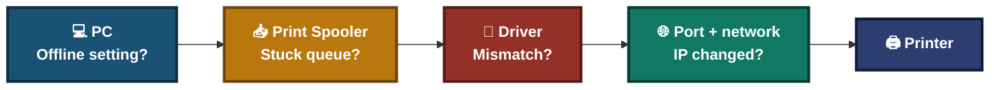
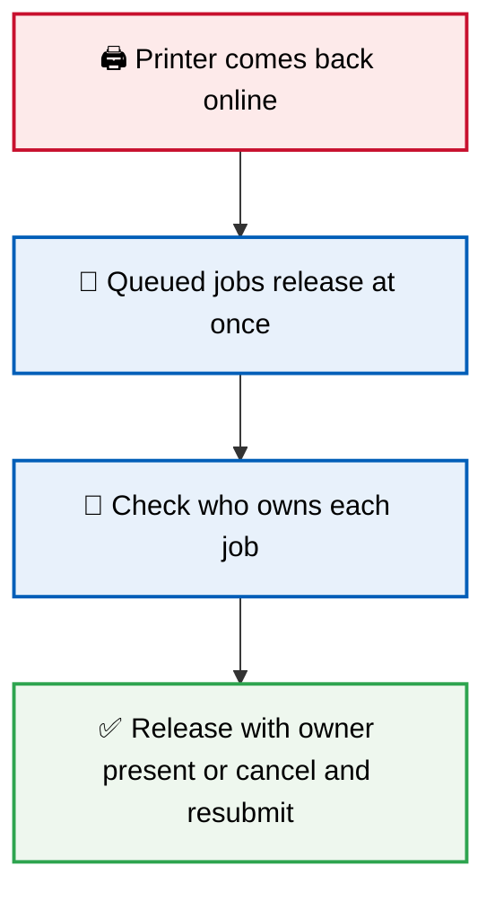
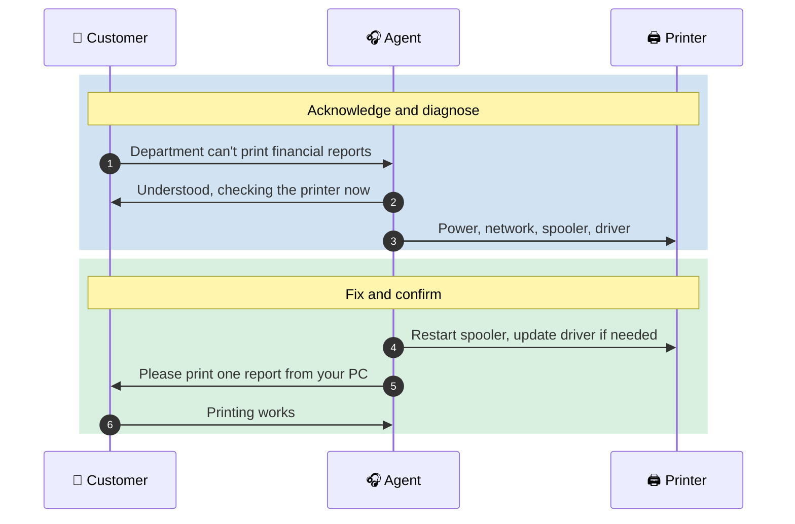
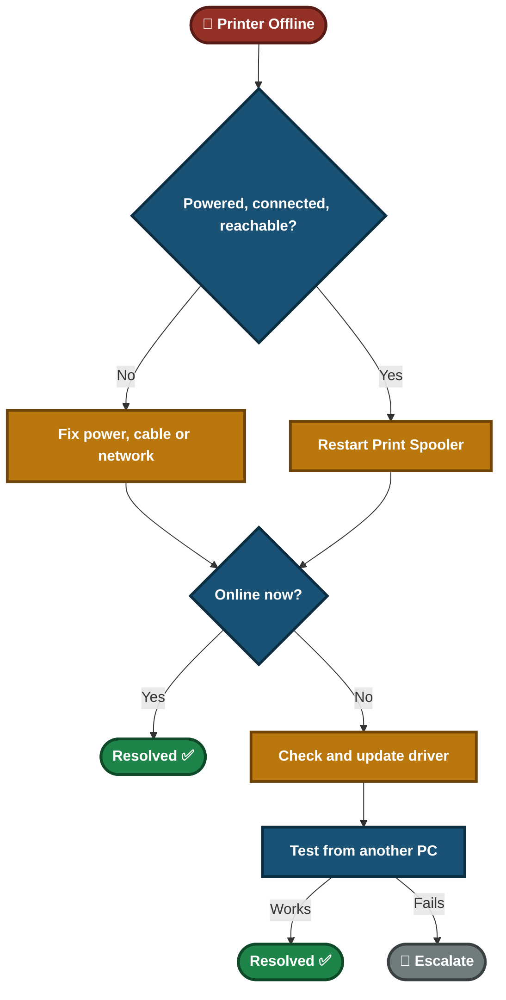

<div align="center">

# 🎥 Printer Offline — Video Script

**Video Knowledge Base — Script 01.4**

Print Spooler · Drivers · Network Printer · Customer Communication


A department cannot print financial reports because the shared printer shows "Offline". This lab checks hardware and network first, then the spooler and the driver, proves the fix from another user's PC, and handles the customer without promising more than was tested.

</div>

---

## 📑 Table of Contents

1. [At a Glance](#at-a-glance)
2. [Project Background](#project-background)
3. [Environment](#environment)
4. [Project Flow](#project-flow)
5. [Module 1 — Issue Identification](#module-1)
6. [Where Printing Can Break](#print-layers)
7. [Module 2 — Resolution & Verification](#module-2)
8. [Module 3 — Customer Interaction](#module-3)
9. [Decision Path](#decision-path)
10. [Video Script](#video-script)
11. [Project Summary](#project-summary)
12. [Challenges & Fixes](#challenges-fixes)
13. [Scope & Limitations](#scope-limitations)
14. [What I Learned](#what-i-learned)
15. [Skills Demonstrated](#skills-demonstrated)
16. [Screenshot Index](#screenshot-index)
17. [Repo Structure](#repo-structure)

---

<a id="at-a-glance"></a>
## 📊 At a Glance

| 🧩 Modules | 🖼️ Screenshots | 🔧 Tools Used | 👤 Customer Interactions |
|:---:|:---:|:---:|:---:|
| **3** | **5** | **3** | **1** |

---

<a id="project-background"></a>
## 📖 Project Background

"Offline" only says Windows cannot reach the printer. The cause can be power, cable, a changed network address, a stuck spooler, or a driver problem. Guessing wastes time and can leave the real cause in place. This lab works from the simplest check to the most complex one.

- **Module 1 — Issue Identification:** Rule out power and network before touching software.
- **Module 2 — Resolution & Verification:** Fix the spooler, then the driver if needed, and prove it from another user's PC.
- **Module 3 — Customer Interaction:** Handle a department-wide problem involving sensitive documents.

> [!NOTE]
> The affected documents are financial reports. Jobs stuck in the queue may print all at once when the printer comes back, so watch the output tray.

<div align="center">

### 🧩 Lab Setup at a Glance

<table>
<tr>
<td align="center" valign="top" width="30%">


**User's PC**<br>
<sub>Printer shows "Offline"</sub>

</td>
<td align="center" valign="middle" width="5%">

**➜**

</td>
<td align="center" valign="top" width="30%">


**Spooler + Driver**<br>
<sub>Queues and formats jobs</sub>

</td>
<td align="center" valign="middle" width="5%">

**➜**

</td>
<td align="center" valign="top" width="30%">


**Shared Printer**<br>
<sub>Power, cable, network</sub>

</td>
</tr>
</table>

</div>

---

<a id="environment"></a>
## 🖧 Environment

| Item | Value |
|---|---|
| **Client OS** | Windows |
| **Service** | Print Spooler (`services.msc`) |
| **Driver Source** | Manufacturer's official driver page |
| **Windows Tools** | Devices and Printers, Device Manager, Services |

---

<a id="project-flow"></a>
## ⏱️ Project Flow


<p align="center"><em>Colors mark each stage of the support process.</em></p>

---

<a id="module-1"></a>
## 🔵 Module 1 — Issue Identification

**Objective:** Rule out hardware and network causes before changing software.

### Step 1 — Check power and cable ✅

Confirm the printer is on and the network or USB cable is connected.

<p align="center">
  <br>
  <em>Exhibit 1 — Printer shown as "Offline" in Devices and Printers</em>
</p>

### Step 2 — Check the network address and offline setting ✅

- Ping the printer's IP address. A printer whose IP changed will show "Offline" even when it is on.
- Check that "Use Printer Offline" is not ticked in the printer menu.

🎯 **Result:** Power and cable are fine. The fault is software-side.

| Check | Result |
|---|---|
| Power status | On ✅ |
| Network/USB cable | Connected ✅ |
| Printer reachable by IP | Confirm with `ping` |
| "Use Printer Offline" | Not ticked |
| Conclusion | Software-level issue (spooler or driver) |

---

<a id="print-layers"></a>
## 🗺️ Where Printing Can Break



- Each box is a place printing can fail.
- Work from left to right: the cheapest checks come first.

---

<a id="module-2"></a>
## 🟢 Module 2 — Resolution & Verification

**Objective:** Fix one thing at a time and prove the fix from a user's point of view.

### Step 3 — Restart the Print Spooler ✅

Open `services.msc`, find "Print Spooler" and restart it. This clears stuck internal queue state.

<p align="center">
  <br>
  <em>Exhibit 2 — Print Spooler service restarted in <code>services.msc</code></em>
</p>

Check whether the printer is now online. If yes, stop here.

### Step 4 — Check stuck jobs ✅

Look at the print queue. Financial reports may be waiting there. Decide with the owner whether to release or cancel them, so sensitive pages do not print unattended.

### Step 5 — Check driver and firmware versions ✅

Compare the installed driver with the printer's current firmware. A mismatch after a firmware update can cause "Offline".

### Step 6 — Install the updated driver ✅

Download the driver only from the manufacturer's official page. Install it on the machine that shares the printer, and on client PCs if they need it.

<p align="center">
  <br>
  <em>Exhibit 3 — Updated driver installed</em>
</p>

> [!IMPORTANT]
> Restart the spooler first and test. If that fixes it, a driver update was not needed, and you cannot claim the driver was the cause.

### Step 7 — Test from another user's PC ✅

A test print from the admin PC is not enough. The department must be able to print.

<p align="center">
  <br>
  <em>Exhibit 4 — Test print successful and printer status "Ready"</em>
</p>

🎯 **Result:** The printer is online and a test print works.

| Check | Result |
|---|---|
| Test print | Successful ✅ |
| Printer status | Ready ✅ |
| Test from another user's PC | Successful ✅ |

### 🔍 Analyst Note — Sensitive Jobs in the Queue

<p align="center">
  <br>
  <em>Exhibit 5 — Print queue with waiting jobs before they are released</em>
</p>



- Financial reports left in an output tray are a data exposure risk.

---

<a id="module-3"></a>
## 🟠 Module 3 — Customer Interaction

**Objective:** Restore printing for a department and be honest about what was tested.

> *"Our whole department can't print financial reports."*



**Agent response given:**
- **During the fix:** "I understand the department is blocked. I'm checking the printer now."
- **After the fix:** "The printer is back online and a test print worked from another user's PC. Please print one report to confirm. If any old jobs were waiting, I'll check with you before they print, since they are financial reports."

---

<a id="decision-path"></a>
## 🧭 Decision Path



---

<a id="video-script"></a>
## 🎥 Video Script

**Title:** "Fix Printer Offline Issues — Step by Step"

<details>
<summary><b>Click to open the timed script</b></summary>

| Time | Section | What is said / shown |
|:---:|---|---|
| 0:00–0:20 | Introduction | "Printer showing 'Offline'? Let's find the cause step by step, starting with the simplest checks." |
| 0:20–0:50 | Issue Identification | Check power, cable, and whether the printer answers a ping. |
| 0:50–2:00 | Troubleshooting | Restart the Print Spooler and test. If still offline, check the driver against the firmware and update it. |
| 2:00–2:30 | Verification | Test print from another user's PC and confirm the status is "Ready". |
| 2:30–3:00 | Customer Interaction | Department cannot print financial reports. Agent fixes, confirms, and checks queued jobs before release. |

</details>

---

<a id="project-summary"></a>
## 📝 Project Summary

| Module | Tooling | Key Finding |
|---|---|---|
| Issue Identification | Power, cable, `ping` | Hardware and network fine, fault is software-side |
| Resolution & Verification | `services.msc`, driver install | Spooler restarted, driver updated where needed, test print worked from another PC |
| Customer Interaction | Communication | Confirmed with the customer and protected queued financial reports |

---

<a id="challenges-fixes"></a>
## ⚠️ Challenges & Fixes

| ❌ Challenge | ✅ Fix |
|---|---|
| Spooler restart and driver update were both done, so the real cause was unclear | Restart the spooler first, test, and update the driver only if it is still offline |
| A changed printer IP also shows "Offline" and was not checked | Added a ping and port check to the first steps |
| A test print from the admin PC does not prove the department can print | Tested from another user's PC |
| Queued financial reports could print unattended when the printer returned | Checked the queue and confirmed with the owner before release |
| Drivers can be downloaded from untrusted sites | Used the manufacturer's official page only |

---

<a id="scope-limitations"></a>
## 🚧 Scope & Limitations

- **One printer:** The lab covers a single shared network printer.
- **Cause of the fault is not fully proven.** The lab does not show whether the firmware update or something else broke it.
- **Print server setups are not covered.** If a print server shares the printer, the driver must be updated there.

---

<a id="what-i-learned"></a>
## 🧠 What I Learned

- **"Offline" is a symptom.** Power, network address, spooler and driver are all possible causes.
- **Start with the cheapest check.** Restart the spooler before changing drivers.
- **Fix one thing at a time.** Otherwise the cause stays unknown.
- **Firmware updates need a driver check**, but a driver update is only the fix if the spooler restart did not work.
- **Sensitive jobs need care.** Queued reports can print unattended when the printer returns.

---

<a id="skills-demonstrated"></a>
## 🛠️ Skills Demonstrated

- Diagnosing printer offline problems from hardware to driver
- Managing the Print Spooler service
- Updating drivers from official sources
- Verifying a fix from a real user's point of view
- Communicating with a department-wide outage

---

<a id="screenshot-index"></a>
## 🖼️ Screenshot Index

| # | File | Shows |
|:---:|---|---|
| 1 | `Exhibit1_printer_offline_status.png` | Printer shown as "Offline" |
| 2 | `Exhibit2_print_spooler_restart.png` | Print Spooler restarted |
| 3 | `Exhibit3_driver_update.png` | Updated driver installed |
| 4 | `Exhibit4_test_print_ready.png` | Test print and "Ready" status |
| 5 | `Exhibit5_print_queue.png` | Print queue with waiting jobs |

---

<a id="repo-structure"></a>
## 📁 Repo Structure

```text
Printer-Network-Print-Troubleshooting/
|-- README.md
`-- screenshots/
    |-- Exhibit1_printer_offline_status.png
    |-- Exhibit2_print_spooler_restart.png
    |-- Exhibit3_driver_update.png
    |-- Exhibit4_test_print_ready.png
    `-- Exhibit5_print_queue.png
```

<div align="center">

🖨️ **[Windows Print Spooler](https://learn.microsoft.com/windows-server/administration/windows-commands/windows-commands)** · 🪟 **[Windows Services](https://learn.microsoft.com/windows/win32/services/services)** · 🛠️ **[Troubleshooting Flow](#decision-path)**

</div>
