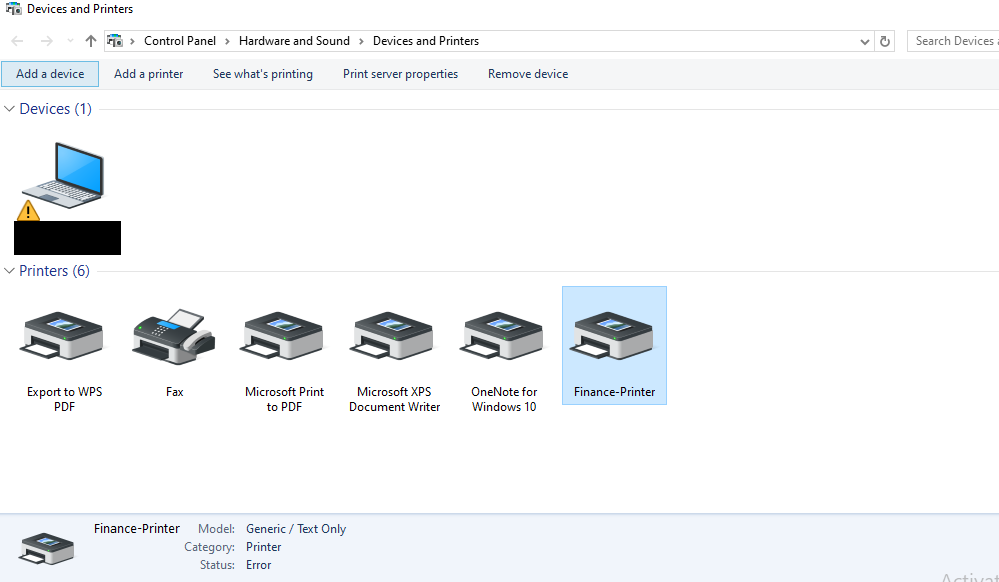
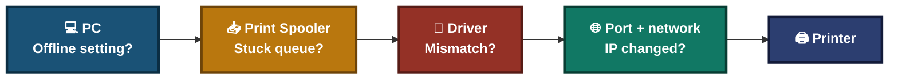
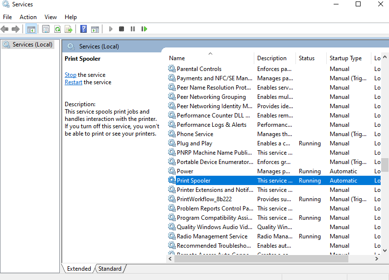
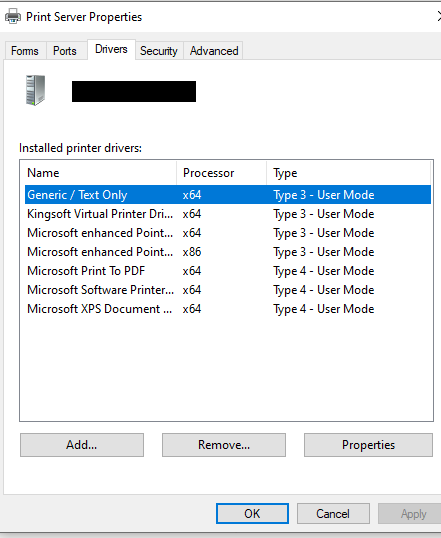
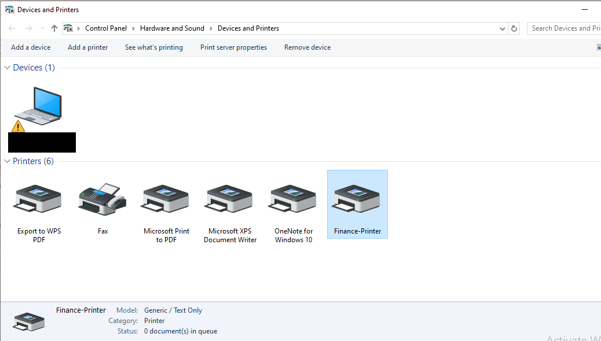
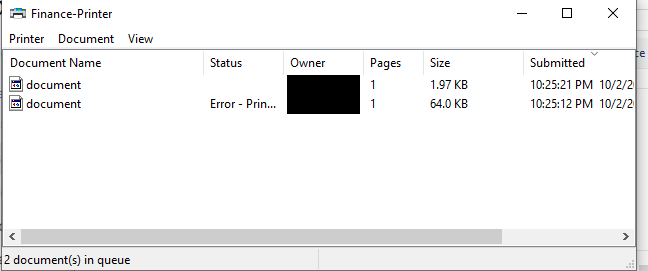
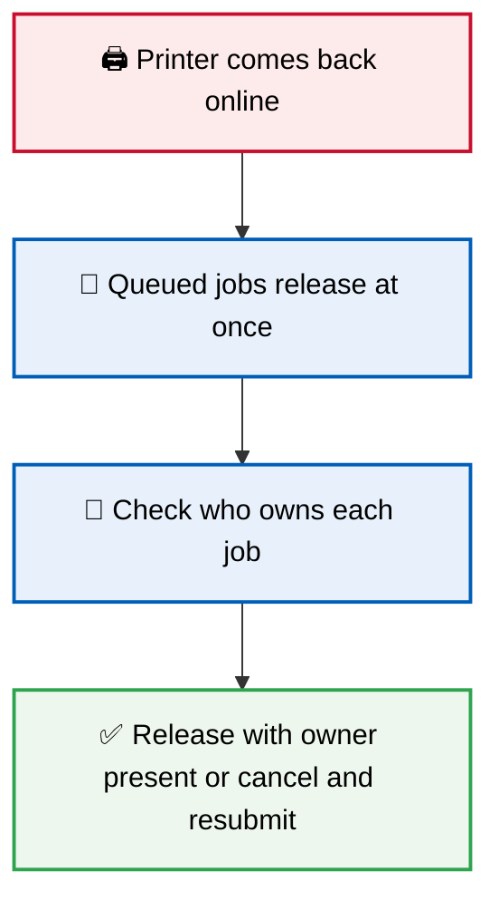
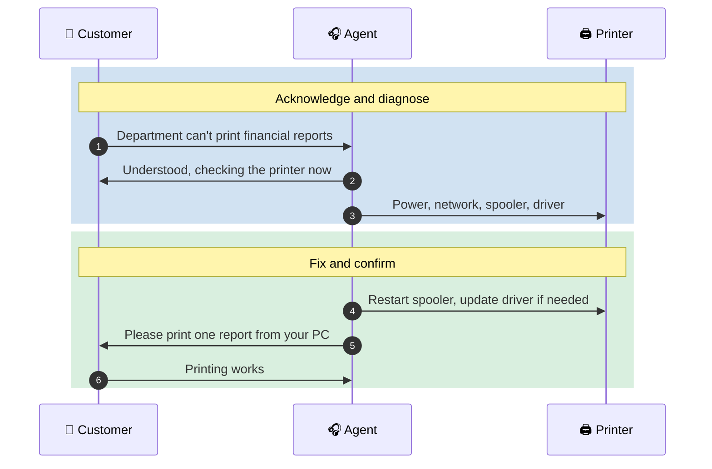
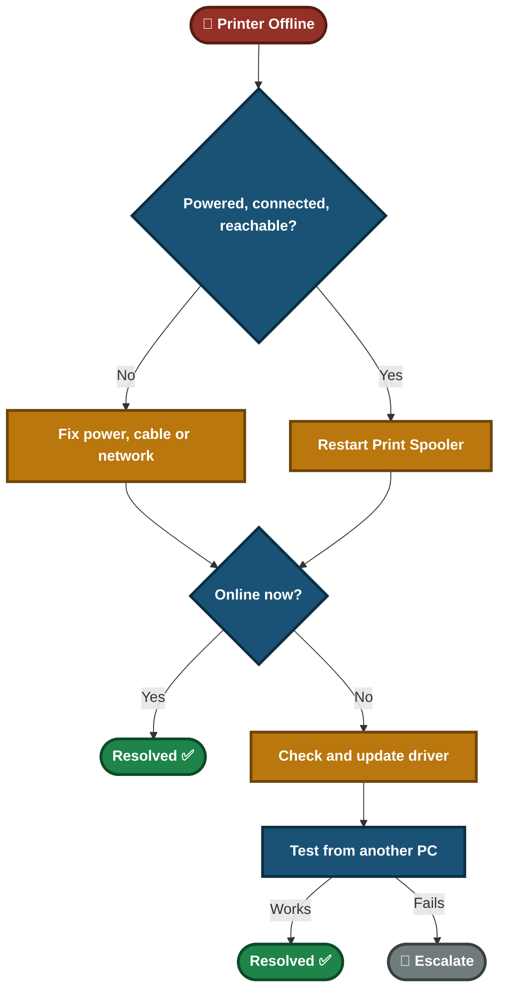

<div align="center">

# 🎥 Printer Offline — Video Script

**Video Knowledge Base — Script 01.4**

Print Spooler · Drivers · Network Printer · Customer Communication


A department cannot print financial reports because the shared printer shows "Offline". This lab checks hardware and network first, then the spooler and the driver, proves the fix from another user's PC, and handles the customer without promising more than was tested.

</div>

---

## 📑 Table of Contents

1. [At a Glance](#at-a-glance)
2. [Project Background](#project-background)
3. [Environment](#environment)
4. [Project Flow](#project-flow)
5. [Module 1 — Issue Identification](#module-1)
6. [Where Printing Can Break](#print-layers)
7. [Module 2 — Resolution & Verification](#module-2)
8. [Module 3 — Customer Interaction](#module-3)
9. [Decision Path](#decision-path)
10. [Video Script](#video-script)
11. [Project Summary](#project-summary)
12. [Challenges & Fixes](#challenges-fixes)
13. [Scope & Limitations](#scope-limitations)
14. [What I Learned](#what-i-learned)
15. [Skills Demonstrated](#skills-demonstrated)
16. [Screenshot Index](#screenshot-index)
17. [Repo Structure](#repo-structure)

---

<a id="at-a-glance"></a>
## 📊 At a Glance

| 🧩 Modules | 🖼️ Screenshots | 🔧 Tools Used | 👤 Customer Interactions |
|:---:|:---:|:---:|:---:|
| **3** | **5** | **4** | **1** |

> [!NOTE]
> Items marked **described, not tested** were not done in my run. They describe the method only.

---

<a id="project-background"></a>
## 📖 Project Background

"Offline" only says Windows cannot reach the printer. The cause can be power, cable, a changed network address, a stuck spooler, or a driver problem. Guessing wastes time and can leave the real cause in place. This lab works from the simplest check to the most complex one.

- **Module 1 — Issue Identification:** Rule out power and network before touching software.
- **Module 2 — Resolution & Verification:** Fix the spooler, then the driver if needed, and prove it from another user's PC.
- **Module 3 — Customer Interaction:** Handle a department-wide problem involving sensitive documents.

> [!NOTE]
> The affected documents are financial reports. Jobs stuck in the queue may print all at once when the printer comes back, so watch the output tray.

> [!NOTE]
> **How this lab was really run:** I had no physical network printer, so I built a test printer called `Finance-Printer` on one Windows PC. It uses the built-in "Generic / Text Only" driver on a TCP/IP port that points to `10.255.255.250`, an address with no device on it. This made the printer fail on purpose. The fault I created is a dead port address, and Windows showed it as **"Error"**, not "Offline".

<div align="center">

### 🧩 Lab Setup at a Glance

<table>
<tr>
<td align="center" valign="top" width="30%">


**User's PC**<br>
<sub>Printer shows "Offline"</sub>

</td>
<td align="center" valign="middle" width="5%">

**➜**

</td>
<td align="center" valign="top" width="30%">


**Spooler + Driver**<br>
<sub>Queues and formats jobs</sub>

</td>
<td align="center" valign="middle" width="5%">

**➜**

</td>
<td align="center" valign="top" width="30%">


**Shared Printer**<br>
<sub>Power, cable, network</sub>

</td>
</tr>
</table>

</div>

---

<a id="environment"></a>
## 🖧 Environment

| Item | Value |
|---|---|
| **Client OS** | Windows (one PC, one user account) |
| **Service** | Print Spooler (`services.msc`) |
| **Lab printer** | `Finance-Printer`, driver "Generic / Text Only", TCP/IP port `IP_10.255.255.250` (no device at this address) |
| **Driver Source** | Manufacturer's official driver page (described, not tested: the lab driver is built into Windows) |
| **Windows Tools** | Devices and Printers, Services, Print Server Properties, PowerShell |

---

<a id="project-flow"></a>
## ⏱️ Project Flow


```mermaid
flowchart LR
    A["🔎 Identify<br/>Power + network"]:::s1 --> B["🧪 Diagnose<br/>Spooler or driver?"]:::s2 --> C["🛠 Fix<br/>Restart spooler, then driver"]:::s3 --> D["✅ Verify<br/>Print from another PC"]:::s4 --> E["👤 Close<br/>Update department"]:::s5

    classDef s1 fill:#1A5276,stroke:#0B2E43,stroke-width:3px,color:#FFFFFF,font-weight:bold
    classDef s2 fill:#76448A,stroke:#432752,stroke-width:3px,color:#FFFFFF,font-weight:bold
    classDef s3 fill:#B9770E,stroke:#6E4409,stroke-width:3px,color:#FFFFFF,font-weight:bold
    classDef s4 fill:#117864,stroke:#083D33,stroke-width:3px,color:#FFFFFF,font-weight:bold
    classDef s5 fill:#2C3E70,stroke:#131B3A,stroke-width:3px,color:#FFFFFF,font-weight:bold
```
<p align="center"><em>Colors mark each stage of the support process. The diagram shows the method. See Scope & Limitations for what I actually tested.</em></p>

---

<a id="module-1"></a>
## 🔵 Module 1 — Issue Identification

**Objective:** Rule out hardware and network causes before changing software.

### Step 1 — Check power and cable (described, not tested)

Confirm the printer is on and the network or USB cable is connected. My lab printer is virtual, so there was no power or cable to check.

### Step 2 — Check the network address and offline setting ✅ (partly tested)

- Ping the printer's IP address (described, not tested: I did not run `ping`). A printer whose IP changed will show "Offline" even when it is on.
- Check the "Use Printer Offline" setting in the printer menu. I tested this on a first test printer (Microsoft Print To PDF). The setting showed `WorkOffline = True`, but the printer ignored it and still asked where to save each job, so I could not use it as the fault.
- I then built `Finance-Printer` on a port with an unreachable address and sent two test jobs: "Q3 Financial Report - page 1" and "Q3 Financial Report - page 2".

<p align="center">
  <br>
  <em>Exhibit 1 — Finance-Printer selected in Devices and Printers. Status shows "Error". Computer name hidden with a black box.</em>
</p>

🎯 **Result:** The printer shows a fault and does not print. In this lab the cause is a port that points to an address with no device. Windows showed **"Error"**, not "Offline".

| Check | Result |
|---|---|
| Power status | Described, not tested (virtual printer) |
| Network/USB cable | Described, not tested (virtual printer) |
| Printer reachable by IP | Described, not tested (`ping` not run). The port address was set to `10.255.255.250` on purpose |
| "Use Printer Offline" | Tested on a first printer: set to True, but the printer ignored it |
| Conclusion | Port address with no device behind it. Status shown as "Error" |

---

<a id="print-layers"></a>
## 🗺️ Where Printing Can Break


```mermaid
flowchart LR
    A["💻 PC<br/>Offline setting?"]:::a --> B["📥 Print Spooler<br/>Stuck queue?"]:::b --> C["🧩 Driver<br/>Mismatch?"]:::c --> D["🌐 Port + network<br/>IP changed?"]:::d --> E["🖨️ Printer"]:::e

    classDef a fill:#1A5276,stroke:#0B2E43,stroke-width:3px,color:#FFFFFF,font-weight:bold
    classDef b fill:#B9770E,stroke:#6E4409,stroke-width:3px,color:#FFFFFF,font-weight:bold
    classDef c fill:#943126,stroke:#571C16,stroke-width:3px,color:#FFFFFF,font-weight:bold
    classDef d fill:#117864,stroke:#083D33,stroke-width:3px,color:#FFFFFF,font-weight:bold
    classDef e fill:#2C3E70,stroke:#131B3A,stroke-width:3px,color:#FFFFFF,font-weight:bold
```

- Each box is a place printing can fail.
- Work from left to right: the cheapest checks come first.
- In my run the fault was in the **Port + network** box.

---

<a id="module-2"></a>
## 🟢 Module 2 — Resolution & Verification

**Objective:** Fix one thing at a time and prove the fix from a user's point of view.

### Step 3 — Restart the Print Spooler ✅

Open `services.msc`, find "Print Spooler" and restart it. This clears stuck internal queue state.

<p align="center">
  <br>
  <em>Exhibit 2 — Print Spooler shown as "Running" in <code>services.msc</code> after the restart</em>
</p>

I did not record the printer status right after the restart. The screenshot shows the service running, not the result on the printer. The fault was only cleared later in Step 7, so the restart was not the fix in this lab.

### Step 4 — Check stuck jobs ✅ (release with the owner: described, not tested)

I looked at the print queue and found my two test jobs waiting, one with status "Error - Printing". In Step 7 I deleted both jobs with `Get-PrintJob -PrinterName "Finance-Printer" | Remove-PrintJob`. Asking the owner whether to release or cancel real financial reports is described, not tested.

### Step 5 — Check driver and firmware versions ✅ (driver listed; firmware: described, not tested)

I opened Print Server Properties (`printui /s /t2`, Drivers tab). It lists "Generic / Text Only" as installed (x64, Type 3 - User Mode). This window has no version column, so I did not compare versions. Comparing the driver with printer firmware is described, not tested: a virtual printer has no firmware.

<p align="center">
  <br>
  <em>Exhibit 3 — Print Server Properties, Drivers tab. "Generic / Text Only" is installed. This is a driver check only, no update was done. Computer name hidden with a black box.</em>
</p>

### Step 6 — Install the updated driver (described, not tested)

Download the driver only from the manufacturer's official page. Install it on the machine that shares the printer, and on client PCs if they need it. I did not do this. The lab driver is built into Windows and the fault was not a driver problem.

> [!IMPORTANT]
> Restart the spooler first and test. If that fixes it, a driver update was not needed, and you cannot claim the driver was the cause.

### Step 7 — Repoint the port and send a test print ✅

This was the step that fixed the fault. I deleted the stuck jobs, moved the printer from the dead TCP/IP port to `PORTPROMPT:`, and sent a new test job:

```
Get-PrintJob -PrinterName "Finance-Printer" | Remove-PrintJob
```
```
Set-Printer -Name "Finance-Printer" -PortName "PORTPROMPT:"
```
```
"Q3 Financial Report - test" | Out-Printer -Name "Finance-Printer"
```

A "Save as" box appeared and I saved the output as a file. That shows the job now reaches the output.

<p align="center">
  <br>
  <em>Exhibit 4 — After the fix: Finance-Printer shows "0 document(s) in queue" and no error. Computer name hidden with a black box.</em>
</p>

The screenshot does not show the word "Ready", and it does not show the saved test file.

### Step 8 — Test from another user's PC (described, not tested)

A test print from the admin PC is not enough. The department must be able to print. I tested on one PC with one account only.

🎯 **Result:** The printer left the error state and the queue was empty. The test job reached the "Save as" box on the same PC.

| Check | Result |
|---|---|
| Test print | Reached the "Save as" box on the same PC ✅ |
| Printer status | "0 document(s) in queue", no error (not "Ready") ✅ |
| Test from another user's PC | Described, not tested |

### 🔍 Analyst Note — Sensitive Jobs in the Queue

<p align="center">
  <br>
  <em>Exhibit 5 — Print queue with 2 waiting jobs before the fix. One shows "Error - Printing". Owner column hidden with a black box.</em>
</p>

I took this screenshot before restarting the spooler, because the queue changes once the fault is fixed.


```mermaid
flowchart TD
    A["🖨️ Printer comes back online"]:::alert --> B["📄 Queued jobs release at once"]:::work
    B --> C["🔎 Check who owns each job"]:::work
    C --> D["✅ Release with owner present or cancel and resubmit"]:::done

    classDef alert fill:#fdeaea,stroke:#C8102E,stroke-width:2px,color:#000
    classDef work fill:#e8f1fb,stroke:#005EB8,stroke-width:2px,color:#000
    classDef done fill:#eef7ee,stroke:#2ea44f,stroke-width:2px,color:#000
```

- Financial reports left in an output tray are a data exposure risk.
- Described, not tested: in my run the two test jobs were deleted, not released, so I did not see jobs print all at once.

---

<a id="module-3"></a>
## 🟠 Module 3 — Customer Interaction

**Objective:** Restore printing for a department and be honest about what was tested.

> *"Our whole department can't print financial reports."*


```mermaid
sequenceDiagram
    autonumber
    participant C as 👤 Customer
    participant A as 🎧 Agent
    participant P as 🖨️ Printer

    rect rgba(0, 94, 184, 0.18)
    Note over C,P: Acknowledge and diagnose
    C->>A: Department can't print financial reports
    A->>C: Understood, checking the printer now
    A->>P: Power, network, spooler, driver
    end

    rect rgba(46, 164, 79, 0.18)
    Note over C,P: Fix and confirm
    A->>P: Restart spooler, update driver if needed
    A->>C: Please print one report from your PC
    C->>A: Printing works
    end
```

**Agent response given:**
- **During the fix:** "I understand the department is blocked. I'm checking the printer now."
- **After the fix:** "The printer is back online and a test print worked from another user's PC. Please print one report to confirm. If any old jobs were waiting, I'll check with you before they print, since they are financial reports."

> [!NOTE]
> **Described, not tested.** This is a scripted scenario. There was no real customer. In my run the test print was on the same PC, so the sentence "worked from another user's PC" is what the agent would say after doing that test.

---

<a id="decision-path"></a>
## 🧭 Decision Path


```mermaid
flowchart TD
    Start(["🚨 Printer Offline"]):::start --> A{"Powered, connected, reachable?"}:::step
    A -->|No| B["Fix power, cable or network"]:::fix
    A -->|Yes| C["Restart Print Spooler"]:::fix
    B --> D{"Online now?"}:::step
    C --> D
    D -->|Yes| End1(["Resolved ✅"]):::ok
    D -->|No| E["Check and update driver"]:::fix
    E --> F["Test from another PC"]:::step
    F -->|Works| End2(["Resolved ✅"]):::ok
    F -->|Fails| End3(["📨 Escalate"]):::esc

    classDef start fill:#943126,stroke:#571C16,stroke-width:3px,color:#FFFFFF,font-weight:bold
    classDef step fill:#1A5276,stroke:#0B2E43,stroke-width:3px,color:#FFFFFF,font-weight:bold
    classDef fix fill:#B9770E,stroke:#6E4409,stroke-width:3px,color:#FFFFFF,font-weight:bold
    classDef ok fill:#1E8449,stroke:#0E4A28,stroke-width:3px,color:#FFFFFF,font-weight:bold
    classDef esc fill:#707B7C,stroke:#3B4142,stroke-width:3px,color:#FFFFFF,font-weight:bold
```

---

<a id="video-script"></a>
## 🎥 Video Script

**Title:** "Fix Printer Offline Issues — Step by Step"

<details>
<summary><b>Click to open the timed script</b></summary>

| Time | Section | What is said / shown |
|:---:|---|---|
| 0:00–0:20 | Introduction | "Printer showing 'Offline'? Let's find the cause step by step, starting with the simplest checks." |
| 0:20–0:50 | Issue Identification | Check power, cable, and whether the printer answers a ping. |
| 0:50–2:00 | Troubleshooting | Restart the Print Spooler and test. If still offline, check the driver against the firmware and update it. |
| 2:00–2:30 | Verification | Test print from another user's PC and confirm the status is "Ready". |
| 2:30–3:00 | Customer Interaction | Department cannot print financial reports. Agent fixes, confirms, and checks queued jobs before release. |

</details>

> [!NOTE]
> This is the script for the video. My lab run differs in places: see Scope & Limitations.

---

<a id="project-summary"></a>
## 📝 Project Summary

| Module | Tooling | Key Finding |
|---|---|---|
| Issue Identification | Devices and Printers, PowerShell | Test printer with an unreachable port address showed "Error". Power, cable and `ping` described, not tested |
| Resolution & Verification | `services.msc`, Print Server Properties, PowerShell | Spooler restarted and driver listed, but the fix was repointing the port. Driver update and a test from another PC described, not tested |
| Customer Interaction | Communication | Scripted scenario, described, not tested with a real customer |

---

<a id="challenges-fixes"></a>
## ⚠️ Challenges & Fixes

| ❌ Challenge | ✅ Fix |
|---|---|
| I pasted the `Add-Printer` command several times on one line and PowerShell said the `Name` parameter was given more than once | Cleared the screen and ran the command once |
| Microsoft Print To PDF ignored "Use Printer Offline" (`WorkOffline` was True but the "Save as" box still appeared), so I could not hold jobs in the queue | Built a new `Finance-Printer` on a TCP/IP port to `10.255.255.250`, an address with no device |
| `Add-Printer` failed with "The specified driver does not exist" for "Generic / Text Only" | Installed the driver with `Add-PrinterDriver`, then created the printer again |
| Windows showed the status "Error" and the job status "Error - Printing" instead of "Offline" | Reported what Windows showed. Exhibit 1 and Exhibit 5 show the real status |
| `Remove-PrintJob -ID` failed because two jobs gave a list of IDs | Used `Get-PrintJob -PrinterName "Finance-Printer" \| Remove-PrintJob` |
| Clearing the queue also removed my first test job, so no "Save as" box appeared | Sent the test job again after the queue was empty |
| Restarting the spooler did not fix the fault | Repointed the port to `PORTPROMPT:` and sent a new test print |

---

<a id="scope-limitations"></a>
## 🚧 Scope & Limitations

- **Virtual printer only:** There was no physical network printer. Power, cable, `ping` and firmware checks are described, not tested.
- **Fault was created on purpose:** The cause was a port pointing to an address with no device. This lab does not prove what breaks a real department printer.
- **Status was "Error", not "Offline":** Windows did not show the word "Offline" for this fault. The first attempt with "Use Printer Offline" did not hold jobs on Microsoft Print To PDF.
- **Spooler restart result not recorded:** I did not note the printer status right after the restart. Only the later port change cleared the fault.
- **Driver update described, not tested:** I only checked the driver list. The Print Server Properties window had no version column, so I did not compare versions.
- **Another user's PC described, not tested:** Everything was done on one PC with one account.
- **Queued jobs deleted, not released:** The "release with the owner present" step is described, not tested.
- **Exhibit 4 shows "0 document(s) in queue", not "Ready"**, and does not show the saved test file.
- **Exhibit 5 was taken before the spooler restart**, because the queue changes once the fault is fixed.
- **Private data hidden:** Computer name and queue owner are covered with solid black boxes in the screenshots.
- **Cleanup:** At the end I removed the lab printer (`Remove-Printer`), the port `IP_10.255.255.250` (`Remove-PrinterPort`) and the folder `C:\Temp`. `Get-Printer` then returned "No MSFT_Printer objects found".
- **Print server setups are not covered.** If a print server shares the printer, the driver must be updated there.

---

<a id="what-i-learned"></a>
## 🧠 What I Learned

- **"Offline" is a symptom.** Power, network address, spooler and driver are all possible causes. A dead port address showed up as "Error" in my lab.
- **Start with the cheapest check.** Restart the spooler before changing drivers. In my lab the restart was not enough, which is why I could say the cause was the port and not the driver.
- **Fix one thing at a time.** Otherwise the cause stays unknown.
- **A lab can fail in unexpected ways.** My first offline setting was ignored by the printer, so I had to change the lab setup.
- **Sensitive jobs need care.** Queued reports can print unattended when the printer returns. I deleted my test jobs, so I did not see this happen.

---

<a id="skills-demonstrated"></a>
## 🛠️ Skills Demonstrated

- Diagnosing printer problems in Devices and Printers and the print queue
- Managing the Print Spooler service
- Creating and removing a test printer, port and driver with PowerShell
- Reading PowerShell errors and finding workarounds
- Updating drivers from official sources (described, not tested)
- Verifying a fix from a real user's point of view (described, not tested: same PC only)
- Communicating with a department-wide outage (scripted, described, not tested with a real customer)

---

<a id="screenshot-index"></a>
## 🖼️ Screenshot Index

| # | File | Shows |
|:---:|---|---|
| 1 | `Exhibit1_printer_offline_status.png` | Finance-Printer with status "Error" in Devices and Printers |
| 2 | `Exhibit2_print_spooler_restart.png` | Print Spooler "Running" in Services |
| 3 | `Exhibit3_driver_update.png` | Print Server Properties, Drivers tab (driver check only) |
| 4 | `Exhibit4_test_print_ready.png` | Finance-Printer "0 document(s) in queue" after the fix |
| 5 | `Exhibit5_print_queue.png` | Print queue with 2 waiting jobs before the fix |

---

<a id="repo-structure"></a>
## 📁 Repo Structure

```text
Printer-Network-Print-Troubleshooting/
|-- README.md
`-- screenshots/
    |-- Exhibit1_printer_offline_status.png
    |-- Exhibit2_print_spooler_restart.png
    |-- Exhibit3_driver_update.png
    |-- Exhibit4_test_print_ready.png
    `-- Exhibit5_print_queue.png
```

<div align="center">

🖨️ **[Windows Print Spooler](https://learn.microsoft.com/windows-server/administration/windows-commands/windows-commands)** · 🪟 **[Windows Services](https://learn.microsoft.com/windows/win32/services/services)** · 🛠️ **[Troubleshooting Flow](#decision-path)**

</div>
