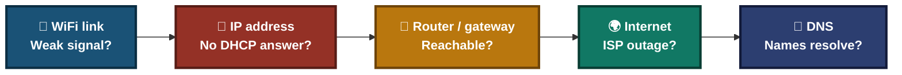
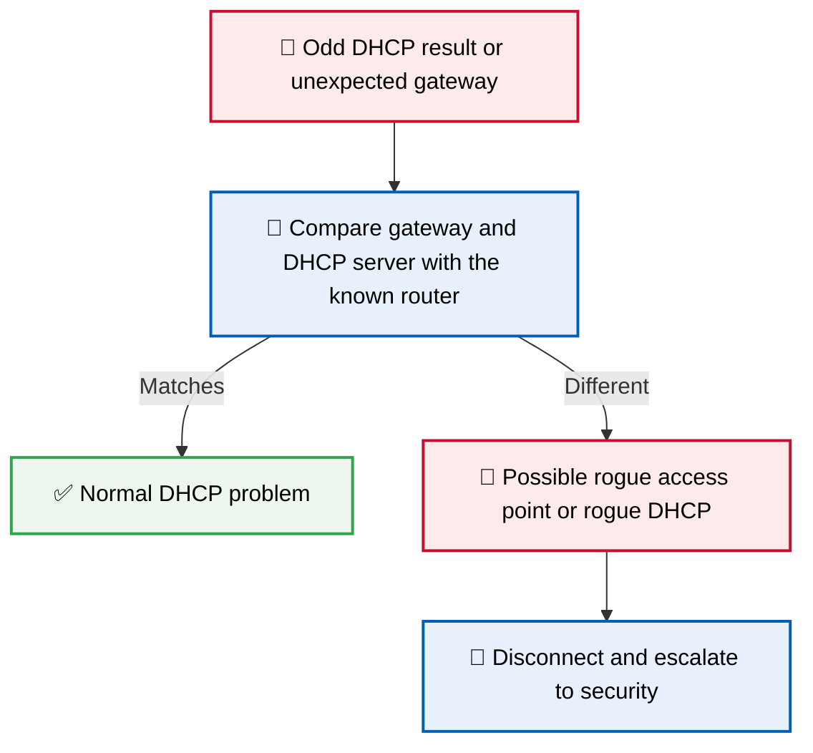
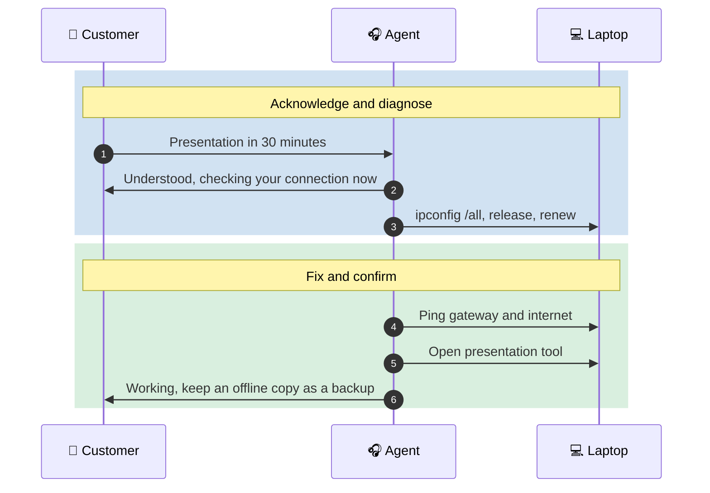
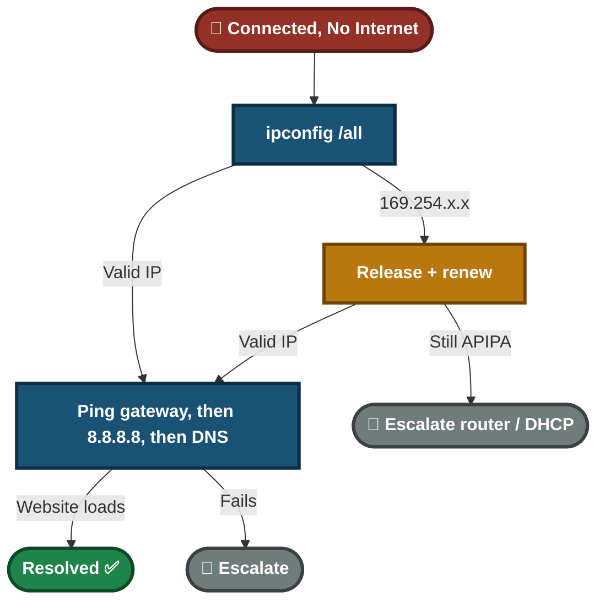

<div align="center">

# 🎥 WiFi Connected, No Internet — Video Script

**Video Knowledge Base — Script 01.5**

DHCP · IP Configuration · Wireless Client · Customer Communication


A laptop shows "Connected" to WiFi but has no internet, and the user has a client presentation soon. This lab reads the IP configuration, finds a self-assigned APIPA address, restores a valid address from the router, tests the connection layer by layer, and checks that the network is the real one.

</div>

---

## 📑 Table of Contents

1. [At a Glance](#at-a-glance)
2. [Project Background](#project-background)
3. [Environment](#environment)
4. [Project Flow](#project-flow)
5. [Module 1 — Issue Identification](#module-1)
6. [Where "Connected, No Internet" Can Break](#wifi-layers)
7. [Module 2 — Resolution & Verification](#module-2)
8. [Module 3 — Customer Interaction](#module-3)
9. [Decision Path](#decision-path)
10. [Video Script](#video-script)
11. [Project Summary](#project-summary)
12. [Challenges & Fixes](#challenges-fixes)
13. [Scope & Limitations](#scope-limitations)
14. [What I Learned](#what-i-learned)
15. [Skills Demonstrated](#skills-demonstrated)
16. [Screenshot Index](#screenshot-index)
17. [Repo Structure](#repo-structure)

---

<a id="at-a-glance"></a>
## 📊 At a Glance

| 🧩 Modules | 🖼️ Screenshots | 🔧 Commands Used | 👤 Customer Interactions |
|:---:|:---:|:---:|:---:|
| **3** | **5** | **5** | **1** |

---

<a id="project-background"></a>
## 📖 Project Background

"Connected" only means the laptop joined the WiFi. It does not mean the laptop got a valid address, can reach the router, or can reach the internet. Each of these is a separate step, and each can fail on its own. This lab tests them in order, so the cause is proven and not guessed.

- **Module 1 — Issue Identification:** Read the IP configuration and find out what address the laptop really has.
- **Module 2 — Resolution & Verification:** Renew the address, then test the router, the internet and a website in that order.
- **Module 3 — Customer Interaction:** Handle a user with a presentation in 30 minutes, and test what they actually need.

> [!NOTE]
> A `169.254.x.x` address (APIPA) is what Windows gives itself when it gets no answer from a DHCP server. It is one cause of "connected, no internet", not the only one.

<div align="center">

### 🧩 Lab Setup at a Glance

<table>
<tr>
<td align="center" valign="top" width="30%">


**Affected Laptop**<br>
<sub>"Connected", no internet</sub>

</td>
<td align="center" valign="middle" width="5%">

**➜**

</td>
<td align="center" valign="top" width="30%">


**Router**<br>
<sub>WiFi + DHCP address lease</sub>

</td>
<td align="center" valign="middle" width="5%">

**➜**

</td>
<td align="center" valign="top" width="30%">


**Internet**<br>
<sub>ISP + DNS</sub>

</td>
</tr>
</table>

</div>

---

<a id="environment"></a>
## 🖧 Environment

| Item | Value |
|---|---|
| **Client OS** | Windows |
| **Shell** | Command Prompt |
| **Commands** | `ipconfig /all`, `/release`, `/renew`, `/flushdns`, `ping` |
| **Network Type** | WiFi with router-assigned addresses (DHCP) |

---

<a id="project-flow"></a>
## ⏱️ Project Flow


<p align="center"><em>Colors mark each stage of the support process.</em></p>

---

<a id="module-1"></a>
## 🔵 Module 1 — Issue Identification

**Objective:** Find out what address the laptop really has before changing anything.

### Step 1 — Check the scope ✅

Ask whether other devices on the same WiFi have internet. If they do not, the problem is the router or the ISP, not this laptop.

### Step 2 — Read the IP configuration ✅

```cmd
ipconfig /all
```

Note the IP address, default gateway, DHCP server and DNS server.

<p align="center">
  <br>
  <em>Exhibit 1 — <code>ipconfig /all</code> showing a <code>169.254.x.x</code> address</em>
</p>

🎯 **Result:** The laptop has a self-assigned address. It did not get one from the router.

| Check | Result |
|---|---|
| Other devices on the same WiFi | Confirm scope first |
| `ipconfig /all` | Shows 169.254.x.x (APIPA) |
| Conclusion | The laptop got no answer from DHCP. Not enough to say why yet |

---

<a id="wifi-layers"></a>
## 🗺️ Where "Connected, No Internet" Can Break



- **In this lab the fault is at the IP address layer** (APIPA).
- A weak signal can also cause a missed DHCP answer, so signal is not ruled out by APIPA alone.
- Test each layer in order: address, gateway, internet, then DNS.

---

<a id="module-2"></a>
## 🟢 Module 2 — Resolution & Verification

**Objective:** Get a valid address and prove each layer works.

### Step 3 — Release the invalid address ✅

```cmd
ipconfig /release
```

### Step 4 — Request a new address ✅

```cmd
ipconfig /renew
```

<p align="center">
  <br>
  <em>Exhibit 2 — <code>ipconfig /release</code> and <code>/renew</code> run on the laptop</em>
</p>

### Step 5 — Check the new address and DHCP server ✅

```cmd
ipconfig /all
```

<p align="center">
  <br>
  <em>Exhibit 3 — Valid <code>192.168.x.x</code> address with the expected gateway and DHCP server</em>
</p>

Check that the gateway and DHCP server are the router's known addresses. An unexpected DHCP server is a security warning (see the Analyst Note).

### Step 6 — Test layer by layer ✅

```cmd
ping <default gateway>
ping 8.8.8.8
```

Then open a website.

- Gateway fails: the problem is the WiFi link or the router.
- Gateway works, `8.8.8.8` fails: the problem is the router or ISP.
- `8.8.8.8` works, website fails: run `ipconfig /flushdns` and check DNS.

<p align="center">
  <br>
  <em>Exhibit 4 — Ping to the gateway and to <code>8.8.8.8</code> succeed</em>
</p>

### Step 7 — Test what the user needs ✅

Open the presentation tool, the meeting app, or the cloud file the user will actually use.

<p align="center">
  <br>
  <em>Exhibit 5 — Website and the user's presentation tool load correctly</em>
</p>

🎯 **Result:** The laptop has a valid address, reaches the router and the internet, and opens the user's tools.

| Check | Result |
|---|---|
| IP address | Valid (192.168.x.x) ✅ |
| Gateway reachable | Yes ✅ |
| Website load | Successful ✅ |
| User's presentation tool | Loads ✅ |

### 🔍 Analyst Note — Is This the Real Network?



- A fake WiFi network with a similar name can hand out its own addresses and route traffic through an attacker.
- Confirm the network name and the router address before the user opens sensitive material.

---

<a id="module-3"></a>
## 🟠 Module 3 — Customer Interaction

**Objective:** Restore access fast for a user with a deadline, and prove it with the tools they need.

> *"I have a client presentation starting in 30 minutes."*



**Agent response given:**
- **During the fix:** "I understand you have a presentation soon. I'm checking your connection now."
- **After the fix:** "Your laptop got a valid address and I confirmed the internet and your presentation tool load. As a backup, keep an offline copy of the presentation on the laptop. If the WiFi drops again, tell me right away."

---

<a id="decision-path"></a>
## 🧭 Decision Path



---

<a id="video-script"></a>
## 🎥 Video Script

**Title:** "WiFi Connected But No Internet? Diagnose It Step by Step"

<details>
<summary><b>Click to open the timed script</b></summary>

| Time | Section | What is said / shown |
|:---:|---|---|
| 0:00–0:20 | Introduction | "Laptop shows 'Connected' but no internet? Let's find which layer is failing." |
| 0:20–0:50 | Issue Identification | Run `ipconfig /all` and find a `169.254.x.x` address. The laptop got no DHCP answer. |
| 0:50–2:00 | Troubleshooting | Release and renew the address, then ping the gateway, `8.8.8.8` and a website. |
| 2:00–2:30 | Verification | Valid `192.168.x.x` address, website loads, and the presentation tool opens. |
| 2:30–3:00 | Customer Interaction | Presentation in 30 minutes. Agent fixes, tests the tool and recommends an offline backup. |

</details>

---

<a id="project-summary"></a>
## 📝 Project Summary

| Module | Tooling | Key Finding |
|---|---|---|
| Issue Identification | `ipconfig /all` | Laptop had a self-assigned APIPA address |
| Resolution & Verification | `ipconfig`, `ping` | Valid address restored, each layer tested, user's tools loaded |
| Customer Interaction | Communication | Tested what the user needs and advised an offline backup |

---

<a id="challenges-fixes"></a>
## ⚠️ Challenges & Fixes

| ❌ Challenge | ✅ Fix |
|---|---|
| "Connected, no internet" was treated as always meaning APIPA | Read `ipconfig /all` first, since APIPA is only one possible cause |
| `ipconfig /flushdns` was run even though the fault was DHCP | Flush DNS only if the internet works but names do not resolve |
| APIPA was taken as proof that signal strength is not the cause | Noted that a weak signal can also cause a missed DHCP answer |
| A working website does not prove the user's presentation tool works | Tested the actual presentation tool |
| A fake network could give a valid-looking address | Compared the gateway and DHCP server with the known router |

---

<a id="scope-limitations"></a>
## 🚧 Scope & Limitations

- **One laptop:** The lab covers a single Windows client.
- **Root cause is not found.** The lab does not show why the DHCP answer was missed (full address pool, router restart, or weak signal).
- **Other causes are not tested:** ISP outage, wrong DNS, captive portal login pages, MAC filtering.

---

<a id="what-i-learned"></a>
## 🧠 What I Learned

- **"Connected" is not "working".** Address, gateway, internet and DNS are separate layers.
- **APIPA means no DHCP answer**, not proof of one cause.
- **Test in order.** Gateway first, then internet, then DNS.
- **Flush DNS only when DNS is the suspect.**
- **Check the network is the real one.** Odd gateways and DHCP servers can mean a rogue access point.
- **Test what the user needs**, and suggest a backup when there is a deadline.

---

<a id="skills-demonstrated"></a>
## 🛠️ Skills Demonstrated

- Reading IP configuration with `ipconfig /all`
- Recognizing APIPA and renewing a DHCP lease
- Testing connectivity layer by layer with `ping`
- Spotting signs of a rogue access point or DHCP server
- Communicating with a user who has a deadline

---

<a id="screenshot-index"></a>
## 🖼️ Screenshot Index

| # | File | Shows |
|:---:|---|---|
| 1 | `Exhibit1_ipconfig_apipa.png` | `ipconfig /all` with a `169.254.x.x` address |
| 2 | `Exhibit2_release_renew.png` | `/release` and `/renew` run |
| 3 | `Exhibit3_valid_ip.png` | Valid address with gateway and DHCP server |
| 4 | `Exhibit4_ping_gateway_internet.png` | Ping to gateway and `8.8.8.8` |
| 5 | `Exhibit5_website_and_presentation.png` | Website and presentation tool load |

---

<a id="repo-structure"></a>
## 📁 Repo Structure

```text
LAN-WiFi-Connectivity-Diagnostics/
|-- README.md
`-- screenshots/
    |-- Exhibit1_ipconfig_apipa.png
    |-- Exhibit2_release_renew.png
    |-- Exhibit3_valid_ip.png
    |-- Exhibit4_ping_gateway_internet.png
    `-- Exhibit5_website_and_presentation.png
```

<div align="center">

📶 **[What is DHCP](https://www.cloudflare.com/learning/network-layer/what-is-dhcp/)** · 🪟 **[ipconfig Reference](https://learn.microsoft.com/windows-server/administration/windows-commands/ipconfig)** · 🛠️ **[Troubleshooting Flow](#decision-path)**

</div>
