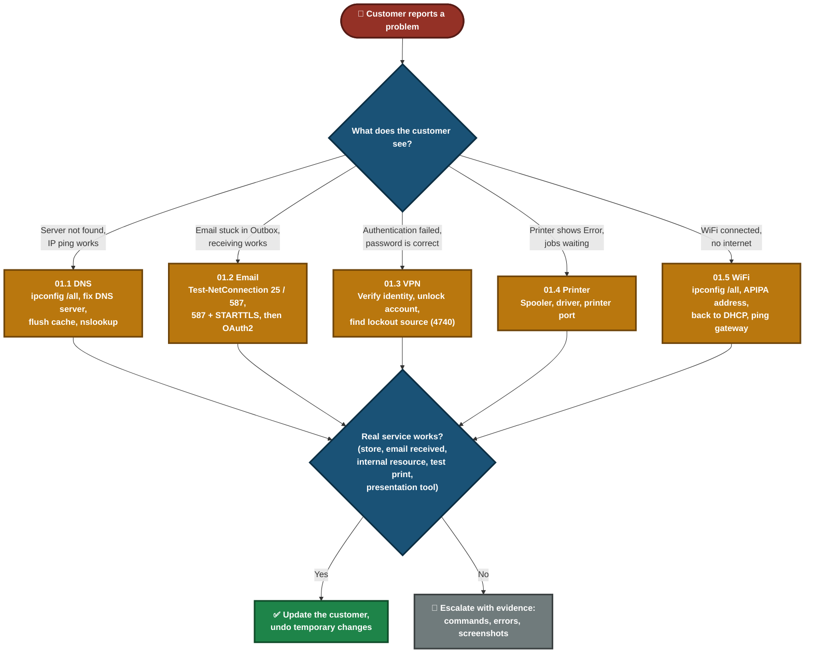

<div align="center">

# 🎥 Video Knowledge Base — Index

**Folder 01 · Scripts 01.1 to 01.5**

Five Windows support scenarios, each with diagnosis, fix, verification and a customer conversation.


</div>

---

## 📑 Table of Contents

1. [All Scripts at a Glance](#at-a-glance)
2. [What Every Script Contains](#structure)
3. [Flow Chart — Which Script to Use](#flowchart)
4. [Script Summaries](#summaries)
5. [What Was Real and What Was Simulated](#honesty)
6. [Screenshot Totals](#totals)
7. [Folder Structure](#folder-structure)

---

<a id="at-a-glance"></a>
## 📊 All Scripts at a Glance

| # | Script | Problem | Main Tools | Modules | Screenshots |
|:---:|---|---|---|:---:|:---:|
| 01.1 | [DNS Resolution Issue](01_1-DNS-Resolution-Issue.md) | "Server not found" on every website | `ping`, `nslookup`, `ipconfig` | 3 | 5 |
| 01.2 | [Email Sending Failure](01_2-Email-Sending-Failure.md) | Email stuck in the Outbox | Thunderbird SMTP settings, `Test-NetConnection` | 3 | 16 |
| 01.3 | [VPN Authentication Failure](01_3-VPN-Connection-Failed.md) | "Authentication failed" with a correct password | `net user`, `net accounts`, Event Viewer (4740) | 3 | 9 |
| 01.4 | [Printer Offline](01_4-Printer-Offline.md) | Shared printer shows an error and jobs wait | Services, Print Server Properties, PowerShell | 3 | 5 |
| 01.5 | [WiFi Connected, No Internet](01_5-WiFi-Connectivity.md) | WiFi says "Connected" but no internet | `ipconfig`, `netsh`, `ping` | 3 | 6 |

---

<a id="structure"></a>
## 🧱 What Every Script Contains

- **Module 1 — Issue Identification:** prove what is broken before changing anything.
- **Module 2 — Resolution & Verification:** fix it and check the customer's real need.
- **Module 3 — Customer Interaction:** keep the customer informed without claiming an unproven cause.
- **Also in each file:** flow diagram, decision path, timed video script, Challenges & Fixes, Scope & Limitations, screenshot index.

---

<a id="flowchart"></a>
## 🧭 Flow Chart — Which Script to Use



---

<a id="summaries"></a>
## 🗂️ Script Summaries

### 01.1 — DNS Resolution Issue
- **Finding:** pinging an IP works, pinging a name fails, so the fault is DNS and not the network.
- **Fix:** read the configured DNS servers with `ipconfig /all`, correct them, flush the cache, confirm `nslookup` resolves and the customer's store loads.

### 01.2 — Email Sending Failure
- **Finding:** receiving works but sending is stuck, so the fault is on the outgoing (SMTP) side.
- **Fix, in order:** port 25 failed and port 587 worked (`Test-NetConnection`), then port 587 with STARTTLS gave a new error, then OAuth2 sent the email and it arrived at the recipient.

### 01.3 — VPN Authentication Failure
- **Finding:** the password was fine, the account was locked.
- **Fix:** verify identity, unlock the account, find the lockout source in the Security log (event 4740), confirm access, restore the policy.

### 01.4 — Printer Offline
- **Finding:** the printer showed "Error" and 2 jobs waited in the queue.
- **Fix:** the spooler was restarted and the driver listed, but the fix was pointing the printer port at the right address.

### 01.5 — WiFi Connected, No Internet
- **Finding:** the laptop had an APIPA-range address (`169.254.x.x`) and no gateway.
- **Fix:** set the adapter back to DHCP, got a valid address from the router, then checked the gateway, the internet and a presentation tool.

---

<a id="honesty"></a>
## 🧪 What Was Real and What Was Simulated

| Script | How the fault was made | Main limit stated in the script |
|---|---|---|
| 01.1 | Bad DNS servers set on purpose, outbound DNS blocked with temporary firewall rules (removed before the fix) | `nslookup google.com 8.8.8.8` described, not tested |
| 01.2 | Outgoing settings broken on purpose in Thunderbird with a test Gmail account (OAuth2) | Cause of the STARTTLS error not proven. Port 25 result depends on the network |
| 01.3 | Local Windows test account, temporary lockout policy | Local account stands in for Active Directory. The VPN client is not linked to the test account. Internal resources not tested |
| 01.4 | Virtual printer with a port pointing to an address with no device | Status was "Error", not "Offline". Driver update and test from another PC described, not tested |
| 01.5 | APIPA-range address set by hand with `netsh` | Simulation, not a real DHCP failure. Root cause not found. Router DNS not tested |

- **Customer conversations** in 01.2, 01.4 and 01.5 are scripted scenarios, not tested with real customers.
- **Private data** (addresses, usernames, computer names, MAC addresses) is covered with solid black boxes in the screenshots.
- **Anything not done** is marked "described, not tested" inside each script.

---

<a id="totals"></a>
## 🖼️ Screenshot Totals

| Script | Screenshots |
|---|:---:|
| 01.1 DNS | 5 |
| 01.2 Email | 16 |
| 01.3 VPN | 9 |
| 01.4 Printer | 5 |
| 01.5 WiFi | 6 |
| **Total** | **41** |

---

<a id="folder-structure"></a>
## 📁 Folder Structure

```text
01-Video-knowledge-base/
|-- README.md                        (this index)
|-- 01_1-DNS-Resolution-Issue.md
|-- 01_2-Email-Sending-Failure.md
|-- 01_3-VPN-Connection-Failed.md
|-- 01_4-Printer-Offline.md
`-- 01_5-WiFi-Connectivity.md
```

> Each script's `screenshots/` folder is listed in its own Repo Structure section.
