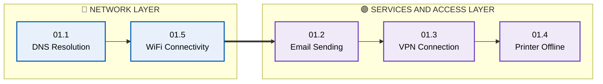
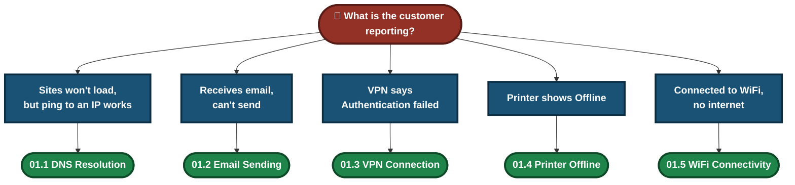
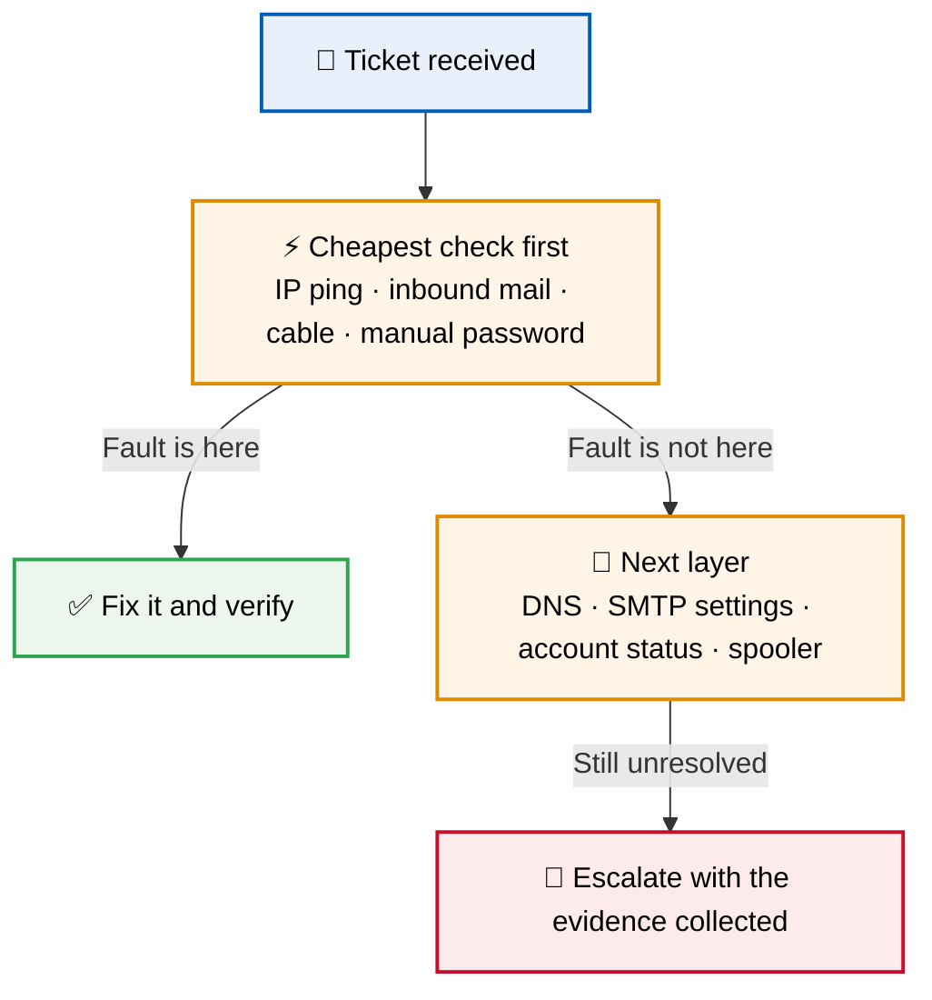
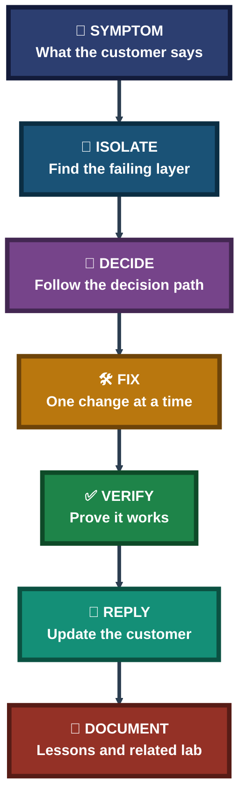

<div align="center">

# 🎥 Video Knowledge Base — IT Support Screen-Recording Scripts

**5 Scripts · Network → Services & Access · Read-Aloud Troubleshooting**

Five screen-recording scripts for common IT support issues, each written to be read aloud while the fix is shown on screen — from spotting the symptom, to the fix, to the words used with the customer.


Five issues, one repeatable method: find the layer that is failing, fix one thing at a time, prove the fix, and keep the customer informed. Every script follows the same structure.

### [📂 Jump to the scripts](#scripts-index)

### [📑 Open the visual index](INDEX.md)

</div>

---

## 📑 Table of Contents

1. [At a Glance](#at-a-glance)
2. [About This Folder](#about)
3. [Environment & Tools](#environment)
4. [The 5-Script Flow](#flow)
5. [Which Script Do I Need?](#which-script)
6. [Network Layer (Scripts 1 & 5)](#network-layer)
7. [Services & Access Layer (Scripts 2, 3 & 4)](#services-layer)
8. [Coverage Snapshot](#coverage-snapshot)
9. [Support Method Pipeline](#pipeline)
10. [Verification, Not Assumption](#verification)
11. [Command & Setting Cheat Sheet](#cheat-sheet)
12. [Problems & Fixes at a Glance](#problems-fixes)
13. [Scope & Limitations](#scope-limitations)
14. [What I Learned](#what-i-learned)
15. [Skills Demonstrated](#skills-demonstrated)
16. [Scripts Index](#scripts-index)
17. [Repo Structure](#repo-structure)

---

<a id="at-a-glance"></a>
## 📊 At a Glance

| 📄 Scripts | 🧩 Topics | 🧱 Sections per Script | 👤 Customer Scenarios |
|:---:|:---:|:---:|:---:|
| **5** | **5** | **10** | **5** |

---

<a id="about"></a>
## 📖 About This Folder

This folder holds five short video scripts for common IT support tickets. Each script is written so it can be read aloud during a screen recording. Every script uses the same ten sections: title, introduction, issue identification, visual decision path, troubleshooting steps, verification, customer interaction, tools used, lessons learned and a link to the related lab.

- **Network layer (Scripts 1 and 5):** DNS resolution and WiFi connectivity. Find out whether the fault is in name lookup or in the IP address.
- **Services and access layer (Scripts 2, 3 and 4):** Email sending, VPN authentication and printer offline. Find the setting, account or service that is blocking the user.

> [!NOTE]
> These are simulated support scenarios. The customer quotes in each script are role-played. Screenshots and lab evidence live in the related lab folder named at the bottom of each script.

<div align="center">

### 🧩 Support Workflow at a Glance

<table>
<tr>
<td align="center" valign="top" width="18%">

**🎫 Symptom**<br>
<sub>What the customer<br>reports</sub>

</td>
<td align="center" valign="middle" width="5%">

**➜**

</td>
<td align="center" valign="top" width="20%">

**🔎 Isolate**<br>
<sub>Find the failing<br>layer</sub>

</td>
<td align="center" valign="middle" width="5%">

**➜**

</td>
<td align="center" valign="top" width="18%">

**🛠 Fix**<br>
<sub>One change<br>at a time</sub>

</td>
<td align="center" valign="middle" width="5%">

**➜**

</td>
<td align="center" valign="top" width="18%">

**✅ Verify**<br>
<sub>Prove it<br>works</sub>

</td>
<td align="center" valign="middle" width="5%">

**➜**

</td>
<td align="center" valign="top" width="16%">

**👤 Reply**<br>
<sub>Tell the<br>customer</sub>

</td>
</tr>
<tr>
<td colspan="9" align="center">


<br>
<sub>Built-in Windows tools only, so every script can be repeated on any Windows PC</sub>

</td>
</tr>
</table>

</div>

---

<a id="environment"></a>
## 🖧 Environment & Tools

| Area | Tools Used |
|---|---|
| **Endpoint** | Windows PC or laptop, Command Prompt |
| **Name Resolution** | `ping`, `nslookup`, `ipconfig /flushdns`, Google Public DNS (8.8.8.8) |
| **IP Configuration** | `ipconfig /all`, `/release`, `/renew` |
| **Email** | Outlook or Thunderbird settings, SMTP port and authentication |
| **Identity & Remote Access** | Active Directory account console, VPN client, account unlock tools |
| **Print** | `services.msc` (Print Spooler), Device Manager, Devices and Printers |

---

<a id="flow"></a>
## ⏱️ The 5-Script Flow



<p align="center"><em>Scripts keep their numbered file order (01.1 to 01.5). The two groups show which layer each script belongs to.</em></p>

---

<a id="which-script"></a>
## 🧭 Which Script Do I Need?



---

<a id="network-layer"></a>
## 🔵 Network Layer (Scripts 1 & 5)

**Goal:** Work out which step of getting online is failing: the IP address, or the name lookup.

| # | Focus | What the Script Covers | File |
|:---:|---|---|:---:|
| **01.1** | DNS Resolution | "Server not found" on every website. Separates a DNS failure from a network outage using a raw IP ping, then clears the DNS cache and tests with `nslookup` and a public DNS. | [📄 Script](./01.1-DNS-Resolution-Issue.md) |
| **01.5** | WiFi Connectivity | "Connected" but no internet. Reads the IP configuration, finds a self-assigned `169.254.x.x` address, and renews the address from the router with `ipconfig`. | [📄 Script](./01.5-WiFi-Connectivity.md) |

### Where Name Lookup and Addressing Can Break


- **Script 01.5** works on the address step (IP from DHCP).
- **Script 01.1** works on the name lookup step (DNS).

---

<a id="services-layer"></a>
## 🟣 Services & Access Layer (Scripts 2, 3 & 4)

**Goal:** Find the setting, account or service that is stopping the user from working.

| # | Focus | What the Script Covers | File |
|:---:|---|---|:---:|
| **01.2** | Email Sending | Customer can receive mail but not send. Checks the outgoing port and encryption, and turns on outgoing authentication. | [📄 Script](./01.2-Email-Sending-Failure.md) |
| **01.3** | VPN Connection | "Authentication failed" with the correct password. Rules out a typing issue, finds a locked account, unlocks it, and checks other devices for an old saved password. | [📄 Script](./01.3-VPN-Connection-Failed.md) |
| **01.4** | Printer Offline | Department cannot print. Checks power and cable, restarts the Print Spooler service, and checks the driver against the printer firmware. | [📄 Script](./01.4-Printer-Offline.md) |

### 🔍 Analyst Note — Why the Simple Check Comes First

Every script starts with the cheapest check before touching anything complex. It rules out a whole group of causes in seconds.



---

<a id="coverage-snapshot"></a>
## 🌟 Coverage Snapshot

| 🛡️ Domain | 📌 Where It Appears | ✅ What Is Shown |
|---|---|---|
| Name Resolution (DNS) | Script 01.1 | Separating DNS from connectivity, cache flush, DNS testing |
| IP Addressing (DHCP) | Script 01.5 | Reading `ipconfig`, APIPA address, release and renew |
| Email (SMTP) | Script 01.2 | Inbound vs outbound, port, encryption, authentication |
| Identity & Remote Access | Script 01.3 | Account lockout, unlock, old saved passwords |
| Print Services | Script 01.4 | Print Spooler, driver and firmware check |
| Customer Communication | All 5 scripts | An urgent customer request and a reply in each script |

---

<a id="pipeline"></a>
## 🧭 Support Method Pipeline

How every script turns a customer complaint into a verified fix



---

<a id="verification"></a>
## ✅ Verification, Not Assumption

A recurring rule across the scripts: a fix is not done until it has been checked.

| Script | Verification Step |
|---|---|
| 01.1 DNS | Ping again, `nslookup` returns a valid IP, and the website loads |
| 01.2 Email | Send a test email and confirm it is delivered |
| 01.3 VPN | Reconnect with the current password and open internal resources |
| 01.4 Printer | Send a test print and confirm the printer shows Ready |
| 01.5 WiFi | Confirm a valid IP address, then load a website |

---

<a id="cheat-sheet"></a>
## 🧾 Command & Setting Cheat Sheet

| Script | Commands / Settings |
|---|---|
| 01.1 DNS | `ping 8.8.8.8` · `ping google.com` · `ipconfig /flushdns` · `nslookup google.com` |
| 01.2 Email | Outgoing port (25 → 587 with TLS) · outgoing server authentication |
| 01.3 VPN | Account status in the Active Directory console · unlock account |
| 01.4 Printer | `services.msc` → Print Spooler → Restart · driver and firmware check |
| 01.5 WiFi | `ipconfig /all` · `ipconfig /release` · `ipconfig /renew` · `ipconfig /flushdns` |

---

<a id="problems-fixes"></a>
## ⚠️ Problems & Fixes at a Glance

| ❌ Scenario in the Script | ✅ Fix Shown |
|---|---|
| Every website shows "Server not found" while the network works | Clear the DNS cache and test name resolution |
| Mail can be received but not sent | Correct the outgoing port and enable authentication |
| VPN says "Authentication failed" with the right password | Unlock the locked account and update old saved passwords |
| Printer shows Offline | Restart the Print Spooler and check the driver |
| Connected to WiFi with no internet | Release and renew the IP address |

---

<a id="scope-limitations"></a>
## 🚧 Scope & Limitations

- **Simulated scenarios:** Each script is one role-played case, not a real customer ticket.
- **Evidence lives in the labs:** Screenshots and recordings are in the related lab folder named in each script.
- **Infrastructure varies:** Where a script mentions a VPN gateway, Active Directory or a print server, check the related lab to see what was actually reproduced.
- **One case per script:** Other causes of the same symptom are not covered. For example, "connected, no internet" can also come from an ISP outage or DNS.
- **Not a company runbook:** Real workplaces need their own identity-verification and escalation rules.

These limits are stated here so the scripts are read as demonstrations, not as guaranteed fixes.

---

<a id="what-i-learned"></a>
## 🧠 What I Learned

- **Isolate the layer first.** A raw IP ping, an inbound mail check or a cable check narrows the problem fast.
- **Change one thing at a time.** Otherwise the real cause stays unknown.
- **Prove the fix.** A test email, a test print or a website load shows the fix worked.
- **Fix the cause, not only the symptom.** An unlocked account or a renewed address can fail again if the source is not found.
- **Talk to the customer.** Every scenario has an urgent request, and a clear, honest reply is part of the job.
- **Simple checks come first.** They rule out many causes cheaply.

---

<a id="skills-demonstrated"></a>
## 🛠️ Skills Demonstrated

- Diagnosing DNS and DHCP problems with `ping`, `nslookup` and `ipconfig`
- Troubleshooting outgoing email settings (port, encryption, authentication)
- Handling account lockouts and VPN authentication errors
- Managing the Print Spooler service and checking drivers
- Building clear decision-path diagrams for common tickets
- Writing customer replies for urgent support requests
- Turning each case into a repeatable, read-aloud script

---

<a id="scripts-index"></a>
## 📂 Scripts Index

| # | Script | Layer | Related Lab |
|:---:|---|:---:|---|
| 1 | [01.1 — DNS Resolution Issue](./01.1-DNS-Resolution-Issue.md) | Network | `03-it-support-troubleshooting/DNS-Troubleshooting-Resolution` |
| 2 | [01.2 — Email Sending Failure](./01.2-Email-Sending-Failure.md) | Services & Access | `03-it-support-troubleshooting/Email-Troubleshooting` |
| 3 | [01.3 — VPN Connection Failed](./01.3-VPN-Connection-Failed.md) | Services & Access | `03-it-support-troubleshooting/Remote-Desktop-VPN-Troubleshooting` |
| 4 | [01.4 — Printer Offline](./01.4-Printer-Offline.md) | Services & Access | `03-it-support-troubleshooting/Printer-Network-Print-Troubleshooting` |
| 5 | [01.5 — WiFi Connectivity](./01.5-WiFi-Connectivity.md) | Network | `03-it-support-troubleshooting/LAN-WiFi-Connectivity-Diagnostics` |

---

<a id="repo-structure"></a>
## 📁 Repo Structure

```text
01-video-knowledge-base/
|-- README.md
|-- 01.1-DNS-Resolution-Issue.md
|-- 01.2-Email-Sending-Failure.md
|-- 01.3-VPN-Connection-Failed.md
|-- 01.4-Printer-Offline.md
`-- 01.5-WiFi-Connectivity.md
```

<div align="center">

🎥 **[DNS Basics](https://www.cloudflare.com/learning/dns/what-is-dns/)** · 📶 **[What is DHCP](https://www.cloudflare.com/learning/network-layer/what-is-dhcp/)** · ✉️ **[What is SMTP](https://www.cloudflare.com/learning/email-security/what-is-smtp/)** · 🪟 **[Windows Commands](https://learn.microsoft.com/windows-server/administration/windows-commands/windows-commands)**

[⬅️ Back to Portfolio Root](../README.md)

</div>
