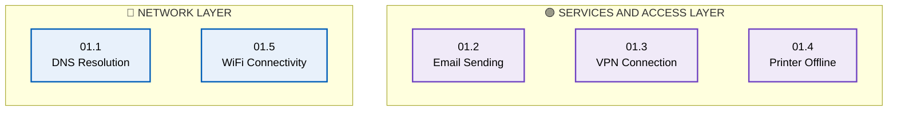
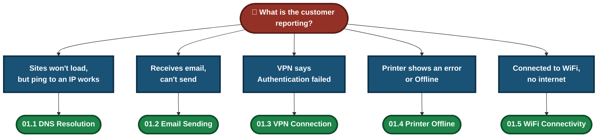
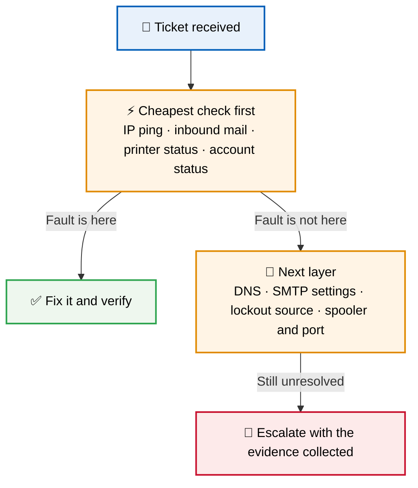
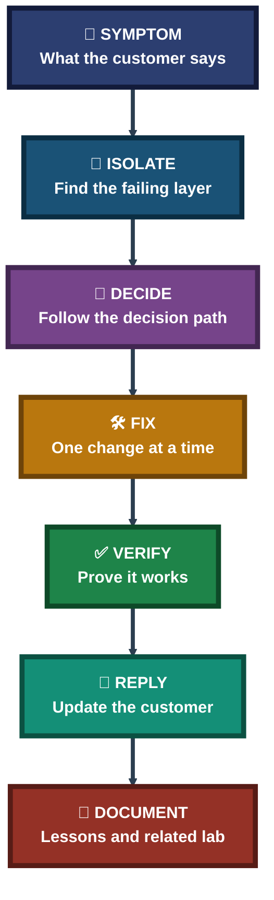

<div align="center">

# 🎥 Video Knowledge Base — IT Support Screen-Recording Scripts

**5 Scripts · Network → Services & Access · Read-Aloud Troubleshooting**

Five screen-recording scripts for common IT support issues, each written to be read aloud while the fix is shown on screen — from spotting the symptom, to the fix, to the words used with the customer.


Five issues, one repeatable method: find the layer that is failing, fix one thing at a time, prove the fix, and keep the customer informed. Every script follows the same structure.

### [📂 Jump to the scripts](#scripts-index)

### [📑 Open the visual index](../INDEX.md)

</div>

---

## 📑 Table of Contents

1. [At a Glance](#at-a-glance)
2. [About This Folder](#about)
3. [Environment & Tools](#environment)
4. [The 5-Script Flow](#flow)
5. [Which Script Do I Need?](#which-script)
6. [Network Layer (Scripts 1 & 5)](#network-layer)
7. [Services & Access Layer (Scripts 2, 3 & 4)](#services-layer)
8. [Coverage Snapshot](#coverage-snapshot)
9. [Support Method Pipeline](#pipeline)
10. [Verification, Not Assumption](#verification)
11. [Command & Setting Cheat Sheet](#cheat-sheet)
12. [Problems & Fixes at a Glance](#problems-fixes)
13. [Scope & Limitations](#scope-limitations)
14. [What I Learned](#what-i-learned)
15. [Skills Demonstrated](#skills-demonstrated)
16. [Scripts Index](#scripts-index)
17. [Repo Structure](#repo-structure)

---

<a id="at-a-glance"></a>
## 📊 At a Glance

| 📄 Scripts | 🧩 Topics | 🧱 Sections per Script | 👤 Customer Scenarios |
|:---:|:---:|:---:|:---:|
| **5** | **5** | **17** | **5** |

---

<a id="about"></a>
## 📖 About This Folder

This folder holds five short video scripts for common IT support tickets. Each script can be read aloud during a screen recording. Every script follows the same structure: At a Glance, Project Background, Environment, Project Flow, three modules (Issue Identification, Resolution & Verification, Customer Interaction), a decision path, a timed video script, summary, Challenges & Fixes, Scope & Limitations, What I Learned, Skills Demonstrated, Screenshot Index and Repo Structure.

- **Network layer (Scripts 1 and 5):** DNS resolution and WiFi connectivity. Find out whether the fault is in name lookup or in the IP address.
- **Services and access layer (Scripts 2, 3 and 4):** Email sending, VPN authentication and printer offline. Find the setting, account or service that is blocking the user.

> [!NOTE]
> These are simulated support scenarios. The faults were created on purpose in lab setups, and the customer quotes are role-played. Each script has its own `screenshots/` folder and states what was tested and what is "described, not tested".

<div align="center">

### 🧩 Support Workflow at a Glance

<table>
<tr>
<td align="center" valign="top" width="18%">

**🎫 Symptom**<br>
<sub>What the customer<br>reports</sub>

</td>
<td align="center" valign="middle" width="5%">

**➜**

</td>
<td align="center" valign="top" width="20%">

**🔎 Isolate**<br>
<sub>Find the failing<br>layer</sub>

</td>
<td align="center" valign="middle" width="5%">

**➜**

</td>
<td align="center" valign="top" width="18%">

**🛠 Fix**<br>
<sub>One change<br>at a time</sub>

</td>
<td align="center" valign="middle" width="5%">

**➜**

</td>
<td align="center" valign="top" width="18%">

**✅ Verify**<br>
<sub>Prove it<br>works</sub>

</td>
<td align="center" valign="middle" width="5%">

**➜**

</td>
<td align="center" valign="top" width="16%">

**👤 Reply**<br>
<sub>Tell the<br>customer</sub>

</td>
</tr>
<tr>
<td colspan="9" align="center">


<br>
<sub>Mostly built-in Windows tools. Free apps used where needed: Thunderbird (email) and Turbo VPN (VPN)</sub>

</td>
</tr>
</table>

</div>

---

<a id="environment"></a>
## 🖧 Environment & Tools

| Area | Tools Used |
|---|---|
| **Endpoint** | Windows PC or laptop, Command Prompt, PowerShell |
| **Name Resolution** | `ping`, `nslookup`, `ipconfig /all`, `ipconfig /flushdns`, Google Public DNS (8.8.8.8) |
| **IP Configuration** | `ipconfig /all`, `/release`, `/renew`, `netsh interface ip` |
| **Email** | Thunderbird with a test Gmail account (OAuth2), SMTP port, security and authentication settings, `Test-NetConnection` |
| **Identity & Remote Access** | Local Windows test account (stand-in for Active Directory), `net user`, `net accounts`, Event Viewer (event 4740), Turbo VPN client |
| **Print** | `services.msc` (Print Spooler), Print Server Properties, Devices and Printers, PowerShell |

---

<a id="flow"></a>
## ⏱️ The 5-Script Flow


```mermaid
flowchart LR
    subgraph L1["🔵 NETWORK LAYER"]
        direction LR
        S1["01.1<br/>DNS Resolution"] ~~~ S5["01.5<br/>WiFi Connectivity"]
    end
    subgraph L2["🟣 SERVICES AND ACCESS LAYER"]
        direction LR
        S2["01.2<br/>Email Sending"] ~~~ S3["01.3<br/>VPN Connection"] ~~~ S4["01.4<br/>Printer Offline"]
    end
    L1 ~~~ L2

    classDef one fill:#e8f1fb,stroke:#005EB8,stroke-width:2px,color:#000
    classDef two fill:#f0eaf8,stroke:#6f42c1,stroke-width:2px,color:#000
    class S1,S5 one
    class S2,S3,S4 two
```

<p align="center"><em>The two groups show which layer each script belongs to. The scripts are independent, so they can be read in any order. Files keep their numbered order (01.1 to 01.5).</em></p>

---

<a id="which-script"></a>
## 🧭 Which Script Do I Need?


```mermaid
flowchart TD
    Start(["🎫 What is the customer reporting?"]):::start
    Start --> A["Sites won't load,<br/>but ping to an IP works"]:::q
    Start --> B["Receives email,<br/>can't send"]:::q
    Start --> C["VPN says<br/>Authentication failed"]:::q
    Start --> D["Printer shows an error<br/>or Offline"]:::q
    Start --> E["Connected to WiFi,<br/>no internet"]:::q
    A --> S1(["01.1 DNS Resolution"]):::s
    B --> S2(["01.2 Email Sending"]):::s
    C --> S3(["01.3 VPN Connection"]):::s
    D --> S4(["01.4 Printer Offline"]):::s
    E --> S5(["01.5 WiFi Connectivity"]):::s

    classDef start fill:#943126,stroke:#571C16,stroke-width:3px,color:#FFFFFF,font-weight:bold
    classDef q fill:#1A5276,stroke:#0B2E43,stroke-width:3px,color:#FFFFFF,font-weight:bold
    classDef s fill:#1E8449,stroke:#0E4A28,stroke-width:3px,color:#FFFFFF,font-weight:bold
```

---

<a id="network-layer"></a>
## 🔵 Network Layer (Scripts 1 & 5)

**Goal:** Work out which step of getting online is failing: the IP address, or the name lookup.

| # | Focus | What the Script Covers | File |
|:---:|---|---|:---:|
| **01.1** | DNS Resolution | "Server not found" on every website. Separates a DNS failure from a network outage using a raw IP ping, reads the configured DNS servers with `ipconfig /all`, corrects them, flushes the cache, and tests with `nslookup`. | [📄 Script](./01.1-DNS-Resolution-Issue.md) |
| **01.5** | WiFi Connectivity | "Connected" but no internet. Reads the IP configuration, finds a `169.254.x.x` address (set by hand to simulate the fault), sets the adapter back to DHCP, renews the address from the router, and tests the gateway and internet with `ping`. | [📄 Script](./01.5-WiFi-Connectivity.md) |

### Where Name Lookup and Addressing Can Break


```mermaid
flowchart LR
    A["📡 WiFi link"]:::a --> B["🔑 IP address<br/>from DHCP"]:::b --> C["🚪 Gateway"]:::c --> D["📖 DNS<br/>name lookup"]:::d --> E["🌐 Website"]:::e

    classDef a fill:#1A5276,stroke:#0B2E43,stroke-width:3px,color:#FFFFFF,font-weight:bold
    classDef b fill:#943126,stroke:#571C16,stroke-width:3px,color:#FFFFFF,font-weight:bold
    classDef c fill:#B9770E,stroke:#6E4409,stroke-width:3px,color:#FFFFFF,font-weight:bold
    classDef d fill:#76448A,stroke:#432752,stroke-width:3px,color:#FFFFFF,font-weight:bold
    classDef e fill:#2C3E70,stroke:#131B3A,stroke-width:3px,color:#FFFFFF,font-weight:bold
```

- **Script 01.5** works on the address step (IP from DHCP).
- **Script 01.1** works on the name lookup step (DNS).

---

<a id="services-layer"></a>
## 🟣 Services & Access Layer (Scripts 2, 3 & 4)

**Goal:** Find the setting, account or service that is stopping the user from working.

| # | Focus | What the Script Covers | File |
|:---:|---|---|:---:|
| **01.2** | Email Sending | Customer can receive mail but not send. Tests which port is reachable (25 failed, 587 worked), sets port 587 with STARTTLS, reads the new error, then sets authentication to OAuth2 and confirms the email arrives. | [📄 Script](./01.2-Email-Sending-Failure.md) |
| **01.3** | VPN Connection | "Authentication failed" with the correct password. Uses a local Windows test account as a stand-in for Active Directory: finds the locked account, unlocks it, finds the lockout source in the Security log (event 4740), and restores the policy. | [📄 Script](./01.3-VPN-Connection-Failed.md) |
| **01.4** | Printer Offline | Department cannot print. The lab printer showed "Error" (not "Offline"). Restarts the Print Spooler, checks the driver list, and fixes the printer port. Power, cable and firmware checks are described, not tested. | [📄 Script](./01.4-Printer-Offline.md) |

### 🔍 Analyst Note — Why the Simple Check Comes First

Every script starts with the cheapest check before touching anything complex. It rules out a whole group of causes in seconds.


```mermaid
flowchart TD
    A["🎫 Ticket received"]:::start --> B["⚡ Cheapest check first<br/>IP ping · inbound mail · printer status · account status"]:::work
    B -->|Fault is here| C["✅ Fix it and verify"]:::good
    B -->|Fault is not here| D["🔎 Next layer<br/>DNS · SMTP settings · lockout source · spooler and port"]:::work
    D -->|Still unresolved| E["📨 Escalate with the evidence collected"]:::bad

    classDef start fill:#e8f1fb,stroke:#005EB8,stroke-width:2px,color:#000
    classDef work fill:#fff4e5,stroke:#e08a00,stroke-width:2px,color:#000
    classDef good fill:#eef7ee,stroke:#2ea44f,stroke-width:2px,color:#000
    classDef bad fill:#fdeaea,stroke:#C8102E,stroke-width:2px,color:#000
```

---

<a id="coverage-snapshot"></a>
## 🌟 Coverage Snapshot

| 🛡️ Domain | 📌 Where It Appears | ✅ What Is Shown |
|---|---|---|
| Name Resolution (DNS) | Script 01.1 | Separating DNS from connectivity, reading the DNS servers, correcting them, cache flush, `nslookup` |
| IP Addressing (DHCP) | Script 01.5 | Reading `ipconfig`, APIPA-range address (simulated), DHCP, release and renew |
| Email (SMTP) | Script 01.2 | Inbound vs outbound, port test, STARTTLS, OAuth2 authentication, delivery check |
| Account Lockout & Access | Script 01.3 | Locked account, unlock, lockout source in the Security log (local account stand-in) |
| Print Services | Script 01.4 | Print Spooler, driver list, printer port |
| Customer Communication | All 5 scripts | An urgent customer request and a reply in each script |

---

<a id="pipeline"></a>
## 🧭 Support Method Pipeline

How every script turns a customer complaint into a verified fix


```mermaid
flowchart TB
    Sym["🎫 SYMPTOM<br/>What the customer says"]:::symClass
    Iso["🔎 ISOLATE<br/>Find the failing layer"]:::isoClass
    Dec["🧭 DECIDE<br/>Follow the decision path"]:::decClass
    Fix["🛠 FIX<br/>One change at a time"]:::fixClass
    Ver["✅ VERIFY<br/>Prove it works"]:::verClass
    Rep["👤 REPLY<br/>Update the customer"]:::repClass
    Doc["📝 DOCUMENT<br/>Lessons and related lab"]:::docClass

    Sym --> Iso --> Dec --> Fix --> Ver --> Rep --> Doc

    classDef symClass fill:#2C3E70,stroke:#131B3A,stroke-width:5px,color:#FFFFFF,font-weight:bold,font-size:16px
    classDef isoClass fill:#1A5276,stroke:#0B2E43,stroke-width:5px,color:#FFFFFF,font-weight:bold,font-size:16px
    classDef decClass fill:#76448A,stroke:#432752,stroke-width:5px,color:#FFFFFF,font-weight:bold,font-size:16px
    classDef fixClass fill:#B9770E,stroke:#6E4409,stroke-width:5px,color:#FFFFFF,font-weight:bold,font-size:16px
    classDef verClass fill:#1E8449,stroke:#0E4A28,stroke-width:5px,color:#FFFFFF,font-weight:bold,font-size:16px
    classDef repClass fill:#148F77,stroke:#0B5142,stroke-width:5px,color:#FFFFFF,font-weight:bold,font-size:16px
    classDef docClass fill:#943126,stroke:#571C16,stroke-width:5px,color:#FFFFFF,font-weight:bold,font-size:16px

    linkStyle default stroke:#2C3E50,stroke-width:4px
```

---

<a id="verification"></a>
## ✅ Verification, Not Assumption

A recurring rule across the scripts: a fix is not done until it has been checked.

| Script | Verification Step |
|---|---|
| 01.1 DNS | `nslookup` returns a valid IP, and the website and the customer's store load |
| 01.2 Email | Outbox is empty and the test email arrives in the recipient's Inbox |
| 01.3 VPN | Account shows as unlocked and the lockout source is found. Access to internal resources is described, not tested |
| 01.4 Printer | Printer queue shows "0 document(s) in queue" after the port fix. A test from another PC is described, not tested |
| 01.5 WiFi | Valid IP address, `ping` to the gateway and `8.8.8.8` with 0% loss, and a website and presentation tool load |

---

<a id="cheat-sheet"></a>
## 🧾 Command & Setting Cheat Sheet

| Script | Commands / Settings |
|---|---|
| 01.1 DNS | `ping 8.8.8.8` · `ping google.com` · `ipconfig /all` · `ipconfig /flushdns` · `nslookup google.com` |
| 01.2 Email | `Test-NetConnection smtp.gmail.com -Port 25` and `-Port 587` · SMTP port 587 with STARTTLS · authentication method OAuth2 |
| 01.3 VPN | `net user` · `net accounts` · Local Users and Groups (`lusrmgr.msc`) · Event Viewer, Security log, event `4740` |
| 01.4 Printer | `services.msc` → Print Spooler → Restart · Print Server Properties (Drivers tab) · printer port settings · `Get-Printer` |
| 01.5 WiFi | `ipconfig /all` · `ipconfig /release` · `ipconfig /renew` · `netsh interface ip` · `ping` (`ipconfig /flushdns` described, not tested) |

---

<a id="problems-fixes"></a>
## ⚠️ Problems & Fixes at a Glance

| ❌ Scenario in the Script | ✅ Fix Shown |
|---|---|
| Every website shows "Server not found" while the network works | Read the DNS servers with `ipconfig /all`, correct them, then flush the cache and test with `nslookup` |
| Mail can be received but not sent | Use a reachable port (587) with STARTTLS, then set authentication to OAuth2 |
| VPN says "Authentication failed" with the right password | Unlock the locked account and find the lockout source in the Security log |
| Printer shows an error instead of Ready | Restart the Print Spooler, check the driver, and correct the printer port |
| Connected to WiFi with no internet | Set the adapter back to DHCP, then release and renew the IP address |

---

<a id="scope-limitations"></a>
## 🚧 Scope & Limitations

- **Simulated scenarios:** Each script is one role-played case, not a real customer ticket. The faults were created on purpose.
- **Evidence:** Each script has its own `screenshots/` folder, and private data is covered with solid black boxes.
- **Not the real infrastructure:** The VPN script used a local Windows account instead of Active Directory, and the VPN client was not linked to that account. The printer was a virtual printer with no physical device. The WiFi fault was set by hand with `netsh`.
- **Described, not tested:** Items that were not done in the lab are marked "described, not tested" in each script (for example internal resource access in 01.3, firmware and another user's PC in 01.4, and `ipconfig /flushdns` in 01.5).
- **One case per script:** Other causes of the same symptom are not covered. For example, "connected, no internet" can also come from an ISP outage or DNS.
- **Not a company runbook:** Real workplaces need their own identity-verification and escalation rules.

These limits are stated here so the scripts are read as demonstrations, not as guaranteed fixes.

---

<a id="what-i-learned"></a>
## 🧠 What I Learned

- **Isolate the layer first.** A raw IP ping, an inbound mail check or a printer status check narrows the problem fast.
- **Change one thing at a time.** Otherwise the real cause stays unknown.
- **Prove the fix.** A test email, a queue check or a website load shows the fix worked.
- **Fix the cause, not only the symptom.** An unlocked account or a renewed address can fail again if the source is not found, and flushing a cache does not help when the DNS server itself is wrong.
- **Read the exact error.** A changed error message shows what the last change did.
- **Talk to the customer.** Every scenario has an urgent request, and a clear, honest reply is part of the job.
- **Say what was not tested.** Marking steps "described, not tested" keeps the evidence honest.

---

<a id="skills-demonstrated"></a>
## 🛠️ Skills Demonstrated

- Diagnosing DNS and DHCP problems with `ping`, `nslookup` and `ipconfig`
- Troubleshooting outgoing email (port test, STARTTLS, OAuth2)
- Handling account lockouts and reading the Security log (event 4740)
- Managing the Print Spooler service, checking drivers and printer ports
- Building clear decision-path diagrams for common tickets
- Writing customer replies for urgent support requests
- Documenting limits honestly and hiding private data in evidence
- Turning each case into a repeatable, read-aloud script

---

<a id="scripts-index"></a>
## 📂 Scripts Index

| # | Script | Layer | Related Lab |
|:---:|---|:---:|---|
| 1 | [01.1 — DNS Resolution Issue](./01.1-DNS-Resolution-Issue.md) | Network | `03-it-support-troubleshooting/DNS-Troubleshooting-Resolution` |
| 2 | [01.2 — Email Sending Failure](./01.2-Email-Sending-Failure.md) | Services & Access | `03-it-support-troubleshooting/Email-Troubleshooting` |
| 3 | [01.3 — VPN Connection Failed](./01.3-VPN-Connection-Failed.md) | Services & Access | `03-it-support-troubleshooting/Remote-Desktop-VPN-Troubleshooting` |
| 4 | [01.4 — Printer Offline](./01.4-Printer-Offline.md) | Services & Access | `03-it-support-troubleshooting/Printer-Network-Print-Troubleshooting` |
| 5 | [01.5 — WiFi Connectivity](./01.5-WiFi-Connectivity.md) | Network | `03-it-support-troubleshooting/LAN-WiFi-Connectivity-Diagnostics` |

---

<a id="repo-structure"></a>
## 📁 Repo Structure

```text
01-video-knowledge-base/
|-- README.md
|-- 01.1-DNS-Resolution-Issue.md
|-- 01.2-Email-Sending-Failure.md
|-- 01.3-VPN-Connection-Failed.md
|-- 01.4-Printer-Offline.md
`-- 01.5-WiFi-Connectivity.md
```

<div align="center">

🎥 **[DNS Basics](https://www.cloudflare.com/learning/dns/what-is-dns/)** · 📶 **[What is DHCP](https://www.cloudflare.com/learning/network-layer/what-is-dhcp/)** · ✉️ **[What is SMTP](https://www.cloudflare.com/learning/email-security/what-is-smtp/)** · 🪟 **[Windows Commands](https://learn.microsoft.com/windows-server/administration/windows-commands/windows-commands)**

[⬅️ Back to Portfolio Root](../README.md)

</div>
