<div align="center">

# 🎫 Ticket Simulation — DNS Resolution Failure (TKT-2026-001)

**Lab — IT Support Ticketing**

Ticket Triage · DNS Diagnostics · Root Cause · Customer Communication


A sales user cannot open any website or the CRM name. This lab builds a small DNS setup in Azure, stops the DNS service on purpose, proves where the fault is with client and server evidence, restores the service, and shows how to keep the customer informed.

</div>

> [!NOTE]
> Simulated ticket. The customer, quotes and office are role-played. The fault was created on purpose by stopping the DNS service. Public IP addresses, account details and subscription IDs are blurred in the screenshots.

---

## 📑 Table of Contents

1. [At a Glance](#at-a-glance)
2. [Ticket Record](#ticket-record)
3. [Project Background](#project-background)
4. [Environment](#environment)
5. [Ticket Flow](#ticket-flow)
6. [Module 1 — Lab Build](#module-1)
7. [Module 2 — Triage & Scope](#module-2)
8. [Where the Outage Can Sit](#outage-layers)
9. [Module 3 — Diagnostics & Root Cause](#module-3)
10. [Module 4 — Resolution & Verification](#module-4)
11. [Module 5 — Customer Communication](#module-5)
12. [Decision Path](#decision-path)
13. [Project Summary](#project-summary)
14. [Challenges & Fixes](#challenges-fixes)
15. [Scope & Limitations](#scope-limitations)
16. [What I Learned](#what-i-learned)
17. [Skills Demonstrated](#skills-demonstrated)
18. [Screenshot Index](#screenshot-index)
19. [Repo Structure](#repo-structure)

---

<a id="at-a-glance"></a>
## 📊 At a Glance

| 🧩 Modules | 🖼️ Screenshots | 🔍 Diagnostic Checks | 💬 Customer Messages |
|:---:|:---:|:---:|:---:|
| **5** | **14** | **8** | **3** |

---

<a id="ticket-record"></a>
## 🎫 Ticket Record

| Field | Value |
|---|---|
| **Ticket #** | TKT-2026-001 |
| **Date** | 2026-10-03 |
| **Priority** | P1 (Critical) — the customer says the whole sales team cannot work and the CRM is down |
| **Status** | Resolved ✅ |
| **Category** | DNS Resolution |
| **Customer** | Sarah Khan, Sales, Karachi Office (role-played) |
| **Impact / Scope** | Reported: sales team. Tested in this lab: one client machine (see Scope & Limitations) |
| **Outage window (lab)** | Service stopped 09:17:36 UTC, started again 09:23:18 UTC |

> *"All websites are showing 'Server not found' errors. I can't access our CRM or any websites. My team is unable to work."*

---

<a id="project-background"></a>
## 📖 Project Background

When one DNS server stops answering, every device that uses it loses name resolution. A good ticket proves where the fault is, fixes the shared source, and confirms the real service works.

- **Module 1 — Lab Build:** Build a DNS server and a client in Azure.
- **Module 2 — Triage & Scope:** Set the priority from the impact and ask how many users are affected.
- **Module 3 — Diagnostics & Root Cause:** Prove the fault is the DNS server, using client tests and the server itself.
- **Module 4 — Resolution & Verification:** Restore the service and test through the real setup.
- **Module 5 — Customer Communication:** Acknowledge, update and close with clear messages.

<div align="center">

### 🧩 Lab Setup at a Glance

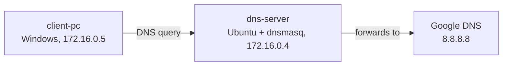

</div>

---

<a id="environment"></a>
## 🖧 Environment

| Item | Value |
|---|---|
| **Platform** | Microsoft Azure for Students, region India South Central, one virtual network and subnet for both machines |
| **DNS server** | `dns-server`: Ubuntu Server 24.04 LTS, `dnsmasq` 2.91, private IP `172.16.0.4` (set to static) |
| **Client** | `client-pc`: Windows Server 2022 Datacenter, private IP `172.16.0.5`, DNS set to `172.16.0.4` on its network interface |
| **VM size** | Standard B2ls v2 (2 vCPU, 4 GiB) for both |
| **Server access** | SSH (`systemctl`, `journalctl`) |
| **Client commands** | `ping`, `nslookup`, `ipconfig /all`, `ipconfig /flushdns`, run with Azure Run Command (RunPowerShellScript) |
| **Test DNS server** | Google Public DNS (`8.8.8.8`) |
| **Test record** | `crm.lab.local` → `172.16.0.4` (stands in for the CRM name) |

---

<a id="ticket-flow"></a>
## ⏱️ Ticket Flow

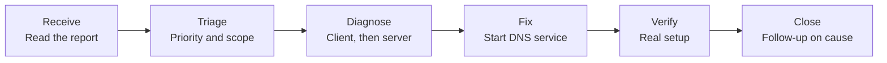

---

<a id="module-1"></a>
## 🟡 Module 1 — Lab Build

**Objective:** Build a working DNS setup first, so the fault can be created and fixed on purpose.

### Step 1 — Create the DNS server VM ✅

Create an Ubuntu Server 24.04 VM named `dns-server` in a new resource group. Set the private IP to **static** so it does not change after a restart. Turn on auto-shutdown to save credit.

<p align="center">
  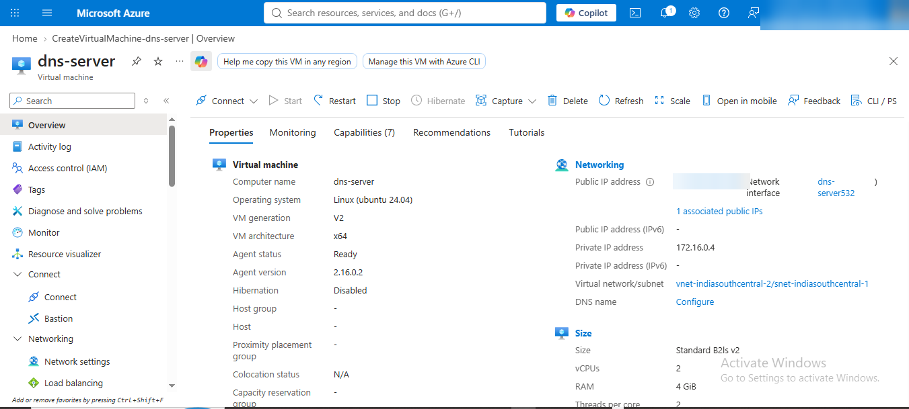<br>
  <em>Build 1 — <code>dns-server</code> is Ubuntu 24.04 with private IP <code>172.16.0.4</code> (public IP hidden)</em>
</p>

### Step 2 — Install and configure dnsmasq ✅

```bash
sudo apt update && sudo apt install dnsmasq -y
```

The first start failed because Ubuntu already uses port 53 locally. Listening only on the private IP fixed it:

```bash
sudo tee /etc/dnsmasq.d/lab.conf > /dev/null <<'EOF'
listen-address=172.16.0.4
bind-interfaces
no-resolv
server=8.8.8.8
address=/crm.lab.local/172.16.0.4
EOF
sudo systemctl restart dnsmasq
```

<p align="center">
  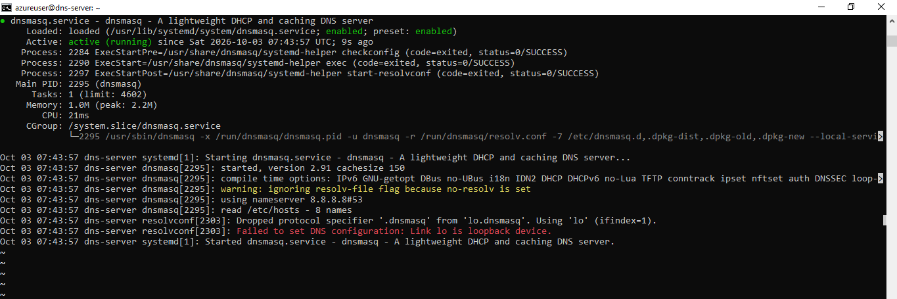<br>
  <em>Build 2 — <code>dnsmasq</code> is <code>active (running)</code> and uses <code>8.8.8.8</code> as the upstream server</em>
</p>

### Step 3 — Test the server from itself ✅

```bash
nslookup crm.lab.local 172.16.0.4
nslookup google.com 172.16.0.4
```

<p align="center">
  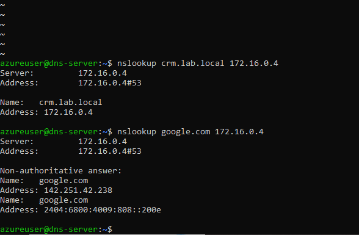<br>
  <em>Build 3 — The server answers its own record and forwards <code>google.com</code> to the internet</em>
</p>

### Step 4 — Lock down access ✅

The SSH rule in the network security group allows only my own IP, not "Any". The RDP rule on the client is limited the same way. A temporary port 53 rule used for an earlier test was deleted.

<p align="center">
  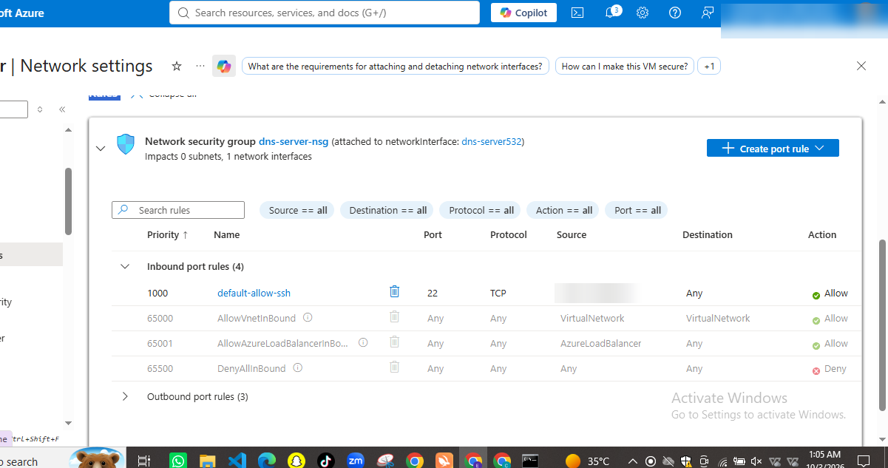<br>
  <em>Build 4 — SSH is allowed only from one source address (hidden). No DNS rule is open to the internet</em>
</p>

### Step 5 — Create the client and point it to the server ✅

Create `client-pc` in the **same virtual network**. On its network interface, set **DNS servers → Custom → `172.16.0.4`**, then restart it.

<p align="center">
  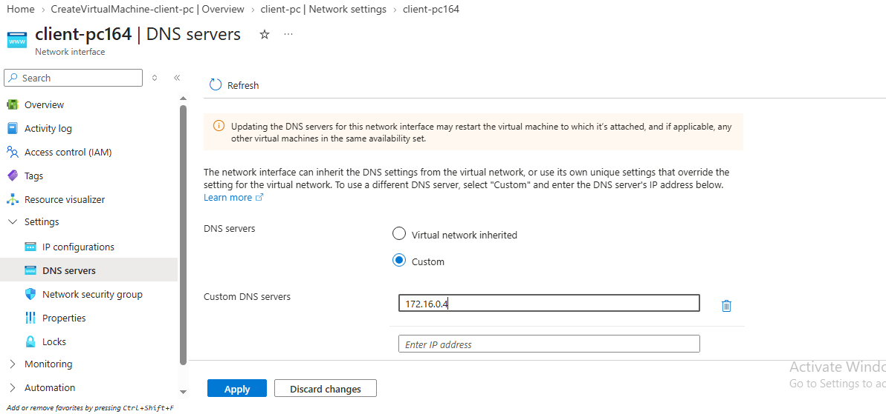<br>
  <em>Build 5 — Client network interface uses the custom DNS server <code>172.16.0.4</code></em>
</p>

### Step 6 — Record a working baseline ✅

Before breaking anything, prove the setup works from the client.

<p align="center">
  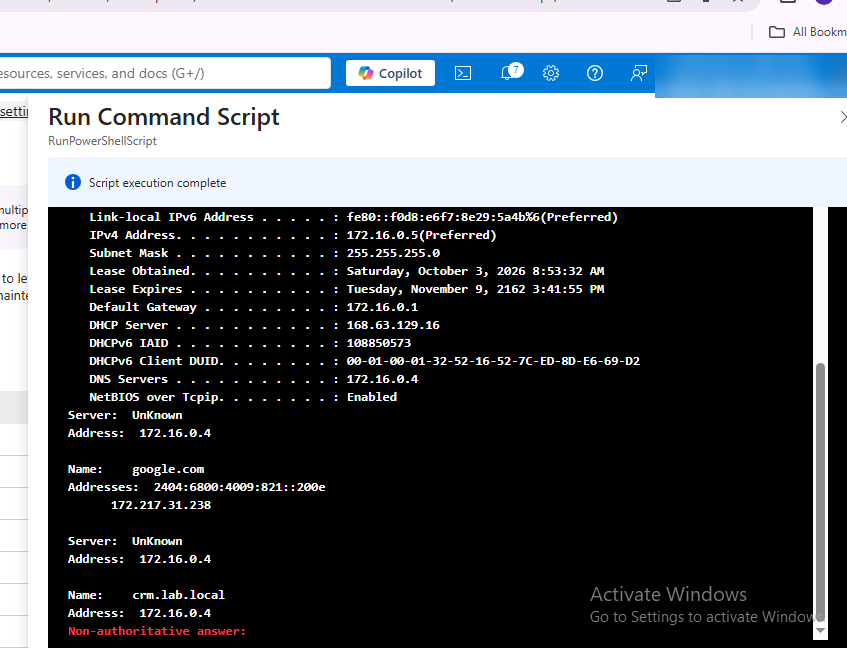<br>
  <em>Build 6 — Before the fault: <code>ipconfig /all</code> shows DNS server <code>172.16.0.4</code>, and <code>google.com</code> and <code>crm.lab.local</code> both resolve (run with Azure Run Command)</em>
</p>

🎯 **Result:** A client that resolves names only through `172.16.0.4`, with a recorded "before" state.

---

<a id="module-2"></a>
## 🔵 Module 2 — Triage & Scope

**Objective:** Set the right priority and find out how far the problem reaches.

### Step 7 — Read the impact ✅

The customer says the whole team cannot work and the CRM is down. That is a business-wide impact, so the ticket is P1, not P2.

### Step 8 — Check the scope ✅

Ask whether other devices and users have the same problem.

| Check | Result |
|---|---|
| Other users or devices affected | Reported by the customer as the whole team. Only one client machine was tested in this lab |
| Priority | P1 (Critical) |

---

<a id="outage-layers"></a>
## 🗺️ Where the Outage Can Sit

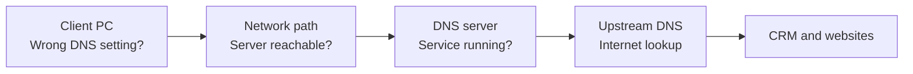

- A client that cannot reach DNS does not show which box is broken.
- The next module tests the boxes in order: client, path, server.

---

<a id="module-3"></a>
## 🟢 Module 3 — Diagnostics & Root Cause

**Objective:** Prove where the fault is and why, using evidence from the client and the server.

For this lab the fault was created on purpose by stopping the DNS service on the server:

```bash
sudo systemctl stop dnsmasq
```

### Step 9 — Test connectivity and name resolution ✅

```cmd
ipconfig /flushdns
ping 8.8.8.8 -n 2
ping google.com -n 2
nslookup google.com
```

<p align="center">
  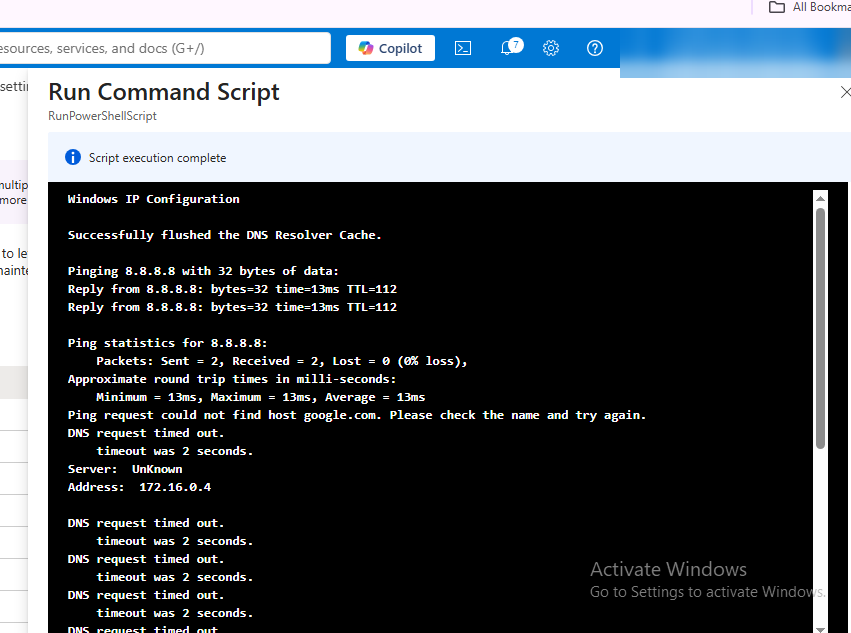<br>
  <em>Exhibit 1 — <code>ping 8.8.8.8</code> works (0% loss). <code>ping google.com</code> fails with "could not find host", and <code>nslookup</code> times out against <code>172.16.0.4</code></em>
</p>

### Step 10 — Read the configured DNS server ✅

`ipconfig /all` on the client shows DNS server `172.16.0.4` (see Build 6, captured before the fault). The client is pointed at the right server, so the problem is not a wrong setting on the PC.

### Step 11 — Test the DNS server itself ✅

```cmd
ping 172.16.0.4 -n 2
nslookup google.com 172.16.0.4
```

<p align="center">
  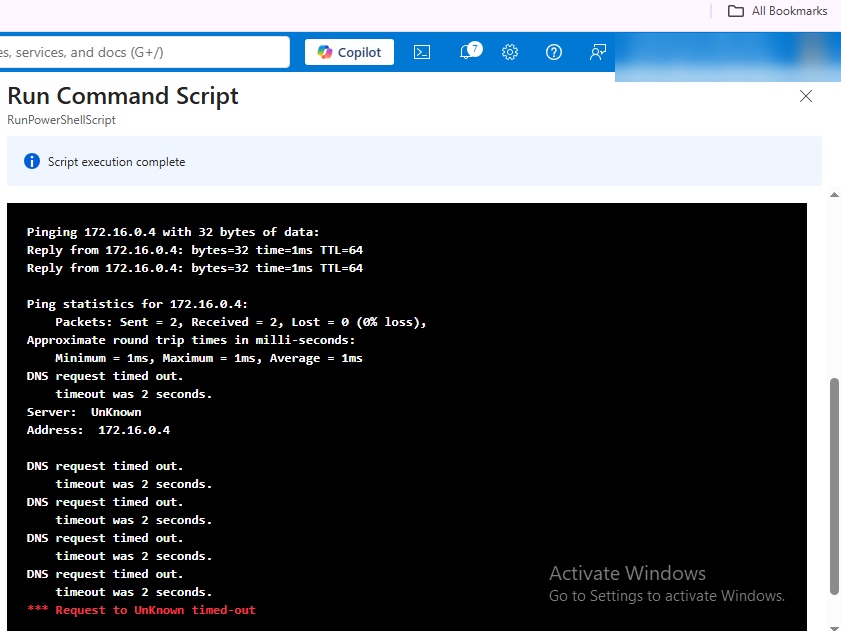<br>
  <em>Exhibit 2 — The server replies to ping (0% loss), but <code>nslookup</code> against it times out. The machine is up, the DNS answers are missing</em>
</p>

### Step 12 — Test a second DNS server ✅

```cmd
nslookup google.com 8.8.8.8
```

<p align="center">
  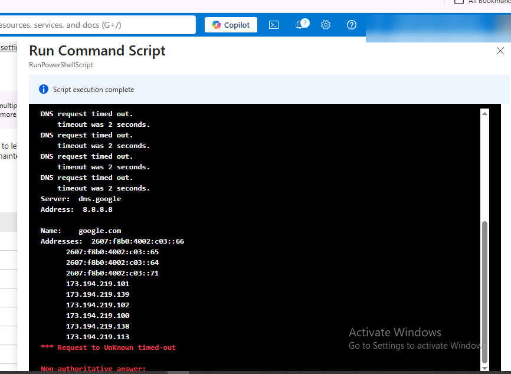<br>
  <em>Exhibit 3 — Through <code>8.8.8.8</code> (<code>dns.google</code>) the name resolves. Internet DNS works, so the problem is the internal server</em>
</p>

### Step 13 — Check the DNS service on the server ✅

```bash
systemctl status dnsmasq
```

<p align="center">
  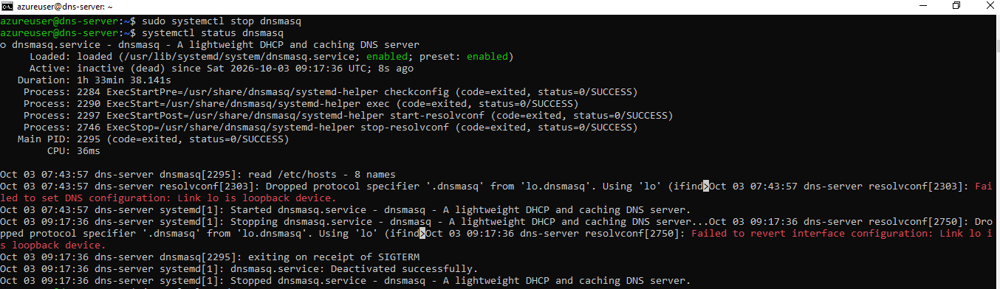<br>
  <em>Exhibit 4 — <code>dnsmasq</code> shows <code>inactive (dead)</code></em>
</p>

### Step 14 — Read the service log ✅

```bash
journalctl -u dnsmasq -n 20
```

<p align="center">
  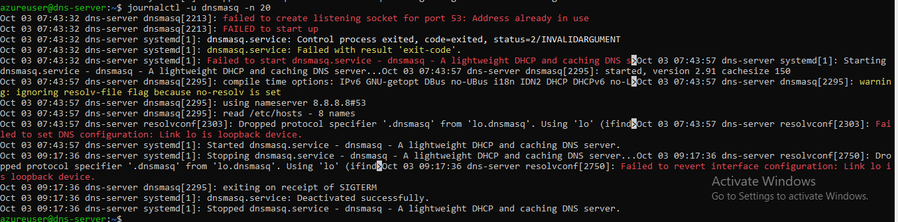<br>
  <em>Exhibit 5 — The log at 09:17:36 shows "exiting on receipt of SIGTERM" and "Deactivated successfully". The older "Address already in use" lines are from the first setup attempt, before the config fix</em>
</p>

🎯 **Result:** The client and the network are fine. The DNS server machine is up, but the DNS service is not running.

| Check | Result |
|---|---|
| `ping 8.8.8.8` | Success — network connectivity exists |
| `ping google.com` | Failed — could not find host |
| `ipconfig /all` | DNS server `172.16.0.4` (correct setting) |
| `ping 172.16.0.4` | Replies — the server machine is up |
| `nslookup google.com 172.16.0.4` | Timed out — the DNS service is not answering |
| `nslookup google.com 8.8.8.8` | Resolves — internet DNS works |
| `systemctl status dnsmasq` | `inactive (dead)` |
| `journalctl -u dnsmasq` | Clean stop at 09:17:36 UTC (SIGTERM) |

### 🎯 Root Cause

The `dnsmasq` DNS service on `172.16.0.4` was stopped, so every device using it lost name resolution.

> [!IMPORTANT]
> In this lab the service was stopped by me on purpose. A manual stop appears in the log as a normal stop, not a crash. In a real ticket, the reason for the stop would still need to be found.

---

<a id="module-4"></a>
## 🟠 Module 4 — Resolution & Verification

**Objective:** Fix the shared source first, then prove it works through the real setup.

### Step 15 — Start the DNS service ✅

```bash
sudo systemctl start dnsmasq
systemctl status dnsmasq
```

<p align="center">
  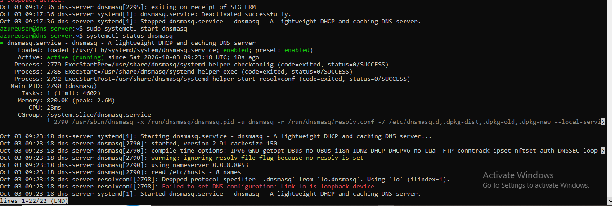<br>
  <em>Exhibit 6 — <code>dnsmasq</code> is <code>active (running)</code> again (started at 09:23:18 UTC)</em>
</p>

Fixing the server restores every client at once. No change was made on the client, and the client DNS stayed on `172.16.0.4`.

> [!WARNING]
> Setting a client to a public DNS (`8.8.8.8`) would only be a workaround. A public DNS cannot resolve internal names such as the CRM name. It would also not prove the fixed server works.

### Step 16 — Verify through the real setup ✅

```cmd
ipconfig /flushdns
nslookup google.com
nslookup crm.lab.local
```

<p align="center">
  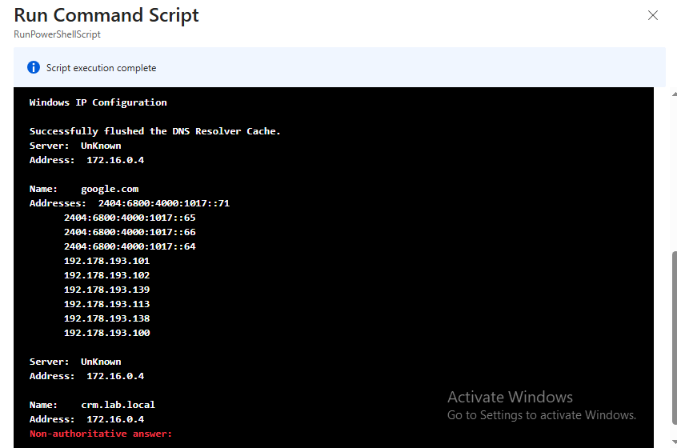<br>
  <em>Exhibit 7 — With the client still on <code>172.16.0.4</code>, <code>google.com</code> and <code>crm.lab.local</code> both resolve</em>
</p>

🎯 **Result:** Name resolution works again through the fixed server, including the CRM name.

| Verification | Result |
|---|---|
| `nslookup google.com` (client DNS unchanged) | Resolves ✅ |
| `nslookup crm.lab.local` | Resolves to `172.16.0.4` ✅ |
| CRM web page | Not tested (the lab has no web server, only the name record) |
| Second client PC | Not tested |

### 🔍 Analyst Note — Why Not Verify Through the Workaround?

- If the client were set to `8.8.8.8`, a working `google.com` would prove nothing about the internal server.
- Test with the client on its normal DNS server, then attach the ping, `nslookup`, `systemctl` and `journalctl` evidence to the ticket.

---

<a id="module-5"></a>
## 🟣 Module 5 — Customer Communication

**Objective:** Keep an urgent customer informed without claiming a cause too early.

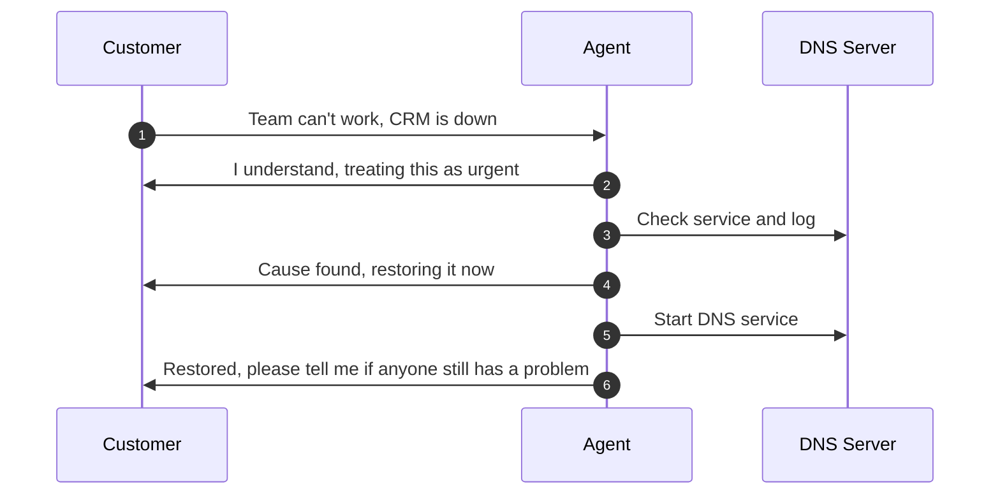

- **Acknowledge:** "I understand your team can't work. I'm treating this as urgent and checking the DNS now."
- **Update:** "The cause is the DNS service on our server, which has stopped. I'm restoring it now and will confirm as soon as names resolve again."
- **Close:** "DNS is restored. Websites and the CRM name now resolve from your PC. Please tell me if any colleague still has a problem. I'm also checking why the service stopped."

---

<a id="decision-path"></a>
## 🧭 Decision Path

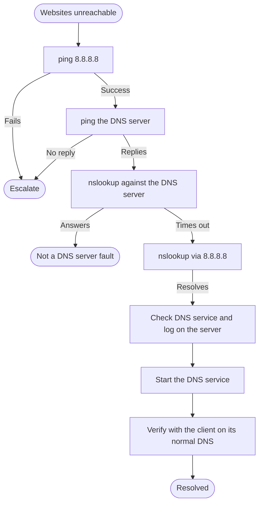

---

<a id="project-summary"></a>
## 📝 Project Summary

| Module | Tooling | Key Finding |
|---|---|---|
| Lab Build | Azure, `dnsmasq`, `nslookup` | Working DNS server and client, with a recorded baseline |
| Triage & Scope | Ticket fields | Reported team-wide impact makes this P1, and scope is checked first |
| Diagnostics & Root Cause | `ping`, `nslookup`, `systemctl`, `journalctl` | Network and server machine work, the DNS service is stopped |
| Resolution & Verification | `systemctl`, `nslookup` | Source fixed, client left unchanged, real setup verified |
| Customer Communication | Communication | Acknowledged, updated and closed without claiming unproven things |

---

<a id="challenges-fixes"></a>
## ⚠️ Challenges & Fixes

| ❌ Challenge | ✅ Fix |
|---|---|
| `dnsmasq` failed to start after install: "Address already in use" on port 53 | Ubuntu already uses port 53 locally. Set `listen-address` and `bind-interfaces` so dnsmasq listens only on `172.16.0.4` |
| First plan was to test from my own Windows PC against the Azure server. A name lookup to `192.0.2.1`, an address with no DNS server, still returned an answer | The answer most likely came from my home ISP, which seems to handle DNS traffic itself. So that test could not prove anything about my server. I moved the client into Azure, in the same network as the server |
| Opening port 53 to the internet for that test is unsafe | The rule allowed only my own IP, and I deleted it as soon as I moved the client into Azure |
| Server commands and client commands were run in the wrong window more than once | Server commands only over SSH (`systemctl`, `journalctl`). Client commands only through Azure Run Command (`ping`, `nslookup`) |
| The first `journalctl` view mixed old setup errors with the stop entries | Labeled the old lines in the exhibit caption instead of hiding them |
| Verifying through a public DNS would bypass the server that was fixed | Left the client on `172.16.0.4` and tested again after the fix |

<p align="center">
  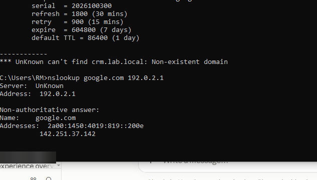<br>
  <em>Challenge 1 — From my home PC, <code>nslookup google.com 192.0.2.1</code> returned an answer although no DNS server exists at that address. This is why the client was moved inside Azure</em>
</p>

---

<a id="scope-limitations"></a>
## 🚧 Scope & Limitations

- **One ticket:** The simulation covers a single DNS outage.
- **One client tested:** The customer reports a whole team, but only `client-pc` was tested. No second client was used.
- **Failure was set up on purpose.** `dnsmasq` was stopped manually with `systemctl stop`. The log shows a clean stop, not a crash, so why a service would stop in real life is not proven here.
- **No CRM web page:** `crm.lab.local` is only a DNS record pointing at the DNS server. The lab proves the name resolves, not that a web app loads.
- **Evidence was captured with Azure Run Command** on the client, not from a remote desktop session.
- **ISP behavior is likely, not proven.** I did not run a packet capture to confirm that my home ISP answers DNS queries itself.
- **Not a real office network.** One virtual network with two virtual machines, no domain or internal zones.

---

<a id="what-i-learned"></a>
## 🧠 What I Learned

- **Prove the cause on the server.** A client that cannot reach DNS does not show why.
- **Ping the server, then query it.** A ping that replies and a DNS query that times out means the machine is up and the service is down.
- **A second DNS server separates the problem.** `nslookup` through `8.8.8.8` shows internet DNS works, so the fault is the internal server.
- **Confirm the scope early.** One PC and a whole office need different priority.
- **Fix the shared source first.** Changing every laptop is slow and can break internal names.
- **Never verify through a workaround.** Test with the client on its normal DNS.
- **Be careful when testing across the internet.** My ISP answered DNS queries for an address with no server, so a lab test that crosses the internet can mislead.
- **Check which window you are in.** Server and client commands need different tools.
- **Lock down lab access.** SSH and RDP only from my own IP, and no extra open ports.
- **Find why the service stopped.** In a real ticket, add a second DNS server and an alert when the DNS service stops.

---

<a id="skills-demonstrated"></a>
## 🛠️ Skills Demonstrated

- Building a small DNS server and client in Azure
- Setting ticket priority from business impact
- Diagnosing DNS outages from client to server with `ping`, `nslookup`, `ipconfig`
- Reading service state and logs with `systemctl` and `journalctl`
- Verifying a fix through the real configuration
- Securing lab access with network security group rules
- Communicating with an urgent customer
- Documenting limits honestly, including what was not tested

---

<a id="screenshot-index"></a>
## 🖼️ Screenshot Index

| # | File | Shows |
|:---:|---|---|
| 1 | `Build1_dns_server_overview.png` | `dns-server` Ubuntu VM with private IP `172.16.0.4` |
| 2 | `Build2_dnsmasq_running.png` | `dnsmasq` active, upstream `8.8.8.8` |
| 3 | `Build3_server_selftest.png` | Server answers its own record and forwards a lookup |
| 4 | `Build4_nsg_ssh_locked.png` | SSH limited to one source, no DNS port open |
| 5 | `Build5_client_dns_setting.png` | Client network interface uses custom DNS `172.16.0.4` |
| 6 | `Build6_baseline_before_fault.png` | Baseline: DNS setting and both lookups work |
| 7 | `Exhibit1_ping_ip_ok_name_fails.png` | Ping to IP works, name fails, `nslookup` times out |
| 8 | `Exhibit2_server_ping_ok_dns_timeout.png` | Server replies to ping, DNS query times out |
| 9 | `Exhibit3_nslookup_via_8888.png` | `nslookup` through `8.8.8.8` resolves |
| 10 | `Exhibit4_dnsmasq_inactive.png` | `systemctl status` shows `inactive (dead)` |
| 11 | `Exhibit5_dnsmasq_journal_stop.png` | `journalctl` shows the stop (SIGTERM) |
| 12 | `Exhibit6_dnsmasq_restarted.png` | Service `active (running)` again |
| 13 | `Exhibit7_after_fix_client.png` | Both names resolve after the fix |
| 14 | `Challenge1_isp_answers_fake_server.png` | Answer from an address with no DNS server |

---

<a id="repo-structure"></a>
## 📁 Repo Structure

```text
TKT-2026-001-DNS-Resolution/
|-- README.md
`-- screenshots/
    |-- Build1_dns_server_overview.png
    |-- Build2_dnsmasq_running.png
    |-- Build3_server_selftest.png
    |-- Build4_nsg_ssh_locked.png
    |-- Build5_client_dns_setting.png
    |-- Build6_baseline_before_fault.png
    |-- Exhibit1_ping_ip_ok_name_fails.png
    |-- Exhibit2_server_ping_ok_dns_timeout.png
    |-- Exhibit3_nslookup_via_8888.png
    |-- Exhibit4_dnsmasq_inactive.png
    |-- Exhibit5_dnsmasq_journal_stop.png
    |-- Exhibit6_dnsmasq_restarted.png
    |-- Exhibit7_after_fix_client.png
    `-- Challenge1_isp_answers_fake_server.png
```

<div align="center">

🌐 **[DNS Basics](https://www.cloudflare.com/learning/dns/what-is-dns/)** · 🪟 **[Windows Commands](https://learn.microsoft.com/windows-server/administration/windows-commands/windows-commands)** · 🛠️ **[Troubleshooting Flow](#decision-path)**

</div>
