<div align="center">

# 🎫 Ticket Simulation — Incoming Email Not Arriving (TKT-2026-002)

**Lab — IT Support Ticketing**

Ticket Triage · Email (IMAP) Diagnostics · Root Cause · Customer Communication


An accounts user says new emails have stopped arriving in Thunderbird, while clients say they sent invoices. This lab sets the incoming mail server name to a name that cannot exist, proves where the fault is by comparing Gmail on the web with Thunderbird and by testing the name and the port, restores the correct name, and shows how to keep the customer informed.

</div>

> [!NOTE]
> Simulated ticket. The customer, quotes and office are role-played. The fault was created on purpose by changing the incoming server name in Thunderbird. Email addresses, account names and other people's emails are hidden with black boxes in the screenshots.

---

## 📑 Table of Contents

1. [At a Glance](#at-a-glance)
2. [Ticket Record](#ticket-record)
3. [Project Background](#project-background)
4. [Environment](#environment)
5. [Ticket Flow](#ticket-flow)
6. [Module 1 — Lab Build](#module-1)
7. [Module 2 — Triage & Scope](#module-2)
8. [Where the Fault Can Sit](#fault-layers)
9. [Module 3 — Diagnostics & Root Cause](#module-3)
10. [Module 4 — Resolution & Verification](#module-4)
11. [Module 5 — Customer Communication](#module-5)
12. [Decision Path](#decision-path)
13. [Project Summary](#project-summary)
14. [Challenges & Fixes](#challenges-fixes)
15. [Scope & Limitations](#scope-limitations)
16. [What I Learned](#what-i-learned)
17. [Skills Demonstrated](#skills-demonstrated)
18. [Screenshot Index](#screenshot-index)
19. [Repo Structure](#repo-structure)

---

<a id="at-a-glance"></a>
## 📊 At a Glance

| 🧩 Modules | 🖼️ Screenshots | 🔍 Diagnostic Checks | 💬 Customer Messages |
|:---:|:---:|:---:|:---:|
| **5** | **13** | **8** | **3** |

---

<a id="ticket-record"></a>
## 🎫 Ticket Record

| Field | Value |
|---|---|
| **Ticket #** | TKT-2026-002 |
| **Date** | 2026-10-04 |
| **Priority** | P2 (High) — one user cannot receive new work email. Other mail services are not reported as down, so it is not P1 |
| **Status** | Resolved ✅ |
| **Category** | Email (incoming) |
| **Customer** | Ayesha Malik, Accounts, Lahore Office (role-played) |
| **Impact / Scope** | Reported: one user. Tested in this lab: one account on one PC (see Scope & Limitations) |
| **Fault window (lab)** | The setting was changed after the 2:50 PM baseline test and restored after the 3:21 PM test email. Exact times were not recorded. Times are the lab PC clock |

> *"New emails are not arriving in Thunderbird. My clients say they sent me invoices, but I can't see them. I have payments to approve."*

---

<a id="project-background"></a>
## 📖 Project Background

When a mail client cannot reach its incoming server, old mail still shows but nothing new arrives. The Inbox looks normal, so the fault is easy to miss. A good ticket compares the mail service with the client, proves where the fault is, fixes it, and checks that new mail arrives.

- **Module 1 — Lab Build:** Record a working baseline, then break the incoming server name on purpose.
- **Module 2 — Triage & Scope:** Set the priority from the impact and ask how many users are affected.
- **Module 3 — Diagnostics & Root Cause:** Compare Gmail on the web with Thunderbird, read the error, and test the name and the port.
- **Module 4 — Resolution & Verification:** Restore the correct name and check that new mail arrives.
- **Module 5 — Customer Communication:** Acknowledge, update and close with clear messages.

<div align="center">

### 🧩 Lab Setup at a Glance

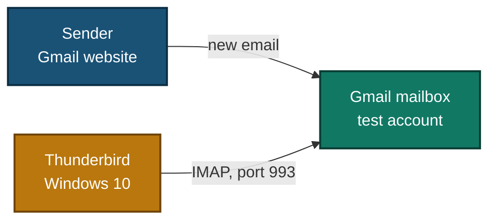

</div>

---

<a id="environment"></a>
## 🖧 Environment

| Item | Value |
|---|---|
| **Client** | Windows 10 PC with Mozilla Thunderbird |
| **Mail account** | Test Gmail account, IMAP, sign-in with OAuth2 (no app password) |
| **Working incoming settings** | `imap.gmail.com`, port 993, SSL/TLS, OAuth2 |
| **Faulty incoming server name (lab setup)** | `imap.gmail.invalid` (the `.invalid` ending is reserved and cannot be registered, so no real server can receive the sign-in) |
| **Client commands** | `nslookup`, `Test-NetConnection` in PowerShell (run as Administrator) |
| **DNS server shown by `nslookup`** | `dns.google` (`8.8.8.8`) |
| **Test emails** | "Baseline test" (sent from Thunderbird) and "Invoice test" (sent from the Gmail website) |

---

<a id="ticket-flow"></a>
## ⏱️ Ticket Flow

```mermaid
flowchart LR
    A["Receive<br>Read the report"] --> B["Triage<br>Priority and scope"] --> C["Diagnose<br>Webmail, then client"] --> D["Fix<br>Correct server name"] --> E["Verify<br>New mail arrives"] --> F["Close<br>Follow-up on cause"]
    classDef blue fill:#1A5276,stroke:#0B2E43,stroke-width:2px,color:#FFFFFF;
    classDef red fill:#943126,stroke:#571C16,stroke-width:2px,color:#FFFFFF;
    classDef purple fill:#76448A,stroke:#432752,stroke-width:2px,color:#FFFFFF;
    classDef orange fill:#B9770E,stroke:#6E4409,stroke-width:2px,color:#FFFFFF;
    classDef green fill:#117864,stroke:#083D33,stroke-width:2px,color:#FFFFFF;
    classDef navy fill:#2C3E70,stroke:#131B3A,stroke-width:2px,color:#FFFFFF;
    class A blue;
    class B red;
    class C purple;
    class D orange;
    class E green;
    class F navy;
```

---

<a id="module-1"></a>
## 🟡 Module 1 — Lab Build

**Objective:** Record a working state first, so the fault can be created and fixed on purpose.

### Step 1 — Record the baseline incoming settings ✅

Account Settings > Server Settings shows the working incoming settings.

<p align="center">
  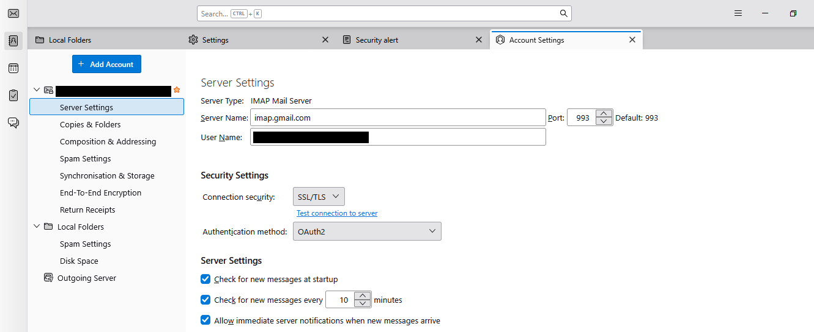<br>
  <em>Build 1 — Baseline: IMAP, <code>imap.gmail.com</code>, Port 993, SSL/TLS, OAuth2 (account name and username hidden)</em>
</p>

### Step 2 — Send a baseline test email ✅

Send "Baseline test" from Thunderbird to the same test account.

<p align="center">
  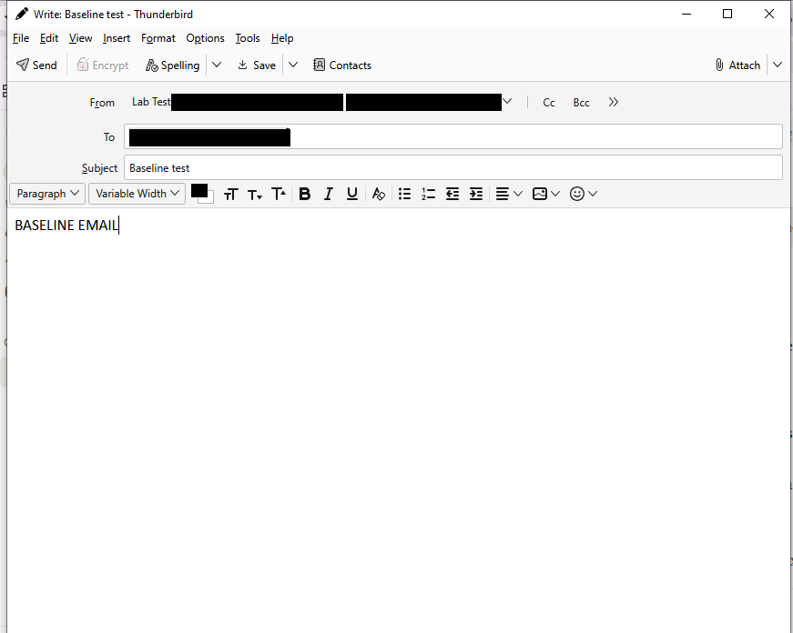<br>
  <em>Build 2 — Test email "Baseline test", body "BASELINE EMAIL." (addresses hidden)</em>
</p>

### Step 3 — Confirm it arrives in the Inbox ✅

<p align="center">
  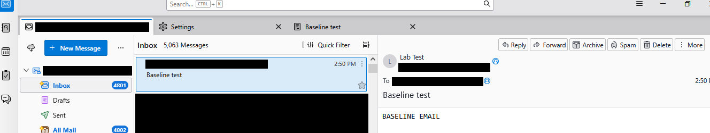<br>
  <em>Build 3 — "Baseline test" (2:50 PM) is at the top of the Inbox, which shows 5,063 messages. Incoming mail works before the fault (other emails and addresses hidden)</em>
</p>

### Step 4 — Break the incoming server name on purpose ✅

Change **Server Name** to `imap.gmail.invalid`. Thunderbird asks for a restart to apply the change.

<p align="center">
  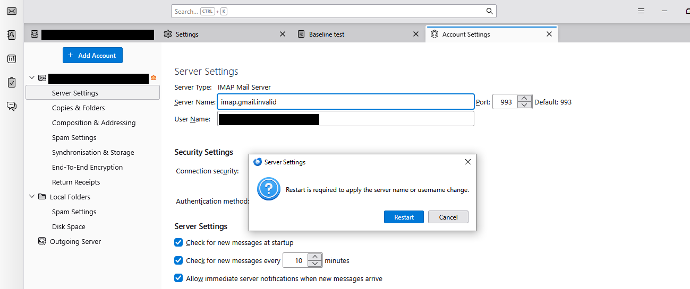<br>
  <em>Build 4 — Server Name <code>imap.gmail.invalid</code>, Port 993. The box says a restart is required to apply the server name change (account names and username hidden)</em>
</p>

### Step 5 — Confirm the broken setting was saved ✅

After the restart (see Challenge 1) the setting is still there.

<p align="center">
  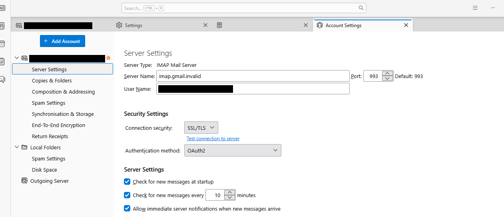<br>
  <em>Build 5 — After reopening Thunderbird: Server Name <code>imap.gmail.invalid</code>, Port 993, SSL/TLS, OAuth2</em>
</p>

🎯 **Result:** A Thunderbird account with a recorded working state and a broken incoming server name.

---

<a id="module-2"></a>
## 🔵 Module 2 — Triage & Scope

**Objective:** Set the right priority and find out how far the problem reaches.

### Step 6 — Read the impact ✅

One user cannot see new email, and invoices are waiting. The work is affected, but no whole-team outage is reported, so the ticket is P2.

### Step 7 — Check the scope ✅

| Check | Result |
|---|---|
| Other users affected | Not reported by the customer. Not tested in this lab |
| Accounts tested | One account on one PC |
| Priority | P2 (High) |

---

<a id="fault-layers"></a>
## 🗺️ Where the Fault Can Sit

```mermaid
flowchart LR
    A["Sender or Gmail<br>Was the email delivered?"] --> B["Thunderbird setting<br>Server name correct?"] --> C["Name lookup<br>Does the name resolve?"] --> D["Network path<br>Port 993 reachable?"] --> E["Gmail IMAP server"]
    classDef blue fill:#1A5276,stroke:#0B2E43,stroke-width:2px,color:#FFFFFF;
    classDef orange fill:#B9770E,stroke:#6E4409,stroke-width:2px,color:#FFFFFF;
    classDef red fill:#943126,stroke:#571C16,stroke-width:2px,color:#FFFFFF;
    classDef green fill:#117864,stroke:#083D33,stroke-width:2px,color:#FFFFFF;
    classDef navy fill:#2C3E70,stroke:#131B3A,stroke-width:2px,color:#FFFFFF;
    class A blue;
    class B orange;
    class C red;
    class D green;
    class E navy;
```

- An Inbox with old mail does not show which box is broken.
- The next module tests the boxes in order: mail service, client setting, name, port.

---

<a id="module-3"></a>
## 🟢 Module 3 — Diagnostics & Root Cause

**Objective:** Prove where the fault is and why, using evidence from the mail service and the client.

### Step 8 — Read the client error ✅

Thunderbird shows a pop-up when it checks for mail.

<p align="center">
  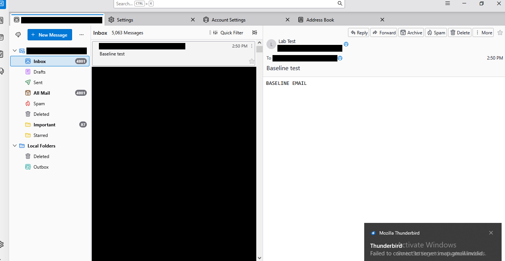<br>
  <em>Exhibit 1 — The pop-up begins "Failed to connect to server" and names <code>imap.gmail.invalid</code>. The Windows activation text overlaps it (other emails and addresses hidden)</em>
</p>

### Step 9 — Compare Gmail on the web with Thunderbird ✅

<p align="center">
  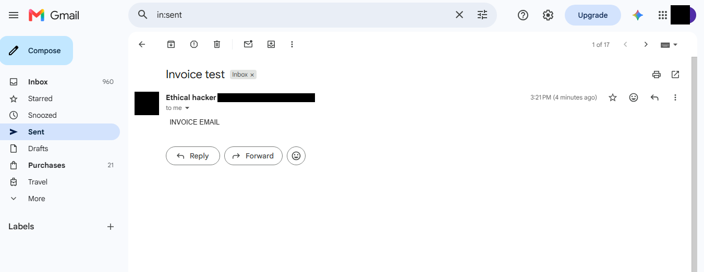<br>
  <em>Exhibit 2 — The Gmail website has "Invoice test", body "INVOICE EMAIL.", time 3:21 PM, with the Inbox label. The page was opened from a Sent search (<code>in:sent</code>) (address, profile picture and browser bar hidden)</em>
</p>

<p align="center">
  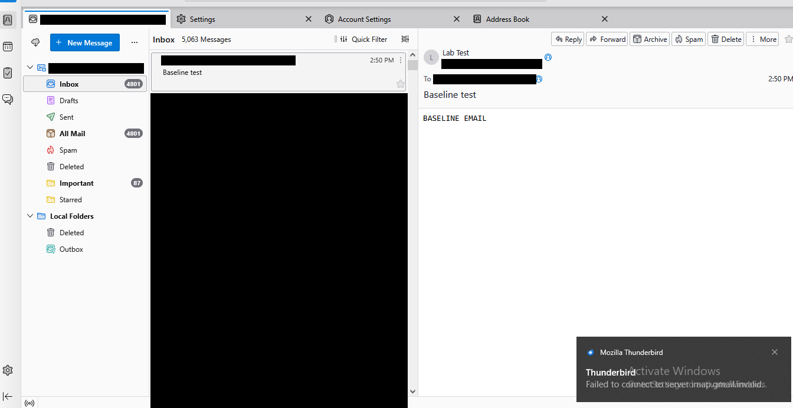<br>
  <em>Exhibit 3 — Thunderbird's Inbox still starts with "Baseline test" (2:50 PM) and shows 5,063 messages. "Invoice test" is not there, and the same pop-up shows (other emails and addresses hidden)</em>
</p>

The email is in the mailbox, but Thunderbird does not have it. The fault is between Thunderbird and the mail server, not with the sender.

### Step 10 — Read the configured server name ✅

Account Settings > Server Settings shows `imap.gmail.invalid` (see Build 5, taken after the change). Port, security and authentication are the same as the baseline, so the name is the only difference.

### Step 11 — Test the name ✅

```powershell
nslookup imap.gmail.com
nslookup imap.gmail.invalid
```

### Step 12 — Test the port ✅

```powershell
Test-NetConnection imap.gmail.com -Port 993
Test-NetConnection imap.gmail.invalid -Port 993
```

<p align="center">
  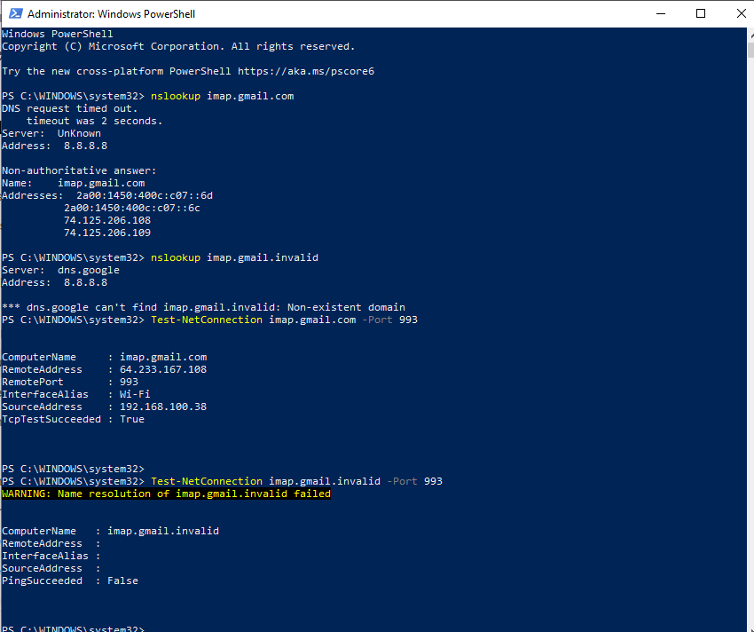<br>
  <em>Exhibit 4 — <code>nslookup imap.gmail.com</code> returns addresses (after a "DNS request timed out" line). <code>nslookup imap.gmail.invalid</code> returns "Non-existent domain" from <code>dns.google</code> (<code>8.8.8.8</code>). Port 993 on <code>imap.gmail.com</code> shows <code>TcpTestSucceeded : True</code>. For <code>imap.gmail.invalid</code>, name resolution failed</em>
</p>

### 🎯 Root Cause

The incoming server name in Thunderbird was set to `imap.gmail.invalid`. That name does not exist, so Thunderbird could not connect and could not fetch new mail. The real server name resolves and its port works from the same PC.

> [!IMPORTANT]
> In this lab I changed the server name myself on purpose. In a real ticket, the reason for the change would still need to be found.

| Diagnostic check | Evidence | Result |
|---|---|---|
| 1. Gmail website has the new email | Exhibit 2 | Yes |
| 2. Thunderbird has the new email | Exhibit 3 | No |
| 3. Thunderbird error message | Exhibit 1 | "Failed to connect to server" |
| 4. Configured server name | Build 5 | `imap.gmail.invalid` |
| 5. `nslookup imap.gmail.com` | Exhibit 4 | Resolves |
| 6. `nslookup imap.gmail.invalid` | Exhibit 4 | Non-existent domain |
| 7. Port 993 on `imap.gmail.com` | Exhibit 4 | Succeeds |
| 8. Port 993 on `imap.gmail.invalid` | Exhibit 4 | Name resolution failed |

---

<a id="module-4"></a>
## 🟠 Module 4 — Resolution & Verification

**Objective:** Fix the setting, then prove new mail arrives.

### Step 13 — Restore the correct server name ✅

Set **Server Name** back to `imap.gmail.com`. Thunderbird asks for a restart again.

<p align="center">
  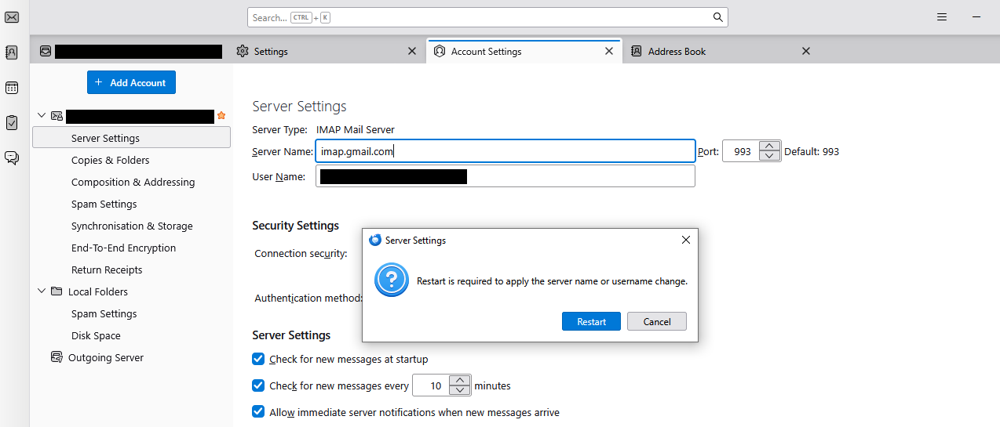<br>
  <em>Exhibit 5 — Server Name set back to <code>imap.gmail.com</code>, Port 993, with the restart prompt (account names and username hidden)</em>
</p>

### Step 14 — Verify that new mail arrives ✅

<p align="center">
  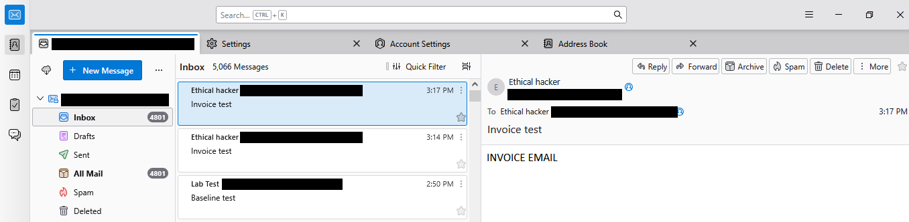<br>
  <em>Exhibit 6 — After the restart, two "Invoice test" emails (3:14 PM and 3:17 PM) are at the top of the Inbox, above "Baseline test". The Inbox shows 5,066 messages. The sender name is "Ethical hacker" because "Invoice test" was sent from the Gmail website (addresses hidden)</em>
</p>

### Step 15 — Confirm the settings are back to the baseline ✅

<p align="center">
  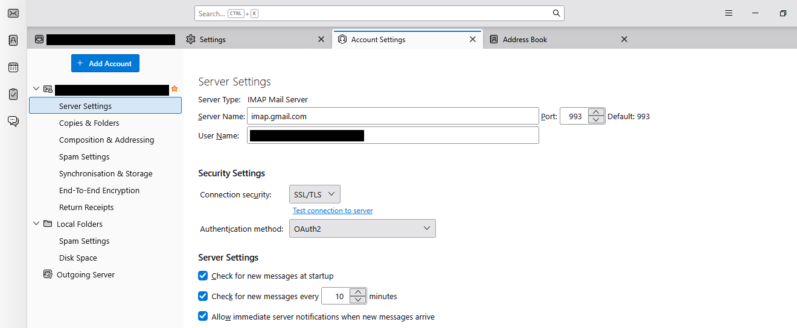<br>
  <em>Exhibit 7 — Server Name <code>imap.gmail.com</code>, Port 993, SSL/TLS, OAuth2, the same as Build 1 (account name and username hidden)</em>
</p>

🎯 **Result:** New mail reaches Thunderbird again, and the setting is back to the baseline.

| Verification | Result |
|---|---|
| New email arrives in Thunderbird | "Invoice test" appears twice ✅ |
| Server settings | Same as baseline ✅ |
| Sending mail | Not tested in this ticket |
| Second account or second PC | Not tested |

### 🔍 Analyst Note — Why Compare Before Changing Anything?

- Old mail still shows when the incoming server cannot be reached, so the Inbox alone proves nothing.
- Send a new email from another route (here the Gmail website), then check the client. If the mailbox has it and the client does not, the fault is on the client side.

---

<a id="module-5"></a>
## 🟣 Module 5 — Customer Communication

**Objective:** Keep a worried customer informed without claiming a cause too early.

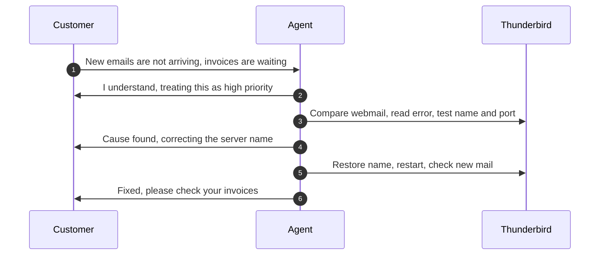

- **Acknowledge:** "I understand new emails aren't reaching you and invoices are waiting. I'm treating this as high priority and checking now."
- **Update:** "Your emails are arriving in Gmail on the web, but Thunderbird can't reach the incoming mail server. The server name in the Thunderbird settings is wrong, so it can't be found. I'm correcting it now."
- **Close:** "It's fixed. New emails are arriving in Thunderbird again. Please check that your invoices are there, and tell me if one is still missing. I'm also finding out how the setting was changed."

---

<a id="decision-path"></a>
## 🧭 Decision Path

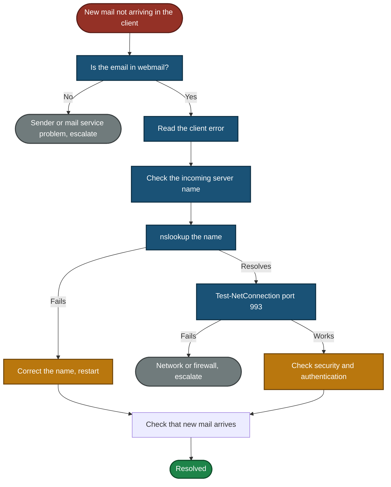

> The path "port works, check security and authentication" is described, not tested in this lab.

---

<a id="project-summary"></a>
## 📝 Project Summary

| Module | Tooling | Key Finding |
|---|---|---|
| Lab Build | Thunderbird, test Gmail account | Working baseline recorded, server name then broken on purpose |
| Triage & Scope | Ticket fields | One user affected, so the ticket is P2, and scope is checked first |
| Diagnostics & Root Cause | Gmail website, Thunderbird, `nslookup`, `Test-NetConnection` | The mailbox has the email, Thunderbird does not, and the set server name does not exist |
| Resolution & Verification | Thunderbird settings | Correct name restored, new mail arrives, settings back to baseline |
| Customer Communication | Communication | Acknowledged, updated and closed without claiming unproven things |

---

<a id="challenges-fixes"></a>
## ⚠️ Challenges & Fixes

| ❌ Challenge | ✅ Fix |
|---|---|
| Thunderbird needs a restart to apply a server name change, and the restart box covered the security settings in the screenshot | Took the settings screenshot again after reopening Thunderbird (Build 5) |
| Thunderbird crashed during the first restart (Challenge 1) | Reopened it and checked that the setting was still saved (Build 5). The cause of the crash is not known |
| Right after the change the Inbox looked normal: old mail showed and the count stayed the same | Sent a new email from the Gmail website and compared it with Thunderbird (Exhibits 2 and 3) |
| The "Failed to connect" pop-up came and went, and did not show when I tried to trigger it | Captured it when it showed (Exhibit 1) and backed it up with the `nslookup` and port tests (Exhibit 4) |
| A typo such as `smtp.gmial.com`-style names can belong to someone else, and a sign-in could go to them | Used the reserved `.invalid` ending, which can never be registered |
| The `nslookup` of the real name printed a "DNS request timed out" line before the answer | Kept the screenshot as it is. The answer still came back, and I wrote down what the screen shows |
| I clicked **New Message** instead of **Get Messages** twice, and an empty compose window opened | Closed the window and repeated the step. Those screenshots are not used |
| "Invoice test" was sent more than once, and I did not record how many times | Wrote the times exactly as the screenshots show them (see Scope & Limitations) |
| The "Activate Windows" text showed in some screenshots | Cropped it where possible. It still overlaps the pop-up in Exhibits 1 and 3 |

<p align="center">
  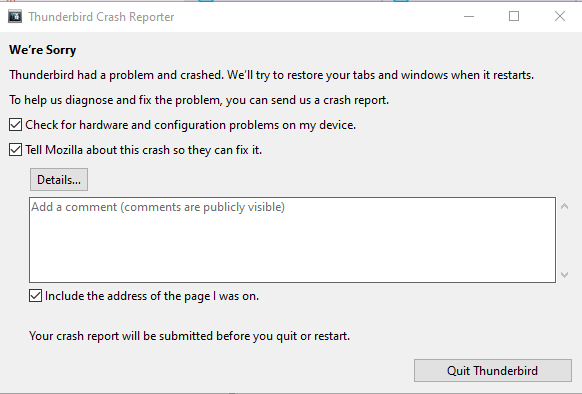<br>
  <em>Challenge 1 — Thunderbird crash report window shown during the restart for the first server name change. After reopening, the broken setting was still saved (Build 5)</em>
</p>

---

<a id="scope-limitations"></a>
## 🚧 Scope & Limitations

- **One ticket:** The simulation covers a single incoming mail fault.
- **One account on one PC tested:** The customer is role-played, and no second user or second PC was used.
- **Failure was set up on purpose.** The server name was changed by hand in Thunderbird. Why a setting would change in real life is not proven here.
- **Sending was not tested.** Outgoing mail (SMTP) is covered in script 01.2, not in this ticket.
- **Only IMAP with OAuth2 was tested.** POP3 and password sign-in were not tested.
- **The cause is shown by tests, not by a packet capture.** The pop-up, the failed name lookup and the working port point to the server name. I did not capture network traffic.
- **The number of "Invoice test" sends was not recorded.** Thunderbird shows two copies (3:14 PM and 3:17 PM), the Gmail screenshot shows 3:21 PM, and the Inbox count rose from 5,063 to 5,066. I did not work out the difference.
- **Message counts differ between Gmail and Thunderbird.** The Gmail website shows a different Inbox count than Thunderbird. I did not investigate this and did not use it as evidence.
- **Which DNS server the PC uses by default was not checked.** `nslookup` shows `dns.google` (`8.8.8.8`) as the server that answered.
- **Times are the lab PC clock.** The time zone is not shown in the screenshots.
- **Not a real office network.** One account, one PC, no team.

---

<a id="what-i-learned"></a>
## 🧠 What I Learned

- **Old mail hides an incoming fault.** The Inbox looks normal, so test with a new email.
- **Compare the mail service with the client.** If webmail has the email and the client does not, the fault is on the client side.
- **Test the name and the port separately.** The real name resolved and its port worked, while the wrong name failed at name resolution.
- **Use a name that cannot belong to anyone.** The reserved `.invalid` ending is safe for a lab.
- **Some changes need a restart.** Check that the setting was saved after the restart.
- **Undo the temporary change and prove it.** Restore the baseline and screenshot it.
- **Write down surprises as they are.** The crash, the pop-up that did not show on demand and the sending counts are in this README without a guessed cause.
- **Set priority from impact.** One user with a workaround (webmail) is P2, not P1.

---

<a id="skills-demonstrated"></a>
## 🛠️ Skills Demonstrated

- Setting ticket priority from business impact
- Diagnosing incoming email faults by comparing webmail with a mail client
- Testing names and ports with `nslookup` and `Test-NetConnection`
- Configuring IMAP server settings in Thunderbird
- Verifying a fix with a new test email
- Communicating with an urgent customer
- Hiding private data in evidence
- Documenting limits honestly, including what was not tested

---

<a id="screenshot-index"></a>
## 🖼️ Screenshot Index

| # | File | Shows |
|:---:|---|---|
| 1 | `Build1_baseline_imap_settings.png` | Baseline incoming settings |
| 2 | `Build2_baseline_test_composed.png` | "Baseline test" email composed |
| 3 | `Build3_baseline_test_in_inbox.png` | "Baseline test" in the Inbox |
| 4 | `Build4_invalid_server_restart_prompt.png` | `imap.gmail.invalid` typed, restart prompt |
| 5 | `Build5_broken_setting_saved.png` | Broken setting saved after restart |
| 6 | `Exhibit1_thunderbird_connect_error.png` | "Failed to connect to server" pop-up |
| 7 | `Exhibit2_gmail_has_invoice_test.png` | Gmail website has "Invoice test" |
| 8 | `Exhibit3_thunderbird_missing_invoice_test.png` | Thunderbird does not have it |
| 9 | `Exhibit4_nslookup_and_port_test.png` | Name and port tests |
| 10 | `Exhibit5_correct_name_restart_prompt.png` | Correct name typed, restart prompt |
| 11 | `Exhibit6_invoice_test_arrives.png` | "Invoice test" arrives in Thunderbird |
| 12 | `Exhibit7_settings_restored.png` | Settings back to the baseline |
| 13 | `Challenge1_thunderbird_crash_report.png` | Thunderbird crash report during restart |

---

<a id="repo-structure"></a>
## 📁 Repo Structure

```text
TKT-2026-002-Email-Not-Receiving/
|-- README.md
`-- screenshots/
    |-- Build1_baseline_imap_settings.png
    |-- Build2_baseline_test_composed.png
    |-- Build3_baseline_test_in_inbox.png
    |-- Build4_invalid_server_restart_prompt.png
    |-- Build5_broken_setting_saved.png
    |-- Exhibit1_thunderbird_connect_error.png
    |-- Exhibit2_gmail_has_invoice_test.png
    |-- Exhibit3_thunderbird_missing_invoice_test.png
    |-- Exhibit4_nslookup_and_port_test.png
    |-- Exhibit5_correct_name_restart_prompt.png
    |-- Exhibit6_invoice_test_arrives.png
    |-- Exhibit7_settings_restored.png
    `-- Challenge1_thunderbird_crash_report.png
```

<div align="center">

📧 **[What is IMAP](https://www.cloudflare.com/learning/email-security/what-is-imap/)** · 🪟 **[Test-NetConnection](https://learn.microsoft.com/powershell/module/nettcpip/test-netconnection)** · 🛠️ **[Troubleshooting Flow](#decision-path)**

</div>
