<div align="center">

# 🎫 Ticket Simulation — VPN Stuck on Connecting (TKT-2026-003)

**Lab — IT Support Ticketing**

Ticket Triage · VPN Client Diagnostics · Failed Fault Attempt · Customer Communication


A remote sales user's VPN will not connect and the shared files are out of reach. This lab uses a free VPN client on one Windows 10 laptop. It records a working baseline, tries two faults on purpose (a firewall block and a wrong date), and writes down honestly what each one did. The first fault did not work, and the cause of the second is not proven.

</div>

> [!NOTE]
> Simulated ticket. The customer, quotes and role are role-played. Both faults were created on purpose. Public IP addresses, account details and personal information are blurred in the screenshots.

---

## 📑 Table of Contents

1. [At a Glance](#at-a-glance)
2. [Ticket Record](#ticket-record)
3. [Project Background](#project-background)
4. [Environment](#environment)
5. [Ticket Flow](#ticket-flow)
6. [Module 1 — Lab Build / Baseline](#module-1)
7. [Module 2 — Triage & Scope](#module-2)
8. [Where the Failure Can Sit](#failure-layers)
9. [Module 3 — Diagnostics & Root Cause](#module-3)
10. [Module 4 — Resolution & Verification](#module-4)
11. [Module 5 — Customer Communication](#module-5)
12. [Decision Path](#decision-path)
13. [Project Summary](#project-summary)
14. [Challenges & Fixes](#challenges-fixes)
15. [Scope & Limitations](#scope-limitations)
16. [What I Learned](#what-i-learned)
17. [Skills Demonstrated](#skills-demonstrated)
18. [Screenshot Index](#screenshot-index)
19. [Repo Structure](#repo-structure)

---

<a id="at-a-glance"></a>
## 📊 At a Glance

| 🧩 Modules | 🖼️ Screenshots | 🔍 Diagnostic Checks | 💬 Customer Messages |
|:---:|:---:|:---:|:---:|
| **5** | **20** | **8** | **3** |

---

<a id="ticket-record"></a>
## 🎫 Ticket Record

| Field | Value |
|---|---|
| **Ticket #** | TKT-2026-003 |
| **Date** | 2026-10-04 |
| **Priority** | P2 (High) — one user is blocked from work and has a client call soon. Not P1, because only one user is reported |
| **Status** | Resolved in lab ✅ (cause not proven, see Root Cause) |
| **Category** | VPN / Remote Access |
| **Customer** | Zainab Malik, Sales, working from home (role-played) |
| **Impact / Scope** | Reported: one remote worker. Tested in this lab: one laptop and one phone (see Scope & Limitations) |
| **Wrong-date window (lab)** | Laptop date shown as 2024 at 11:44:39, shown corrected at 11:57:19 (laptop clock) |

> *"My VPN won't connect. It just says Connecting and I can't reach the shared files. I have a client call soon."*

---

<a id="project-background"></a>
## 📖 Project Background

A VPN that will not connect can fail on the laptop, on the network path, at the VPN server, or at the login. A good ticket starts with a working baseline, changes one thing at a time, and only claims a cause it has proven.

The video lab for this topic (`01.3`) covered an account lockout. This ticket tests different, client-side causes on a real VPN client.

- **Module 1 — Lab Build / Baseline:** Record the laptop without the VPN, then with the VPN connected.
- **Module 2 — Triage & Scope:** Set the priority, check a second device, and compare the laptop clock with the phone.
- **Module 3 — Diagnostics & Root Cause:** Try a firewall block, then a wrong date, and record what each one did.
- **Module 4 — Resolution & Verification:** Correct the date, check that the VPN connects, and list what was not tested.
- **Module 5 — Customer Communication:** Acknowledge, update and close without claiming anything untested.

<div align="center">

### 🧩 Lab Setup at a Glance

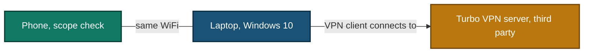

</div>

---

<a id="environment"></a>
## 🖧 Environment

| Item | Value |
|---|---|
| **Laptop** | Windows 10 (build 19045), Command Prompt run as administrator, time zone Pakistan Standard Time (`tzutil /g`) |
| **Second device** | One phone on the same WiFi, used only for the scope check |
| **VPN client** | Turbo VPN 3.7.1.0, a free consumer VPN. Server location chosen in the app: Australia, Sydney |
| **VPN server** | Third party. Not mine, and not a company gateway |
| **Firewall** | Windows Firewall, rules made with `netsh advfirewall` |
| **Client commands** | `ping`, `nslookup`, `echo %date% %time%`, `tzutil /g`, `netsh advfirewall`, PowerShell `Get-Process`, `Get-NetTCPConnection`, `Get-NetUDPEndpoint` |
| **DNS used by `nslookup`** | `dns.google` (`8.8.8.8`) |

---

<a id="ticket-flow"></a>
## ⏱️ Ticket Flow


---

<a id="module-1"></a>
## 🟡 Module 1 — Lab Build / Baseline

**Objective:** Record a working state first, so a fault can be created and judged against it.

### Step 1 — Baseline without the VPN ✅

The VPN was off. Run in Command Prompt (administrator):

```cmd
ping 8.8.8.8
nslookup google.com
```

<p align="center">
  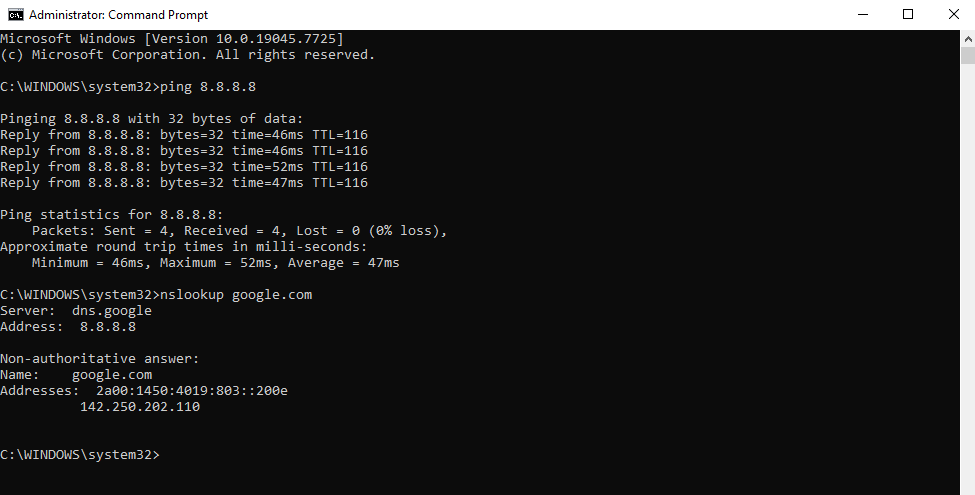<br>
  <em>Build 1 — VPN off: <code>ping 8.8.8.8</code> gets 4 of 4 replies (46 to 52 ms, TTL 116), and <code>nslookup google.com</code> is answered by <code>dns.google</code></em>
</p>

> [!NOTE]
> This baseline was taken before I noticed the laptop clock was off (see Module 2). Ping and `nslookup` worked anyway.

### Step 2 — Connect the VPN and record a working baseline ✅

This step was done after the laptop clock was corrected in Module 2. Turbo VPN was connected once to Australia, Sydney.

<p align="center">
  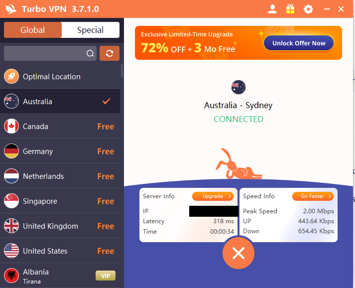<br>
  <em>Build 2 — Turbo VPN shows <b>CONNECTED</b>, Australia - Sydney, latency 318 ms (server IP hidden)</em>
</p>

### Step 3 — Run the same tests with the VPN on ✅

```cmd
ping 8.8.8.8
nslookup google.com
```

<p align="center">
  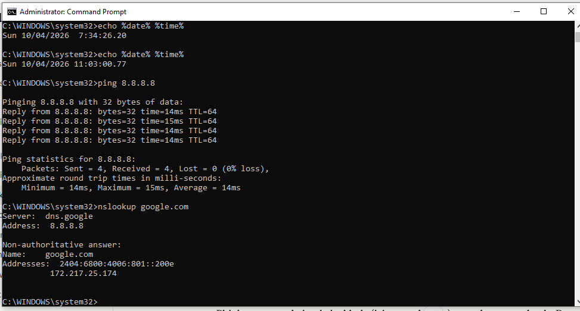<br>
  <em>Build 3 — VPN connected: ping and <code>nslookup</code> both work</em>
</p>

| Check | VPN off (Build 1) | VPN connected (Build 3) |
|---|---|---|
| `ping 8.8.8.8` | 4 of 4 replies, 46 to 52 ms, TTL 116 | 4 of 4 replies, 14 to 15 ms, TTL 64 |
| `nslookup google.com` | Answered by `dns.google` | Answered by `dns.google` |

The ping time and TTL changed. I did not investigate why, and I did not check my public IP. So this README does **not** claim that my traffic went through the VPN.

### Step 4 — Open a website with the VPN on ✅

<p align="center">
  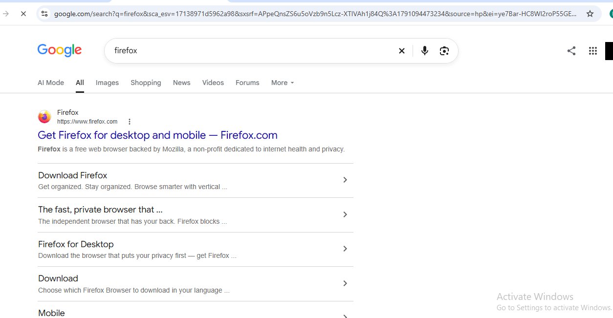<br>
  <em>Build 4 — A Google results page is shown with the VPN connected (profile picture hidden)</em>
</p>

🎯 **Result:** A working baseline. The VPN connects from this network, so a fault can be built on top of it.

---

<a id="module-2"></a>
## 🔵 Module 2 — Triage & Scope

**Objective:** Set the right priority, and find out whether the problem is only on this laptop.

### Step 5 — Read the impact ✅

One remote worker cannot reach the shared files and has a client call soon. Work is blocked for one person, so the ticket is P2. It would be P1 only if many users were reported.

### Step 6 — Check a second device ✅

I opened a website on the phone, on the same WiFi, with no VPN.

<p align="center">
  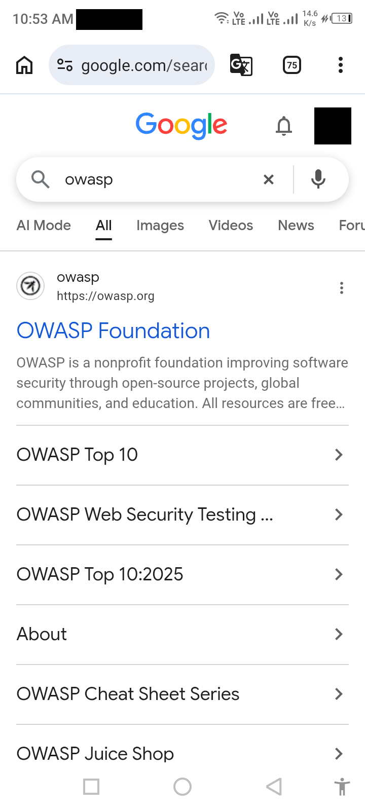<br>
  <em>Scope 1 — Phone (10:53 AM) shows a Google results page. WiFi and mobile signal icons are both visible (notifications and profile picture hidden)</em>
</p>

| Check | Result |
|---|---|
| Phone opens a website | Yes ✅ |
| Proof the page came over WiFi | No. Mobile signal icons were also visible, so this screenshot does not prove it |
| Phone connects with the same VPN account | Not tested |

### Step 7 — Compare the laptop clock with the phone ✅

A wrong clock is a known cause of VPN trouble, so I read the laptop clock and time zone.

```cmd
echo %date% %time%
tzutil /g
```

<p align="center">
  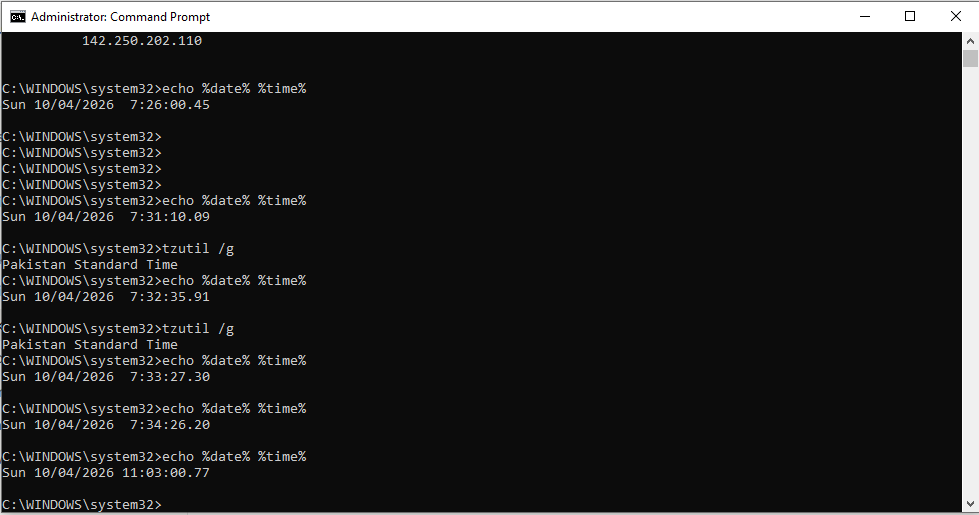<br>
  <em>Scope 2 — Time zone is Pakistan Standard Time. The laptop clock reads 7:26 to 7:34 (24-hour) first, then 11:03:00 after I corrected it</em>
</p>

<p align="center">
  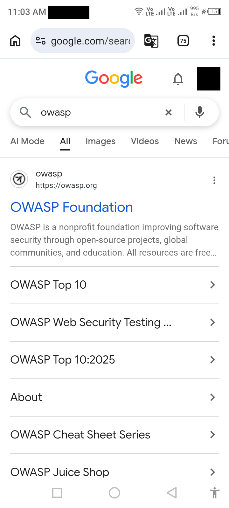<br>
  <em>Scope 3 — The phone shows 11:03 AM, which matches the corrected laptop clock (notifications and profile picture hidden)</em>
</p>

| Check | Result |
|---|---|
| Time zone | Pakistan Standard Time (correct) |
| Laptop clock before the fix | Roughly 3.5 hours behind the phone. The screenshots were not taken at the same moment, so the gap is approximate |
| Laptop clock after the fix | `11:03` on the laptop, `11:03 AM` on the phone |
| How I corrected it | Not recorded |

🎯 **Result:** The laptop clock was wrong before any fault was made. I corrected it before the VPN baseline in Module 1.

---

<a id="failure-layers"></a>
## 🗺️ Where the Failure Can Sit


- Blue boxes were tested in this lab. Gray boxes were not.
- The VPN server, the login and the shared files belong to a third party or do not exist in this lab, so they stay "described, not tested".

---

<a id="module-3"></a>
## 🟢 Module 3 — Diagnostics & Root Cause

**Objective:** Create a fault on purpose, record what happens, and say only what the evidence shows.

Two faults were tried, one after the other, so only one thing changed each time.

### Fault attempt A — block Turbo VPN with Windows Firewall

### Step 8 — Create the block rules ✅

Two outbound block rules, one for each Turbo VPN program:

```cmd
netsh advfirewall firewall add rule name="LAB-Block-TurboVPN-app" dir=out action=block program="C:\Program Files (x86)\TurboVPN\TurboVPN.exe" enable=yes
netsh advfirewall firewall add rule name="LAB-Block-TurboVPN-service" dir=out action=block program="C:\Program Files (x86)\TurboVPN\turbo_vpn-service.exe" enable=yes
netsh advfirewall show allprofiles state
netsh advfirewall firewall show rule name="LAB-Block-TurboVPN-app" verbose
```

<p align="center">
  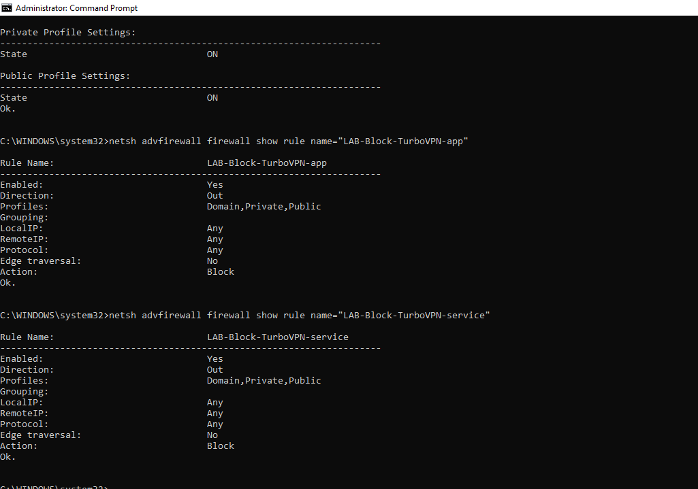<br>
  <em>Exhibit 1 — Private and Public firewall profiles are ON. Both rules show <code>Enabled: Yes</code>, <code>Direction: Out</code>, <code>Action: Block</code> (the Domain profile state is not visible)</em>
</p>

<p align="center">
  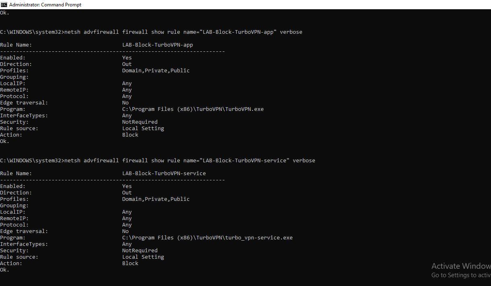<br>
  <em>Exhibit 2 — The verbose view shows the program path of each rule, so the fault really exists</em>
</p>

### Step 9 — Connect with the rules on (first attempt) ✅

<p align="center">
  <br>
  <em>Exhibit 3 — With both rules enabled, Turbo VPN still shows <b>CONNECTED</b> (server IP hidden)</em>
</p>

I do not know whether I disconnected the VPN before pressing Connect, so this attempt is not clean. I repeated it in Step 11.

### Step 10 — Look at the connections of the two programs ✅

```cmd
powershell -Command "Get-NetTCPConnection -OwningProcess 2888,7248"
powershell -Command "Get-NetUDPEndpoint -OwningProcess 2888,7248"
```

The numbers are the process IDs of `turbo_vpn-service.exe` and `TurboVPN.exe` in this session.

<p align="center">
  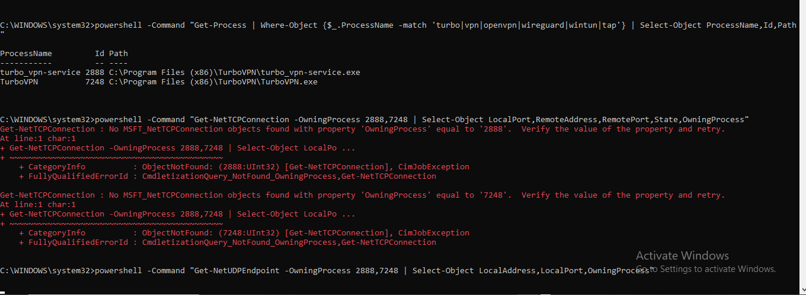<br>
  <em>Exhibit 4 — The TCP query finds no connection for either process</em>
</p>

<p align="center">
  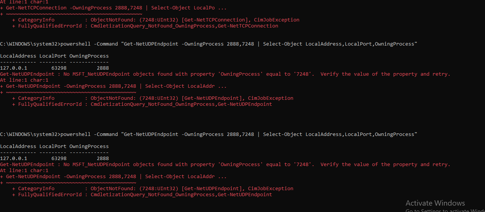<br>
  <em>Exhibit 5 — The only UDP endpoint is <code>127.0.0.1</code> (this laptop itself), owned by the service process. None for the app process</em>
</p>

These two programs showed no connection to the outside at that moment. I did not find which component builds the VPN connection.

### Step 11 — Repeat the test cleanly ✅

I disconnected the VPN and checked that both rules still exist. Then I pressed Connect once.

```cmd
netsh advfirewall firewall show rule name=all | findstr /C:"LAB-Block"
```

<p align="center">
  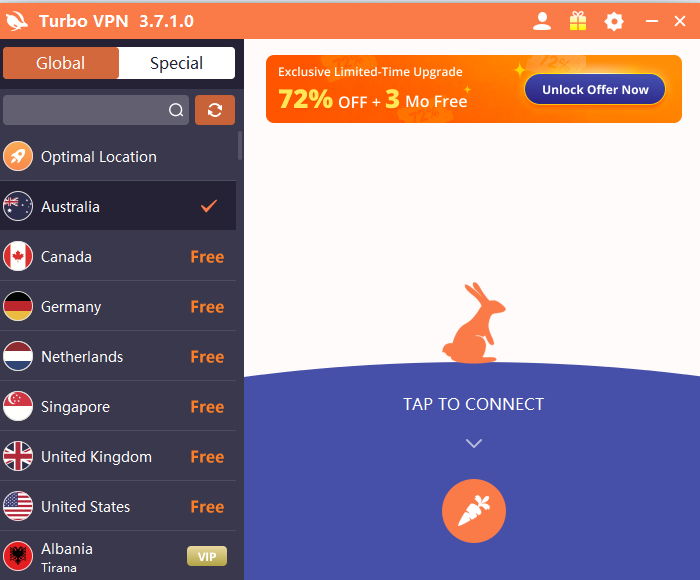<br>
  <em>Exhibit 6 — Turbo VPN is disconnected ("TAP TO CONNECT") before the second attempt</em>
</p>

<p align="center">
  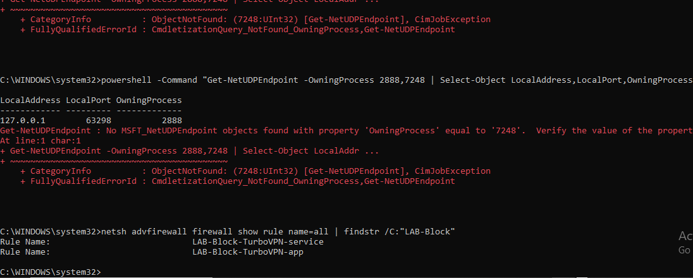<br>
  <em>Exhibit 7 — Both <code>LAB-Block</code> rules are still present</em>
</p>

<p align="center">
  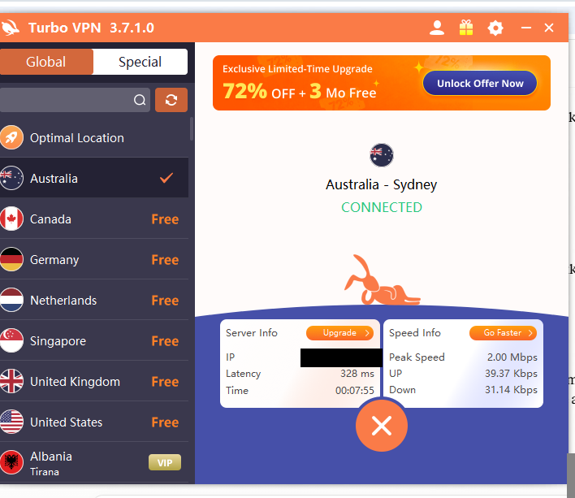<br>
  <em>Exhibit 8 — Second attempt: Turbo VPN shows <b>CONNECTED</b> again, timer 00:07:55 (server IP hidden)</em>
</p>

🎯 **Result of attempt A:** Blocking the two Turbo VPN programs did **not** stop the VPN. The fault did not work. I do not know why.

### Step 12 — Remove the failed rules ✅

```cmd
netsh advfirewall firewall delete rule name="LAB-Block-TurboVPN-app"
netsh advfirewall firewall delete rule name="LAB-Block-TurboVPN-service"
netsh advfirewall firewall show rule name=all | findstr /C:"LAB-Block"
```

<p align="center">
  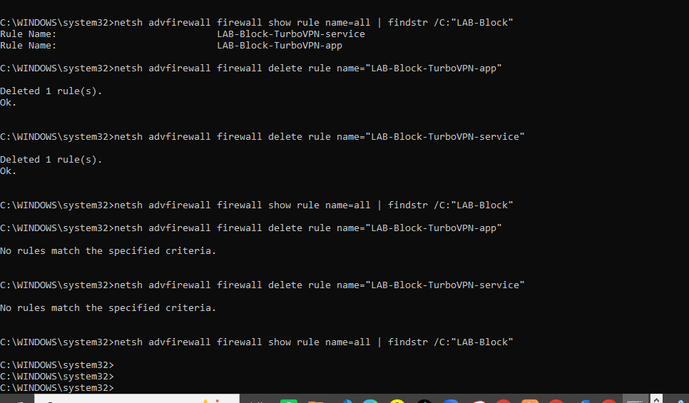<br>
  <em>Exhibit 9 — "Deleted 1 rule(s)" for both, and the search finds no <code>LAB-Block</code> rule. A second delete says "No rules match"</em>
</p>

### Fault attempt B — wrong date

### Step 13 — Set the laptop date two years back ✅

I set the Windows date to 04 Oct 2024 by hand, in Settings, Date & time. Then I read it back:

```cmd
echo %date% %time%
```

<p align="center">
  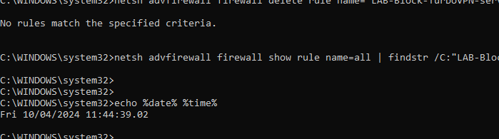<br>
  <em>Exhibit 10 — The laptop shows <code>Fri 10/04/2024 11:44:39</code>. The Settings page itself was not captured</em>
</p>

### Step 14 — Connect with the wrong date ✅

I disconnected the VPN, then pressed Connect once.

<p align="center">
  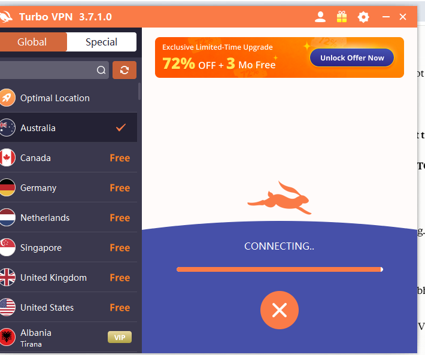<br>
  <em>Exhibit 11 — Turbo VPN shows "CONNECTING.." with a progress bar and no error message</em>
</p>

It stayed on Connecting until I corrected the date. How long it waited was not recorded, and no error code or client log was captured.

### 🔍 The Diagnostic Checks

| # | Check | Result |
|:---:|---|---|
| 1 | `ping 8.8.8.8` with the VPN off | 4 of 4 replies, so the internet works |
| 2 | `nslookup google.com` with the VPN off | Answered, so name lookup works |
| 3 | Second device (phone) | A website opened. Not proof of WiFi (mobile icons visible) |
| 4 | Laptop clock and time zone vs phone | Time zone correct. Clock roughly 3.5 hours behind before the fix |
| 5 | Firewall block rules on both Turbo VPN programs | VPN connected anyway, twice. The fault did not work |
| 6 | Connections of the two programs | No TCP connection. One local-only UDP endpoint |
| 7 | Date set to 2024 | VPN stuck on "CONNECTING.." |
| 8 | Date corrected | VPN connected (Module 4) |

### 🎯 Root Cause

**Not proven.**

What I observed:
- With the date two years behind, Turbo VPN stayed on "CONNECTING..".
- After the date was corrected, it connected.
- The firewall block did not stop it.

What I did **not** prove:
- That the date caused the failure. It was one attempt each way. There was no error code, no client log, and no repeat test.
- Why the firewall block had no effect.

> [!IMPORTANT]
> Both faults were created by me on purpose. The wrong date is the most likely cause only because of the before and after timing. That is a hint, not proof.

---

<a id="module-4"></a>
## 🟠 Module 4 — Resolution & Verification

**Objective:** Fix one thing, then show what was checked and what was not.

### Step 15 — Correct the date ✅

<p align="center">
  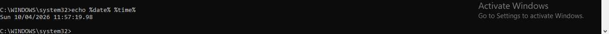<br>
  <em>Fix 1 — The laptop shows <code>Sun 10/04/2026 11:57:19</code> again</em>
</p>

Only the date was changed. I corrected it sooner than planned, because I needed to keep using the same laptop for the lab.

### Step 16 — Check that the VPN connects ✅

<p align="center">
  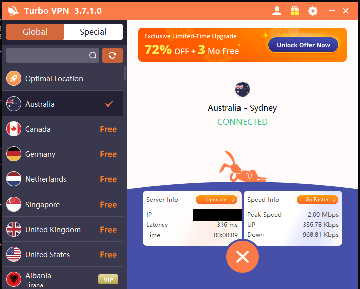<br>
  <em>Fix 2 — Turbo VPN shows <b>CONNECTED</b>, Australia - Sydney, timer 00:00:09, a new session (server IP hidden)</em>
</p>

🎯 **Result:** The VPN client connects again after the date was corrected.

| Verification | Result |
|---|---|
| VPN client status | Connected ✅ |
| `ping` after the fix | Not tested |
| Website after the fix | Not tested |
| Public IP check (proof traffic uses the VPN) | Not tested |
| Shared files or company resource | Not tested (this lab has none) |

### Step 17 — Clean up the lab

| Item | Status |
|---|---|
| Firewall block rules removed | Done ✅ (Exhibit 9) |
| Turbo VPN disconnected | Not confirmed by screenshot |
| "Set time automatically" turned back on | Not confirmed by screenshot |
| Third-party app access removed from any account used to sign in | Not confirmed by screenshot |

### 🔍 Analyst Note — A Connected VPN Is Not Proof

- "Connected" in the app shows the client reached a server. It does not prove that my traffic goes through it. A real check would compare the public IP seen by a website with and without the VPN. I did not do that.
- Turbo VPN is a free consumer app with a third-party server. A company VPN uses a company gateway with logs, so a real ticket would also check the gateway, the login and the server logs. I could not do that here.
- Do not trust a free VPN with work accounts or real passwords.

---

<a id="module-5"></a>
## 🟣 Module 5 — Customer Communication

**Objective:** Keep a worried customer informed without claiming anything untested.

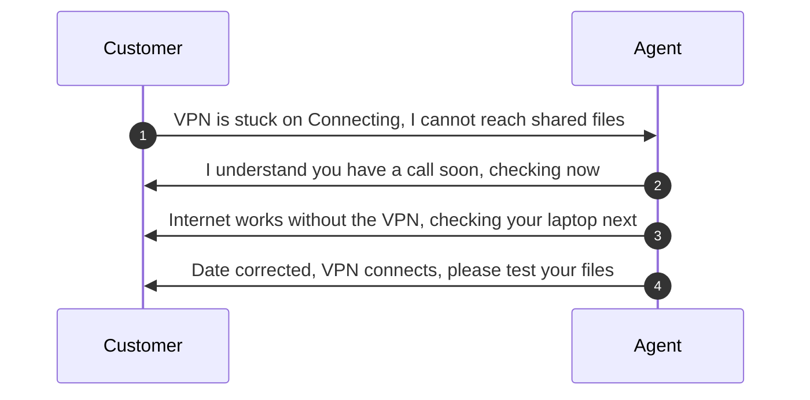

- **Acknowledge:** "I understand you have a client call soon and the VPN will not connect. I'm treating this as urgent and checking your laptop now."
- **Update:** "Your internet works without the VPN, so the problem is on the VPN side or on your laptop. I'm checking the laptop's date, time and firewall next."
- **Close:** "Your VPN connects again after the laptop date was set back to the correct date. The date is the most likely cause, but I have not proven it. I did not test your shared files, so please open them and tell me if anything is still wrong. If the VPN stops again, send me a screenshot of the VPN window."

---

<a id="decision-path"></a>
## 🧭 Decision Path

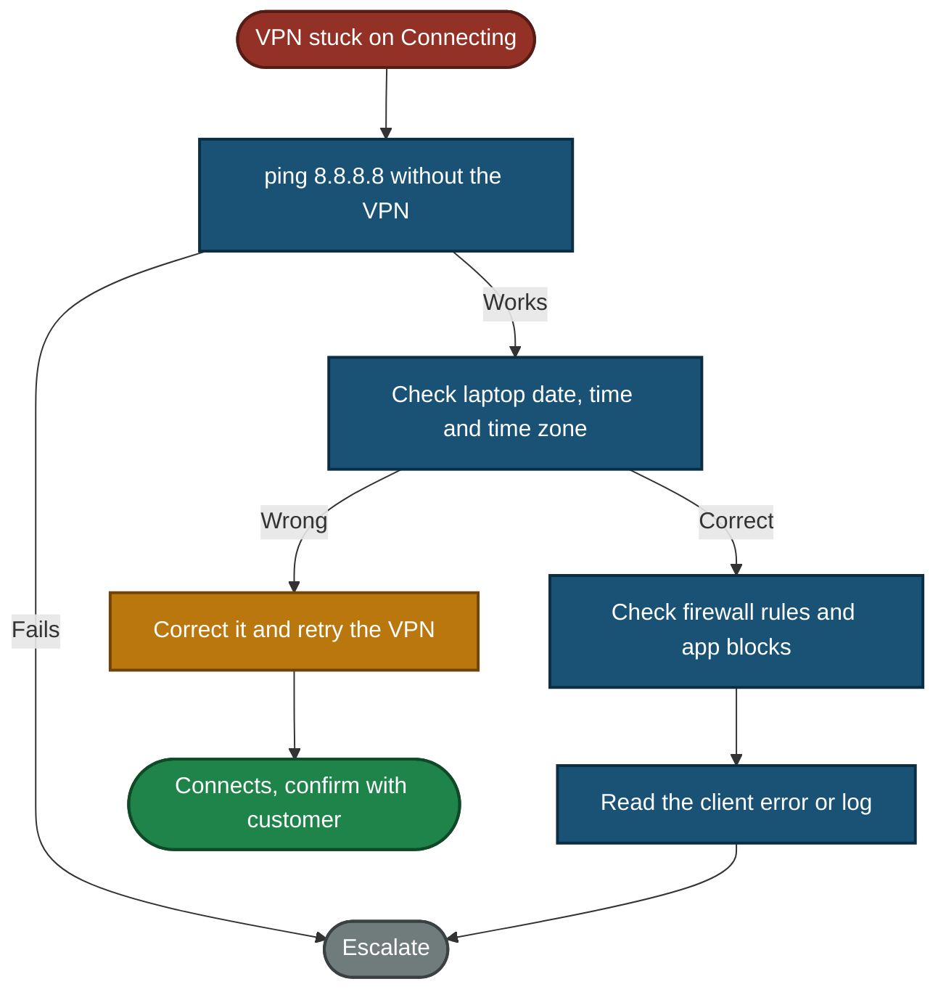

---

<a id="project-summary"></a>
## 📝 Project Summary

| Module | Tooling | Key Finding |
|---|---|---|
| Lab Build / Baseline | `ping`, `nslookup`, Turbo VPN | Internet works with and without the VPN, and the VPN connects, so a baseline exists |
| Triage & Scope | Phone, `tzutil`, `echo %date% %time%` | P2 for one blocked user. The laptop clock was wrong before any fault |
| Diagnostics & Root Cause | `netsh advfirewall`, PowerShell | Firewall block did not stop the VPN. Wrong date left it on "CONNECTING..". Cause not proven |
| Resolution & Verification | Turbo VPN | VPN connects after the date fix. Traffic path and company resources not tested |
| Customer Communication | Communication | Acknowledged, updated and closed without claiming untested things |

---

<a id="challenges-fixes"></a>
## ⚠️ Challenges & Fixes

| ❌ Challenge | ✅ Fix |
|---|---|
| The firewall block on both Turbo VPN programs did not stop the VPN | Removed the rules (Exhibit 9) and moved to a different fault. I did not find out why the block had no effect |
| I could not tell whether the VPN was disconnected before the first connect with the rules on | Repeated it cleanly: showed the VPN disconnected, showed the rules, pressed Connect once |
| The laptop clock was about 3.5 hours behind the phone from the start, with the correct time zone | Recorded it, corrected it, and took the VPN baseline after the correction. The no-VPN baseline was taken before, and it worked anyway |
| A wrong clock can break other things on the laptop | Corrected the date sooner than planned, so the wrong-date state has only one VPN screenshot |
| The VPN showed only "CONNECTING.." with no error message | Wrote that down as it was. No error code or log means the cause stays unproven |
| Connected in the app does not prove traffic uses the VPN | Did not claim it. No public IP check was done |

---

<a id="scope-limitations"></a>
## 🚧 Scope & Limitations

- **Client-side only.** Turbo VPN is a free consumer VPN. The server is a third party's, not mine, and not a company gateway.
- **The first fault did not work.** The firewall block did not stop the VPN, and the reason is not known.
- **The second fault was set by hand.** I changed the date manually. It is not a real clock or time-sync failure.
- **Cause not proven.** One attempt with the wrong date and one after the fix. No error code, no client log, and no repeat test. The time spent on "CONNECTING.." was not recorded.
- **Other things on the laptop were not tested** while the date was wrong, so I cannot say whether the failure was specific to the VPN.
- **Verification is thin.** After the fix I only have the "Connected" screen. No ping, no website, no public IP check, and no company resource, because this lab has none.
- **Not tested:** server reachability with `Test-NetConnection` (the app does not show a server name or port), server name resolution, a real login or account problem, MFA, and a real company gateway.
- **Second device:** the phone showed a website, but both WiFi and mobile icons were visible. The phone was not tried with the same VPN account.
- **Clock correction:** how I corrected the clock was not recorded. The Settings page for the wrong date was not captured. The laptop and phone clock screenshots were not taken at the same moment.
- **Cleanup:** the firewall rules are shown deleted. The VPN disconnect, "Set time automatically" and removal of app access are not confirmed by screenshot.
- **One laptop and one phone only.** Not a real remote-access setup.

---

<a id="what-i-learned"></a>
## 🧠 What I Learned

- **Record a working baseline first.** A fault means nothing without a state to compare with.
- **A fault attempt can fail.** I checked that the rules existed, and the VPN still connected. I wrote that down instead of hiding it.
- **Check that the fault really exists.** Showing the rules and the disconnected VPN before the retest made the result trustworthy.
- **Check the clock early.** The laptop clock was off by hours even though the time zone was right.
- **Timing is a hint, not proof.** "It connected after I fixed the date" is not the same as "the date was the cause".
- **Connected is not the same as protected.** I never checked the public IP, so I cannot say the traffic used the VPN.
- **A free VPN is third-party.** I cannot see its server or logs, so the ticket stays client-side.
- **Change one thing at a time.** Two faults, one after the other, kept the results separate.
- **Clean up after the lab.** Firewall rules and clock settings should not stay on the machine.

---

<a id="skills-demonstrated"></a>
## 🛠️ Skills Demonstrated

- Recording a working baseline before creating a fault
- Setting ticket priority from impact
- Checking a second device for scope
- Checking date, time zone and clock drift with `echo %date% %time%` and `tzutil`
- Creating and proving Windows Firewall rules with `netsh advfirewall`
- Reading process connections with PowerShell
- Testing a fault, noticing it failed, and trying another
- Writing customer messages that do not claim untested things
- Documenting limits honestly, including what was not proven

---

<a id="screenshot-index"></a>
## 🖼️ Screenshot Index

| # | File | Shows |
|:---:|---|---|
| 1 | `Build1_baseline_vpn_off.png` | Ping and `nslookup` with the VPN off |
| 2 | `Build2_vpn_connected_baseline.png` | Turbo VPN connected, Sydney |
| 3 | `Build3_vpn_on_ping_nslookup.png` | Ping and `nslookup` with the VPN on |
| 4 | `Build4_vpn_on_website.png` | Website open with the VPN on |
| 5 | `Scope1_phone_internet.png` | Phone opens a website |
| 6 | `Scope2_laptop_clock_before_after.png` | Time zone and laptop clock before and after the fix |
| 7 | `Scope3_phone_clock_match.png` | Phone clock at 11:03 AM |
| 8 | `Exhibit1_firewall_state_and_rules.png` | Firewall profiles ON, block rules enabled |
| 9 | `Exhibit2_rules_program_paths.png` | Rules with Turbo VPN program paths |
| 10 | `Exhibit3_vpn_connected_with_rules_first.png` | VPN connected with rules on (first attempt) |
| 11 | `Exhibit4_no_tcp_connections.png` | No TCP connection for the two programs |
| 12 | `Exhibit5_udp_local_only.png` | One local-only UDP endpoint |
| 13 | `Exhibit6_vpn_disconnected_before_retest.png` | VPN disconnected before the retest |
| 14 | `Exhibit7_rules_present_before_retest.png` | Both rules still present |
| 15 | `Exhibit8_vpn_connected_with_rules_second.png` | VPN connected with rules on (second attempt) |
| 16 | `Exhibit9_rules_deleted.png` | Rules deleted and none left |
| 17 | `Exhibit10_wrong_date_2024.png` | Laptop date set to 2024 |
| 18 | `Exhibit11_vpn_stuck_connecting.png` | VPN stuck on "CONNECTING.." |
| 19 | `Fix1_date_corrected.png` | Laptop date back to 2026 |
| 20 | `Fix2_vpn_connected_after_fix.png` | VPN connected after the fix |

---

<a id="repo-structure"></a>
## 📁 Repo Structure

```text
TKT-2026-003-VPN-Connection/
|-- README.md
`-- screenshots/
    |-- Build1_baseline_vpn_off.png
    |-- Build2_vpn_connected_baseline.png
    |-- Build3_vpn_on_ping_nslookup.png
    |-- Build4_vpn_on_website.png
    |-- Scope1_phone_internet.png
    |-- Scope2_laptop_clock_before_after.png
    |-- Scope3_phone_clock_match.png
    |-- Exhibit1_firewall_state_and_rules.png
    |-- Exhibit2_rules_program_paths.png
    |-- Exhibit3_vpn_connected_with_rules_first.png
    |-- Exhibit4_no_tcp_connections.png
    |-- Exhibit5_udp_local_only.png
    |-- Exhibit6_vpn_disconnected_before_retest.png
    |-- Exhibit7_rules_present_before_retest.png
    |-- Exhibit8_vpn_connected_with_rules_second.png
    |-- Exhibit9_rules_deleted.png
    |-- Exhibit10_wrong_date_2024.png
    |-- Exhibit11_vpn_stuck_connecting.png
    |-- Fix1_date_corrected.png
    `-- Fix2_vpn_connected_after_fix.png
```

<div align="center">

🔐 **[VPN Basics](https://www.cloudflare.com/learning/access-management/what-is-a-vpn/)** · 🪟 **[Windows Firewall](https://learn.microsoft.com/windows/security/operating-system-security/network-security/windows-firewall/)** · 🛠️ **[Troubleshooting Flow](#decision-path)**

</div>
