<div align="center">

# 🎫 Ticket Simulation — Printer Not Printing (TKT-2026-004)

**Lab — IT Support Ticketing**

Ticket Triage · Print Spooler · Printer Port · Customer Communication


A finance team cannot print its month-end reports. This lab builds a virtual network printer on one Windows PC, makes it unreachable on purpose, proves where the fault is (not the spooler, not the driver), restores it, and checks what happens to the reports that were waiting in the queue.

</div>

> [!NOTE]
> Simulated ticket. The customer, quotes and office are role-played. The printer is virtual and the fault was created on purpose. Computer name and account names of my own PC are blurred in the screenshots.

---

## 📑 Table of Contents

1. [At a Glance](#at-a-glance)
2. [Ticket Record](#ticket-record)
3. [Project Background](#project-background)
4. [Environment](#environment)
5. [Ticket Flow](#ticket-flow)
6. [Module 1 — Lab Build](#module-1)
7. [Module 2 — Triage & Scope](#module-2)
8. [Where Printing Can Break](#print-layers)
9. [Module 3 — Diagnostics & Root Cause](#module-3)
10. [Module 4 — Resolution & Verification](#module-4)
11. [Module 5 — Customer Communication](#module-5)
12. [Decision Path](#decision-path)
13. [Project Summary](#project-summary)
14. [Challenges & Fixes](#challenges-fixes)
15. [Scope & Limitations](#scope-limitations)
16. [What I Learned](#what-i-learned)
17. [Skills Demonstrated](#skills-demonstrated)
18. [Screenshot Index](#screenshot-index)
19. [Repo Structure](#repo-structure)

---

<a id="at-a-glance"></a>
## 📊 At a Glance

| 🧩 Modules | 🖼️ Screenshots | 🔍 Diagnostic Checks | 💬 Customer Messages |
|:---:|:---:|:---:|:---:|
| **5** | **14** | **6** | **3** |

---

<a id="ticket-record"></a>
## 🎫 Ticket Record

| Field | Value |
|---|---|
| **Ticket #** | TKT-2026-004 |
| **Date** | 2026-10-04 |
| **Priority** | P2 (High) — one shared printer is down and reports are delayed, but the business is still running |
| **Status** | Resolved ✅ |
| **Category** | Printer |
| **Customer** | Finance team member (role-played) |
| **Impact / Scope** | Reported: the Finance department. Tested in this lab: two accounts on one PC (see Scope & Limitations) |
| **Outage window (lab)** | Jobs queued at about 04:43 and the printer came back at 04:53 (PC local time) |

> *"Our month-end reports are stuck. Nothing prints on the Finance printer."*

---

<a id="project-background"></a>
## 📖 Project Background

"The printer does not print" can mean a stuck spooler, a missing driver, a wrong port, or a printer that cannot be reached. Restarting things at random can hide the real cause. A good ticket checks from the cheapest test to the most complex, proves where the fault is, and handles the jobs that are waiting.

- **Module 1 — Lab Build:** Build a virtual printer that can really be switched on and off.
- **Module 2 — Triage & Scope:** Set the priority from the impact and ask who is affected.
- **Module 3 — Diagnostics & Root Cause:** Prove the fault is the path to the printer, not the spooler or the driver.
- **Module 4 — Resolution & Verification:** Restore the printer, watch the queue, and test with a second account.
- **Module 5 — Customer Communication:** Acknowledge, update and close with clear messages.

<div align="center">

### 🧩 Lab Setup at a Glance

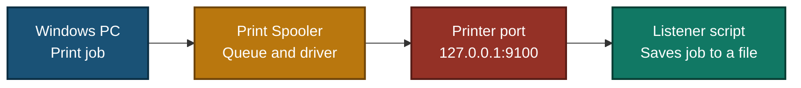

</div>

---

<a id="environment"></a>
## 🖧 Environment

| Item | Value |
|---|---|
| **PC** | One Windows 10 PC (build 19045), no VM, no cloud |
| **Printer** | `Finance-Printer`, driver "Generic / Text Only" |
| **Printer port** | TCP/IP port `IP_127.0.0.1` (address `127.0.0.1`, port 9100) |
| **Virtual printer** | A small PowerShell script (`Listener.ps1`) that listens on `127.0.0.1:9100` and saves every job it receives to a text file |
| **Printer on / off** | Listener running = printer reachable. Listener stopped = printer not reachable |
| **Second user** | `LabUser2`, a local account created for the lab and deleted afterwards |
| **Tools** | PowerShell (`Get-Printer`, `Get-PrintJob`, `Get-Service`, `Test-NetConnection`), print queue window |

---

<a id="ticket-flow"></a>
## ⏱️ Ticket Flow


---

<a id="module-1"></a>
## 🟡 Module 1 — Lab Build

**Objective:** Build a printer that works first, so the fault can be created and fixed on purpose.

### Step 1 — Create the virtual printer ✅

```powershell
Add-PrinterDriver -Name "Generic / Text Only"
Add-PrinterPort -Name "IP_127.0.0.1" -PrinterHostAddress "127.0.0.1"
Add-Printer -Name "Finance-Printer" -DriverName "Generic / Text Only" -PortName "IP_127.0.0.1"
```

<p align="center">
  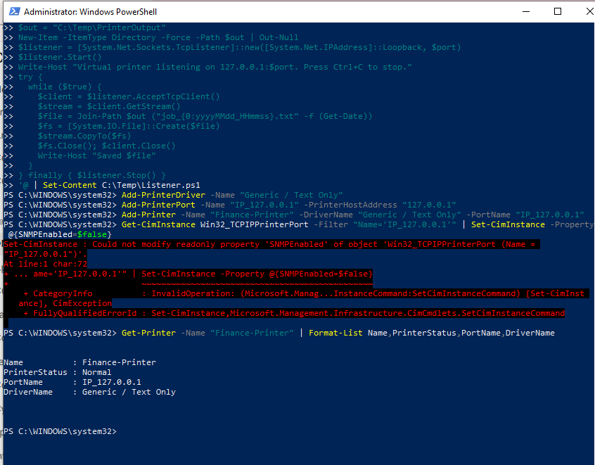<br>
  <em>Build 1 — <code>Finance-Printer</code> exists with status <code>Normal</code>, port <code>IP_127.0.0.1</code>. The red error above it is the SNMP change that Windows refused (see Challenges)</em>
</p>

### Step 2 — Start the virtual printer ✅

I saved a small listener script as `C:\Temp\Listener.ps1` and started it in its own PowerShell window. It stays open while the "printer" is on.

```powershell
powershell -ExecutionPolicy Bypass -File C:\Temp\Listener.ps1
```

<p align="center">
  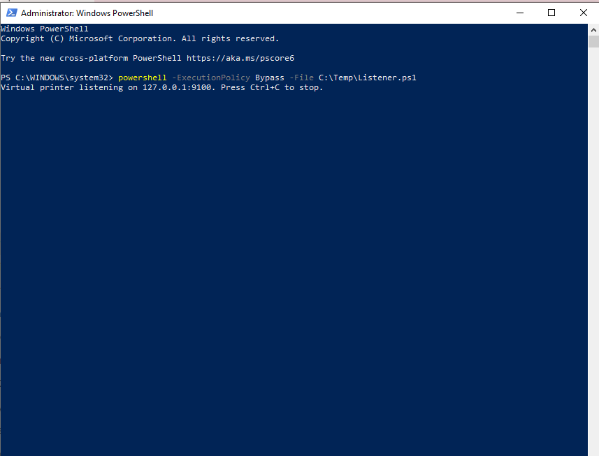<br>
  <em>Build 2 — The listener is running on <code>127.0.0.1:9100</code></em>
</p>

### Step 3 — Record a working baseline ✅

```powershell
"Q3 Financial Report - baseline" | Out-Printer -Name "Finance-Printer"
Get-ChildItem C:\Temp\PrinterOutput
```

<p align="center">
  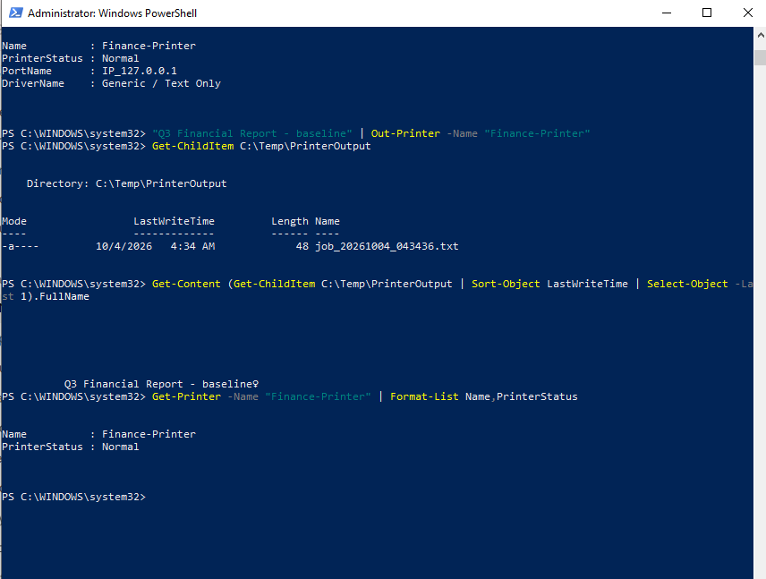<br>
  <em>Build 3 — The baseline job arrived as <code>job_20261004_043436.txt</code> and contains the report text. Printer status is <code>Normal</code>. The small symbol after the text is a page-end character from the driver</em>
</p>

<p align="center">
  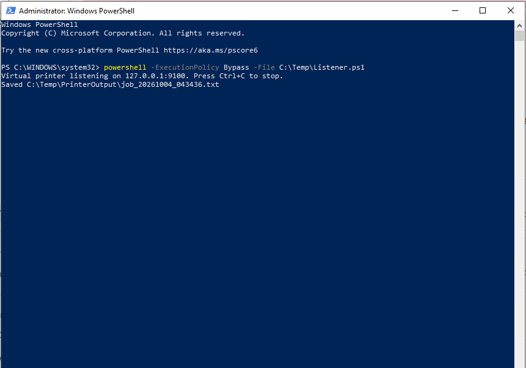<br>
  <em>Build 4 — The listener window confirms it saved the baseline job</em>
</p>

🎯 **Result:** A printer that prints, with a recorded "before" state.

---

<a id="module-2"></a>
## 🔵 Module 2 — Triage & Scope

**Objective:** Set the right priority and find out how far the problem reaches.

### Step 4 — Read the impact ✅

One shared printer is down and the finance reports are delayed. The business can still work, so this is P2, not P1. The reports are sensitive, so I also note that waiting jobs need care when the printer comes back.

### Step 5 — Check the scope ✅

| Check | Result |
|---|---|
| Who is affected | Reported: the Finance department. Tested in this lab: two accounts on one PC |
| Other printers working | Not tested (the lab has one printer) |
| Priority | P2 (High) |

---

<a id="print-layers"></a>
## 🗺️ Where Printing Can Break

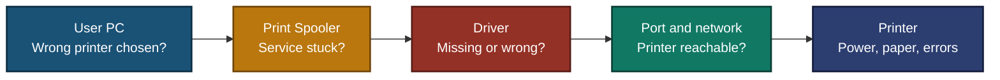

- Each box is a place printing can fail.
- Work from left to right: the cheapest checks come first.
- In this lab the fault is in the **Port and network** box.

---

<a id="module-3"></a>
## 🟢 Module 3 — Diagnostics & Root Cause

**Objective:** Prove where the fault is and why, using evidence.

### Step 6 — Create the fault ✅

I stopped the listener, so nothing was listening on port 9100. My first attempt did not work: the listener was still running, so both test jobs printed (see Challenges).

<p align="center">
  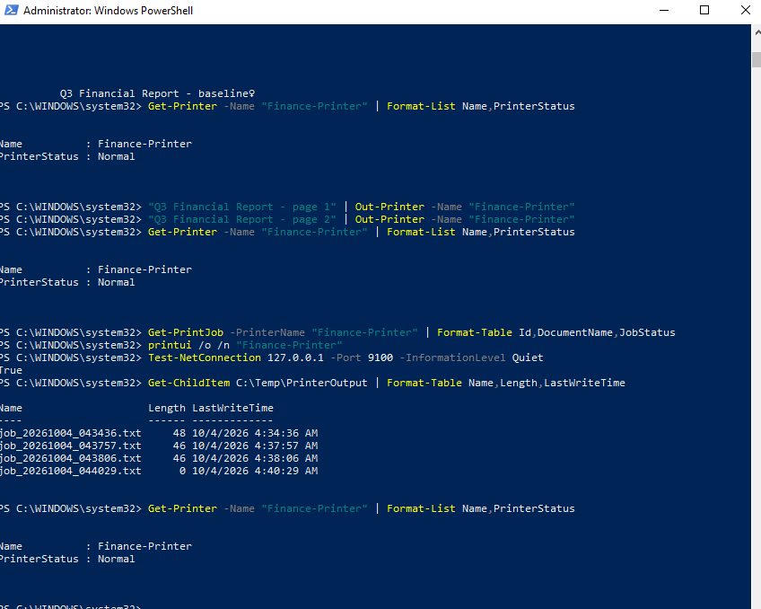<br>
  <em>Challenge 1 — First attempt: the port test returned <code>True</code>, so the listener was still running. Both test jobs were saved as files and the status stayed <code>Normal</code></em>
</p>

Second attempt: I stopped the listener properly and checked the port.

```powershell
Test-NetConnection 127.0.0.1 -Port 9100 -InformationLevel Quiet
```

<p align="center">
  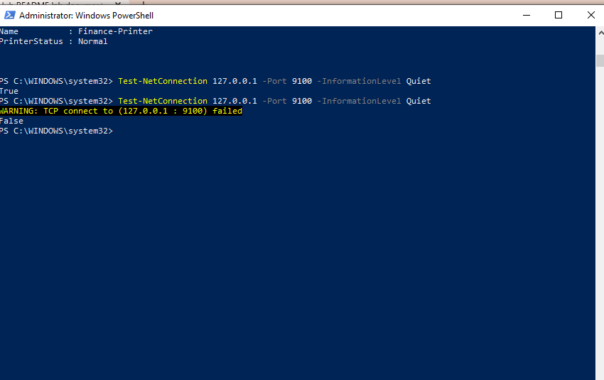<br>
  <em>Exhibit 1 — The port test returned <code>True</code> before and <code>False</code> after the listener was stopped. The "printer" is now unreachable</em>
</p>

### Step 7 — Look at the print queue ✅

I sent two test jobs and opened the queue.

```powershell
"Q3 Financial Report - page 1" | Out-Printer -Name "Finance-Printer"
"Q3 Financial Report - page 2" | Out-Printer -Name "Finance-Printer"
printui /o /n "Finance-Printer"
```

<p align="center">
  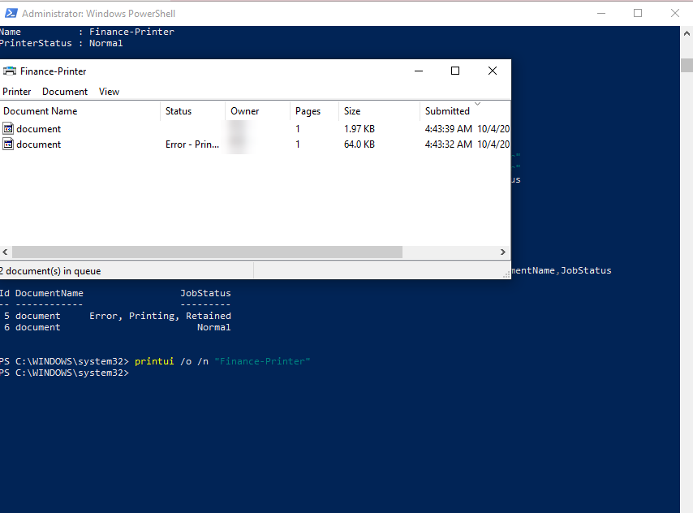<br>
  <em>Exhibit 2 — Two jobs wait in the queue. One shows "Error - Printing". The Owner column is hidden</em>
</p>

I took this screenshot before touching the spooler, because the queue changes once the fault is fixed.

### Step 8 — Check the spooler, the driver and the port ✅

```powershell
Test-NetConnection 127.0.0.1 -Port 9100
Get-Service Spooler
Get-PrinterDriver -Name "Generic / Text Only"
Get-Printer -Name "Finance-Printer" | Format-List Name,PrinterStatus,PortName,DriverName
```

<p align="center">
  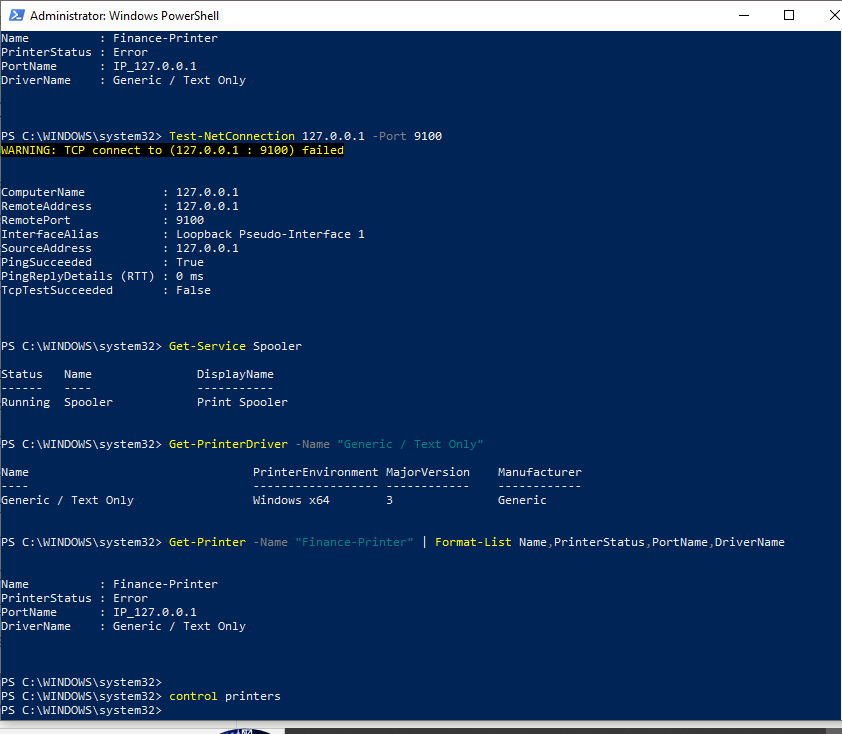<br>
  <em>Exhibit 3 — Port 9100 does not accept a connection (<code>TcpTestSucceeded : False</code>), the Spooler is <code>Running</code>, the driver is installed, and the printer status is now <code>Error</code></em>
</p>

### Step 9 — Test from a second account ✅

I created a second local account, `LabUser2`, opened PowerShell as that user, and printed.

```powershell
New-LocalUser -Name "LabUser2" -Password (Read-Host -AsSecureString "Password") -FullName "Lab User 2"
runas /user:LabUser2 powershell
```
```powershell
"Q3 Financial Report - LabUser2" | Out-Printer -Name "Finance-Printer"
Get-PrintJob -PrinterName "Finance-Printer" | Format-Table Id,DocumentName,UserName,JobStatus
```

<p align="center">
  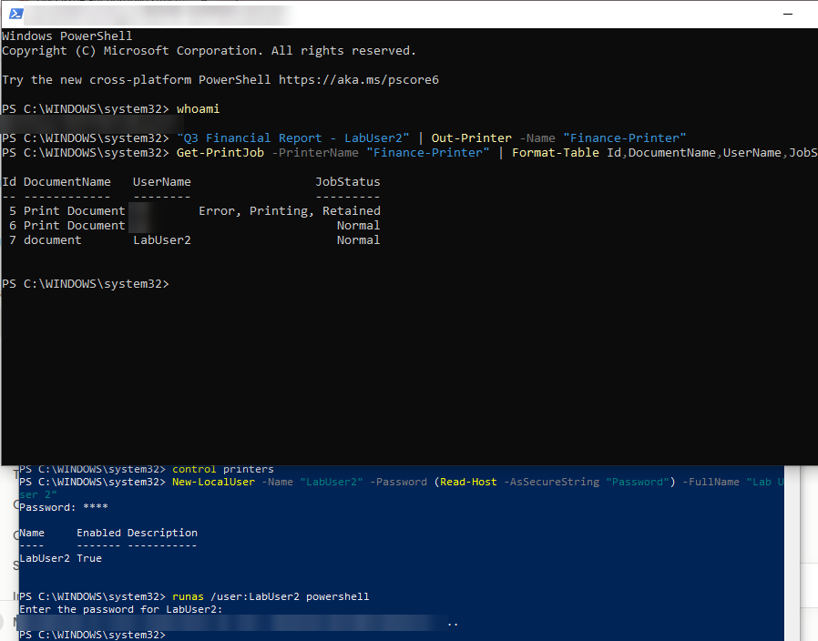<br>
  <em>Exhibit 4 — The second account's job (Id 7) is also waiting in the queue, next to my first account's jobs. The fault is not tied to one user. Computer name and my account name are hidden</em>
</p>

🎯 **Result:** The spooler and the driver are fine. Nothing answers on the printer's port, and more than one account is affected.

| Check | Result |
|---|---|
| Print queue | 2 jobs waiting, one with "Error - Printing" |
| `Test-NetConnection` port 9100 | Failed (`TcpTestSucceeded : False`) |
| `Get-Service Spooler` | Running |
| `Get-PrinterDriver` | Driver installed |
| `Get-Printer` status | Normal at first, `Error` later |
| Second account | Its job also waits in the queue |

### 🎯 Root Cause

The printer is not reachable on its port (9100), so every job waits in the queue. The spooler and the driver are working.

> [!IMPORTANT]
> In this lab I stopped the virtual printer on purpose. Windows first kept the status `Normal`, and showed `Error` only later. It never showed the word "Offline" for this fault. In a real ticket, the reason the printer became unreachable (power, cable, a changed address) would still need to be found.

---

<a id="module-4"></a>
## 🟠 Module 4 — Resolution & Verification

**Objective:** Fix the shared source first, then prove it works and watch the waiting jobs.

### Step 10 — Bring the printer back ✅

I checked that no output file existed yet, then started the listener again. I did not restart the spooler and I did not restart any job by hand.

```powershell
Get-ChildItem C:\Temp\PrinterOutput
powershell -ExecutionPolicy Bypass -File C:\Temp\Listener.ps1
```

<p align="center">
  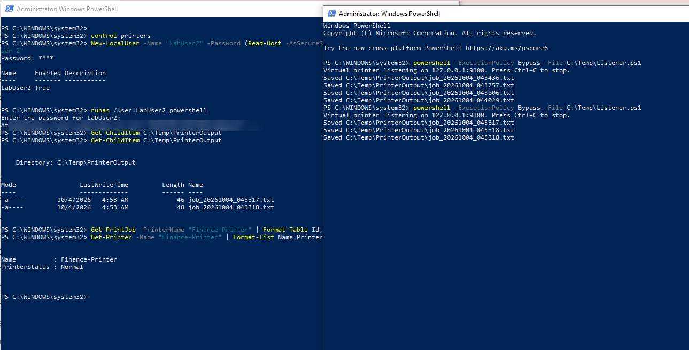<br>
  <em>Exhibit 5 — Right after the listener started, it saved the waiting jobs on its own (left: queue empty and printer <code>Normal</code>; right: the listener window). Computer name hidden</em>
</p>

> [!WARNING]
> The waiting reports came out as soon as the printer was reachable, with nobody standing at it. For real financial reports, check who owns the waiting jobs first, and release them while the owner is present or cancel and resubmit.

### Step 11 — Check what arrived ✅

Three jobs were waiting, but only two files exist. Two jobs arrived in the same second, and my listener names each file by the second, so the second one replaced the first. The file for page 2 is gone. This is a flaw of my test script, not of Windows printing, and it is my best explanation, not something I proved.

### Step 12 — Verify from two accounts ✅

I printed a new job from my own account and from `LabUser2`, a few seconds apart.

```powershell
"Q3 Financial Report - verify RM" | Out-Printer -Name "Finance-Printer"
"Q3 Financial Report - verify LabUser2" | Out-Printer -Name "Finance-Printer"
```

<p align="center">
  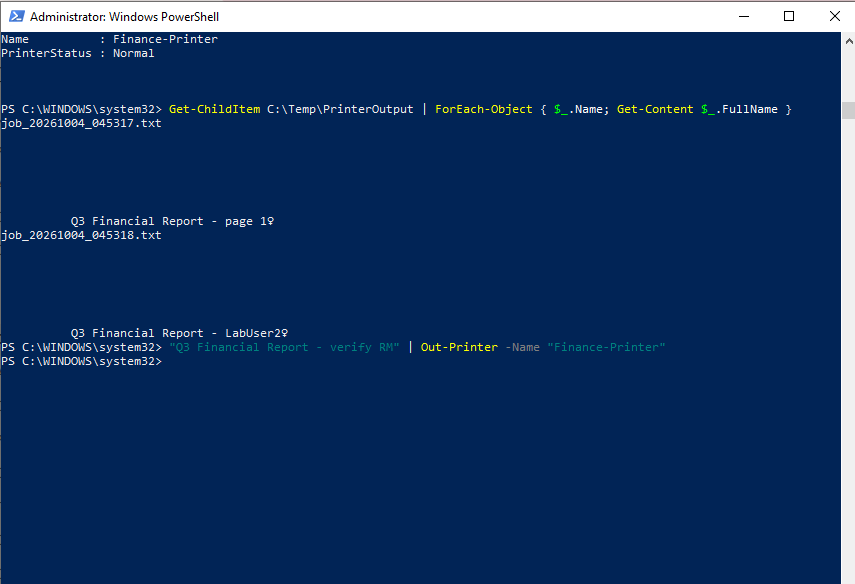<br>
  <em>Exhibit 6 — The output files from the first release: page 1 and the second account's job. The page 2 text is missing</em>
</p>

<p align="center">
  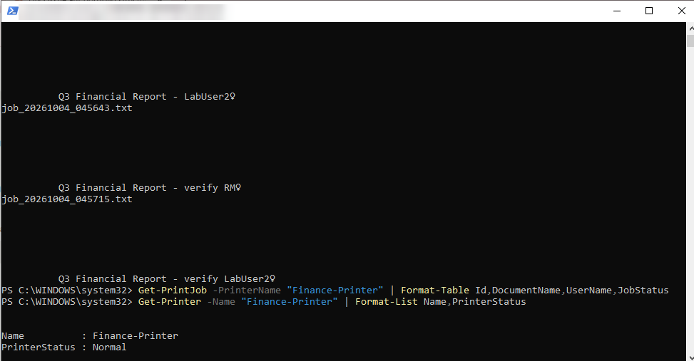<br>
  <em>Exhibit 7 — Both new jobs arrived as separate files, the queue is empty and the status is <code>Normal</code>. Window title hidden</em>
</p>

🎯 **Result:** The printer works for both accounts, the queue is empty, and the waiting jobs came out.

| Verification | Result |
|---|---|
| Waiting jobs released after the printer returned | Yes, without a spooler restart ✅ |
| New job from my account | Arrived ✅ |
| New job from the second account | Arrived ✅ |
| Print queue | Empty ✅ |
| Printer status | `Normal` ✅ |
| All waiting pages arrived | No: page 2 was overwritten by my script |
| Real paper output | Not applicable (text files) |

### 🧹 Cleanup ✅

I removed the lab so nothing is left on the PC: the printer, the port, the test account (and its profile) and `C:\Temp`.

<p align="center">
  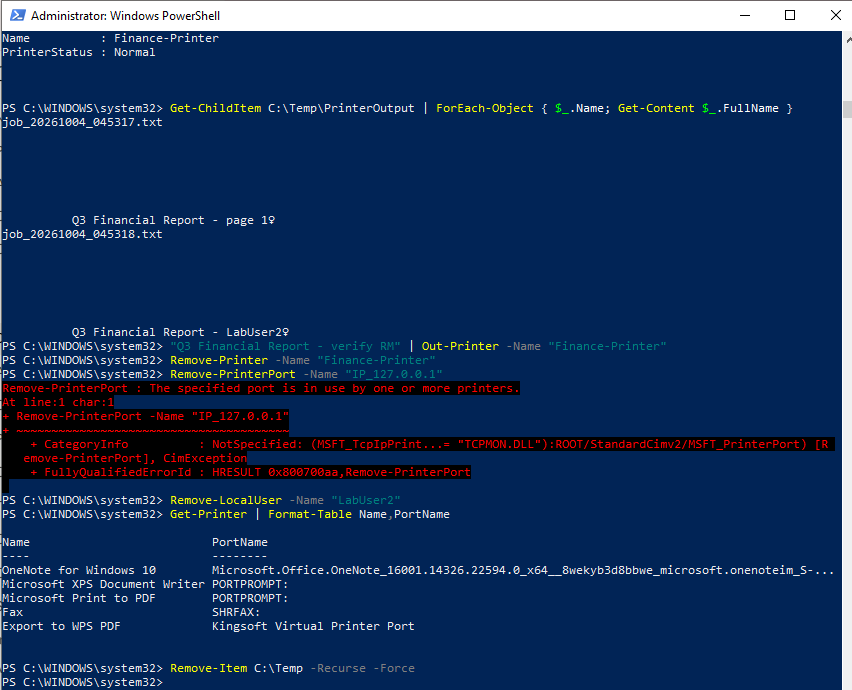<br>
  <em>Exhibit 8 — <code>Finance-Printer</code> is gone from the printer list. The first <code>Remove-PrinterPort</code> failed with "port is in use"</em>
</p>

<p align="center">
  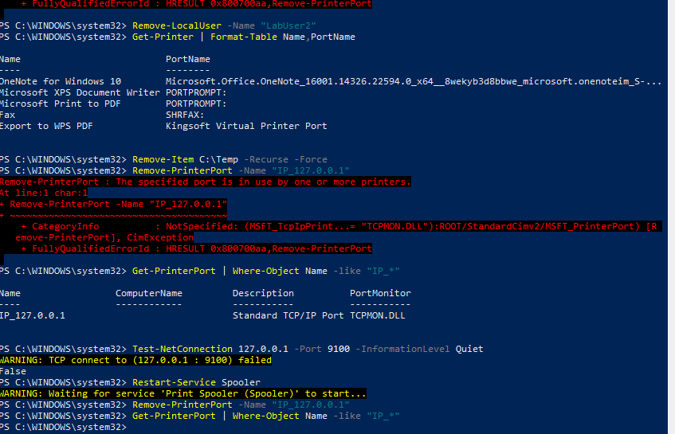<br>
  <em>Exhibit 9 — After restarting the spooler, the port was removed and no <code>IP_*</code> ports remain. Restarting the spooler was only needed for cleanup</em>
</p>

---

<a id="module-5"></a>
## 🟣 Module 5 — Customer Communication

**Objective:** Keep an urgent customer informed without claiming more than was tested.

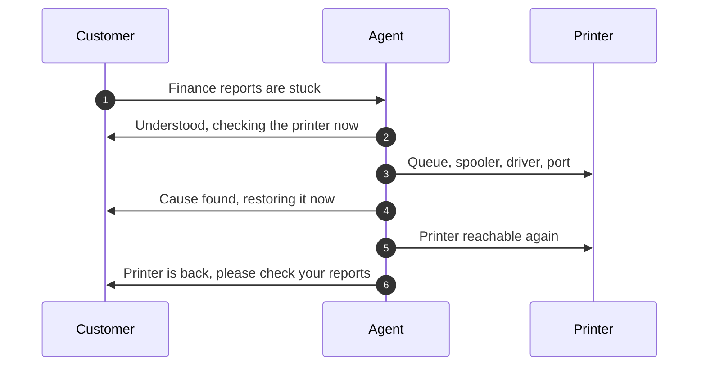

- **Acknowledge:** "I understand the finance reports are stuck. I'm checking the printer now and will update you shortly."
- **Update:** "The print service and driver are fine. The printer is not reachable on its network port, so your jobs are waiting in the queue. I'm restoring it now. When it comes back, the waiting reports may print right away, so please stand near the printer or tell me to hold them."
- **Close:** "The printer is reachable again and the waiting jobs have printed. Please check the output tray for all your pages and tell me if any are missing. I'm also checking why the printer became unreachable."

---

<a id="decision-path"></a>
## 🧭 Decision Path

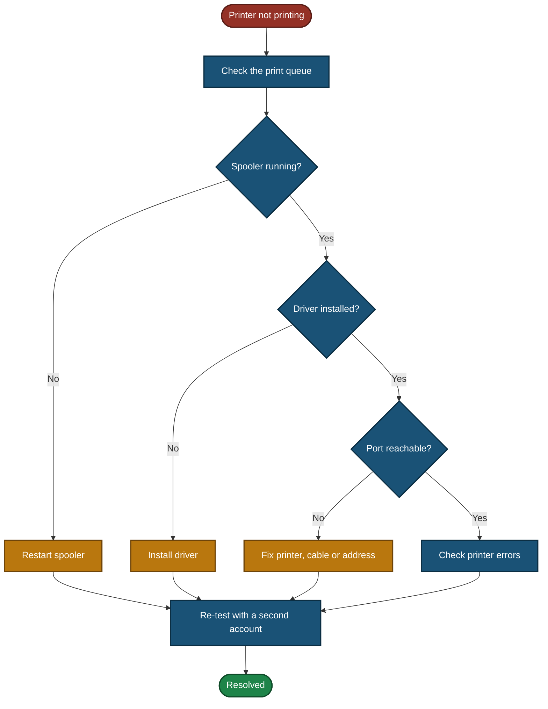

---

<a id="project-summary"></a>
## 📝 Project Summary

| Module | Tooling | Key Finding |
|---|---|---|
| Lab Build | PowerShell, listener script | A working virtual printer with a recorded baseline |
| Triage & Scope | Ticket fields | One shared printer down, so P2, and sensitive jobs need care |
| Diagnostics & Root Cause | Print queue, `Test-NetConnection`, `Get-Service`, `Get-PrinterDriver` | Spooler and driver fine, the printer port is not reachable |
| Resolution & Verification | Listener, `Get-PrintJob`, output files | Waiting jobs released on their own, one page lost by my script, two accounts tested |
| Customer Communication | Communication | Acknowledged, warned about jobs printing at once, closed without overclaiming |

---

<a id="challenges-fixes"></a>
## ⚠️ Challenges & Fixes

| ❌ Challenge | ✅ Fix |
|---|---|
| Changing the printer port's SNMP setting failed: "Could not modify readonly property 'SNMPEnabled'" | Left it as it was. It did not affect the lab |
| My first fault attempt did not work: the listener was still running, so the two test jobs printed and the status stayed `Normal` | Stopped the listener properly, checked that port 9100 was closed, deleted the old output files, and sent the jobs again |
| Pressing Ctrl+C did not stop the listener window | Closed the listener window instead |
| A port test I ran while the listener was on created an empty output file | Ran port tests only while the listener was stopped |
| Windows kept the printer status `Normal` right after the fault and showed `Error` only later | Reported what Windows showed and waited before taking the diagnosis screenshot |
| Two jobs arrived in the same second and my listener named both files the same, so one report page was lost | Noted it as a flaw of my test script and kept it as a lesson about jobs releasing together |
| `Remove-PrinterPort` failed with "port is in use" after the printer was removed | Restarted the Print Spooler, then removed the port |

---

<a id="scope-limitations"></a>
## 🚧 Scope & Limitations

- **Virtual printer only:** There was no physical printer. Power, cable, paper, toner and firmware checks are not part of this lab.
- **Fault was set up on purpose:** I stopped the listener. This lab does not prove what really makes a department printer unreachable.
- **Status was not "Offline":** Windows showed `Normal` at first and `Error` later. It never showed "Offline" for this fault.
- **Second user is not a second PC:** `LabUser2` is another account on the same PC. No other computer was tested.
- **Job release was not timed in detail:** The files appeared when the listener started, at about 04:53. I did not test how long Windows would keep a job waiting before it gives up.
- **One report page was lost by my script.** The cause (same-second file names) is my best explanation, not something I proved.
- **No real output:** Jobs were saved as text files, not printed on paper.
- **Spooler restart not needed for the fix:** I only used it for cleanup.
- **Account profile removal not verified:** I deleted the `LabUser2` account and ran a command to remove its profile. The command gave no error, but I did not check afterwards that the folder is gone from `C:\Users`.
- **No print server:** If a print server shares the printer, the checks would also apply there.

---

<a id="what-i-learned"></a>
## 🧠 What I Learned

- **Check the queue first.** It shows right away whether jobs are waiting and which one has an error.
- **Separate the layers.** A running spooler and an installed driver rule out two causes, and a failed port test points at the path to the printer.
- **Test with a second account.** It shows whether the fault belongs to one user or to the printer.
- **Waiting jobs come out when the printer returns.** Sensitive reports can print with nobody there, so plan for it.
- **A lab can fail the first time.** My first fault attempt did not work because the listener was still running, and I had to check before trusting the result.
- **Do not trust a status word alone.** Windows showed `Normal` while jobs were stuck, so the queue and a port test gave better evidence.
- **Clean up.** Restarting the spooler freed the port that could not be removed.

---

<a id="skills-demonstrated"></a>
## 🛠️ Skills Demonstrated

- Setting ticket priority from business impact
- Diagnosing printing problems from queue to port with PowerShell
- Managing and checking the Print Spooler and printer drivers
- Testing with a second user account
- Handling sensitive jobs waiting in a queue
- Communicating with an urgent customer without overclaiming
- Documenting limits honestly, including what failed and what was not tested

---

<a id="screenshot-index"></a>
## 🖼️ Screenshot Index

| # | File | Shows |
|:---:|---|---|
| 1 | `Build1_printer_created.png` | Printer created, status `Normal`, SNMP error |
| 2 | `Build2_listener_running.png` | Listener running on `127.0.0.1:9100` |
| 3 | `Build3_baseline_print_ok.png` | Baseline job arrived as a file |
| 4 | `Build4_baseline_listener_saved.png` | Listener saved the baseline job |
| 5 | `Challenge1_first_attempt_no_fault.png` | First attempt: listener still on, jobs printed |
| 6 | `Exhibit1_listener_stopped.png` | Port test `True`, then `False` after stopping |
| 7 | `Exhibit2_queue_stuck.png` | Two jobs waiting in the queue |
| 8 | `Exhibit3_diagnosis_checks.png` | Port failed, spooler running, driver installed, status `Error` |
| 9 | `Exhibit4_other_user_job_stuck.png` | Second account's job also waiting |
| 10 | `Exhibit5_listener_back_jobs_released.png` | Listener back, waiting jobs saved, queue empty |
| 11 | `Exhibit6_verify_output_files.png` | Output files from the first release |
| 12 | `Exhibit7_verify_labuser2.png` | New jobs from both accounts arrived, queue empty |
| 13 | `Exhibit8_cleanup_printer_removed.png` | Printer removed |
| 14 | `Exhibit9_cleanup_port_removed.png` | Port removed after a spooler restart |

---

<a id="repo-structure"></a>
## 📁 Repo Structure

```text
TKT-2026-004-Printer/
|-- README.md
`-- screenshots/
    |-- Build1_printer_created.png
    |-- Build2_listener_running.png
    |-- Build3_baseline_print_ok.png
    |-- Build4_baseline_listener_saved.png
    |-- Challenge1_first_attempt_no_fault.png
    |-- Exhibit1_listener_stopped.png
    |-- Exhibit2_queue_stuck.png
    |-- Exhibit3_diagnosis_checks.png
    |-- Exhibit4_other_user_job_stuck.png
    |-- Exhibit5_listener_back_jobs_released.png
    |-- Exhibit6_verify_output_files.png
    |-- Exhibit7_verify_labuser2.png
    |-- Exhibit8_cleanup_printer_removed.png
    `-- Exhibit9_cleanup_port_removed.png
```

<div align="center">

🖨️ **[Windows Print Spooler](https://learn.microsoft.com/windows-server/administration/windows-commands/windows-commands)** · 🪟 **[Windows Services](https://learn.microsoft.com/windows/win32/services/services)** · 🛠️ **[Troubleshooting Flow](#decision-path)**

</div>
