<div align="center">

# 🎫 Ticket Simulation — WiFi Connected, No Internet (TKT-2026-005)

**Lab — IT Support Ticketing**

Ticket Triage · Network Diagnostics · Root Cause · Customer Communication


A marketing user says the laptop is connected to WiFi but nothing opens, and a client presentation starts in 30 minutes. This lab sets a wrong default gateway on purpose, proves where the fault is with layer-by-layer tests, puts the laptop back on automatic settings, and shows how to keep the customer informed.

</div>

> [!NOTE]
> Simulated ticket. The customer, quote and office are role-played. The fault was created on purpose by me, by hand, with `netsh` on my own laptop. It is not a real router or DHCP problem. Everything below comes from what I really saw on **2026-10-04**. Where a result was different from my plan, I wrote the real result. WiFi name, MAC addresses, IPv6 values, DHCPv6 values, profile pictures and my document link are blurred in the screenshots.

---

## 📑 Table of Contents

1. [At a Glance](#at-a-glance)
2. [Ticket Record](#ticket-record)
3. [Project Background](#project-background)
4. [Environment](#environment)
5. [Ticket Flow](#ticket-flow)
6. [Module 1 — Lab Build / Baseline](#module-1)
7. [Module 2 — Triage & Scope](#module-2)
8. [Where the Outage Can Sit](#outage-layers)
9. [Module 3 — Diagnostics & Root Cause](#module-3)
10. [Module 4 — Resolution & Verification](#module-4)
11. [Module 5 — Customer Communication](#module-5)
12. [Decision Path](#decision-path)
13. [Project Summary](#project-summary)
14. [Challenges & Fixes](#challenges-fixes)
15. [Scope & Limitations](#scope-limitations)
16. [What I Learned](#what-i-learned)
17. [Skills Demonstrated](#skills-demonstrated)
18. [Screenshot Index](#screenshot-index)
19. [Repo Structure](#repo-structure)

---

<a id="at-a-glance"></a>
## 📊 At a Glance

| 🧩 Modules | 🖼️ Screenshots | 🔍 Diagnostic Checks | 💬 Customer Messages |
|:---:|:---:|:---:|:---:|
| **5** | **18** | **8** | **3** |

The 8 checks are: three pings, the route table, the browser test, the DNS lookup, the settings check, and the Google Slides test.

---

<a id="ticket-record"></a>
## 🎫 Ticket Record

| Field | Value |
|---|---|
| **Ticket #** | TKT-2026-005 |
| **Date** | 2026-10-04 (real lab date) |
| **Priority** | P2 (High) — one user is affected, but there is a deadline: a client presentation in 30 minutes |
| **Status** | Resolved ✅ (in the lab) |
| **Category** | Network / WiFi |
| **Customer** | Hamza Ali, Marketing, Lahore Office (role-played) |
| **Impact / Scope** | One laptop has no internet. The phone check was done before the fault (see Scope & Limitations) |
| **Story cause (role-play)** | The user followed a "make internet faster" tip and typed manual network settings with a wrong gateway. This is the story, not something I proved |

> *"My laptop says it's connected to WiFi but nothing opens. I have a client presentation in 30 minutes."*

---

<a id="project-background"></a>
## 📖 Project Background

The matching video script is `01.5-WiFi-Connectivity.md`. In that lab I made an APIPA situation by typing a manual address (`169.254.77.10`). It was not a real DHCP failure, and some checks were marked "described, not tested".

This ticket uses a different fault, a **wrong default gateway on a manual address**, and tests those checks for real as far as one laptop and one phone allow.

- **Module 1 — Lab Build / Baseline:** Prove the laptop works and save its settings.
- **Module 2 — Triage & Scope:** Set the priority from the deadline and check another device.
- **Module 3 — Diagnostics & Root Cause:** Create the fault, then test layer by layer.
- **Module 4 — Resolution & Verification:** Put the adapter back on automatic and verify with a real tool.
- **Module 5 — Customer Communication:** Acknowledge, update and close.

<div align="center">

### 🧩 Lab Setup at a Glance

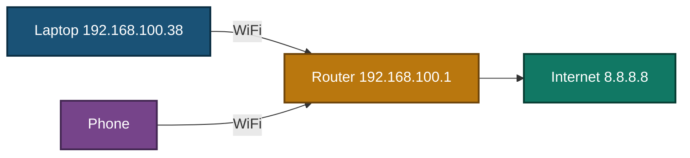

</div>

---

<a id="environment"></a>
## 🖧 Environment

| Item | Value |
|---|---|
| **Laptop** | Windows 10, WiFi adapter name `Wi-Fi`, address `192.168.100.38` |
| **Router subnet** | `192.168.100.0/24` |
| **Known router (gateway)** | `192.168.100.1` |
| **DNS servers on the laptop** | `8.8.8.8` and `8.8.4.4`, set by hand in an earlier lab (they show as "Statically Configured") |
| **Second device** | My phone on the same WiFi |
| **Commands** | `ipconfig`, `netsh`, `ping`, `route print`, `nslookup`, run in Command Prompt as administrator |
| **Real work tool** | Google Slides (blank test file) |
| **Cost** | None. No VM and no second PC |

---

<a id="ticket-flow"></a>
## ⏱️ Ticket Flow


---

<a id="module-1"></a>
## 🟡 Module 1 — Lab Build / Baseline

**Objective:** Prove the laptop works first, and save its settings, so the fault and the fix can be compared with a "before" state.

### Step 1 — Record a working baseline ✅

Command Prompt as administrator:

```cmd
ipconfig /all
ping 192.168.100.1
ping 8.8.8.8
```

<p align="center">
  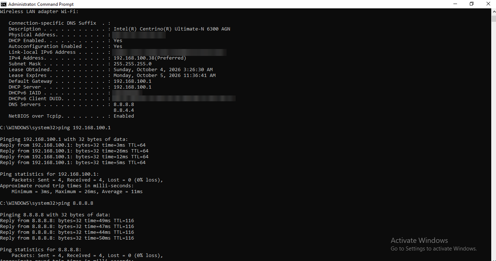<br>
  <em>Build 1 — Baseline: DHCP is on, the gateway and DHCP server are the router, and both pings work (MAC, IPv6 and DHCPv6 values are blurred)</em>
</p>

| Check | Result |
|---|---|
| DHCP Enabled | Yes |
| IPv4 address | `192.168.100.38` |
| Default gateway | `192.168.100.1` |
| DHCP server | `192.168.100.1` |
| `ping 192.168.100.1` | 4 sent, 4 received |
| `ping 8.8.8.8` | 4 sent, 4 received |

### Step 2 — Save the current settings ✅

```cmd
netsh interface ip show config name="Wi-Fi"
```

<p align="center">
  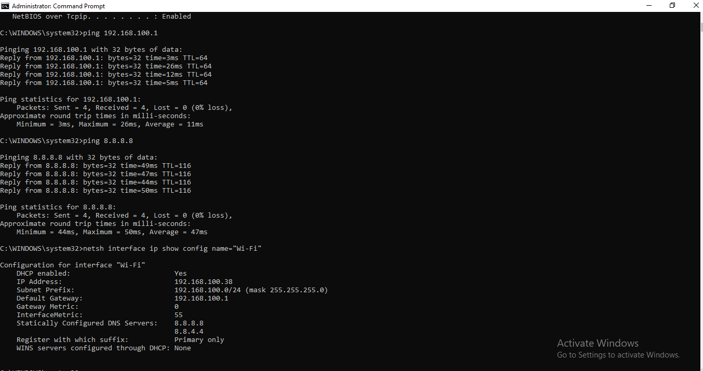<br>
  <em>Build 2 — Settings before the change. These are compared again in the cleanup check</em>
</p>

| Check | Result |
|---|---|
| DHCP enabled | Yes |
| Default gateway | `192.168.100.1` |
| Gateway Metric | 0 |
| InterfaceMetric | 55 |
| DNS servers | `8.8.8.8` and `8.8.4.4` (Statically Configured) |

🎯 **Result:** A laptop that works through the router, with a recorded "before" state.

---

<a id="module-2"></a>
## 🔵 Module 2 — Triage & Scope

**Objective:** Set the right priority and check whether the problem is only on this laptop.

### Step 3 — Read the impact ✅

One user is affected, but there is a client presentation in 30 minutes. One user would normally be P3. The hard deadline raises it to **P2**.

### Step 4 — Check the scope with a second device ✅

I did this check before I created the fault. I turned on airplane mode on my phone, turned WiFi back on, and opened a website. With airplane mode on, the page could only load over WiFi.

<p align="center">
  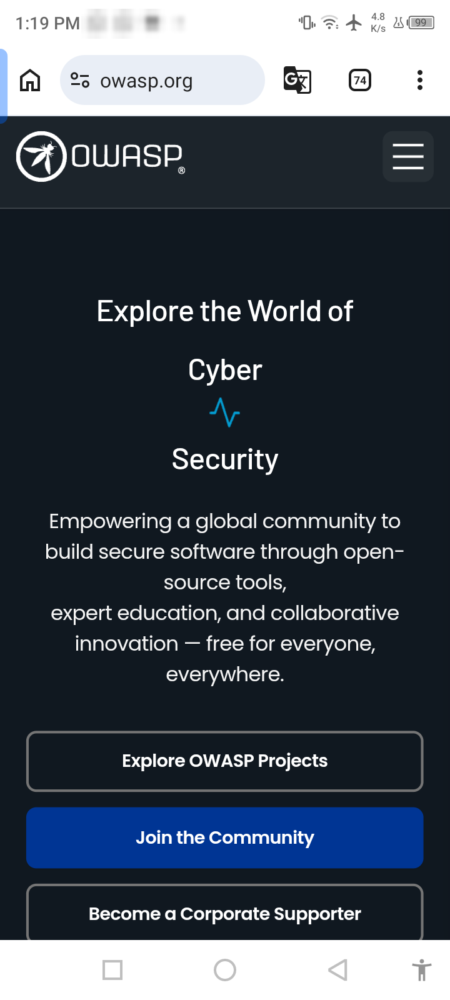<br>
  <em>Build 3 — Phone on the same WiFi in airplane mode. The website opened (taken before the fault)</em>
</p>

| Check | Result |
|---|---|
| Phone connection | WiFi only (airplane and WiFi icons in the status bar) |
| Website on the phone | Opened (owasp.org) |
| Phone gateway check | **Not done.** Described, not tested |
| Phone tested again during the fault | **No** |
| Priority | P2 (High) |

---

<a id="outage-layers"></a>
## 🗺️ Where the Outage Can Sit


- "Connected to WiFi" only means the WiFi link is up. It does not show which box is broken.
- The next module tests the boxes in order, from the cheapest check to the biggest.

---

<a id="module-3"></a>
## 🟢 Module 3 — Diagnostics & Root Cause

**Objective:** Prove where the fault is and why, using evidence from the laptop.

### Step 5 — Create the fault on purpose ✅

For this lab I set a manual address with a wrong gateway. The address is the one the laptop already had. The gateway `192.168.100.254` is a made-up address where no device exists. The real router is `192.168.100.1`.

```cmd
netsh interface ip set address name="Wi-Fi" static 192.168.100.38 255.255.255.0 192.168.100.254
ipconfig /all
netsh interface ip show config name="Wi-Fi"
```

<p align="center">
  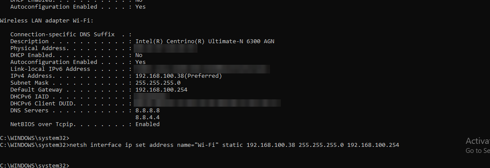<br>
  <em>Exhibit 1 — The fault command. The ipconfig output above the command was captured earlier and already showed the fault, so this capture shows the command being entered again</em>
</p>

<p align="center">
  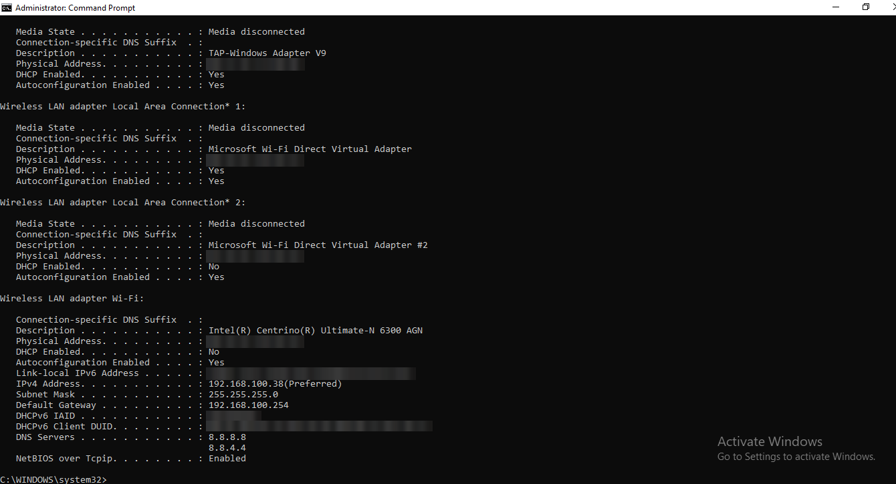<br>
  <em>Exhibit 2 — Fault applied: DHCP is off and the gateway is the made-up address</em>
</p>

<p align="center">
  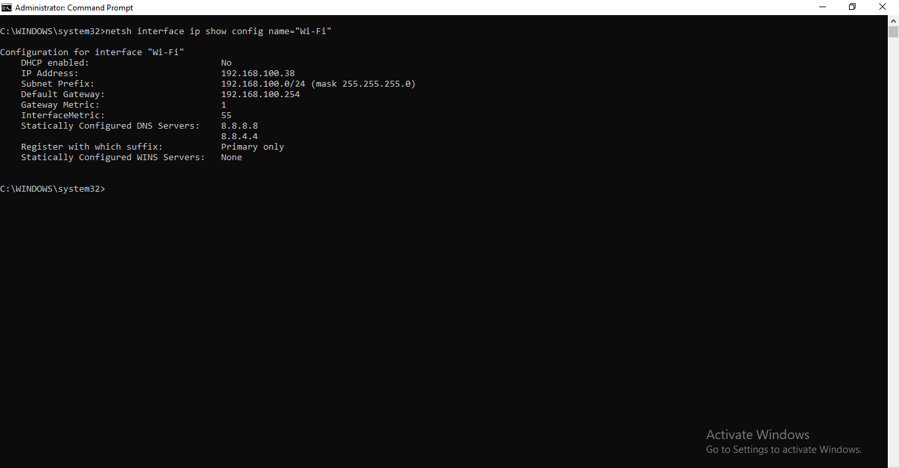<br>
  <em>Exhibit 3 — The same fault seen with <code>netsh</code>. The DNS servers did not change</em>
</p>

| Check | Result |
|---|---|
| Command error | None |
| DHCP Enabled | No |
| IPv4 address | `192.168.100.38` |
| Default gateway | `192.168.100.254` |
| Gateway Metric | 1 (it was 0 in the baseline) |
| DNS servers | Did not change (`8.8.8.8`, `8.8.4.4`) |

### Step 6 — Check the symptoms (before fixing) ✅

<p align="center">
  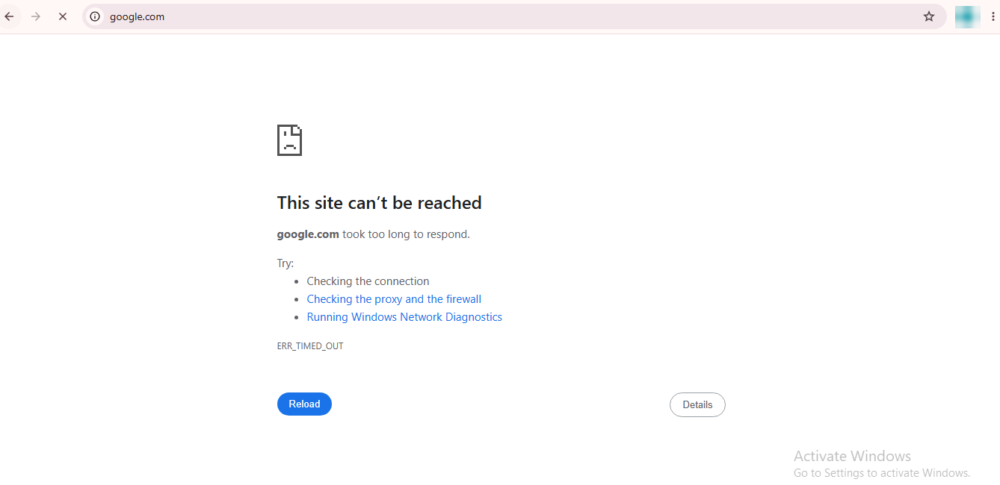<br>
  <em>Exhibit 4 — Browser error with the fault on (profile picture blurred)</em>
</p>

```cmd
ping 8.8.8.8
```

<p align="center">
  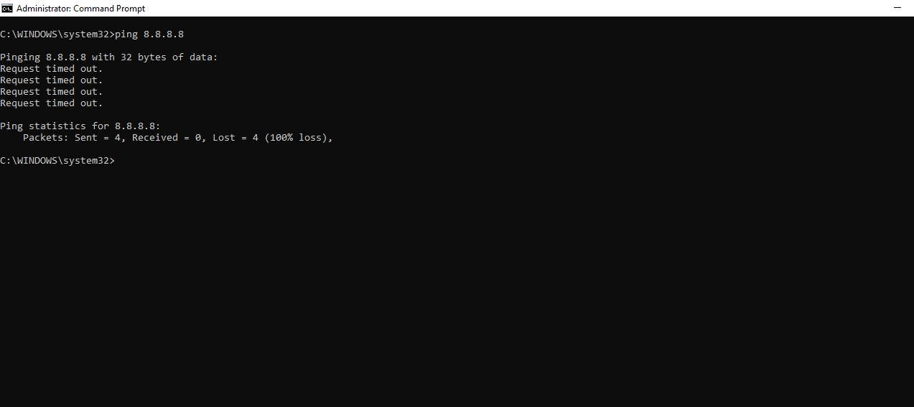<br>
  <em>Exhibit 5 — Ping to the internet fails</em>
</p>

| Check | Result |
|---|---|
| Browser (google.com) | "This site can't be reached", `ERR_TIMED_OUT` |
| `ping 8.8.8.8` | 4 sent, 0 received, 100% loss |
| Note | The browser error was a timeout, not a name error. I did not test why |

### Step 7 — Test layer by layer (cheapest check first) ✅

```cmd
ping 192.168.100.254
ping 192.168.100.1
ping 8.8.8.8
```

<p align="center">
  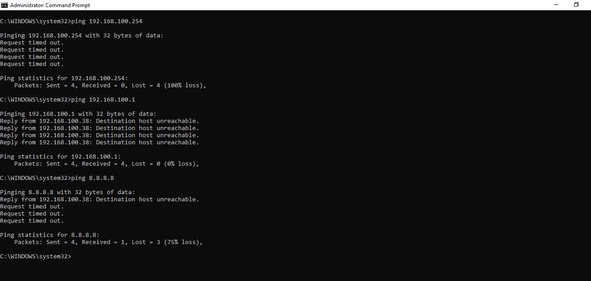<br>
  <em>Exhibit 6 — Pings to the configured gateway, the real router and the internet</em>
</p>

I ran `ping 192.168.100.1` a second time, because the result was not what I expected.

<p align="center">
  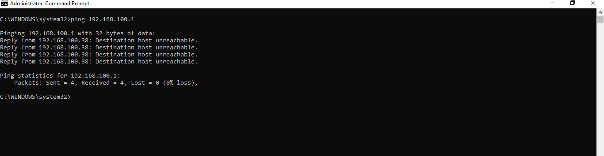<br>
  <em>Exhibit 7 — Second ping to the real router. The result repeated</em>
</p>

| Test | Expected (my plan) | What really happened |
|---|---|---|
| `ping 192.168.100.254` (configured gateway) | Fails | **Failed.** 4 timeouts, 100% loss |
| `ping 192.168.100.1` (real router) | Works | **Did not work.** All 4 replies were "Destination host unreachable", sent from my own laptop address `192.168.100.38`. Windows still showed "4 received, 0% loss" because it counts these replies. The router did not answer. The second ping gave the same result |
| `ping 8.8.8.8` (internet) | Fails | **Failed.** 1 "Destination host unreachable" reply from my own address, then 3 timeouts (1 received, 75% loss) |

> [!IMPORTANT]
> I planned that the real router would still answer, because it is on the same subnet. It did not, and I did not find out why. So I do **not** claim that "the laptop can reach the router" during the fault.

### Step 8 — Read the route table ✅

```cmd
route print -4
```

<p align="center">
  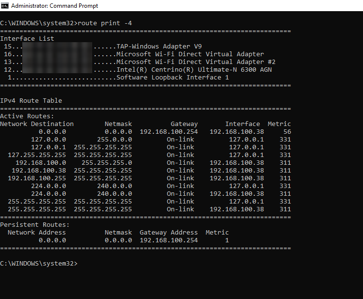<br>
  <em>Exhibit 8 — The default route (<code>0.0.0.0</code>) uses the made-up gateway (interface list blurred)</em>
</p>

| Check | Result |
|---|---|
| `0.0.0.0` line | Gateway `192.168.100.254`, interface `192.168.100.38`, metric 56 |
| `192.168.100.0` line | On-link, metric 311 |
| Persistent Routes | One route: `0.0.0.0` to `192.168.100.254`, metric 1 |

### Step 9 — Compare with the known router ✅

| Gateway | Value | Source |
|---|---|---|
| Baseline (known router) | `192.168.100.1` | Build 1 |
| Laptop during the fault | `192.168.100.254` | Exhibit 2 and Exhibit 8 |
| Phone | Not checked | Described, not tested |

The laptop gateway during the fault is different from the known router.

🎯 **Result:** The default route points to a gateway where no device answered, and websites and the internet ping failed.

### 🎯 Root Cause

The default gateway was set to an address with no device (`192.168.100.254`).

> [!IMPORTANT]
> I set this on purpose with `netsh`. Evidence: the default route in `route print` used `192.168.100.254`, a ping to it got no reply, and `ping 8.8.8.8` and the browser failed. The real router also did not answer pings during the fault, and I did not find out why.

### 🔍 Analyst Note — Gateway and DHCP Server Must Match the Known Router

A different gateway or DHCP server than the known router can mean a wrong manual setting, or a different network such as a rogue one.

**What I compared:**
- The laptop gateway during the fault (`192.168.100.254`) against the baseline gateway (`192.168.100.1`). They are different, and I know why: I typed it.
- After the first renew, the gateway and DHCP server were `172.24.53.243`, which does not match the router. That was my own phone's network (see Step 10).
- After the final fix, the gateway and DHCP server were both `192.168.100.1`, the same as the baseline.

**What I did not compare:**
- The phone's gateway.
- The router's own settings. I did not log in to the router, so I did not do a real rogue access point check.

---

<a id="module-4"></a>
## 🟠 Module 4 — Resolution & Verification

**Objective:** Fix the cause first, then prove it works with a real tool.

### Step 10 — Put the adapter back on automatic ✅

```cmd
netsh interface ip set address name="Wi-Fi" dhcp
ipconfig /release
ipconfig /renew
ipconfig /all
```

I fixed one thing: the adapter is back on DHCP. I only have a camera photo of the `/release` output, so it is not used here.

After `/renew`, the laptop was connected to **my phone's network**, not to the router WiFi. I did not test why.

<p align="center">
  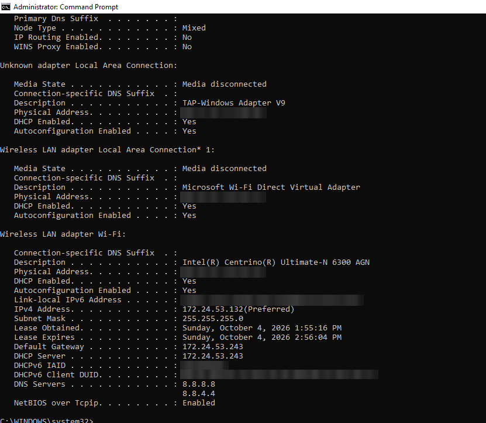<br>
  <em>Exhibit 9 — After the first renew: DHCP is on, but the address, gateway and DHCP server belong to a different network</em>
</p>

| Check | Result |
|---|---|
| DHCP Enabled | Yes |
| IPv4 address | `172.24.53.132` |
| Default gateway | `172.24.53.243` |
| DHCP server | `172.24.53.243` |
| Lease | About 1 hour (1:55:16 PM to 2:56:04 PM) |
| Meaning | The manual settings were gone, but this is **not** the router result I expected |

Then I reconnected the laptop to the router WiFi.

<p align="center">
  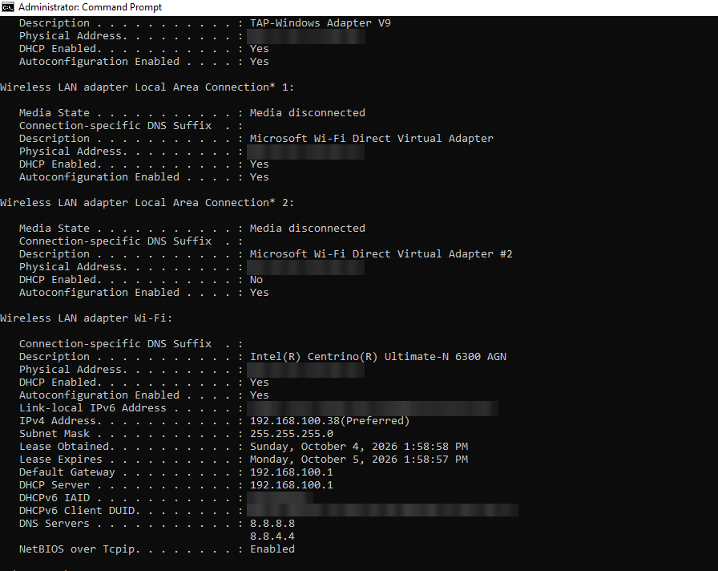<br>
  <em>Exhibit 10 — After reconnecting to the router WiFi: the address and gateway are back to normal</em>
</p>

| Check | Result |
|---|---|
| DHCP Enabled | Yes |
| IPv4 address | `192.168.100.38` |
| Default gateway | `192.168.100.1` |
| DHCP server | `192.168.100.1` |
| Lease | About 24 hours (1:58:58 PM to 1:58:57 PM the next day) |
| DNS servers | `8.8.8.8` and `8.8.4.4` |

> [!WARNING]
> Typing a gateway by hand to "make it work" would only be a workaround. Automatic (DHCP) settings take the gateway from the router, so the laptop follows the router if it ever changes.

### Step 11 — Verify with real checks ✅

```cmd
ping 192.168.100.1
ping 8.8.8.8
nslookup google.com
ipconfig /flushdns
```

<p align="center">
  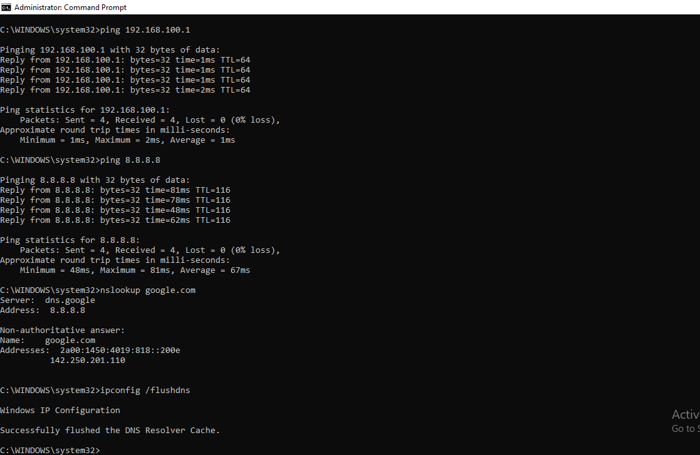<br>
  <em>Exhibit 11 — Pings, DNS lookup and DNS cache flush after the fix</em>
</p>

<p align="center">
  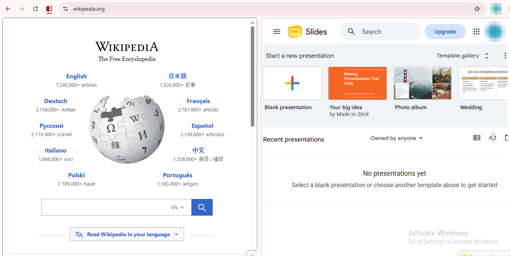<br>
  <em>Exhibit 12 — A website and the Google Slides home page (profile pictures blurred)</em>
</p>

<p align="center">
  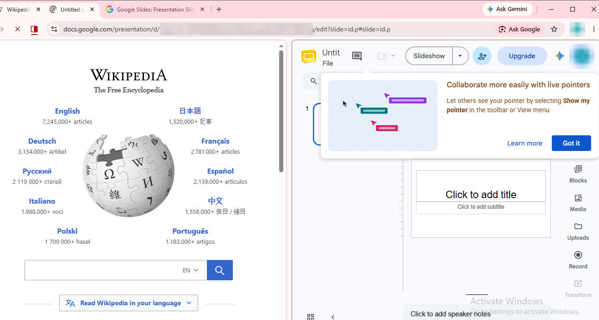<br>
  <em>Exhibit 13 — A blank Google Slides presentation. This is a blank test file, not a real client presentation. The page was still loading in this capture (profile pictures and document link blurred)</em>
</p>

| Verification | Result |
|---|---|
| `ping 192.168.100.1` | 4 sent, 4 received, real replies from `192.168.100.1` ✅ |
| `ping 8.8.8.8` | 4 sent, 4 received ✅ |
| `nslookup google.com` | Answer came from `dns.google` (`8.8.8.8`) ✅ |
| `ipconfig /flushdns` | "Successfully flushed". I ran it after `nslookup`, so the cache was not cleared before the lookup |
| Website (wikipedia.org) | Opened ✅ |
| Google Slides | Home page opened, and a blank presentation opened in the editor ✅ |
| Real client presentation | Not tested |

### Step 12 — Cleanup check ✅

```cmd
netsh interface ip show config name="Wi-Fi"
route print -4
```

<p align="center">
  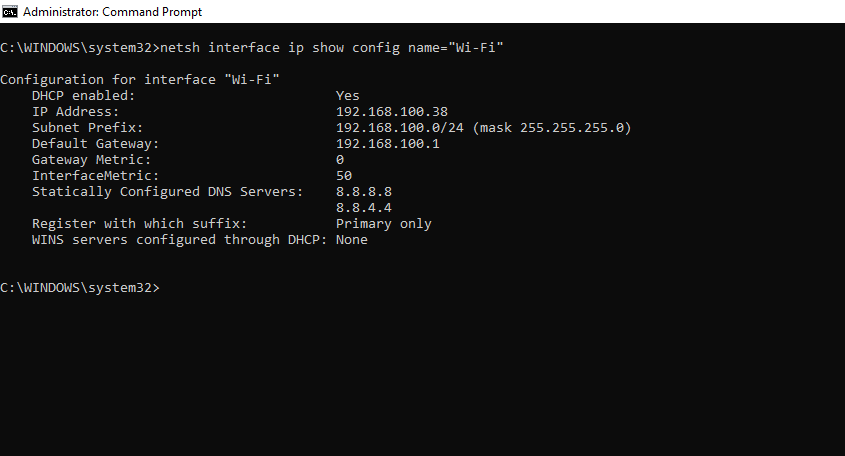<br>
  <em>Exhibit 14 — Settings after the fix, to compare with Build 2</em>
</p>

<p align="center">
  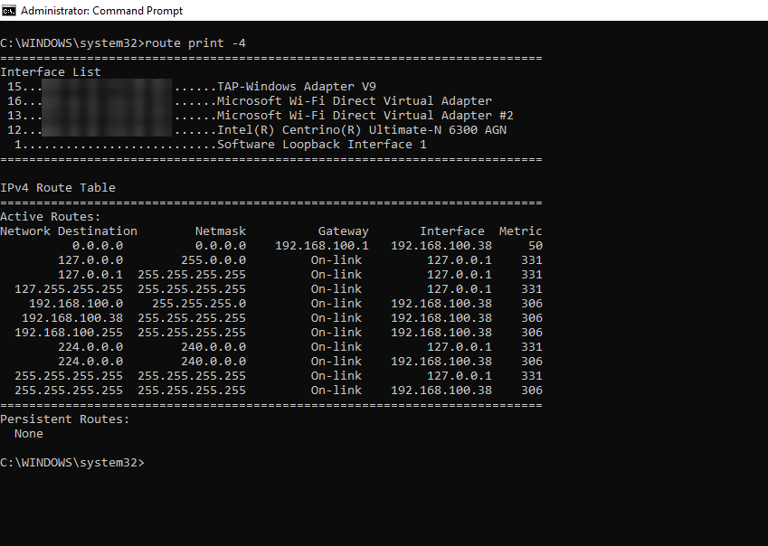<br>
  <em>Exhibit 15 — Route table after the fix (interface list blurred)</em>
</p>

| Check | Step 2 (before) | Step 12 (after) |
|---|---|---|
| DHCP enabled | Yes | Yes |
| IP address | `192.168.100.38` | `192.168.100.38` |
| Default gateway | `192.168.100.1` | `192.168.100.1` |
| Gateway Metric | 0 | 0 |
| InterfaceMetric | 55 | **50** (different, I did not test why) |
| DNS servers | `8.8.8.8`, `8.8.4.4` | `8.8.8.8`, `8.8.4.4` (same) |
| Persistent routes | Not checked before the fault | None |
| Default route (`0.0.0.0`) | Not checked before the fault | Gateway `192.168.100.1`, metric 50 |

No manual address is left over. The persistent route to `192.168.100.254` that was there during the fault is gone. I did not delete it separately. I only ran the `netsh ... dhcp` command.

🎯 **Result:** The laptop works through the router again, and its settings match the baseline except InterfaceMetric.

---

<a id="module-5"></a>
## 🟣 Module 5 — Customer Communication

**Objective:** Keep an urgent customer informed without claiming things I did not test.

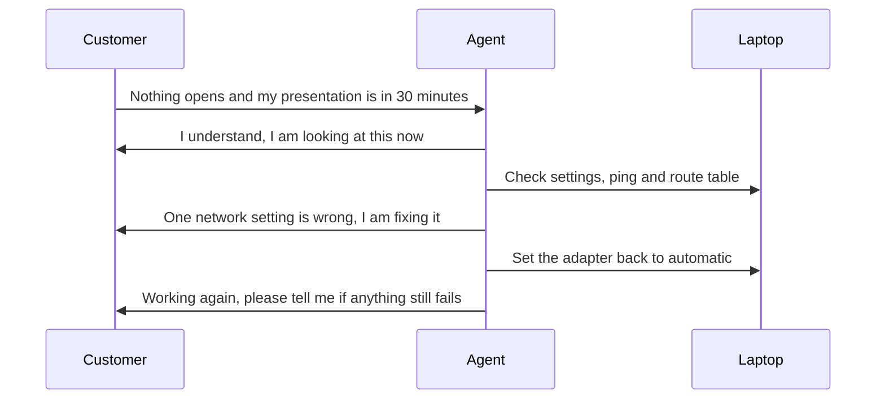

- **Acknowledge:** "Hi Hamza, thanks for letting us know. I understand you have a client presentation in 30 minutes, so I am looking at this now. Please keep your laptop on and do not change any network settings while I check."
- **Update:** "A quick update. Your laptop is connected to WiFi, but one of its network settings (the gateway) points to an address where no device answered. I am setting it back to automatic. Please do not change any network settings until I tell you it is done."
- **Close:** "Your laptop is working again and its network settings are back to automatic. I checked that the router answers, the internet answers, DNS lookup works, a website opens, and Google Slides opens with a blank test file. I did not test your actual client presentation, so please open it and tell me right away if anything does not work. Please do not type manual network settings from 'speed up internet' tips. Contact us first and we will help."

---

<a id="decision-path"></a>
## 🧭 Decision Path

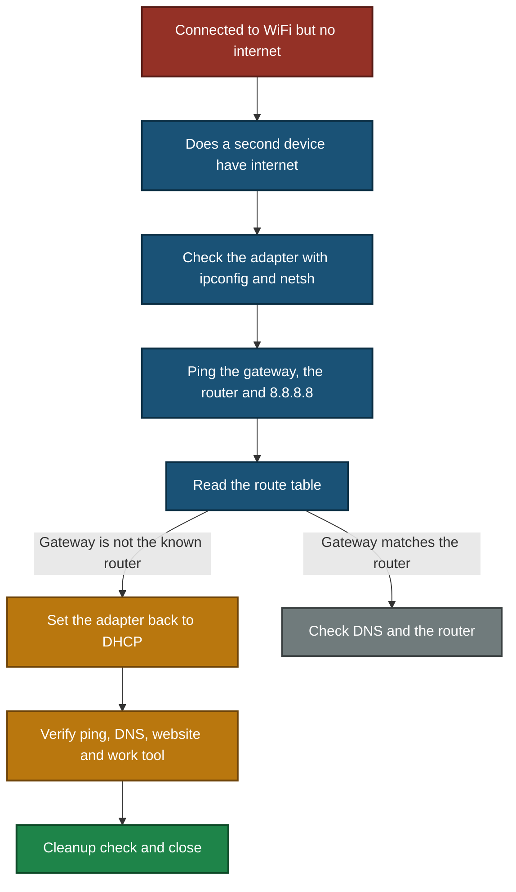

In this lab I followed the path through the gateway check: the gateway did not match the known router, so I set the adapter back to DHCP.

---

<a id="project-summary"></a>
## 📝 Project Summary

| Module | Tooling | Key Finding |
|---|---|---|
| Lab Build / Baseline | `ipconfig`, `netsh`, `ping` | Working laptop with a recorded "before" state |
| Triage & Scope | Ticket fields, phone | One user with a deadline makes this P2, and the phone had internet before the fault |
| Diagnostics & Root Cause | `ping`, `route print` | The default route used a gateway where no device answered |
| Resolution & Verification | `netsh`, `ipconfig`, `nslookup` | Adapter back on DHCP, real checks passed, settings match the baseline except InterfaceMetric |
| Customer Communication | Messages | Acknowledged, updated and closed without claiming untested things |

---

<a id="challenges-fixes"></a>
## ⚠️ Challenges & Fixes

| ❌ Challenge | ✅ Fix |
|---|---|
| The real router did not answer pings during the fault, but I expected it to | Wrote the real result and did not claim a reason (Exhibit 6 and 7) |
| Windows showed "4 received, 0% loss" for replies that were "Destination host unreachable" | Read each reply line, not only the summary, and noted the replies came from my own address |
| The first renew put the laptop on my phone's network | Reconnected to the router WiFi and ran `ipconfig /all` again. Both results are shown (Exhibit 9 and 10) |
| The laptop had no internet during the fault | Took screenshots on the laptop and moved them afterwards |
| Early captures were camera photos with private data and room background | Used real screenshots and blurred private values |
| My first phone screenshot did not clearly show that mobile data was off | Used airplane mode with WiFi on, then took a new screenshot |
| `ipconfig /release` output was only a camera photo | Did not use it as evidence and said so in Step 10 |

---

<a id="scope-limitations"></a>
## 🚧 Scope & Limitations

- **One ticket:** The simulation covers a single wrong-gateway fault.
- **Failure was set up on purpose.** The fault was created by hand with `netsh`. It is **not** a real router or DHCP problem.
- **One laptop and one phone only.**
- **Not tested:** a real DHCP failure, a real rogue network check on the router, WiFi signal strength problems, and a real client presentation.
- **Phone:** the phone check was done **before** the fault was created and was not repeated during the fault. I did not check the phone's gateway (described, not tested).
- **Things that did not behave as expected:**
  - The real router did not answer pings during the fault, and I do not know why.
  - After the first renew, the laptop joined my phone's network, and I do not know why.
  - InterfaceMetric was 55 before and 50 after, and I do not know why.
  - The browser error was a timeout, not a name error, and I did not test why.
- **Google Slides** was a blank test file, not a real presentation.
- **No baseline route table** was captured, so persistent routes cannot be compared with a "before" state.
- **Not a real office network.** One home router, one laptop and one phone.

---

<a id="what-i-learned"></a>
## 🧠 What I Learned

- **Read every ping reply.** A summary can say "received" even when the replies are "Destination host unreachable".
- **Test your expectation.** I expected the router to answer. It did not, so I wrote what really happened.
- **The route table shows the real gateway.** A wrong gateway looks like "WiFi connected, no internet".
- **Save the settings first.** That made the cleanup check possible.
- **Check again after the fix.** My first fix result was a different network, not the router.
- **Do not claim a cause that was not proven.**
- **Do not claim what was not tested.** The closing message says the real presentation was not tested.
- **Use the phone as a second device.** It shows if the problem is only on one laptop, but it must be checked at the right time.

---

<a id="skills-demonstrated"></a>
## 🛠️ Skills Demonstrated

- Setting ticket priority from impact and a deadline
- Windows network checks with `ipconfig`, `netsh`, `ping`, `route print`, `nslookup`
- Layer-by-layer troubleshooting, cheapest check first
- Reading real results and writing them honestly, including surprises
- Fixing one thing at a time and verifying afterwards
- Cleanup check against a saved baseline
- Writing customer messages that do not claim untested things
- Hiding private data in evidence
- Documenting limits honestly, including what was not tested

---

<a id="screenshot-index"></a>
## 🖼️ Screenshot Index

| # | File | Shows |
|:---:|---|---|
| 1 | `Build1_baseline_ipconfig_pings.png` | Baseline ipconfig and two pings |
| 2 | `Build2_baseline_settings.png` | Settings before the change |
| 3 | `Build3_phone_wifi_only.png` | Phone on WiFi only, website open (before the fault) |
| 4 | `Exhibit1_fault_command.png` | The fault command |
| 5 | `Exhibit2_fault_ipconfig.png` | ipconfig with the fault |
| 6 | `Exhibit3_fault_settings.png` | `netsh` settings with the fault |
| 7 | `Exhibit4_browser_error.png` | Browser error `ERR_TIMED_OUT` |
| 8 | `Exhibit5_ping_internet_fails.png` | Ping to 8.8.8.8 fails |
| 9 | `Exhibit6_layer_pings.png` | Three layer pings |
| 10 | `Exhibit7_ping_router_again.png` | Second ping to the router |
| 11 | `Exhibit8_fault_route_print.png` | Route table with the fault |
| 12 | `Exhibit9_after_renew_other_network.png` | ipconfig after the first renew (phone network) |
| 13 | `Exhibit10_fixed_ipconfig.png` | ipconfig after reconnecting to the router WiFi |
| 14 | `Exhibit11_verify_pings_nslookup.png` | Pings, nslookup and flushdns after the fix |
| 15 | `Exhibit12_website_slides_home.png` | Website and Google Slides home |
| 16 | `Exhibit13_slides_blank.png` | Blank Google Slides test file |
| 17 | `Exhibit14_cleanup_settings.png` | Settings after the fix |
| 18 | `Exhibit15_cleanup_route_print.png` | Route table after the fix |

---

<a id="repo-structure"></a>
## 📁 Repo Structure

```text
Customer-Tech-Support-Portfolio/
|-- 01-Video-knowledge-base/
|   `-- 01.5-WiFi-Connectivity.md
|-- 02-Ticket-simulations/
|   |-- 02.5-WiFi-Ticket.md
|   `-- screenshots/
|       |-- Build1_baseline_ipconfig_pings.png
|       |-- Build2_baseline_settings.png
|       |-- Build3_phone_wifi_only.png
|       |-- Exhibit1_fault_command.png
|       |-- Exhibit2_fault_ipconfig.png
|       |-- Exhibit3_fault_settings.png
|       |-- Exhibit4_browser_error.png
|       |-- Exhibit5_ping_internet_fails.png
|       |-- Exhibit6_layer_pings.png
|       |-- Exhibit7_ping_router_again.png
|       |-- Exhibit8_fault_route_print.png
|       |-- Exhibit9_after_renew_other_network.png
|       |-- Exhibit10_fixed_ipconfig.png
|       |-- Exhibit11_verify_pings_nslookup.png
|       |-- Exhibit12_website_slides_home.png
|       |-- Exhibit13_slides_blank.png
|       |-- Exhibit14_cleanup_settings.png
|       `-- Exhibit15_cleanup_route_print.png
|-- 03-Troubleshooting-flowcharts/
|-- 04-Solution-guides/
`-- 05-Escalation-scripts/
```

<div align="center">

🪟 **[Windows Commands](https://learn.microsoft.com/windows-server/administration/windows-commands/windows-commands)** · 🛠️ **[Troubleshooting Flow](#decision-path)**

</div>
