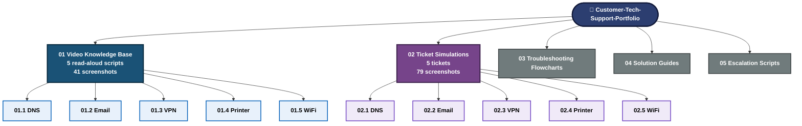
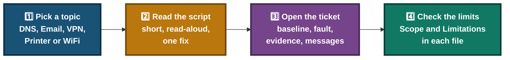
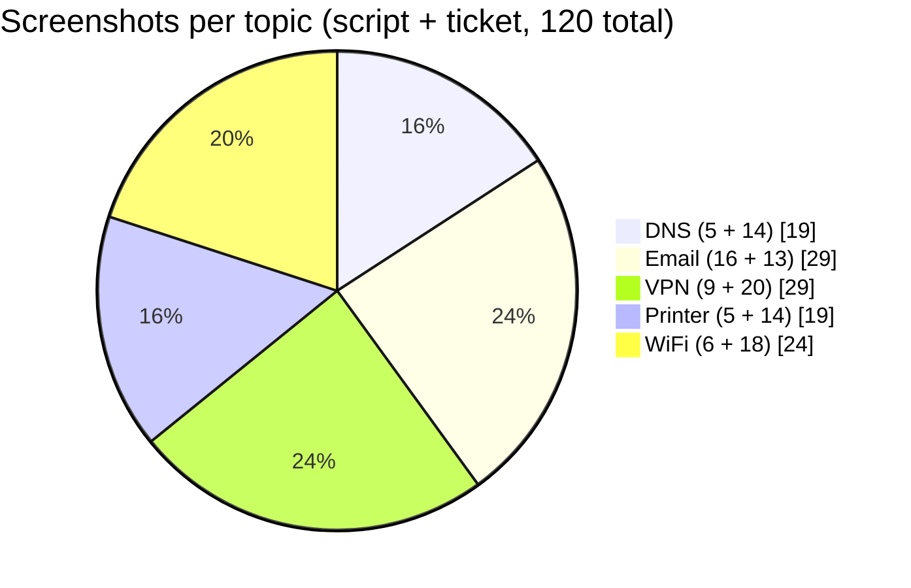

# 🗂️ Customer Tech Support Portfolio — Visual Index

**One map of the portfolio · 5 topics · 5 scripts · 5 tickets**

Each support topic appears twice: first as a short read-aloud video script, then as a full ticket simulation with screenshots.

---

## 📑 Table of Contents

1. [At a Glance](#at-a-glance)
2. [Portfolio Map](#portfolio-map)
3. [Topic Map — Script to Ticket](#topic-map)
4. [How to Read This Portfolio](#how-to-read)
5. [Evidence Volume](#evidence)
6. [Full Index Table](#index-table)
7. [Folder Links](#folder-links)

---

## 📊 At a Glance

| 🎥 Video Scripts | 🎫 Tickets | 🖼️ Script Screenshots | 🖼️ Ticket Screenshots | 🖼️ Total |
|:---:|:---:|:---:|:---:|:---:|
| **5** | **5** | **41** | **79** | **120** |

---

## 🧭 Portfolio Map

> Folders 01 and 02 are detailed here. Folders 03, 04 and 05 are shown by name only. Open them for their own contents.

---

## 🔀 Topic Map — Script to Ticket

Each topic has a short script first and a full ticket second. The ticket uses a different cause from the script.

```mermaid
flowchart LR
    subgraph DNS["🌐 DNS"]
        direction LR
        D1["01.1 Script<br>wrong DNS servers<br>on one PC"]:::s --> D2["02.1 Ticket · P1<br>DNS service stopped<br>on a server"]:::t
    end
    subgraph EML["✉️ Email"]
        direction LR
        E1["01.2 Script<br>cannot send<br>port 25, no auth"]:::s --> E2["02.2 Ticket · P2<br>cannot receive<br>wrong incoming name"]:::t
    end
    subgraph VPN["🔒 VPN"]
        direction LR
        V1["01.3 Script<br>authentication failed<br>locked account"]:::s --> V2["02.3 Ticket · P2<br>stuck on Connecting<br>wrong laptop date"]:::t
    end
    subgraph PRN["🖨️ Printer"]
        direction LR
        P1["01.4 Script<br>printer shows Error<br>port to a dead address"]:::s --> P2["02.4 Ticket · P2<br>port 9100 not reachable<br>listener stopped"]:::t
    end
    subgraph WIF["📶 WiFi"]
        direction LR
        W1["01.5 Script<br>169.254.x.x address<br>set by hand"]:::s --> W2["02.5 Ticket · P2<br>manual address,<br>wrong gateway"]:::t
    end
    DNS ~~~ EML
    EML ~~~ VPN
    VPN ~~~ PRN
    PRN ~~~ WIF

    classDef s fill:#e8f1fb,stroke:#005EB8,stroke-width:2px,color:#000
    classDef t fill:#f0eaf8,stroke:#6f42c1,stroke-width:2px,color:#000
```

---

## 🧭 How to Read This Portfolio

- **Scripts** are short and made to be read aloud during a screen recording.
- **Tickets** are full cases with a ticket record, triage, diagnostics, root cause, fix, verification and three customer messages.
- Every file lists what was tested and what is "described, not tested". Failed attempts and open questions are written down, not hidden.

---

## 🖼️ Evidence Volume

---

## 📂 Full Index Table

| Topic | Script | Shots | Ticket | Priority | Shots | Checks |
|---|---|:---:|---|:---:|:---:|:---:|
| 🌐 DNS | [01.1 DNS Resolution Issue](./01-Video-knowledge-base/01.1-DNS-Resolution-Issue.md) | 5 | [02.1 TKT-2026-001](./02-Ticket-simulations/02.1-DNS-Ticket.md) | P1 | 14 | 8 |
| ✉️ Email | [01.2 Email Sending Failure](./01-Video-knowledge-base/01.2-Email-Sending-Failure.md) | 16 | [02.2 TKT-2026-002](./02-Ticket-simulations/02.2-Email-Ticket.md) | P2 | 13 | 8 |
| 🔒 VPN | [01.3 VPN Connection Failed](./01-Video-knowledge-base/01.3-VPN-Connection-Failed.md) | 9 | [02.3 TKT-2026-003](./02-Ticket-simulations/02.3-VPN-Ticket.md) | P2 | 20 | 8 |
| 🖨️ Printer | [01.4 Printer Offline](./01-Video-knowledge-base/01.4-Printer-Offline.md) | 5 | [02.4 TKT-2026-004](./02-Ticket-simulations/02.4-Printer-Ticket.md) | P2 | 14 | 6 |
| 📶 WiFi | [01.5 WiFi Connectivity](./01-Video-knowledge-base/01.5-WiFi-Connectivity.md) | 6 | [02.5 TKT-2026-005](./02-Ticket-simulations/02.5-WiFi-Ticket.md) | P2 | 18 | 8 |
| **Total** | **5 scripts** | **41** | **5 tickets** | | **79** | **38** |

---

## 📁 Folder Links

| Folder | Link |
|---|---|
| 01 Video Knowledge Base | [📂 Open](./01-Video-knowledge-base/README.md) |
| 02 Ticket Simulations | [📂 Open](./02-Ticket-simulations/README.md) |
| 03 Troubleshooting Flowcharts | [📂 Open](./03-Troubleshooting-flowcharts/) |
| 04 Solution Guides | [📂 Open](./04-Solution-guides/) |
| 05 Escalation Scripts | [📂 Open](./05-Escalation-scripts/) |

🪟 **[Windows Commands](https://learn.microsoft.com/windows-server/administration/windows-commands/windows-commands)** · ☁️ **[DNS Basics](https://www.cloudflare.com/learning/dns/what-is-dns/)**

[⬅️ Back to Portfolio Root](./README.md)

