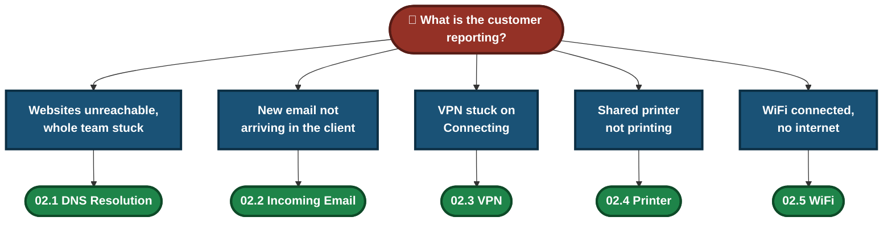
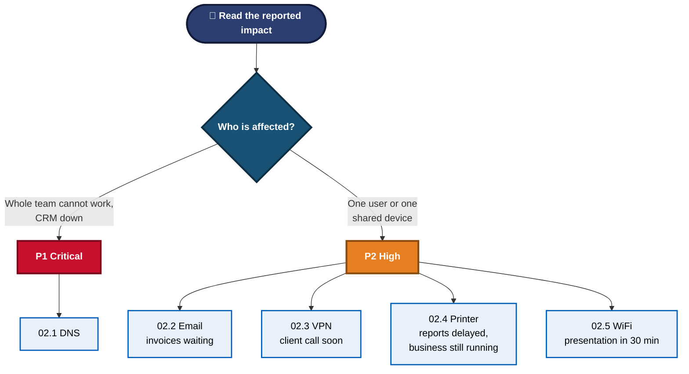
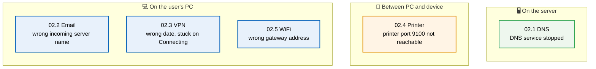
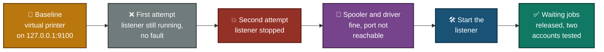
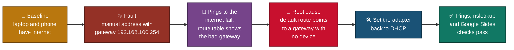
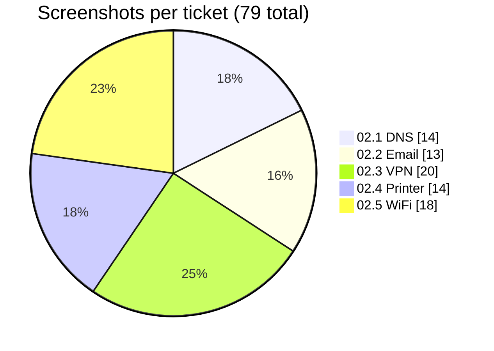

<div align="center">

# 🎫 Ticket Simulations — IT Support Lab Tickets

**5 Tickets · All Complete · Real Faults, Real Evidence, Role-Played Customers**

Each ticket turns one support problem into a full case: ticket record, lab baseline, triage, diagnostics, root cause, fix, verification and customer messages. Every ticket has its own screenshots.


### [📂 Jump to the tickets](#tickets-index)

</div>

---

## 📑 Table of Contents

1. [At a Glance](#at-a-glance)
2. [About This Folder](#about)
3. [Ticket Method Pipeline](#pipeline)
4. [Which Ticket Do I Need?](#which-ticket)
5. [Tickets Index](#tickets-index)
6. [How Priority Was Set](#priority)
7. [Where Each Fault Sat](#fault-map)
8. [Ticket Flowcharts](#ticket-flows)
9. [Evidence Volume](#evidence)
10. [Ticket vs Video Script](#vs-scripts)
11. [What Was Real and What Was Simulated](#honesty)
12. [Scope & Limitations](#scope-limitations)
13. [Repo Structure](#repo-structure)

---

<a id="at-a-glance"></a>
## 📊 At a Glance

| 🎫 Tickets | ✅ Complete | 🖼️ Screenshots | 🔍 Diagnostic Checks | 💬 Customer Messages | 🧩 Modules per Ticket |
|:---:|:---:|:---:|:---:|:---:|:---:|
| **5** | **5** | **79** | **38** | **15** | **5** |

---

<a id="about"></a>
## 📖 About This Folder

This folder holds five ticket simulations. Each one follows the same five modules: Lab Build, Triage & Scope, Diagnostics & Root Cause, Resolution & Verification and Customer Communication. The topics match the five video scripts in folder 01, but each ticket uses its own fault, its own evidence and a priority set from the impact.

> [!NOTE]
> These are simulated tickets. The faults were created on purpose in lab setups, and the customers and their quotes are role-played. Private data in screenshots is hidden with black boxes. Each ticket states what was tested and what is "described, not tested". Ticket 02.3 is marked resolved in the lab, but its cause is not proven.

---

<a id="pipeline"></a>
## 🧭 Ticket Method Pipeline


---

<a id="which-ticket"></a>
## 🧩 Which Ticket Do I Need?



---

<a id="tickets-index"></a>
## 📂 Tickets Index

| # | Ticket | Customer (role-played) | Priority | Date | Screenshots | Checks | Messages | Status |
|:---:|---|---|:---:|:---:|:---:|:---:|:---:|:---:|
| 02.1 | [TKT-2026-001 — DNS Resolution Failure](./02.1-DNS-Ticket.md) | Sarah Khan, Sales, Karachi Office | P1 | 2026-10-03 | 14 | 8 | 3 | ✅ Resolved |
| 02.2 | [TKT-2026-002 — Incoming Email Not Arriving](./02.2-Email-Ticket.md) | Ayesha Malik, Accounts, Lahore Office | P2 | 2026-10-04 | 13 | 8 | 3 | ✅ Resolved |
| 02.3 | [TKT-2026-003 — VPN Stuck on Connecting](./02.3-VPN-Ticket.md) | Zainab Malik, Sales, working from home | P2 | 2026-10-04 | 20 | 8 | 3 | ✅ Resolved in lab (cause not proven) |
| 02.4 | [TKT-2026-004 — Printer Not Printing](./02.4-Printer-Ticket.md) | Finance team member | P2 | 2026-10-04 | 14 | 6 | 3 | ✅ Resolved |
| 02.5 | [TKT-2026-005 — WiFi Connected, No Internet](./02.5-WiFi-Ticket.md) | Hamza Ali, Marketing, Lahore Office | P2 | 2026-10-04 | 18 | 8 | 3 | ✅ Resolved in lab |

---

<a id="priority"></a>
## 🚦 How Priority Was Set



- Only the DNS ticket is P1, because the customer says the whole sales team cannot work.
- The other four are P2: one user or one shared device, with a deadline or delayed work but no whole-team outage.

---

<a id="fault-map"></a>
## 🗺️ Where Each Fault Sat



---

<a id="ticket-flows"></a>
## 🔀 Ticket Flowcharts

How each ticket went from fault to proof. Each chart uses only what the ticket's own screenshots show.

### 02.1 — DNS Resolution Failure

```mermaid
flowchart LR
    A["🔨 Baseline<br>client resolves via<br>172.16.0.4"]:::a --> B["💥 Fault<br>dnsmasq stopped<br>on the server"]:::b --> C["🔎 Ping IP works,<br>name fails"]:::c --> D["🔎 Server pings,<br>DNS query times out"]:::c --> E["🎯 Root cause<br>DNS service<br>inactive"]:::d --> F["🛠 Start the service"]:::e --> G["✅ Client resolves<br>google.com and<br>crm.lab.local"]:::f

    classDef a fill:#B9770E,stroke:#6E4409,stroke-width:2px,color:#FFFFFF
    classDef b fill:#943126,stroke:#571C16,stroke-width:2px,color:#FFFFFF
    classDef c fill:#76448A,stroke:#432752,stroke-width:2px,color:#FFFFFF
    classDef d fill:#C8102E,stroke:#7A0A1C,stroke-width:2px,color:#FFFFFF
    classDef e fill:#1A5276,stroke:#0B2E43,stroke-width:2px,color:#FFFFFF
    classDef f fill:#117864,stroke:#083D33,stroke-width:2px,color:#FFFFFF
```



### 02.2 — Incoming Email Not Arriving


### 02.3 — VPN Stuck on Connecting

```mermaid
flowchart LR
    A["🔨 Baseline<br>internet and VPN<br>both work"]:::a --> B["💥 Attempt A<br>firewall blocks<br>both VPN programs"]:::b --> C["❌ VPN connected<br>anyway, fault did<br>not work"]:::x --> D["💥 Attempt B<br>laptop date set<br>to 2024"]:::b --> E["🔎 VPN stuck on<br>CONNECTING.."]:::c --> F["🛠 Correct the date"]:::e --> G["✅ VPN connects<br>cause not proven"]:::f

    classDef a fill:#B9770E,stroke:#6E4409,stroke-width:2px,color:#FFFFFF
    classDef b fill:#943126,stroke:#571C16,stroke-width:2px,color:#FFFFFF
    classDef x fill:#707B7C,stroke:#3B4142,stroke-width:2px,color:#FFFFFF
    classDef c fill:#76448A,stroke:#432752,stroke-width:2px,color:#FFFFFF
    classDef e fill:#1A5276,stroke:#0B2E43,stroke-width:2px,color:#FFFFFF
    classDef f fill:#117864,stroke:#083D33,stroke-width:2px,color:#FFFFFF
```



### 02.4 — Printer Not Printing



### 02.5 — WiFi Connected, No Internet



---

<a id="evidence"></a>
## 🖼️ Evidence Volume



---

<a id="vs-scripts"></a>
## 🔀 Ticket vs Video Script

The tickets use the same topics as the video scripts, but not the same cause.

| Topic | Video Script (folder 01) | Ticket (folder 02) |
|---|---|---|
| DNS | 01.1 — wrong DNS servers on one PC | 02.1 — DNS service stopped on a server |
| Email | 01.2 — cannot **send** (port 25, no security, no authentication) | 02.2 — cannot **receive** (wrong incoming server name) |
| VPN | 01.3 — "Authentication failed" with the right password (locked account) | 02.3 — VPN stuck on "Connecting" (wrong laptop date) |
| Printer | 01.4 — virtual printer showing "Error", port pointed at an address with no device | 02.4 — printer port `127.0.0.1:9100` not reachable (listener stopped) |
| WiFi | 01.5 — address in the `169.254.x.x` range set by hand | 02.5 — manual address with a wrong gateway |

---

<a id="honesty"></a>
## 🧪 What Was Real and What Was Simulated

| Ticket | How the fault was made | Main limit stated in the ticket |
|---|---|---|
| 02.1 | `dnsmasq` stopped on an Azure VM (Windows client, Ubuntu server) | Reported team scope was role-played, and one client machine was tested |
| 02.2 | Incoming server name changed by hand in Thunderbird | One account on one PC. Sending was not tested. The number of "Invoice test" sends was not recorded |
| 02.3 | Firewall block (did not work), then the laptop date set to 2024 by hand | Free consumer VPN, not a company gateway. **Cause not proven** |
| 02.4 | A PowerShell listener on `127.0.0.1:9100` acts as the printer, then was stopped | The first attempt did not create the fault. One page was lost by my script. Two accounts on one PC |
| 02.5 | Manual address with a made-up gateway entered with `netsh` | The "make internet faster" story cause is role-play, not proven. The phone check was done before the fault |

- **Customers and quotes** are role-played.
- **Anything not done** is marked "described, not tested" inside each ticket.
- **Failed attempts are kept in the tickets** (VPN firewall block, printer first attempt) instead of being hidden.

---

<a id="scope-limitations"></a>
## 🚧 Scope & Limitations

- **Simulated tickets:** Each one is a role-played case, not a real customer ticket.
- **One fault per ticket:** Other causes of the same symptom are not covered.
- **Small labs:** One PC or one client machine per ticket, plus one phone or a second account in some. No real office networks.
- **Cause not proven in 02.3:** The ticket says what the screenshots show and nothing more.
- **Not a company runbook:** Real workplaces need their own priority rules, escalation paths and identity checks.

These limits are stated here so the tickets are read as demonstrations, not as guaranteed fixes.

---

<a id="repo-structure"></a>
## 📁 Repo Structure

```text
02-Ticket-simulations/
|-- README.md                  (this index)
|-- 02.1-DNS-Ticket.md
|-- 02.2-Email-Ticket.md
|-- 02.3-VPN-Ticket.md
|-- 02.4-Printer-Ticket.md
|-- 02.5-WiFi-Ticket.md
`-- screenshots/               (79 files, names are unique across the 5 tickets)
```

<div align="center">

🎥 **[Video Knowledge Base (folder 01)](../01-Video-knowledge-base/README.md)** · 🪟 **[Windows Commands](https://learn.microsoft.com/windows-server/administration/windows-commands/windows-commands)**

[⬅️ Back to Portfolio Root](../README.md)

</div>
