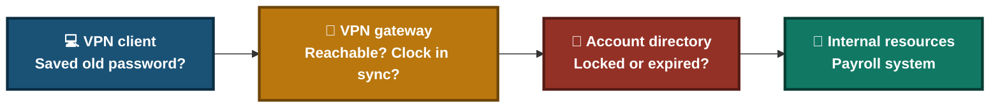
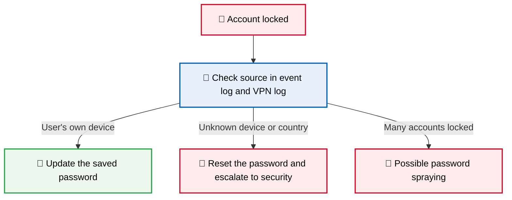
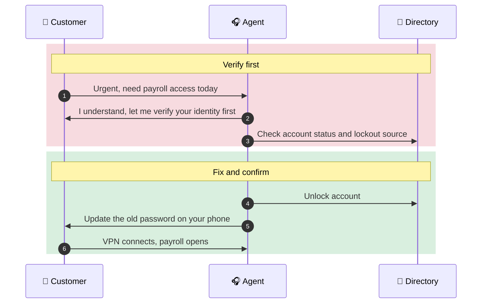
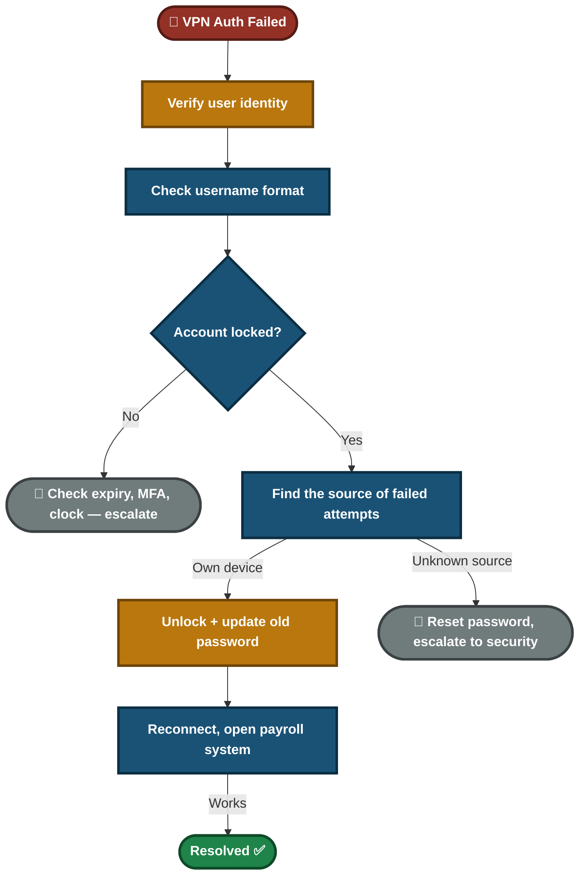

<div align="center">

# 🎫 Ticket Simulation — VPN Authentication Failed (TKT-2026-003)

**Lab — IT Support Ticketing**

Ticket Triage · Identity Verification · Account Lockout · Customer Communication


A remote HR user cannot connect to the VPN and needs payroll records today. This ticket verifies who is asking before touching the account, unlocks it, proves where the failed attempts came from, and confirms access to the system the user actually needs.

</div>

> [!NOTE]
> Simulated ticket. The customer, quotes and office are role-played. Cells marked ⬜ must be filled with your real lab result before you publish. Remove this note when done.

---

## 📑 Table of Contents

1. [At a Glance](#at-a-glance)
2. [Ticket Record](#ticket-record)
3. [Project Background](#project-background)
4. [Environment](#environment)
5. [Ticket Flow](#ticket-flow)
6. [Module 1 — Triage & Identity Verification](#module-1)
7. [Where VPN Login Can Break](#vpn-layers)
8. [Module 2 — Diagnostics & Root Cause](#module-2)
9. [Module 3 — Resolution & Verification](#module-3)
10. [Module 4 — Customer Communication](#module-4)
11. [Decision Path](#decision-path)
12. [Project Summary](#project-summary)
13. [Challenges & Fixes](#challenges-fixes)
14. [Scope & Limitations](#scope-limitations)
15. [What I Learned](#what-i-learned)
16. [Skills Demonstrated](#skills-demonstrated)
17. [Screenshot Index](#screenshot-index)
18. [Repo Structure](#repo-structure)

---

<a id="at-a-glance"></a>
## 📊 At a Glance

| 🧩 Modules | 🖼️ Screenshots | 🔍 Diagnostic Checks | 💬 Customer Messages |
|:---:|:---:|:---:|:---:|
| **4** | **6** | **6** | **3** |

---

<a id="ticket-record"></a>
## 🎫 Ticket Record

| Field | Value |
|---|---|
| **Ticket #** | TKT-2026-003 |
| **Date** | 2026-08-26 |
| **Priority** | P2 (High) — one user, deadline today, not an outage |
| **Status** | Resolved ✅ |
| **Category** | VPN / Authentication |
| **Customer** | Zainab Ali, HR, Remote (Dubai) |
| **Impact / Scope** | One user. Access to employee records for payroll |

> *"I can't connect to the office VPN. It says 'Authentication failed' but I'm 100% sure my password is correct. I have to access employee records for payroll processing today."*

---

<a id="project-background"></a>
## 📖 Project Background

"Authentication failed" with a correct password usually means the account is locked, the password is expired, or an old saved password keeps retrying in the background. Unlocking without finding the source means it locks again. Repeated failures can also be an attack, and an urgent request for payroll records from a remote user is a common social-engineering pattern.

- **Module 1 — Triage & Identity Verification:** Set the priority and confirm who is asking before touching the account.
- **Module 2 — Diagnostics & Root Cause:** Find the lockout and prove where the failed attempts came from.
- **Module 3 — Resolution & Verification:** Unlock, fix the source, and test access to the payroll system.
- **Module 4 — Customer Communication:** Handle the deadline without skipping security.

<div align="center">

### 🧩 Lab Setup at a Glance

<table>
<tr>
<td align="center" valign="top" width="30%">


**User's Device**<br>
<sub>"Authentication failed"<br>Remote, Dubai</sub>

</td>
<td align="center" valign="middle" width="5%">

**➜**

</td>
<td align="center" valign="top" width="30%">


**VPN Gateway**<br>
<sub>Checks the login<br>Logs the source</sub>

</td>
<td align="center" valign="middle" width="5%">

**➜**

</td>
<td align="center" valign="top" width="30%">


**Account Directory**<br>
<sub>Lockout policy<br>Account status</sub>

</td>
</tr>
</table>

</div>

---

<a id="environment"></a>
## 🖧 Environment

| Item | Value |
|---|---|
| **Identity System** | Active Directory (Users and Computers or PowerShell) |
| **Remote Access** | VPN client and gateway |
| **Lockout Policy (scenario)** | 3 failed attempts, 15-minute lockout |
| **Log Sources** | Domain controller Security log (Event ID `4740`), VPN gateway log |

---

<a id="ticket-flow"></a>
## ⏱️ Ticket Flow


<p align="center"><em>Colors mark each stage of the ticket.</em></p>

---

<a id="module-1"></a>
## 🔵 Module 1 — Triage & Identity Verification

**Objective:** Set the right priority and make sure the caller is the account owner before changing anything.

### Step 1 — Read the impact ✅

One user, payroll deadline today, not an outage. That is P2 (High). P1 is kept for problems that stop many users.

### Step 2 — Verify the caller's identity ✅

Use the company's verification process before any unlock or reset. Examples: a callback to the number on file, or approval from the user's manager. Remote users asking for HR or payroll access need this most.

| Check | Result |
|---|---|
| Identity verified by | ⬜ Record the method used (for example callback to number on file) |
| Priority | P2 (High) |

> [!IMPORTANT]
> Never unlock or reset an account on an urgent request alone. An attacker who pretends to be the user will sound urgent too.

---

<a id="vpn-layers"></a>
## 🗺️ Where VPN Login Can Break



- **Client side:** Autofill or an old saved password.
- **Gateway side:** Wrong time, blocked connection, or MFA problems.
- **Directory side:** Locked, disabled or expired account.
- In this ticket the fault is on the directory side.

---

<a id="module-2"></a>
## 🟢 Module 2 — Diagnostics & Root Cause

**Objective:** Prove the account is locked and find where the failed attempts came from.

### Step 3 — Check the username format ✅

The username is entered as `domain\zainab.ali`, which is correct.

<p align="center">
  <br>
  <em>Exhibit 1 — "Authentication failed" on sign-in</em>
</p>

### Step 4 — Read the lockout policy ✅

<p align="center">
  <br>
  <em>Exhibit 2 — Lockout policy: threshold and duration</em>
</p>

### Step 5 — Check the account status ✅

<p align="center">
  <br>
  <em>Exhibit 3 — Account shown as locked out</em>
</p>

### Step 6 — Find where the failed attempts came from ✅

Check the domain controller Security log for the lockout event (Event ID `4740`), which names the source computer. Check the VPN gateway log for the source addresses of the failed sign-ins.

<p align="center">
  <br>
  <em>Exhibit 4 — Lockout event showing the source of the failed attempts</em>
</p>

### Step 7 — Check whether the password was recently changed ✅

Compare the time the password was last set with the time of the first failed attempt.

🎯 **Result:** The account is locked, and the source of the failed attempts is known.

| Check | Result |
|---|---|
| Username format | Correct (`domain\zainab.ali`) |
| Account status in AD | Locked ❌ |
| Failed attempts | 5 in the last 15 minutes |
| Lockout policy | ⬜ Record threshold and duration. The 5 attempts may include some made while the account was already locked |
| Source of the failed attempts | ⬜ Record: user's own device or unknown source |
| Password last changed | ⬜ Record |

### 🎯 Root Cause

Repeated failed sign-ins locked the account. The user had recently changed the password, and a saved old password on the phone's VPN app kept retrying.

> [!IMPORTANT]
> Keep the phone explanation only if the lockout event or VPN log shows the attempts came from the user's own device. If the source is unknown, write "account locked by repeated failed sign-ins from an unconfirmed source" and follow the attack path below.

### 🔍 Analyst Note — When It Might Be an Attack



- A remote user in another country makes an unknown foreign source harder to spot. Compare with where the user really is.
- Record the source in the ticket either way.

---

<a id="module-3"></a>
## 🟠 Module 3 — Resolution & Verification

**Objective:** Unlock only after verification, stop the repeat, and prove the user can do the real task.

### Step 8 — Unlock the account ✅

Unlock it in Active Directory after the identity check. The scenario policy would unlock it after 15 minutes on its own. A manual unlock saves the wait, and is done only after Step 2.

<p align="center">
  <br>
  <em>Exhibit 5 — Account unlocked in Active Directory</em>
</p>

### Step 9 — Update the old saved password ✅

The user updates the password on the phone's VPN app and any other device that saved it.

### Step 10 — Reconnect and test the real task ✅

Reconnect to the VPN, then open the payroll system. A connected VPN does not prove payroll access.

<p align="center">
  <br>
  <em>Exhibit 6 — Successful sign-in and access to the payroll system</em>
</p>

### Step 11 — Watch for a repeat ✅

Check again a few minutes later that no new failed attempts appear and the account stays unlocked.

🎯 **Result:** The user connects and reaches payroll, and the old password is gone from the phone.

| Verification | Result |
|---|---|
| Identity verified before unlock | ⬜ Record |
| VPN connection | Established ✅ (IP `10.0.0.45`) |
| Payroll system opens | ⬜ Record |
| No new failed attempts after a few minutes | ⬜ Record |

---

<a id="module-4"></a>
## 🟣 Module 4 — Customer Communication

**Objective:** Help an urgent customer without skipping security.



- **Acknowledge:** "I understand payroll is due today. First I need to verify your identity, then I'll check your account."
- **Update:** "Your account was locked after several failed sign-ins. I'm unlocking it now. Please update your password on your phone's VPN app, or it will lock again."
- **Close:** "You're connected and the payroll system opens. If it locks again, contact me and tell me the time it happened."

---

<a id="decision-path"></a>
## 🧭 Decision Path



---

<a id="project-summary"></a>
## 📝 Project Summary

| Module | Tooling | Key Finding |
|---|---|---|
| Triage & Identity Verification | Ticket fields, company verification process | Payroll request from a remote user is verified before any change |
| Diagnostics & Root Cause | AD console, Security log, VPN log | Account locked, and the source of the failed attempts identified |
| Resolution & Verification | AD console | Unlocked, old password removed, payroll access tested |
| Customer Communication | Communication | Deadline handled without skipping security |

---

<a id="challenges-fixes"></a>
## ⚠️ Challenges & Fixes

| ❌ Challenge | ✅ Fix |
|---|---|
| The account was unlocked without checking who was asking | Added identity verification before any unlock or reset |
| The phone was named as the cause without proof | Checked the lockout event and VPN log for the source |
| Five failed attempts did not match a 3-attempt policy | Compared the log with the policy and noted attempts made while locked |
| A working VPN does not prove payroll access | Opened the payroll system as the final check |
| P1 was set for one user | Set P2 and kept P1 for wide outages |
| The MFA lesson claimed it reduces lockouts | Corrected it: MFA protects against stolen passwords, it does not reduce lockouts |

---

<a id="scope-limitations"></a>
## 🚧 Scope & Limitations

- **One ticket, one user:** The simulation covers a single locked account.
- **Lab evidence:** A VPN gateway and Active Directory are part of the scenario. The screenshots come from a Windows lab with a local account lockout, which uses the same events (`4740`, `4625`).
- **Other causes are not tested:** Expired password, MFA problems, wrong system time and firewall blocks lead to different fixes.
- **Identity verification depends on company policy.** The ticket names examples, not one required method.
- **Simulated customer:** The conversation is role-played.

---

<a id="what-i-learned"></a>
## 🧠 What I Learned

- **Verify before you unlock.** Urgent requests for sensitive data are a social-engineering pattern.
- **Find the source of the lockout.** Otherwise it locks again, or an attack goes unnoticed.
- **Match the log to the policy.** Numbers that do not agree need an explanation.
- **Old saved passwords on other devices** are a frequent cause of repeat lockouts.
- **MFA protects the account, it does not prevent lockouts.** Use it to reduce the risk of stolen passwords.
- **Test the real task.** A connected VPN does not mean the payroll system works.

---

<a id="skills-demonstrated"></a>
## 🛠️ Skills Demonstrated

- Setting ticket priority from business impact
- Verifying a caller's identity before an account change
- Reading lockout events and VPN logs
- Telling an old-password lockout from a possible attack
- Verifying access to the real system, not only the VPN
- Communicating with an urgent customer

---

<a id="screenshot-index"></a>
## 🖼️ Screenshot Index

| # | File | Shows |
|:---:|---|---|
| 1 | `Exhibit1_login_failed.png` | "Authentication failed" on sign-in |
| 2 | `Exhibit2_lockout_policy.png` | Lockout policy threshold and duration |
| 3 | `Exhibit3_account_locked.png` | Account shown as locked out |
| 4 | `Exhibit4_lockout_event_source.png` | Lockout event with the source |
| 5 | `Exhibit5_account_unlocked.png` | Account unlocked |
| 6 | `Exhibit6_login_success.png` | Successful sign-in and payroll access |

---

<a id="repo-structure"></a>
## 📁 Repo Structure

```text
TKT-2026-003-VPN-Authentication-Failed/
|-- README.md
`-- screenshots/
    |-- Exhibit1_login_failed.png
    |-- Exhibit2_lockout_policy.png
    |-- Exhibit3_account_locked.png
    |-- Exhibit4_lockout_event_source.png
    |-- Exhibit5_account_unlocked.png
    `-- Exhibit6_login_success.png
```

<div align="center">

🔐 **[VPN Basics](https://www.cloudflare.com/learning/access-management/what-is-a-vpn/)** · 🏢 **[Active Directory](https://learn.microsoft.com/windows-server/identity/ad-ds/get-started/virtual-dc/active-directory-domain-services-overview)** · 🛠️ **[Troubleshooting Flow](#decision-path)**

</div>
