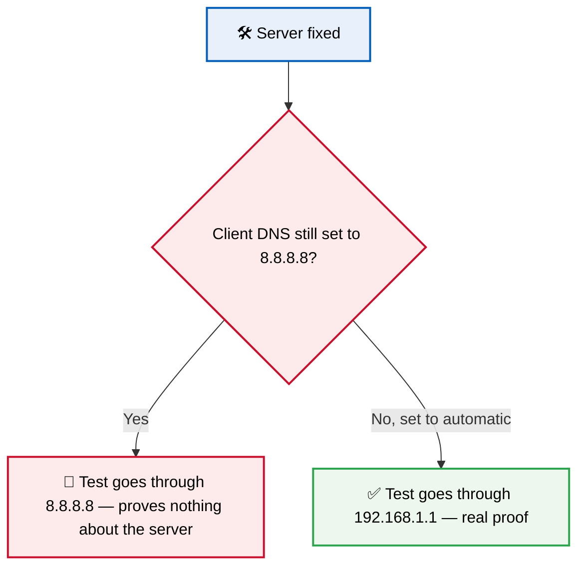
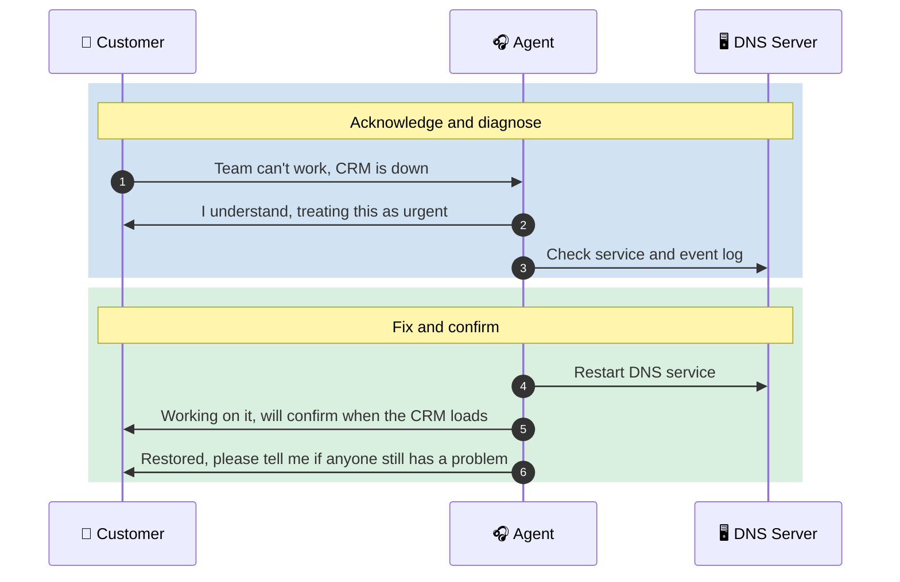
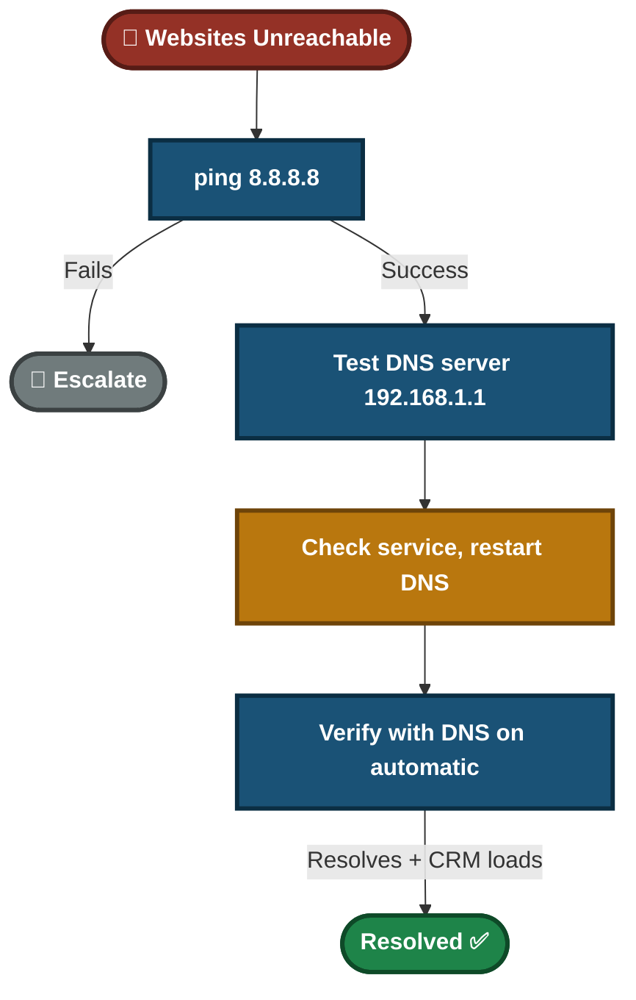

<div align="center">

# 🎫 Ticket Simulation — DNS Resolution Failure (TKT-2026-001)

**Lab — IT Support Ticketing**

Ticket Triage · DNS Diagnostics · Root Cause · Customer Communication


A sales team cannot open any website or the CRM portal. This ticket walks from the first report to a proven root cause on the DNS server, fixes the shared source first, verifies through the real setup, and shows how to keep the customer informed.

</div>

> [!NOTE]
> Simulated ticket. The customer, quotes and office are role-played. Cells marked ⬜ must be filled with your real lab result before you publish. Remove this note when done.

---

## 📑 Table of Contents

1. [At a Glance](#at-a-glance)
2. [Ticket Record](#ticket-record)
3. [Project Background](#project-background)
4. [Environment](#environment)
5. [Ticket Flow](#ticket-flow)
6. [Module 1 — Triage & Scope](#module-1)
7. [Where the Outage Can Sit](#outage-layers)
8. [Module 2 — Diagnostics & Root Cause](#module-2)
9. [Module 3 — Resolution & Verification](#module-3)
10. [Module 4 — Customer Communication](#module-4)
11. [Decision Path](#decision-path)
12. [Project Summary](#project-summary)
13. [Challenges & Fixes](#challenges-fixes)
14. [Scope & Limitations](#scope-limitations)
15. [What I Learned](#what-i-learned)
16. [Skills Demonstrated](#skills-demonstrated)
17. [Screenshot Index](#screenshot-index)
18. [Repo Structure](#repo-structure)

---

<a id="at-a-glance"></a>
## 📊 At a Glance

| 🧩 Modules | 🖼️ Screenshots | 🔍 Diagnostic Checks | 💬 Customer Messages |
|:---:|:---:|:---:|:---:|
| **4** | **7** | **8** | **3** |

---

<a id="ticket-record"></a>
## 🎫 Ticket Record

| Field | Value |
|---|---|
| **Ticket #** | TKT-2026-001 |
| **Date** | 2026-08-26 |
| **Priority** | P1 (Critical) — the whole team cannot work and the CRM is down |
| **Status** | Resolved ✅ |
| **Category** | DNS Resolution |
| **Customer** | Sarah Khan, Sales, Karachi Office |
| **Impact / Scope** | Sales team. Confirm whether other departments are affected ⬜ |

> *"All websites are showing 'Server not found' errors. I can't access our CRM portal or any websites. My team is unable to work."*

---

<a id="project-background"></a>
## 📖 Project Background

When one DNS server fails, every device that uses it loses name resolution at the same time. Fixing laptops one by one is slow and can break internal names. A good ticket proves where the fault is, fixes the shared source, and confirms the real service works.

- **Module 1 — Triage & Scope:** Set the priority from the impact and find out how many users are affected.
- **Module 2 — Diagnostics & Root Cause:** Prove the problem is the DNS server, and why, using the server itself.
- **Module 3 — Resolution & Verification:** Fix the source, undo any workaround, and test through the real setup.
- **Module 4 — Customer Communication:** Acknowledge, update and close with clear messages.

<div align="center">

### 🧩 Lab Setup at a Glance

<table>
<tr>
<td align="center" valign="top" width="30%">


**Customer PC**<br>
<sub>"Server not found"<br>on every website</sub>

</td>
<td align="center" valign="middle" width="5%">

**➜**

</td>
<td align="center" valign="top" width="30%">


**Configured DNS Server**<br>
<sub>DNS Server service<br>on this host</sub>

</td>
<td align="center" valign="middle" width="5%">

**➜**

</td>
<td align="center" valign="top" width="30%">


**Internet**<br>
<sub>Test server: 8.8.8.8</sub>

</td>
</tr>
</table>

</div>

---

<a id="environment"></a>
## 🖧 Environment

| Item | Value |
|---|---|
| **Client OS** | Windows |
| **Shell** | Command Prompt (Run as Administrator) |
| **DNS Server** | `192.168.1.1` (DNS Server service) |
| **Server Tools** | `services.msc`, Event Viewer (DNS Server log) |
| **Client Commands** | `ping`, `nslookup`, `ipconfig /all` |
| **Test DNS Server** | Google Public DNS (`8.8.8.8`) |

---

<a id="ticket-flow"></a>
## ⏱️ Ticket Flow

```mermaid
flowchart LR
    A["🎫 Receive<br/>Read the report"]:::s1 --> B["🚨 Triage<br/>Priority + scope"]:::s2 --> C["🔎 Diagnose<br/>Client, then server"]:::s3 --> D["🛠 Fix<br/>Restart DNS service"]:::s4 --> E["✅ Verify<br/>Real setup + 2nd PC"]:::s5 --> F["📝 Close<br/>Follow-up on cause"]:::s6

    classDef s1 fill:#1A5276,stroke:#0B2E43,stroke-width:3px,color:#FFFFFF,font-weight:bold
    classDef s2 fill:#943126,stroke:#571C16,stroke-width:3px,color:#FFFFFF,font-weight:bold
    classDef s3 fill:#76448A,stroke:#432752,stroke-width:3px,color:#FFFFFF,font-weight:bold
    classDef s4 fill:#B9770E,stroke:#6E4409,stroke-width:3px,color:#FFFFFF,font-weight:bold
    classDef s5 fill:#117864,stroke:#083D33,stroke-width:3px,color:#FFFFFF,font-weight:bold
    classDef s6 fill:#2C3E70,stroke:#131B3A,stroke-width:3px,color:#FFFFFF,font-weight:bold
```


<p align="center"><em>Colors mark each stage of the ticket.</em></p>

---

<a id="module-1"></a>
## 🔵 Module 1 — Triage & Scope

**Objective:** Set the right priority and find out how far the problem reaches.

### Step 1 — Read the impact ✅

The customer says the whole team cannot work and the CRM is down. That is a business-wide impact, so the ticket is P1, not P2.

### Step 2 — Check the scope ✅

Ask whether other devices and users have the same problem.

| Check | Result |
|---|---|
| Other users or devices affected | ⬜ Record: one PC or many |
| Priority | P1 (Critical) |

---

<a id="outage-layers"></a>
## 🗺️ Where the Outage Can Sit


- A client that cannot reach DNS does not show which box is broken.
- The next module tests the boxes in order: client, path, server.

---

<a id="module-2"></a>
## 🟢 Module 2 — Diagnostics & Root Cause

**Objective:** Prove where the fault is and why, using evidence from the server.

### Step 3 — Test connectivity and name resolution ✅

```cmd
ping 8.8.8.8
ping google.com
```

<p align="center">
  <br>
  <em>Exhibit 1 — Ping to <code>8.8.8.8</code> succeeds, ping to <code>google.com</code> fails</em>
</p>

### Step 4 — Read the configured DNS server ✅

```cmd
ipconfig /all
```

<p align="center">
  <br>
  <em>Exhibit 2 — DNS server set to <code>192.168.1.1</code></em>
</p>

### Step 5 — Test the DNS server itself ✅

```cmd
ping 192.168.1.1
nslookup google.com 192.168.1.1
```

<p align="center">
  <br>
  <em>Exhibit 3 — Ping and <code>nslookup</code> against <code>192.168.1.1</code></em>
</p>

### Step 6 — Test a second DNS server ✅

```cmd
nslookup google.com 8.8.8.8
```

If this resolves, internet DNS works and the problem is the internal server.

<p align="center">
  <br>
  <em>Exhibit 4 — <code>nslookup</code> through <code>8.8.8.8</code></em>
</p>

### Step 7 — Check the DNS Server service on the server ✅

Open `services.msc` on the DNS server and read the state of **DNS Server**.

<p align="center">
  <br>
  <em>Exhibit 5 — DNS Server service state in <code>services.msc</code></em>
</p>

### Step 8 — Read the event log ✅

Open Event Viewer and check the **DNS Server** log for an error around the time the outage started.

<p align="center">
  <br>
  <em>Exhibit 6 — DNS Server log entry near the start of the outage</em>
</p>

🎯 **Result:** The client and the network are fine. The DNS server is not answering.

| Check | Result |
|---|---|
| `ping google.com` | Failed — could not find host |
| `ping 8.8.8.8` | Success — network connectivity exists |
| `ipconfig /all` | DNS Server: `192.168.1.1` |
| `ping 192.168.1.1` | ⬜ Record: replies (host is up) or no replies (host or network down) |
| `nslookup google.com` | Failed — DNS server not responding |
| `nslookup google.com 8.8.8.8` | ⬜ Record: resolves means the problem is the internal server |
| DNS Server service state | ⬜ Record |
| DNS Server event log entry | ⬜ Record: error and time |

### 🎯 Root Cause

The DNS Server service on `192.168.1.1` stopped, so every device using it lost name resolution.

> [!IMPORTANT]
> Keep this sentence only if Exhibits 5 and 6 show it. If you did not see the service stopped, write: "DNS server not responding, cause under investigation".

---

<a id="module-3"></a>
## 🟠 Module 3 — Resolution & Verification

**Objective:** Fix the shared source first, then prove it works through the real setup.

### Step 9 — Restart the DNS service ✅

On the server: `services.msc` → **DNS Server** → Restart. This restores the whole office at once.

> [!WARNING]
> A public DNS (`8.8.8.8`) on a laptop is a workaround only, and only if the fix is delayed. It cannot resolve internal names, so the CRM portal may still fail if it uses an internal address. Get approval and undo it afterwards.

### Step 10 — Set the client DNS back to automatic ✅

If a workaround was used, undo it before testing.

### Step 11 — Verify through the real setup ✅

```cmd
nslookup google.com
ping google.com
```

Then open the CRM portal.

<p align="center">
  <br>
  <em>Exhibit 7 — <code>nslookup</code> resolves with DNS on automatic and the CRM portal loads</em>
</p>

### Step 12 — Verify from a second PC ✅

Confirm the office is restored, not only one laptop.

🎯 **Result:** Name resolution and the CRM portal work through the fixed server.

| Verification | Result |
|---|---|
| `nslookup google.com` (DNS on automatic) | Resolves ✅ |
| `ping google.com` | Success ✅ |
| CRM portal loads | ⬜ Record |
| Second PC works | ⬜ Record |

### 🔍 Analyst Note — Why Not Verify Through the Workaround?



- Undo the workaround, then test.
- Attach the ping, `nslookup`, service and event log evidence to the ticket.

---

<a id="module-4"></a>
## 🟣 Module 4 — Customer Communication

**Objective:** Keep an urgent customer informed without claiming a cause too early.



- **Acknowledge:** "I understand your team can't work. I'm treating this as urgent and checking the DNS now."
- **Update:** "The cause is the DNS service on our server. I'm restoring it now. I'll confirm as soon as your CRM portal loads."
- **Close:** "DNS is restored and the CRM portal loads on your PC and on a second PC. Please tell me if any colleague still has a problem. I'm also checking why the service stopped."

---

<a id="decision-path"></a>
## 🧭 Decision Path



---

<a id="project-summary"></a>
## 📝 Project Summary

| Module | Tooling | Key Finding |
|---|---|---|
| Triage & Scope | Ticket fields | Whole-team impact makes this P1, and scope is checked first |
| Diagnostics & Root Cause | `ping`, `nslookup`, `services.msc`, Event Viewer | Network works, the DNS server is not answering |
| Resolution & Verification | `services.msc`, `nslookup` | Source fixed, workaround undone, real setup verified |
| Customer Communication | Communication | Acknowledged, updated and closed with clear messages |

---

<a id="challenges-fixes"></a>
## ⚠️ Challenges & Fixes

| ❌ Challenge | ✅ Fix |
|---|---|
| Root cause was stated as a "service crash" without server evidence | Checked the DNS Server service and event log before writing the cause |
| Client-side tests cannot show whether the server is down, stopped, or unreachable | Pinged the server and ran `nslookup` against it directly |
| Verification after setting `8.8.8.8` bypassed the server that was fixed | Set client DNS back to automatic before testing |
| The CRM portal was never tested | Opened the CRM portal and tested from a second PC |
| P2 priority did not match a whole-team outage | Raised to P1 after reading the impact |

---

<a id="scope-limitations"></a>
## 🚧 Scope & Limitations

- **One ticket:** The simulation covers a single DNS outage.
- **Why the service stopped is not proven.** The follow-up (event log, disk space, recent change) is listed but not part of this lab.
- **`192.168.1.1` is often a router.** In this scenario it is a host running the DNS Server service. Real networks vary.
- **Simulated customer:** The conversation is role-played.

---

<a id="what-i-learned"></a>
## 🧠 What I Learned

- **Prove the cause on the server.** A client that cannot reach DNS does not show why.
- **Confirm the scope early.** One PC and a whole office need different priority.
- **Fix the shared source first.** Workarounds on each laptop are slow and can break internal names.
- **Never verify through a workaround.** Undo it, then test the real path.
- **Find why the service stopped.** Add a secondary DNS server and an alert when the DNS service stops.
- **An automatic restart is only a safety net.** Use it with an alert so crashes are not hidden.

---

<a id="skills-demonstrated"></a>
## 🛠️ Skills Demonstrated

- Setting ticket priority from business impact
- Diagnosing DNS outages from client to server
- Reading service state and event logs
- Verifying a fix through the real configuration
- Communicating with an urgent customer
- Writing follow-up actions to prevent a repeat

---

<a id="screenshot-index"></a>
## 🖼️ Screenshot Index

| # | File | Shows |
|:---:|---|---|
| 1 | `Exhibit1_ping_ip_vs_name.png` | Ping to IP works, ping to name fails |
| 2 | `Exhibit2_ipconfig_all_dns_server.png` | DNS server from `ipconfig /all` |
| 3 | `Exhibit3_ping_and_nslookup_to_server.png` | Ping and `nslookup` against the DNS server |
| 4 | `Exhibit4_nslookup_via_8888.png` | `nslookup` through `8.8.8.8` |
| 5 | `Exhibit5_dns_service_stopped.png` | DNS Server service state |
| 6 | `Exhibit6_dns_event_log.png` | DNS Server event log entry |
| 7 | `Exhibit7_after_fix_nslookup_and_crm.png` | `nslookup` and CRM portal after the fix |

---

<a id="repo-structure"></a>
## 📁 Repo Structure

```text
TKT-2026-001-DNS-Resolution/
|-- README.md
`-- screenshots/
    |-- Exhibit1_ping_ip_vs_name.png
    |-- Exhibit2_ipconfig_all_dns_server.png
    |-- Exhibit3_ping_and_nslookup_to_server.png
    |-- Exhibit4_nslookup_via_8888.png
    |-- Exhibit5_dns_service_stopped.png
    |-- Exhibit6_dns_event_log.png
    `-- Exhibit7_after_fix_nslookup_and_crm.png
```

<div align="center">

🌐 **[DNS Basics](https://www.cloudflare.com/learning/dns/what-is-dns/)** · 🪟 **[Windows Commands](https://learn.microsoft.com/windows-server/administration/windows-commands/windows-commands)** · 🛠️ **[Troubleshooting Flow](#decision-path)**

</div>
