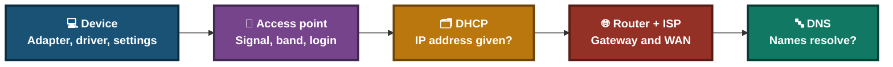
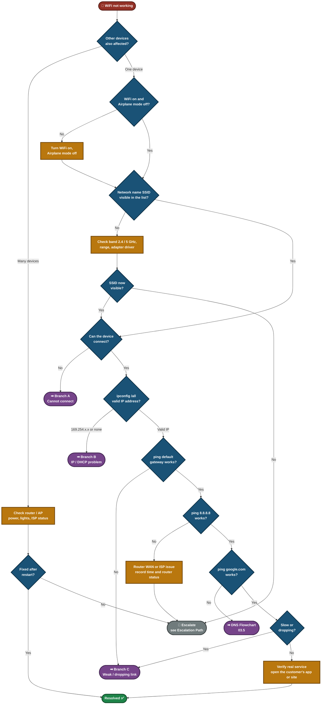
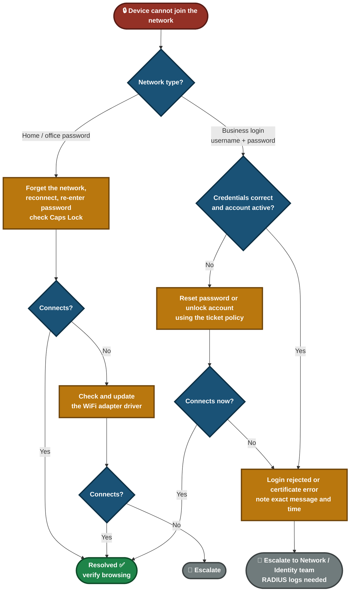
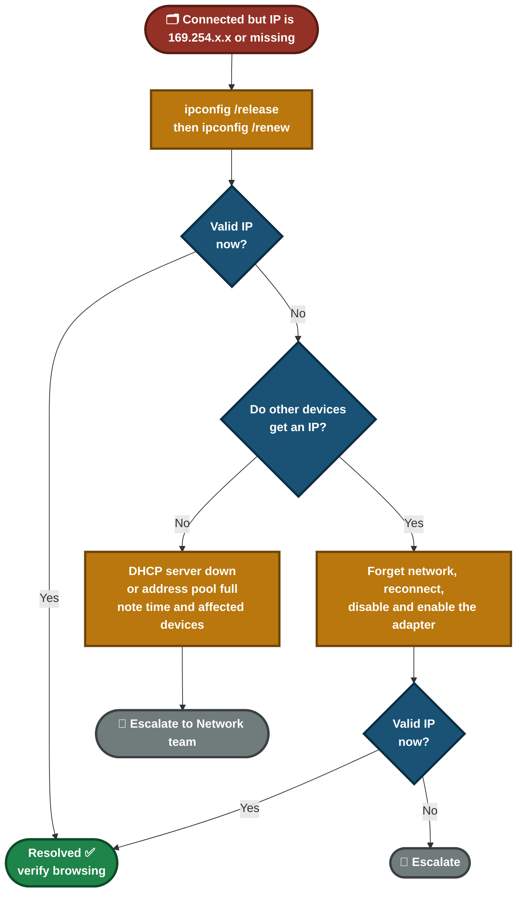
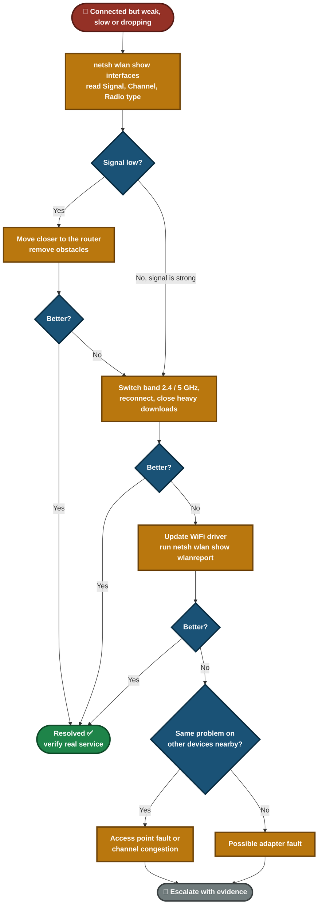
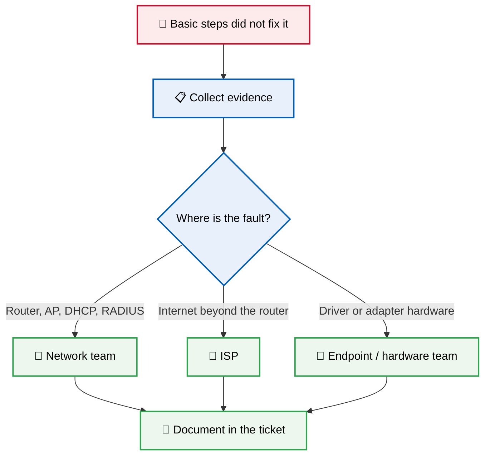
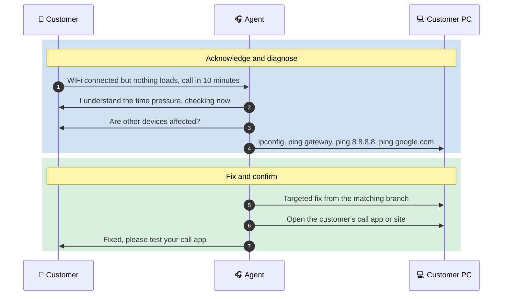

<div align="center">

# 🧭 WiFi Troubleshooting — Flowcharts

**Troubleshooting Flowcharts — 03.1**

Windows Client · WiFi Diagnostics · Escalation Decisions


A customer says "my WiFi is not working". That can mean five different things. These flowcharts give a repeatable path that separates a router problem from a device problem, a login problem, an IP problem and a signal problem, and show when to escalate and with what evidence.

</div>

---

## 📑 Table of Contents

1. [At a Glance](#at-a-glance)
2. [Purpose](#purpose)
3. [Environment](#environment)
4. [Support Flow](#support-flow)
5. [Where WiFi Can Break](#wifi-layers)
6. [Master Decision Path](#master-path)
7. [Branch A — Cannot Connect](#branch-a)
8. [Branch B — IP / DHCP Problem](#branch-b)
9. [Branch C — Weak, Slow or Dropping](#branch-c)
10. [Escalation Path](#escalation)
11. [Command Reference](#commands)
12. [Customer Communication](#customer-communication)
13. [Design Decisions](#design-decisions)
14. [Scope & Limitations](#scope-limitations)
15. [What I Learned](#what-i-learned)
16. [Skills Demonstrated](#skills-demonstrated)
17. [Repo Structure](#repo-structure)

---

<a id="at-a-glance"></a>
## 📊 At a Glance

| 🗺️ Diagrams | 🌿 Branches | 🔧 Tools Used | 📨 Escalation Paths |
|:---:|:---:|:---:|:---:|
| **8** | **3** | **4** | **1** |

---

<a id="purpose"></a>
## 📖 Purpose

"WiFi is not working" is a symptom, not a cause. Guessing wastes the customer's time. The flowcharts below turn the symptom into a short series of yes/no checks, so every ticket follows the same logic and ends in either a fix or a documented escalation.

- **Master Decision Path:** The main chart. It checks scope first, then walks up the network stack.
- **Branch A — Cannot Connect:** The device will not join the network (password or login problem).
- **Branch B — IP / DHCP Problem:** The device joins but gets no valid IP address.
- **Branch C — Weak, Slow or Dropping:** The device is connected but the link is poor.
- **Escalation Path:** What evidence to collect and who owns the next step.

> [!NOTE]
> Connecting to WiFi is not the same as having working internet. The fix is not complete until the customer's real application or website works.

---

<a id="environment"></a>
## 🖧 Environment

| Item | Value |
|---|---|
| **Client OS** | Windows |
| **Shell** | Command Prompt (Run as Administrator) |
| **Commands** | `ipconfig /all`, `ipconfig /release`, `ipconfig /renew`, `ping`, `nslookup`, `netsh wlan show interfaces`, `netsh wlan show wlanreport` |
| **Network types covered** | Home / small office (WPA2/WPA3-Personal) and business (WPA2/WPA3-Enterprise with RADIUS) |
| **Related files** | [DNS Flowchart](03.5-DNS-Flowchart.md) · [WiFi Guide](../04-solution-guides/04.1-WiFi-Guide.md) |

---

<a id="support-flow"></a>
## ⏱️ Support Flow


<p align="center"><em>Colors mark each stage of the support process.</em></p>

---

<a id="wifi-layers"></a>
## 🗺️ Where WiFi Can Break



- **Device layer:** WiFi switched off, airplane mode, bad driver, saved profile with an old password.
- **Access point layer:** Weak signal, wrong band, wrong password, or enterprise login rejected.
- **DHCP layer:** Device joined but has no valid IP (`169.254.x.x`).
- **Router / ISP layer:** Gateway reachable but no internet beyond it.
- **DNS layer:** Internet works by IP but names fail. See the [DNS Flowchart](03.5-DNS-Flowchart.md).
- The master chart below tests these layers in order, so the cause is proven and not guessed.

---

<a id="master-path"></a>
## 🧭 Master Decision Path



| Check | What it proves |
|---|---|
| Other devices affected | Many devices point to the router, AP or ISP. One device points to the client. |
| SSID visible | The adapter works and the AP is broadcasting in range. |
| Device can connect | Password, login and adapter settings are accepted. |
| Valid IP in `ipconfig /all` | DHCP answered. `169.254.x.x` means it did not. |
| Gateway ping | The local WiFi link works. |
| `ping 8.8.8.8` | The router can reach the internet. |
| `ping google.com` | DNS works. |

---

<a id="branch-a"></a>
## 🔵 Branch A — Cannot Connect

**Objective:** Find out whether the device is rejected because of a saved profile, a wrong password, the adapter, or an enterprise login.



- A saved profile with an old password is the most common cause on one device, so "forget and reconnect" comes first.
- On a business network, the support agent cannot see why the RADIUS server rejected the login. The decision is to collect the exact error and escalate, not to keep guessing.
- Never ask the customer to share their password in the ticket.

---

<a id="branch-b"></a>
## 🟢 Branch B — IP / DHCP Problem

**Objective:** Prove whether the device cannot get an IP address because of the client or because of the DHCP service.



- An address starting with `169.254` is an automatic fallback address. It means the device asked for an IP and nobody answered.
- If several devices fail at the same time, the DHCP server or its address pool is the likely cause, not the device.

---

<a id="branch-c"></a>
## 🟠 Branch C — Weak, Slow or Dropping

**Objective:** Separate a poor signal from congestion, a driver problem, or a fault on the access point.



- Changes are made one at a time, so it is clear which one helped.
- The `wlanreport` output is attached to the ticket, because the session history shows when the drops happened.

---

<a id="escalation"></a>
## 🔍 Escalation Path



**Evidence to attach to every WiFi escalation:**

- Output of `ipconfig /all`
- Output of `netsh wlan show interfaces` (SSID, Signal, Channel)
- Ping results for gateway, `8.8.8.8` and `google.com`
- Exact error message, time it started, and how many devices are affected
- Everything already tried, in order
- Any temporary change made (do not leave it undocumented)

---

<a id="commands"></a>
## 💻 Command Reference

| Command | Used for |
|---|---|
| `ipconfig /all` | Read the IP address, gateway, DHCP server and DNS servers |
| `ipconfig /release` and `ipconfig /renew` | Ask the DHCP server for a new address |
| `ping <gateway>` | Test the local WiFi link to the router |
| `ping 8.8.8.8` | Test internet connectivity without DNS |
| `ping google.com` | Test name resolution |
| `nslookup google.com` | Confirm DNS returns an IP |
| `netsh wlan show interfaces` | Read SSID, signal strength, channel and radio type |
| `netsh wlan show wlanreport` | Build a WiFi history report for dropped connections |

---

<a id="customer-communication"></a>
## 🎧 Customer Communication

> *"My laptop says it's connected to WiFi but nothing loads, and I have a client call in ten minutes."*



**Agent response given:**
- **During the fix:** "I understand you have a call soon. I'm checking where the problem is, and I'll tell you as soon as it's working."
- **After the fix:** "WiFi is working again. Please open your call app to confirm. If it drops again, contact us right away and I'll check the signal and connection report."
- **If escalating:** "I've found that the problem is on the network side, not your laptop. I'm passing it to the network team with everything I've collected, so you won't need to repeat yourself."

---

<a id="design-decisions"></a>
## ⚠️ Design Decisions

| ❓ Problem | ✅ Decision |
|---|---|
| One chart with every WiFi cause becomes too large to read | A master chart plus three branch charts, each with one clear start and end |
| Easy to blame the customer's laptop when the router is at fault | The first question is always whether other devices are affected |
| "Connected" does not prove the internet works | The chart climbs through IP, gateway, `8.8.8.8` and `google.com` before closing |
| Agents may keep trying fixes on a login the RADIUS server rejects | Business login failures go to escalation with the exact error and time |
| Several changes at once hide what worked | Each branch changes one thing, then re-tests |

---

<a id="scope-limitations"></a>
## 🚧 Scope & Limitations

- **Windows client only.** macOS, Linux, iOS and Android use different commands.
- **Flowcharts, not live tests.** These are decision guides. They were not run against a live outage.
- **Enterprise login is escalated.** The chart does not cover reading RADIUS server logs, because that needs access a support agent normally does not have.
- **No router configuration.** Changing router or access point settings is outside the support agent's scope in these charts.
- **Signal strength is judged by the agent.** A fixed percentage is not set, because acceptable signal depends on the customer's work.

---

<a id="what-i-learned"></a>
## 🧠 What I Learned

- **Check the scope first.** One device and many devices point to different causes.
- **Climb the stack in order.** Join, IP, gateway, internet, DNS. Each step rules out one layer.
- **`169.254.x.x` means DHCP did not answer.** It is a clear sign, not a vague "no internet".
- **Connected is not working.** Verify the customer's real service before closing.
- **Know your limit.** Some causes, such as a RADIUS rejection, need escalation with evidence, not more guessing.

---

<a id="skills-demonstrated"></a>
## 🛠️ Skills Demonstrated

- Structured troubleshooting logic for WiFi, IP, signal and login faults
- Reading `ipconfig` and `netsh wlan` output
- Separating client faults from router, DHCP, RADIUS and ISP faults
- Building clear decision flowcharts with Mermaid
- Writing escalation evidence and customer updates

---

<a id="repo-structure"></a>
## 📁 Repo Structure

```text
03-Troubleshooting-flowcharts/
|-- 03.1-WiFi-Flowchart.md
|-- 03.2-Email-Flowchart.md
|-- 03.3-VPN-Flowchart.md
|-- 03.4-Printer-Flowchart.md
|-- 03.5-DNS-Flowchart.md
`-- README.md
```

<div align="center">

🌐 **[WiFi Basics](https://www.cloudflare.com/learning/network-layer/what-is-wifi/)** · 🪟 **[Windows Commands](https://learn.microsoft.com/windows-server/administration/windows-commands/windows-commands)** · 🛠️ **[Master Decision Path](#master-path)**

</div>
