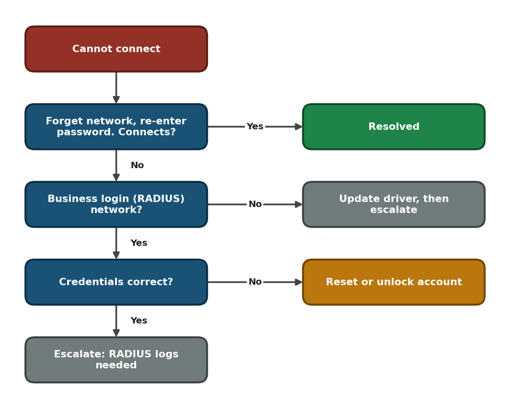
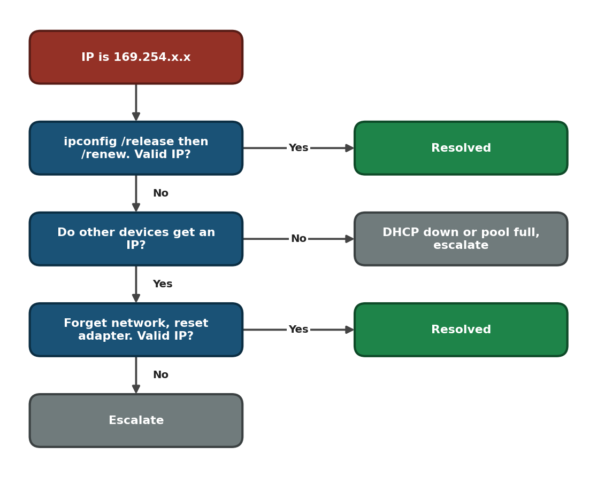
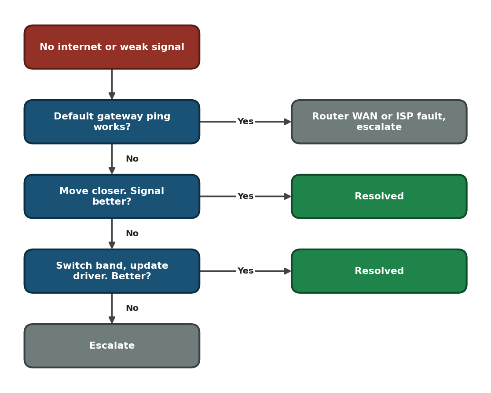

<div align="center">

# 🧭 WiFi Troubleshooting — Flowcharts

**Troubleshooting Flowcharts — 03.1**

Windows Client · WiFi Diagnostics · Escalation Decisions


"WiFi is not working" can mean a login, IP, signal or router problem. These flowcharts separate them in a few yes/no checks and show when to escalate.

</div>

---

## 📑 Table of Contents

1. [At a Glance](#at-a-glance)
2. [Purpose](#purpose)
3. [Environment](#environment)
4. [Support Flow](#support-flow)
5. [Master Flowchart](#master)
6. [Branch A — Cannot Connect](#branch-a)
7. [Branch B — No Valid IP](#branch-b)
8. [Branch C — No Internet or Weak Signal](#branch-c)
9. [Escalation Evidence](#escalation)
10. [Command Reference](#commands)
11. [Customer Communication](#customer-communication)
12. [Scope & Limitations](#scope-limitations)
13. [What I Learned](#what-i-learned)
14. [Skills Demonstrated](#skills-demonstrated)
15. [Repo Structure](#repo-structure)

---

<a id="at-a-glance"></a>
## 📊 At a Glance

| 🗺️ Flowcharts | 🌿 Branches | 🔧 Tools Used | 📨 Escalation Targets |
|:---:|:---:|:---:|:---:|
| **4** | **3** | **4** | **3** |

---

<a id="purpose"></a>
## 📖 Purpose

Guessing wastes the customer's time. These flowcharts give every WiFi ticket the same logic, ending in either a fix or a documented escalation.

- **Master Flowchart:** Checks scope first, then one layer at a time.
- **Branches A, B, C:** Login problems, IP problems, and signal or router problems.
- **Escalation Evidence:** What to attach and who owns the next step.

> [!NOTE]
> Being connected to WiFi is not the same as working internet. The fix is complete only when the customer's real app or site works.

---

<a id="environment"></a>
## 🖧 Environment

| Item | Value |
|---|---|
| **Client OS** | Windows |
| **Shell** | Command Prompt (Run as Administrator) |
| **Networks covered** | Home / office password (WPA2/WPA3-Personal) and business login with RADIUS (WPA2/WPA3-Enterprise) |
| **Related** | [DNS Flowchart](03.5-DNS-Flowchart.md) · [WiFi Guide](../04-solution-guides/04.1-WiFi-Guide.md) |

---

<a id="support-flow"></a>
## ⏱️ Support Flow


<p align="center"><em>Colors mark each stage of the support process.</em></p>

---

<a id="master"></a>
## 🧭 Master Flowchart

<table>
<tr>
<td width="55%" align="center" valign="top">


</td>
<td width="45%" valign="top">

**How to read it**

1. Other devices affected? Check the router and ISP, then escalate.
2. Cannot connect? Go to **Branch A**.
3. No valid IP? Go to **Branch B**.
4. `ping 8.8.8.8` fails? Go to **Branch C**.
5. `ping google.com` fails? Go to the [DNS Flowchart](03.5-DNS-Flowchart.md).
6. Everything passes? Test the customer's app, then close.

<sub>Red = start · Blue = check · Purple = branch · Grey = escalate · Green = resolved</sub>

</td>
</tr>
</table>

---

<a id="branch-a"></a>
## 🔵 Branch A — Cannot Connect

<table>
<tr>
<td width="55%" align="center" valign="top">



</td>
<td width="45%" valign="top">

**How to read it**

1. Forget the network and re-enter the password.
2. On a business login network, check the credentials.
3. Wrong credentials: reset or unlock the account.
4. Credentials correct: escalate with RADIUS logs needed.

<sub>An old saved password is the most common cause on one device. Only the network or identity team can read why RADIUS rejected a login.</sub>

</td>
</tr>
</table>

---

<a id="branch-b"></a>
## 🟢 Branch B — No Valid IP

<table>
<tr>
<td width="55%" align="center" valign="top">



</td>
<td width="45%" valign="top">

**How to read it**

1. Run `ipconfig /release` then `/renew`.
2. Still no IP? Check whether other devices get one.
3. Other devices fail too: DHCP is down or the pool is full, so escalate.
4. Only this device fails: forget the network and reset the adapter.

<sub>`169.254.x.x` is an automatic fallback address. The device asked for an IP and nobody answered.</sub>

</td>
</tr>
</table>

---

<a id="branch-c"></a>
## 🟠 Branch C — No Internet or Weak Signal

<table>
<tr>
<td width="55%" align="center" valign="top">



</td>
<td width="45%" valign="top">

**How to read it**

1. Ping the default gateway.
2. Gateway works: the fault is past the router, so escalate.
3. Gateway fails: move closer and check the signal.
4. Still poor: switch band and update the driver, then escalate.

<sub>Gateway ping fails means the WiFi link is the problem. Gateway ping works but the internet does not means the problem is past the router.</sub>

</td>
</tr>
</table>

---

<a id="escalation"></a>
## 📨 Escalation Evidence

| Fault location | Send to |
|---|---|
| Router, access point, DHCP, RADIUS | Network team |
| Internet beyond the router | ISP |
| Driver or adapter hardware | Endpoint / hardware team |

Attach to the ticket: `ipconfig /all`, `netsh wlan show interfaces` (SSID, Signal, Channel), ping results for gateway, `8.8.8.8` and `google.com`, the exact error with start time and number of devices affected, and everything already tried, in order.

---

<a id="commands"></a>
## 💻 Command Reference

| Command | Used for |
|---|---|
| `ipconfig /all` | Read IP, gateway, DHCP and DNS servers |
| `ipconfig /release` + `/renew` | Ask DHCP for a new address |
| `ping <gateway>` | Test the local WiFi link |
| `ping 8.8.8.8` | Test internet without DNS |
| `ping google.com` | Test name resolution |
| `netsh wlan show interfaces` | Read signal, channel and radio type |

---

<a id="customer-communication"></a>
## 🎧 Customer Communication

> *"My laptop says it's connected to WiFi but nothing loads, and I have a client call in ten minutes."*

- **During the fix:** "I understand you have a call soon. I'm checking where the problem is and I'll tell you as soon as it's working."
- **After the fix:** "WiFi is working again. Please open your call app to confirm. If it drops again, contact us right away."
- **If escalating:** "The problem is on the network side, not your laptop. I'm passing it on with everything I've collected, so you won't need to repeat yourself."

---

<a id="scope-limitations"></a>
## 🚧 Scope & Limitations

- **Windows client only.** Other systems use different commands.
- **Decision guides, not live tests.** They were not run against a live outage.
- **Business login is escalated.** Reading RADIUS server logs needs access a support agent normally does not have.
- **No router configuration.** Changing router or access point settings is outside these charts.

---

<a id="what-i-learned"></a>
## 🧠 What I Learned

- **Check the scope first.** One device and many devices point to different causes.
- **Go in order.** Join, IP, gateway, internet, DNS. Each step rules out one layer.
- **Connected is not working.** Verify the customer's real service before closing.
- **Know the limit.** Some causes need escalation with evidence, not more guessing.

---

<a id="skills-demonstrated"></a>
## 🛠️ Skills Demonstrated

- Structured WiFi troubleshooting for login, IP, signal and router faults
- Reading `ipconfig` and `netsh wlan` output
- Separating client faults from router, DHCP, RADIUS and ISP faults
- Building clear decision flowcharts
- Writing escalation evidence and customer updates

---

<a id="repo-structure"></a>
## 📁 Repo Structure

```text
03-Troubleshooting-flowcharts/
|-- 03.1-WiFi-Flowchart.md
|-- 03.2-Email-Flowchart.md
|-- 03.3-VPN-Flowchart.md
|-- 03.4-Printer-Flowchart.md
|-- 03.5-DNS-Flowchart.md
|-- README.md
`-- screenshots/
    |-- WiFi_Master_Flowchart.PNG
    |-- WiFi_BranchA_Cannot_Connect.PNG
    |-- WiFi_BranchB_No_Valid_IP.PNG
    `-- WiFi_BranchC_No_Internet_Weak_Signal.PNG
```
