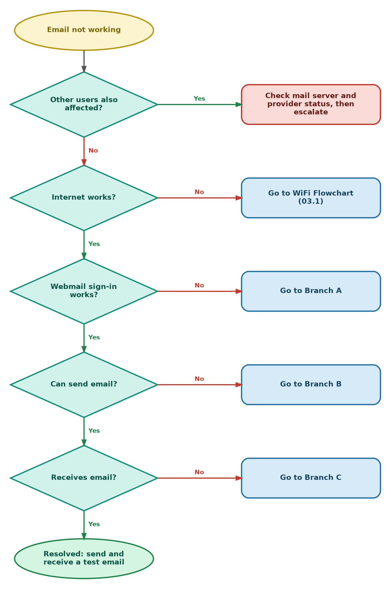
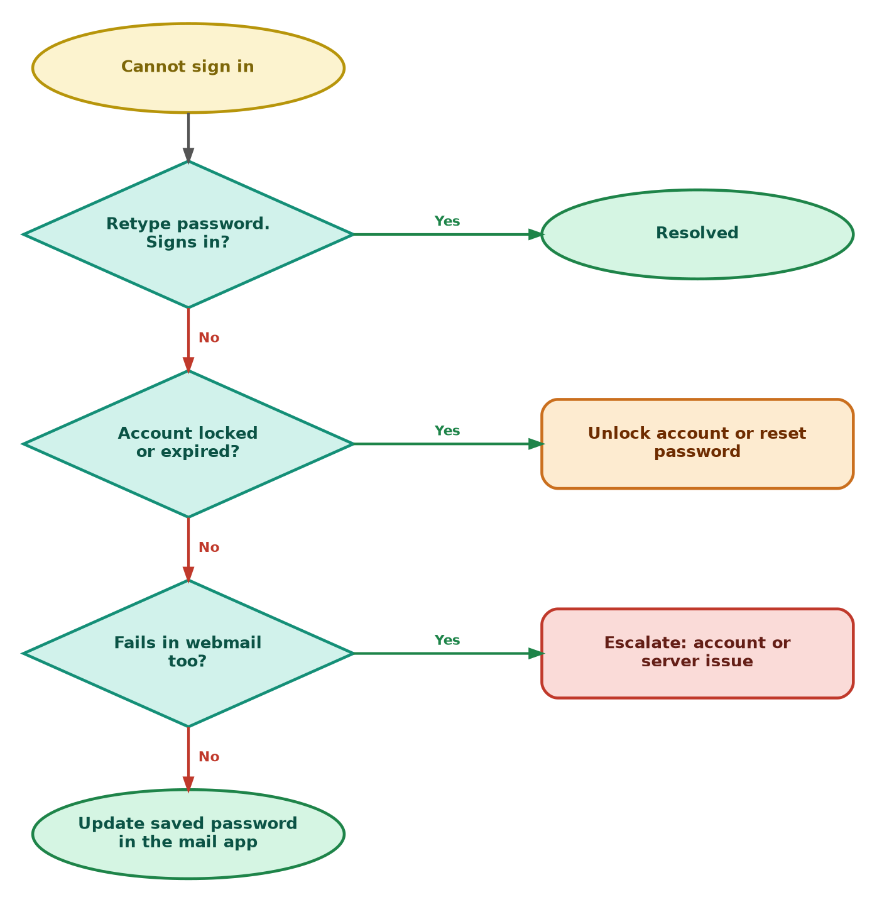
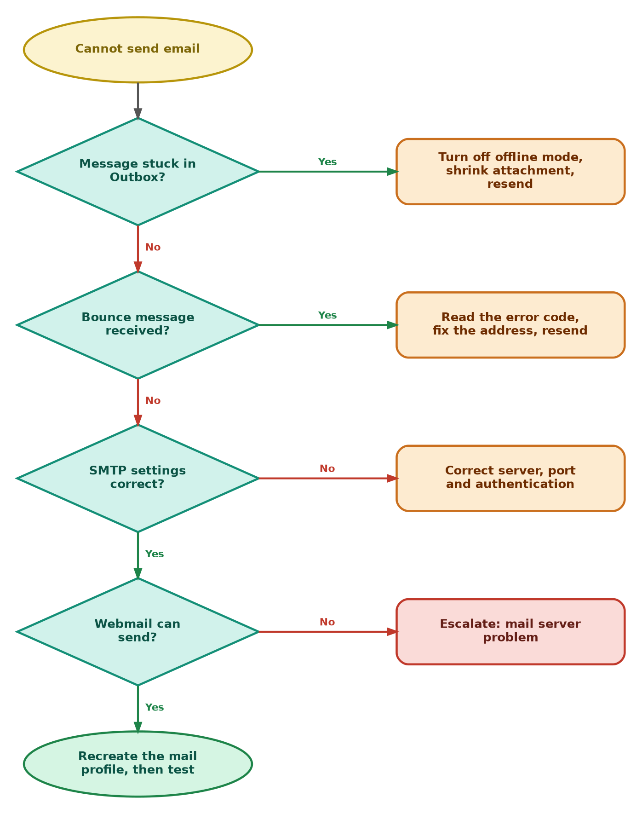
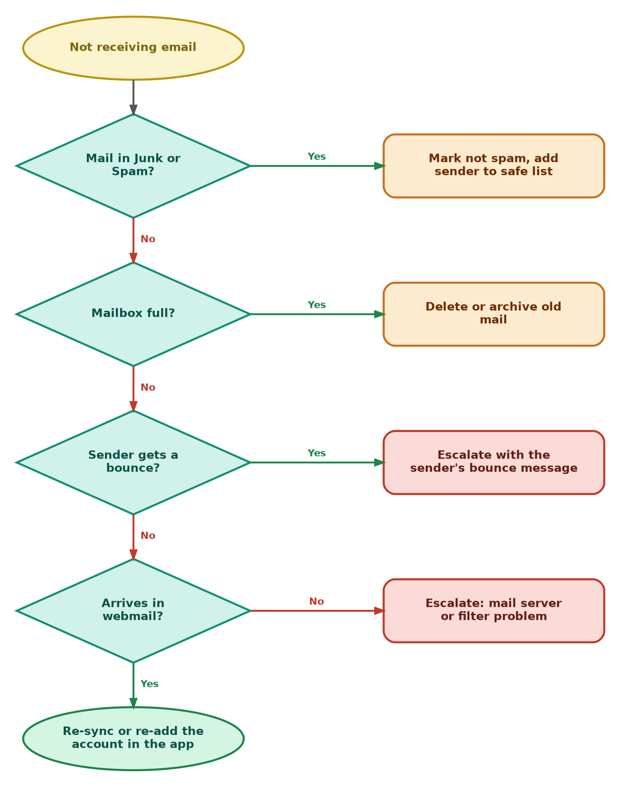

<div align="center">

# 📧 Email Troubleshooting — Flowcharts

**Troubleshooting Flowcharts — 03.2**

Windows Client · Email Diagnostics · Escalation Decisions


"Email is not working" can mean a sign-in, sending, receiving or server problem. These flowcharts separate them in a few yes/no checks and show when to escalate.

</div>

---

## 📑 Table of Contents

1. [At a Glance](#at-a-glance)
2. [Purpose](#purpose)
3. [Environment](#environment)
4. [Support Flow](#support-flow)
5. [Master Flowchart](#master)
6. [Branch A — Cannot Sign In](#branch-a)
7. [Branch B — Cannot Send](#branch-b)
8. [Branch C — Not Receiving](#branch-c)
9. [Escalation Evidence](#escalation)
10. [Command Reference](#commands)
11. [Customer Communication](#customer-communication)
12. [Scope & Limitations](#scope-limitations)
13. [What I Learned](#what-i-learned)
14. [Skills Demonstrated](#skills-demonstrated)
15. [Repo Structure](#repo-structure)

---

<a id="at-a-glance"></a>
## 📊 At a Glance

| 🗺️ Flowcharts | 🌿 Branches | 🔧 Tools Used | 📨 Escalation Targets |
|:---:|:---:|:---:|:---:|
| **4** | **3** | **3** | **3** |

---

<a id="purpose"></a>
## 📖 Purpose

Guessing wastes the customer's time, and a stuck email can mean a lost order or a missed deadline. These flowcharts give every email ticket the same logic, ending in either a fix or a documented escalation.

- **Master Flowchart:** Checks scope, internet and webmail first, then sending and receiving.
- **Branches A, B, C:** Sign-in problems, sending problems, and receiving problems.
- **Escalation Evidence:** What to attach and who owns the next step.

> [!NOTE]
> Webmail is the key test. If webmail works, the mailbox and server are fine and the fault is in the customer's mail app or settings.

---

<a id="environment"></a>
## 🖧 Environment

| Item | Value |
|---|---|
| **Client OS** | Windows |
| **Mail access** | Desktop mail app (such as Outlook) and webmail in a browser |
| **Shell** | Command Prompt or PowerShell |
| **Related** | [WiFi Flowchart](03.1-WiFi-Flowchart.md) · [Email Guide](../04-solution-guides/04.2-Email-Guide.md) |

---

<a id="support-flow"></a>
## ⏱️ Support Flow


<p align="center"><em>Colors mark each stage of the support process.</em></p>

---

<a id="master"></a>
## 🧭 Master Flowchart

<table>
<tr>
<td width="55%" align="center" valign="top">



</td>
<td width="45%" valign="top">

**How to read it**

1. Other users affected? Check the mail server and provider status, then escalate.
2. Internet not working? Go to the [WiFi Flowchart](03.1-WiFi-Flowchart.md).
3. Webmail sign-in fails? Go to **Branch A**.
4. Cannot send? Go to **Branch B**.
5. Not receiving? Go to **Branch C**.
6. Everything passes? Send and receive a test email, then close.

<sub>Yellow = start · Teal diamond = check · Orange = fix · Blue = go to another chart · Red = escalate · Green = resolved</sub>

</td>
</tr>
</table>

---

<a id="branch-a"></a>
## 🔵 Branch A — Cannot Sign In

<table>
<tr>
<td width="55%" align="center" valign="top">



</td>
<td width="45%" valign="top">

**How to read it**

1. Retype the password carefully (check Caps Lock).
2. Account locked or password expired? Unlock it or reset the password.
3. Fails in webmail too? The problem is the account or server, so escalate.
4. Works in webmail only? Update the password saved in the mail app.

<sub>An old saved password is the most common reason the app fails while webmail works.</sub>

</td>
</tr>
</table>

---

<a id="branch-b"></a>
## 🟢 Branch B — Cannot Send

<table>
<tr>
<td width="55%" align="center" valign="top">



</td>
<td width="45%" valign="top">

**How to read it**

1. Message stuck in the Outbox? Turn off offline mode, shrink the attachment and resend.
2. Bounce message received? Read the error code, fix the address and resend.
3. Check the SMTP settings: server, port and authentication.
4. Webmail cannot send either? Escalate a mail server problem.
5. Webmail can send? Recreate the mail profile and test.

<sub>Port numbers and server names depend on the provider. Use the provider's published settings.</sub>

</td>
</tr>
</table>

---

<a id="branch-c"></a>
## 🟠 Branch C — Not Receiving

<table>
<tr>
<td width="55%" align="center" valign="top">



</td>
<td width="45%" valign="top">

**How to read it**

1. Check Junk or Spam. Mark the mail as not spam and add the sender to the safe list.
2. Mailbox full? Delete or archive old mail.
3. Sender gets a bounce? Escalate with the bounce message.
4. Mail missing in webmail too? Escalate a mail server or filter problem.
5. Mail arrives in webmail only? Re-sync or re-add the account in the app.

<sub>A bounce message tells you where delivery failed, so always ask the sender for a copy of it.</sub>

</td>
</tr>
</table>

---

<a id="escalation"></a>
## 📨 Escalation Evidence

| Fault location | Send to |
|---|---|
| Mail server, filtering, mailbox, delivery bounces | Email / mail admin team |
| Locked account, MFA, expired password policy | Identity / account admin team |
| Internet or provider outage | ISP or mail provider |

Attach to the ticket: the exact error or bounce message, the time it started, the sender and recipient addresses (if delivery is the problem), whether webmail works, how many users are affected, and everything already tried, in order.

---

<a id="commands"></a>
## 💻 Command Reference

| Command | Used for |
|---|---|
| `ping 8.8.8.8` | Test internet without DNS |
| `ping google.com` | Test name resolution |
| `nslookup -type=mx <domain>` | Find the mail servers (MX records) for a domain |
| `Test-NetConnection <smtp-server> -Port <port>` | Test whether the mail server port is reachable (PowerShell) |

---

<a id="customer-communication"></a>
## 🎧 Customer Communication

> *"My emails to a client keep failing and they're waiting on a quote."*

- **During the fix:** "I understand the quote is urgent. I'm checking whether the problem is your mail app or the server, and I'll update you shortly."
- **After the fix:** "Email is working again. Please send the quote and confirm it went through. If it fails again, contact us and send me the error message."
- **If escalating:** "The problem is on the mail server side, not your computer. I'm passing it on with everything I've collected, so you won't need to repeat yourself."

---

<a id="scope-limitations"></a>
## 🚧 Scope & Limitations

- **Windows client only.** Other devices use different steps.
- **Decision guides, not live tests.** They were not run against a live mail outage.
- **No server-side admin.** Reading mail server logs or changing filters needs access a support agent normally does not have.
- **Provider settings vary.** Always use the settings published by the customer's email provider.

---

<a id="what-i-learned"></a>
## 🧠 What I Learned

- **Webmail is the fastest test.** It shows whether the fault is the account or server, or the customer's app.
- **Sending and receiving are separate problems.** Each has its own checks.
- **Bounce messages are evidence.** The error code points to where delivery failed.
- **Know the limit.** Some causes need escalation with evidence, not more guessing.

---

<a id="skills-demonstrated"></a>
## 🛠️ Skills Demonstrated

- Structured email troubleshooting for sign-in, sending and receiving faults
- Separating client faults from account, mail server and provider faults
- Reading bounce messages and basic DNS lookups for mail
- Building clear decision flowcharts
- Writing escalation evidence and customer updates

---

<a id="repo-structure"></a>
## 📁 Repo Structure

```text
03-Troubleshooting-flowcharts/
|-- 03.1-WiFi-Flowchart.md
|-- 03.2-Email-Flowchart.md
|-- 03.3-VPN-Flowchart.md
|-- 03.4-Printer-Flowchart.md
|-- 03.5-DNS-Flowchart.md
|-- README.md
`-- screenshots/
    |-- WiFi_Master_Flowchart.PNG
    |-- WiFi_BranchA_Cannot_Connect.PNG
    |-- WiFi_BranchB_No_Valid_IP.PNG
    |-- WiFi_BranchC_No_Internet_Weak_Signal.PNG
    |-- Email_Master_Flowchart.PNG
    |-- Email_BranchA_Cannot_Sign_In.PNG
    |-- Email_BranchB_Cannot_Send.PNG
    `-- Email_BranchC_Not_Receiving.PNG
```
