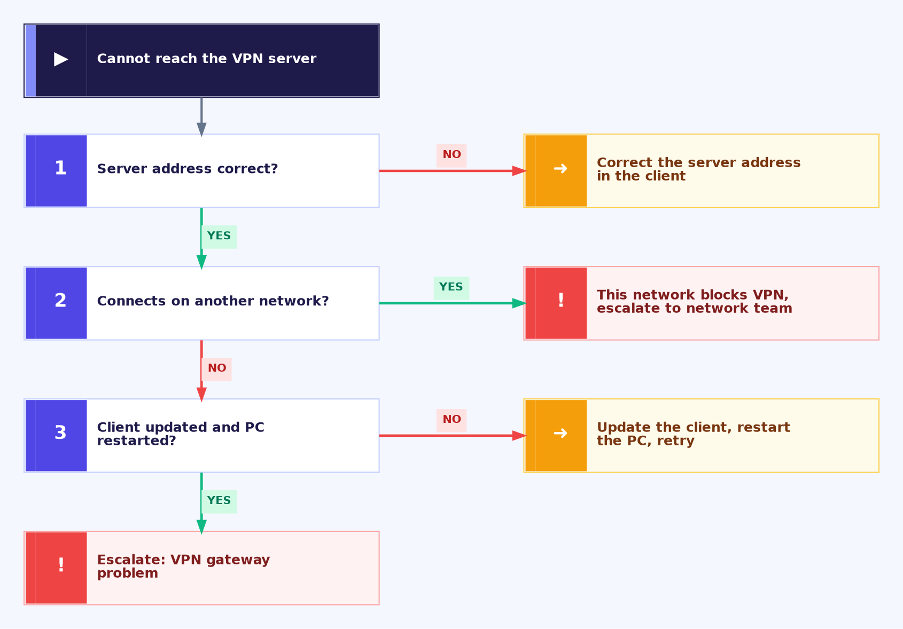
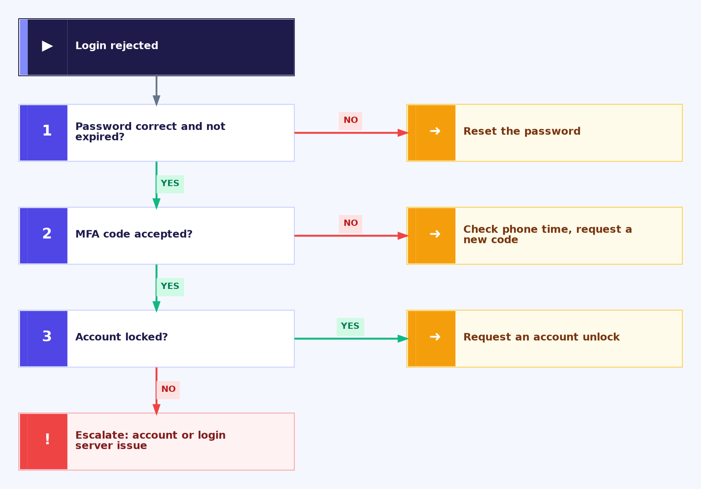
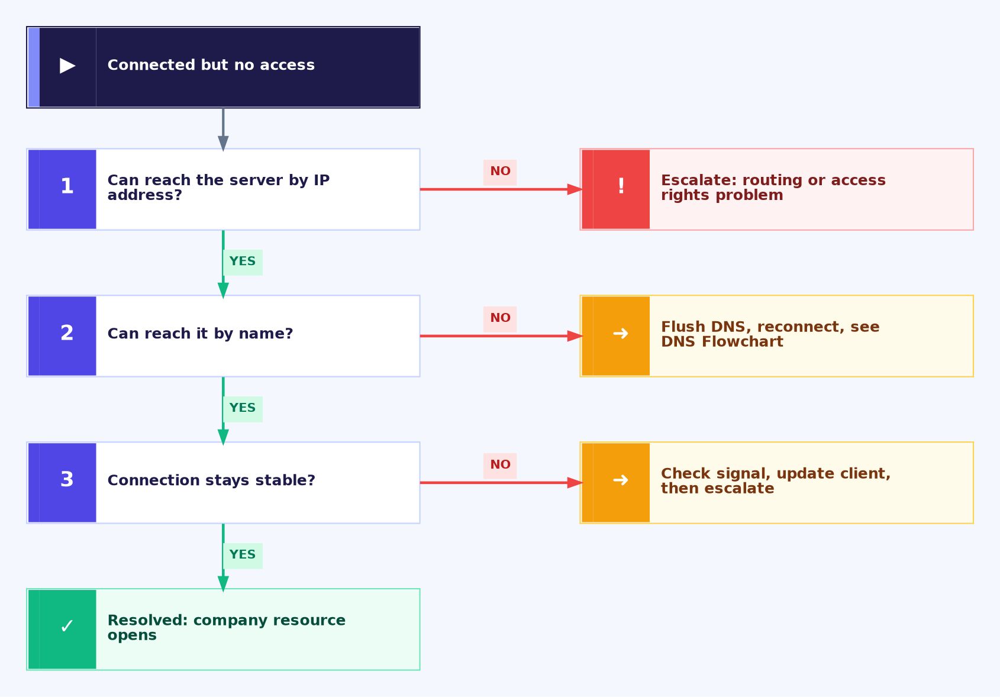

<div align="center">

# 🔐 VPN Troubleshooting — Flowcharts

**Troubleshooting Flowcharts — 03.3**

Windows Client · VPN Diagnostics · Escalation Decisions


"VPN is not working" can mean the server is unreachable, the login is rejected, or the tunnel is up but nothing opens. These flowcharts separate them in a few yes/no checks and show when to escalate.

</div>

---

## 📑 Table of Contents

1. [At a Glance](#at-a-glance)
2. [Purpose](#purpose)
3. [Environment](#environment)
4. [Support Flow](#support-flow)
5. [Master Flowchart](#master)
6. [Branch A — Cannot Reach the Server](#branch-a)
7. [Branch B — Login Rejected](#branch-b)
8. [Branch C — Connected but No Access](#branch-c)
9. [Escalation Evidence](#escalation)
10. [Command Reference](#commands)
11. [Customer Communication](#customer-communication)
12. [Scope & Limitations](#scope-limitations)
13. [What I Learned](#what-i-learned)
14. [Skills Demonstrated](#skills-demonstrated)
15. [Repo Structure](#repo-structure)

---

<a id="at-a-glance"></a>
## 📊 At a Glance

| 🗺️ Flowcharts | 🌿 Branches | 🔧 Tools Used | 📨 Escalation Targets |
|:---:|:---:|:---:|:---:|
| **4** | **3** | **4** | **3** |

---

<a id="purpose"></a>
## 📖 Purpose

A remote worker without VPN cannot reach company systems, so every minute counts. These flowcharts give every VPN ticket the same logic, ending in either a fix or a documented escalation.

- **Master Flowchart:** Checks internet and scope first, then connection, login and access in order.
- **Branches A, B, C:** Server unreachable, login rejected, and connected but no access.
- **Escalation Evidence:** What to attach and who owns the next step.

> [!NOTE]
> A connected VPN is not a working VPN. The fix is complete only when the customer opens a real company resource.

---

<a id="environment"></a>
## 🖧 Environment

| Item | Value |
|---|---|
| **Client OS** | Windows |
| **VPN access** | Company VPN client with password and MFA login |
| **Shell** | Command Prompt or PowerShell |
| **Related** | [WiFi Flowchart](03.1-WiFi-Flowchart.md) · [DNS Flowchart](03.5-DNS-Flowchart.md) · [VPN Guide](../04-solution-guides/04.3-VPN-Guide.md) |

---

<a id="support-flow"></a>
## ⏱️ Support Flow


<p align="center"><em>Colors mark each stage of the support process.</em></p>

---

<a id="master"></a>
## 🧭 Master Flowchart

<table>
<tr>
<td width="55%" align="center" valign="top">


</td>
<td width="45%" valign="top">

**How to read it** (numbers match the chart)

1. Internet not working? Go to the [WiFi Flowchart](03.1-WiFi-Flowchart.md).
2. Other users affected? Check the VPN gateway and ISP status, then escalate.
3. Client cannot reach the server? Go to **Branch A**.
4. Login with password and MFA fails? Go to **Branch B**.
5. Connected but company resources do not open? Go to **Branch C**.
6. Everything passes? Connect, open a company resource, then close.

<sub>Dark = start · Indigo number = check · Amber = fix · Blue = go to another chart · Red = escalate · Green = resolved</sub>

</td>
</tr>
</table>

---

<a id="branch-a"></a>
## 🔵 Branch A — Cannot Reach the Server

<table>
<tr>
<td width="55%" align="center" valign="top">



</td>
<td width="45%" valign="top">

**How to read it**

1. Server address wrong? Correct it in the client.
2. Connects on another network (such as a phone hotspot)? The current network blocks VPN, so escalate to the network team.
3. Client not updated or PC not restarted? Update, restart and retry.
4. Still failing? Escalate a VPN gateway problem.

<sub>The test on another network separates a blocked network from a faulty VPN gateway.</sub>

</td>
</tr>
</table>

---

<a id="branch-b"></a>
## 🟢 Branch B — Login Rejected

<table>
<tr>
<td width="55%" align="center" valign="top">



</td>
<td width="45%" valign="top">

**How to read it**

1. Password wrong or expired? Reset it.
2. MFA code rejected? Check the phone's date and time, then request a new code.
3. Account locked? Request an account unlock.
4. Still rejected? Escalate an account or login server issue.

<sub>Never ask the customer to share their password or MFA code in the ticket.</sub>

</td>
</tr>
</table>

---

<a id="branch-c"></a>
## 🟠 Branch C — Connected but No Access

<table>
<tr>
<td width="55%" align="center" valign="top">



</td>
<td width="45%" valign="top">

**How to read it**

1. Cannot reach the server by IP address? Escalate a routing or access rights problem.
2. Works by IP but not by name? Flush DNS and reconnect. See the [DNS Flowchart](03.5-DNS-Flowchart.md).
3. Connection keeps dropping? Check the signal, update the client, then escalate if it repeats.
4. All stable? Open the company resource and close.

<sub>IP works but name fails points to DNS. IP fails points to routing or permissions.</sub>

</td>
</tr>
</table>

---

<a id="escalation"></a>
## 📨 Escalation Evidence

| Fault location | Send to |
|---|---|
| VPN gateway, firewall, routing, network blocking VPN | Network team |
| Locked account, MFA, password policy | Identity / account admin team |
| Internet or provider outage | ISP |

Attach to the ticket: the exact VPN error message and code, the time it started, the VPN client name and version, whether it connects on another network, how many users are affected, `ipconfig /all` output while connected, and everything already tried, in order.

---

<a id="commands"></a>
## 💻 Command Reference

| Command | Used for |
|---|---|
| `ping <server IP>` | Test whether a company server is reachable by IP |
| `nslookup <server name>` | Test whether a company name resolves |
| `ipconfig /all` | Check that the VPN adapter has an IP and DNS servers |
| `ipconfig /flushdns` | Clear stale name entries after connecting |
| `Test-NetConnection <vpn-server> -Port <port>` | Test whether the VPN server port is reachable (PowerShell) |

---

<a id="customer-communication"></a>
## 🎧 Customer Communication

> *"I'm working from home and the VPN won't connect. I can't open any company files and I have a deadline today."*

- **During the fix:** "I understand you need your files today. I'm checking whether the problem is your connection, your login or the VPN itself, and I'll update you shortly."
- **After the fix:** "The VPN is connected. Please open one of your company files to confirm. If it drops again, contact us and send me the error message."
- **If escalating:** "The problem is on the VPN side, not your computer. I'm passing it on with everything I've collected, so you won't need to repeat yourself."

---

<a id="scope-limitations"></a>
## 🚧 Scope & Limitations

- **Windows client only.** Other devices use different steps.
- **Decision guides, not live tests.** They were not run against a live VPN outage.
- **No gateway or firewall access.** Reading VPN logs or changing firewall rules is outside a support agent's access.
- **Client and ports vary.** Follow the company's own VPN client and published settings.

---

<a id="what-i-learned"></a>
## 🧠 What I Learned

- **Test in stages.** Reach the server, log in, then reach resources. Each stage has its own causes.
- **Another network is a quick test.** It separates a blocked network from a faulty gateway.
- **IP versus name matters.** It separates routing problems from DNS problems.
- **Know the limit.** Some causes need escalation with evidence, not more guessing.

---

<a id="skills-demonstrated"></a>
## 🛠️ Skills Demonstrated

- Structured VPN troubleshooting for connection, login and access faults
- Separating client, network, account and gateway faults
- Using `ping`, `nslookup` and `ipconfig` to test access
- Building clear decision flowcharts
- Writing escalation evidence and customer updates

---

<a id="repo-structure"></a>
## 📁 Repo Structure

```text
03-Troubleshooting-flowcharts/
|-- 03.1-WiFi-Flowchart.md
|-- 03.2-Email-Flowchart.md
|-- 03.3-VPN-Flowchart.md
|-- 03.4-Printer-Flowchart.md
|-- 03.5-DNS-Flowchart.md
|-- README.md
`-- screenshots/
    |-- WiFi_Master_Flowchart.PNG
    |-- WiFi_BranchA_Cannot_Connect.PNG
    |-- WiFi_BranchB_No_Valid_IP.PNG
    |-- WiFi_BranchC_No_Internet_Weak_Signal.PNG
    |-- Email_Master_Flowchart.PNG
    |-- Email_BranchA_Cannot_Sign_In.PNG
    |-- Email_BranchB_Cannot_Send.PNG
    |-- Email_BranchC_Not_Receiving.PNG
    |-- VPN_Master_Flowchart.PNG
    |-- VPN_BranchA_Cannot_Reach_Server.PNG
    |-- VPN_BranchB_Login_Rejected.PNG
    `-- VPN_BranchC_Connected_No_Access.PNG
```
