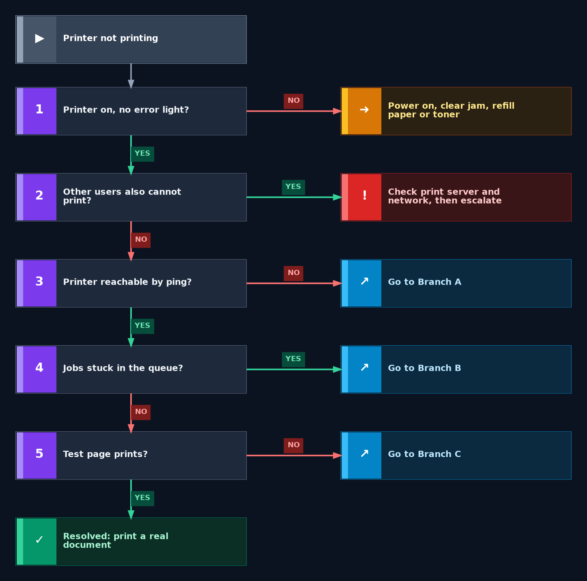
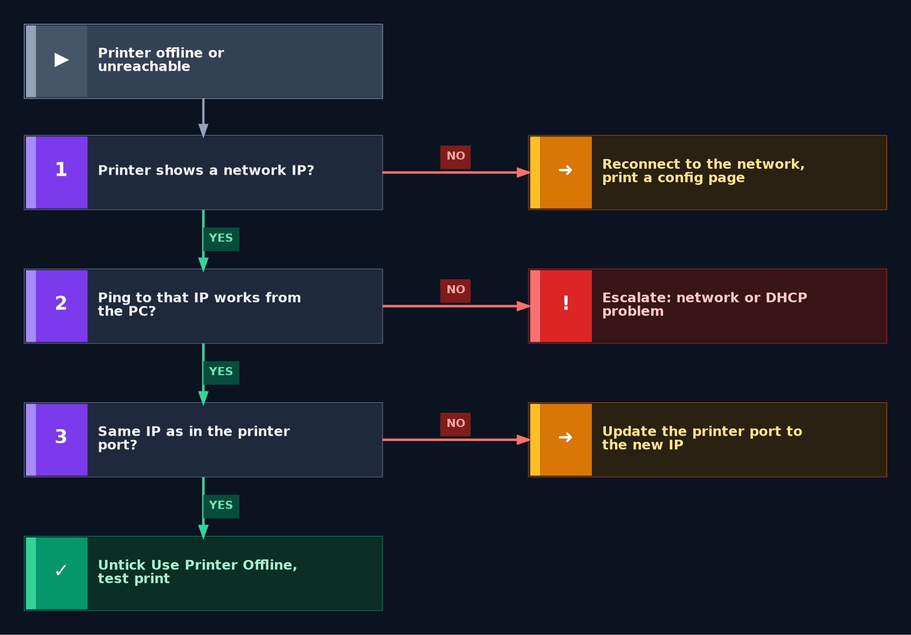
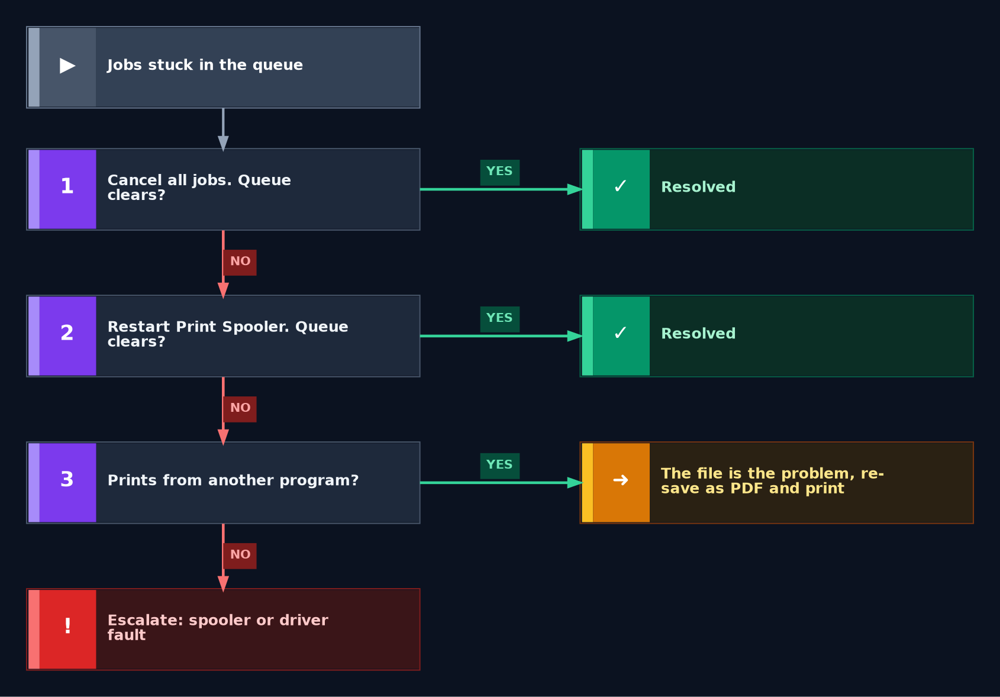
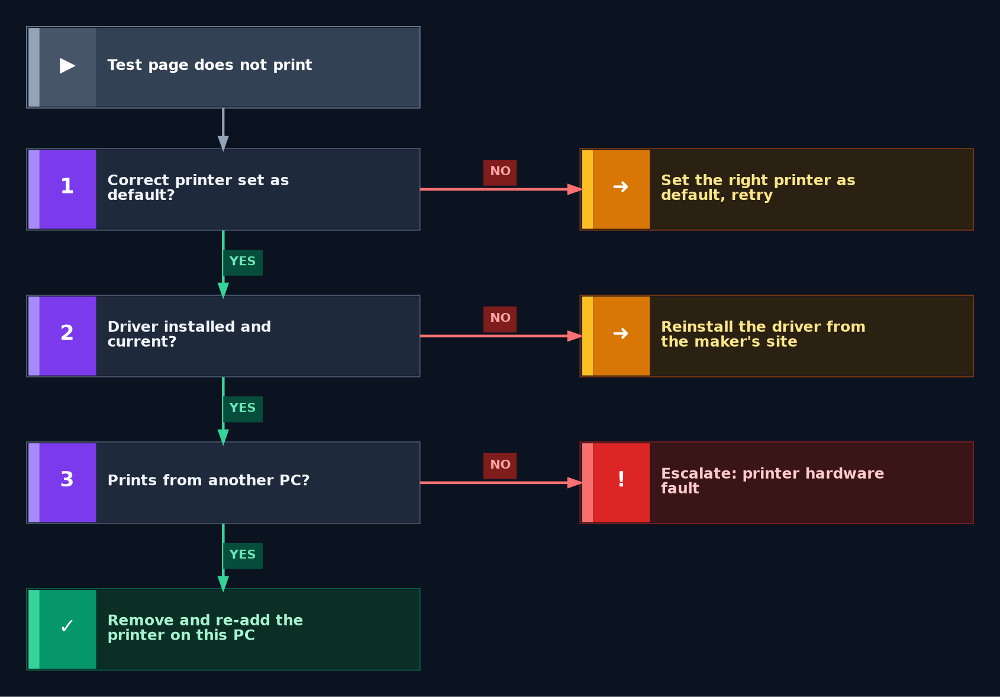

<div align="center">

# 🖨️ Printer Troubleshooting — Flowcharts

**Troubleshooting Flowcharts — 03.4**

Windows Client · Printer Diagnostics · Escalation Decisions


"The printer is not working" can mean a hardware fault, a network problem, a stuck queue or a driver problem. These flowcharts separate them in a few yes/no checks and show when to escalate.

</div>

---

## 📑 Table of Contents

1. [At a Glance](#at-a-glance)
2. [Purpose](#purpose)
3. [Environment](#environment)
4. [Support Flow](#support-flow)
5. [Master Flowchart](#master)
6. [Branch A — Offline or Unreachable](#branch-a)
7. [Branch B — Stuck Queue](#branch-b)
8. [Branch C — Test Page Fails](#branch-c)
9. [Escalation Evidence](#escalation)
10. [Command Reference](#commands)
11. [Customer Communication](#customer-communication)
12. [Scope & Limitations](#scope-limitations)
13. [What I Learned](#what-i-learned)
14. [Skills Demonstrated](#skills-demonstrated)
15. [Repo Structure](#repo-structure)

---

<a id="at-a-glance"></a>
## 📊 At a Glance

| 🗺️ Flowcharts | 🌿 Branches | 🔧 Tools Used | 📨 Escalation Targets |
|:---:|:---:|:---:|:---:|
| **4** | **3** | **4** | **3** |

---

<a id="purpose"></a>
## 📖 Purpose

A printer that will not print blocks invoices, forms and deadlines, and most of the time the cause is simple. These flowcharts give every printer ticket the same logic, ending in either a fix or a documented escalation.

- **Master Flowchart:** Checks the printer itself and the scope first, then the network, the queue and the test page.
- **Branches A, B, C:** Offline or unreachable, stuck queue, and test page that fails.
- **Escalation Evidence:** What to attach and who owns the next step.

> [!NOTE]
> A printer shown as "Offline" does not always mean it is switched off. Often the PC has the wrong IP address for the printer, or the printer lost its network connection.

---

<a id="environment"></a>
## 🖧 Environment

| Item | Value |
|---|---|
| **Client OS** | Windows |
| **Printer type** | Network printer shared by several users |
| **Shell** | Command Prompt (Run as Administrator) or PowerShell |
| **Related** | [WiFi Flowchart](03.1-WiFi-Flowchart.md) · [Printer Guide](../04-solution-guides/04.4-Printer-Guide.md) |

---

<a id="support-flow"></a>
## ⏱️ Support Flow


<p align="center"><em>Colors mark each stage of the support process.</em></p>

---

<a id="master"></a>
## 🧭 Master Flowchart

<table>
<tr>
<td width="55%" align="center" valign="top">



</td>
<td width="45%" valign="top">

**How to read it** (numbers match the chart)

1. Printer off or showing an error light? Power it on, clear any jam, refill paper or toner.
2. Other users cannot print either? Check the print server and network, then escalate.
3. Printer not reachable by ping? Go to **Branch A**.
4. Jobs stuck in the queue? Go to **Branch B**.
5. Test page does not print? Go to **Branch C**.
6. Everything passes? Print a real document, then close.

<sub>Grey = start · Purple number = check · Amber = fix · Blue = go to another chart · Red = escalate · Green = resolved</sub>

</td>
</tr>
</table>

---

<a id="branch-a"></a>
## 🔵 Branch A — Offline or Unreachable

<table>
<tr>
<td width="55%" align="center" valign="top">



</td>
<td width="45%" valign="top">

**How to read it**

1. Printer shows no network IP? Reconnect it to the network and print a configuration page.
2. PC cannot ping the printer's IP? Escalate a network or DHCP problem.
3. The IP differs from the one in the printer port? Update the port to the new IP.
4. All matches? Untick "Use Printer Offline" and print a test page.

<sub>If the printer gets its address by DHCP, the IP can change after a restart, and the PC keeps pointing at the old one.</sub>

</td>
</tr>
</table>

---

<a id="branch-b"></a>
## 🟢 Branch B — Stuck Queue

<table>
<tr>
<td width="55%" align="center" valign="top">



</td>
<td width="45%" valign="top">

**How to read it**

1. Cancel all jobs. If the queue clears, the issue is resolved.
2. Still stuck? Restart the Print Spooler service.
3. Prints from another program? The original file is the problem, so re-save it as a PDF and print.
4. Still stuck? Escalate a spooler or driver fault.

<sub>One damaged or very large file can block every job behind it in the queue.</sub>

</td>
</tr>
</table>

---

<a id="branch-c"></a>
## 🟠 Branch C — Test Page Fails

<table>
<tr>
<td width="55%" align="center" valign="top">



</td>
<td width="45%" valign="top">

**How to read it**

1. Wrong printer set as default? Set the right one and retry.
2. Driver missing or old? Reinstall the driver from the printer maker's site.
3. Does not print from another PC either? Escalate a printer hardware fault.
4. Prints from another PC? Remove and re-add the printer on this PC.

<sub>Printing from a second PC separates a faulty printer from a faulty setup on one computer.</sub>

</td>
</tr>
</table>

---

<a id="escalation"></a>
## 📨 Escalation Evidence

| Fault location | Send to |
|---|---|
| Network, DHCP, print server | Network / server team |
| Spooler or driver problems across several PCs | Endpoint team |
| Printer hardware fault | Printer vendor or repair service |

Attach to the ticket: the printer name and model, the printer's IP address, any error message or light on the printer, the ping result, whether other users are affected, whether the spooler was restarted, the test page result, and everything already tried, in order.

---

<a id="commands"></a>
## 💻 Command Reference

| Command | Used for |
|---|---|
| `ping <printer IP>` | Test whether the printer is reachable |
| `ipconfig /all` | Check the PC is on the same network as the printer |
| `net stop spooler` then `net start spooler` | Restart the Print Spooler service (Administrator) |
| `Get-Printer` | List printers and their status (PowerShell) |

---

<a id="customer-communication"></a>
## 🎧 Customer Communication

> *"I need to print contracts for a meeting in an hour and the printer says Offline."*

- **During the fix:** "I understand the meeting is soon. I'm checking whether the problem is the printer, the network or your computer, and I'll update you shortly."
- **After the fix:** "The printer is working. Please print one of your contracts to confirm. If it goes offline again, contact us and tell me what the printer's screen shows."
- **If escalating:** "The problem is on the network side, not your computer. I'm passing it on with everything I've collected, so you won't need to repeat yourself."

---

<a id="scope-limitations"></a>
## 🚧 Scope & Limitations

- **Windows client only.** Other devices use different steps.
- **Decision guides, not live tests.** They were not run against a live printer fault.
- **Network printers.** USB-connected printers need extra checks that are not covered here.
- **No printer or server access.** Changing printer firmware or print server settings is outside a support agent's scope.

---

<a id="what-i-learned"></a>
## 🧠 What I Learned

- **Check the printer first.** Many faults are a jam, an empty tray or a switched-off device.
- **Offline is not always off.** A changed IP address often causes it.
- **One stuck job blocks the queue.** Clearing it and restarting the spooler fixes most cases.
- **Know the limit.** Some causes need escalation with evidence, not more guessing.

---

<a id="skills-demonstrated"></a>
## 🛠️ Skills Demonstrated

- Structured printer troubleshooting for hardware, network, queue and driver faults
- Separating a faulty printer from a faulty setup on one PC
- Using `ping`, `ipconfig` and the Print Spooler service
- Building clear decision flowcharts
- Writing escalation evidence and customer updates

---

<a id="repo-structure"></a>
## 📁 Repo Structure

```text
03-Troubleshooting-flowcharts/
|-- 03.1-WiFi-Flowchart.md
|-- 03.2-Email-Flowchart.md
|-- 03.3-VPN-Flowchart.md
|-- 03.4-Printer-Flowchart.md
|-- 03.5-DNS-Flowchart.md
|-- README.md
`-- screenshots/
    |-- WiFi_*.PNG
    |-- Email_*.PNG
    |-- VPN_*.PNG
    |-- Printer_Master_Flowchart.PNG
    |-- Printer_BranchA_Offline_Unreachable.PNG
    |-- Printer_BranchB_Stuck_Queue.PNG
    `-- Printer_BranchC_Test_Page_Fails.PNG
```
