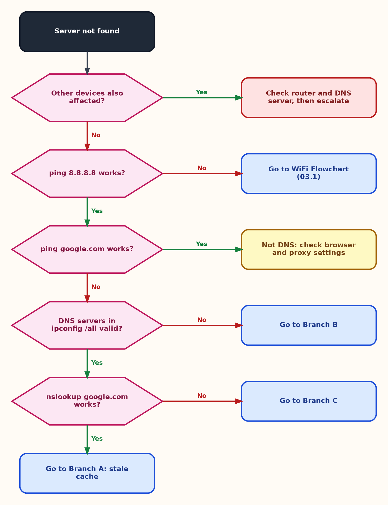
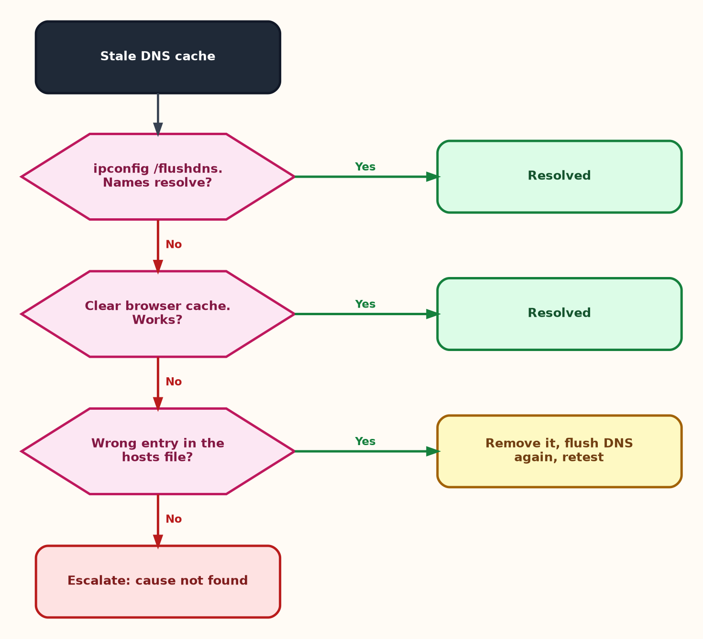
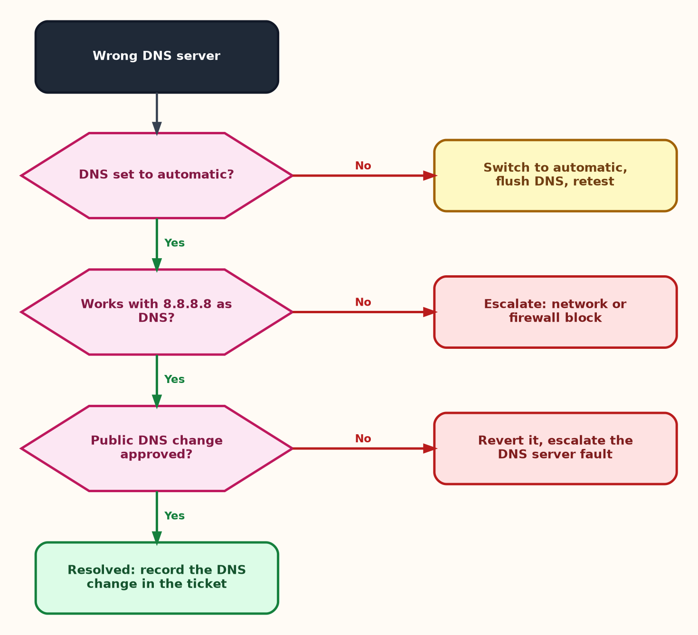
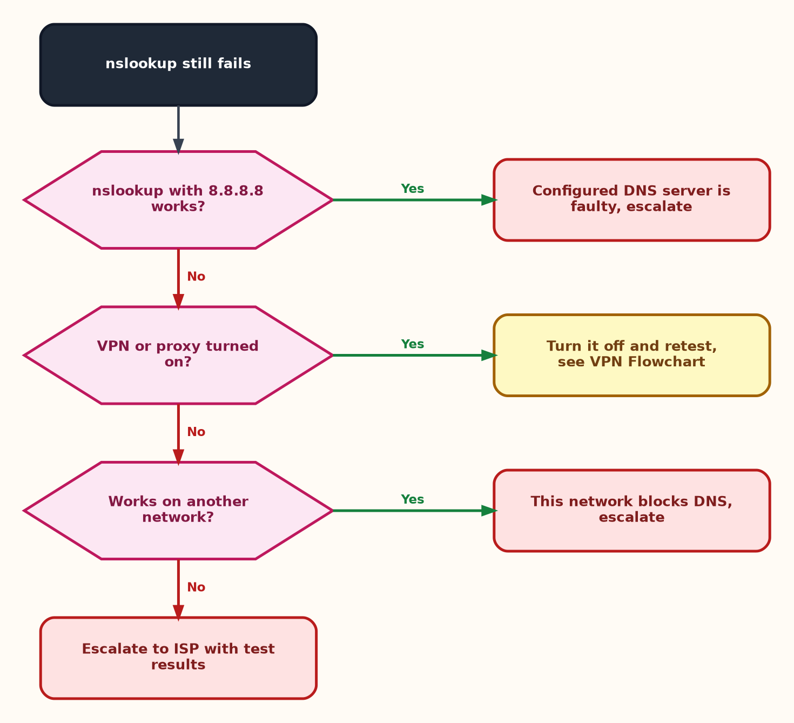

<div align="center">

# 🌐 DNS Troubleshooting — Flowcharts

**Troubleshooting Flowcharts — 03.5**

Windows Client · DNS Diagnostics · Escalation Decisions


"Server not found" can mean the internet is down, or only name lookup is broken. These flowcharts prove which one it is, then separate a stale cache from a wrong or faulty DNS server.

</div>

---

## 📑 Table of Contents

1. [At a Glance](#at-a-glance)
2. [Purpose](#purpose)
3. [Environment](#environment)
4. [Support Flow](#support-flow)
5. [Master Flowchart](#master)
6. [Branch A — Stale Cache](#branch-a)
7. [Branch B — Wrong DNS Server](#branch-b)
8. [Branch C — Lookup Still Fails](#branch-c)
9. [Escalation Evidence](#escalation)
10. [Command Reference](#commands)
11. [Customer Communication](#customer-communication)
12. [Scope & Limitations](#scope-limitations)
13. [What I Learned](#what-i-learned)
14. [Skills Demonstrated](#skills-demonstrated)
15. [Repo Structure](#repo-structure)

---

<a id="at-a-glance"></a>
## 📊 At a Glance

| 🗺️ Flowcharts | 🌿 Branches | 🔧 Tools Used | 📨 Escalation Targets |
|:---:|:---:|:---:|:---:|
| **4** | **3** | **3** | **3** |

---

<a id="purpose"></a>
## 📖 Purpose

Guessing wastes the customer's time and business hours. These flowcharts give every DNS ticket the same logic, ending in either a proven fix or a documented escalation.

- **Master Flowchart:** Checks scope and raw connectivity first, then the DNS servers and name lookup.
- **Branches A, B, C:** Stale cache, wrong DNS server, and lookups that still fail.
- **Escalation Evidence:** What to attach and who owns the next step.

> [!NOTE]
> Loading one website is not proof that the customer's work is fixed. Open their real service, such as the online store or payment page, before closing.

---

<a id="environment"></a>
## 🖧 Environment

| Item | Value |
|---|---|
| **Client OS** | Windows |
| **Shell** | Command Prompt (Run as Administrator) |
| **Test DNS server** | Google Public DNS (`8.8.8.8`), used only as a temporary test |
| **Related** | [WiFi Flowchart](03.1-WiFi-Flowchart.md) · [VPN Flowchart](03.3-VPN-Flowchart.md) · [DNS Video Script](../01-Video-knowledge-base/01.1-DNS-Resolution-Issue.md) |

---

<a id="support-flow"></a>
## ⏱️ Support Flow


<p align="center"><em>Colors mark each stage of the support process.</em></p>

---

<a id="master"></a>
## 🧭 Master Flowchart

<table>
<tr>
<td width="55%" align="center" valign="top">



</td>
<td width="45%" valign="top">

**How to read it**

1. Other devices affected? Check the router and DNS server, then escalate.
2. `ping 8.8.8.8` fails? The network is the problem. Go to the [WiFi Flowchart](03.1-WiFi-Flowchart.md).
3. `ping google.com` works? It is not DNS. Check the browser and proxy settings.
4. DNS servers in `ipconfig /all` look wrong? Go to **Branch B**.
5. `nslookup google.com` fails? Go to **Branch C**.
6. `nslookup` works but ping by name failed? Go to **Branch A** (stale cache).

<sub>Dark = start · Pink hexagon = check · Yellow = fix · Blue = go to another chart · Red = escalate · Green = resolved</sub>

</td>
</tr>
</table>

---

<a id="branch-a"></a>
## 🔵 Branch A — Stale Cache

<table>
<tr>
<td width="55%" align="center" valign="top">



</td>
<td width="45%" valign="top">

**How to read it**

1. Run `ipconfig /flushdns`. If names resolve, the issue is resolved.
2. Still failing? Clear the browser cache and retry.
3. Wrong entry in the hosts file? Remove it, flush DNS again and retest.
4. Still failing? Escalate. The cause is not found yet.

<sub>Flushing the cache only fixes a stale entry. It does not fix a wrong DNS server, so prove the cause first.</sub>

</td>
</tr>
</table>

---

<a id="branch-b"></a>
## 🟢 Branch B — Wrong DNS Server

<table>
<tr>
<td width="55%" align="center" valign="top">



</td>
<td width="45%" valign="top">

**How to read it**

1. DNS set manually? Switch to automatic, flush DNS and retest.
2. Set `8.8.8.8` as the DNS server to test. Still fails? A network or firewall block is likely, so escalate.
3. Works with `8.8.8.8` but the change is not approved? Revert it and escalate the DNS server fault.
4. Works and approved? Record the temporary change in the ticket.

<sub>On a business network, a public DNS can break internal names. Keep it temporary, get approval and note how to revert it.</sub>

</td>
</tr>
</table>

---

<a id="branch-c"></a>
## 🟠 Branch C — Lookup Still Fails

<table>
<tr>
<td width="55%" align="center" valign="top">



</td>
<td width="45%" valign="top">

**How to read it**

1. Run `nslookup google.com 8.8.8.8`. If it works, the configured DNS server is faulty, so escalate.
2. VPN or proxy turned on? Turn it off and retest. See the [VPN Flowchart](03.3-VPN-Flowchart.md).
3. Works on another network? This network blocks DNS, so escalate.
4. Fails everywhere? Escalate to the ISP with the test results.

<sub>Testing with a second DNS server tells you whether the problem is the server or the path to it.</sub>

</td>
</tr>
</table>

---

<a id="escalation"></a>
## 📨 Escalation Evidence

| Fault location | Send to |
|---|---|
| Router, DNS server, firewall | Network team |
| Internet or provider DNS outage | ISP |
| VPN, proxy or security software | Endpoint / security team |

Attach to the ticket: `ipconfig /all` output (showing the DNS servers), the `nslookup` results with and without `8.8.8.8`, the ping results, the exact error message, the start time, how many devices are affected, any temporary change made, and everything already tried, in order.

---

<a id="commands"></a>
## 💻 Command Reference

| Command | Used for |
|---|---|
| `ping 8.8.8.8` | Test the network without DNS |
| `ping google.com` | Test name resolution |
| `ipconfig /all` | Read which DNS servers the PC uses |
| `ipconfig /flushdns` | Clear the local DNS cache |
| `nslookup google.com` | Test lookup with the configured DNS server |
| `nslookup google.com 8.8.8.8` | Test lookup with a second DNS server |

---

<a id="customer-communication"></a>
## 🎧 Customer Communication

> *"Our online store couldn't process any orders while this was happening. I really need this fixed fast."*

- **During the fix:** "I understand orders are blocked, and I'm working on it now. I'll confirm as soon as the store is working again."
- **After the fix:** "The issue is fixed. Please place a test order to confirm. If it happens again, contact us right away and I'll check the DNS server settings."
- **If escalating:** "I've found the problem is on the network side, not your computer. I'm passing it on with everything I've collected, so you won't need to repeat yourself."

---

<a id="scope-limitations"></a>
## 🚧 Scope & Limitations

- **Windows client only.** Other devices use different steps.
- **Decision guides, not live tests.** The Windows steps were not re-run for every branch.
- **Root cause of a stale cache is not covered.** The charts separate cache from DNS server, not why an entry went stale.
- **Public DNS is a test, not a fix.** Its effect on internal business names is described, not tested.

---

<a id="what-i-learned"></a>
## 🧠 What I Learned

- **Separate DNS from connectivity first.** A raw IP ping shows which one you are dealing with.
- **Prove the cause.** A second DNS server shows whether the problem is the cache or the server.
- **Read the configured DNS server first.** `ipconfig /all` shows the real cause before anything is changed.
- **Verify the customer's real service.** A fixed search engine does not mean fixed orders.
- **Workarounds need a plan to revert.**

---

<a id="skills-demonstrated"></a>
## 🛠️ Skills Demonstrated

- Diagnosing DNS failures with `ping`, `nslookup` and `ipconfig`
- Separating cache problems from DNS server problems
- Handling temporary workarounds with approval and a revert plan
- Building clear decision flowcharts
- Writing escalation evidence and customer updates

---

<a id="repo-structure"></a>
## 📁 Repo Structure

```text
03-Troubleshooting-flowcharts/
|-- 03.1-WiFi-Flowchart.md
|-- 03.2-Email-Flowchart.md
|-- 03.3-VPN-Flowchart.md
|-- 03.4-Printer-Flowchart.md
|-- 03.5-DNS-Flowchart.md
|-- README.md
`-- screenshots/
    |-- WiFi_*.PNG
    |-- Email_*.PNG
    |-- VPN_*.PNG
    |-- Printer_*.PNG
    |-- DNS_Master_Flowchart.PNG
    |-- DNS_BranchA_Stale_Cache.PNG
    |-- DNS_BranchB_Wrong_DNS_Server.PNG
    `-- DNS_BranchC_Lookup_Still_Fails.PNG
```
