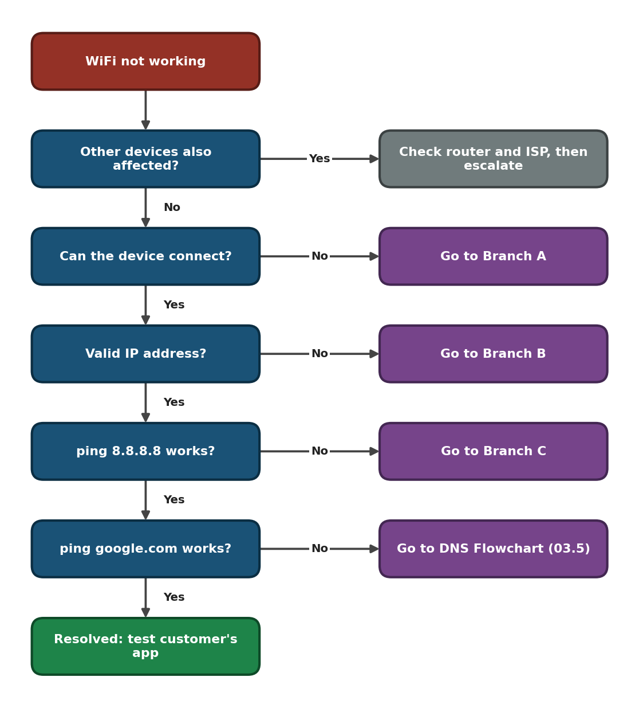
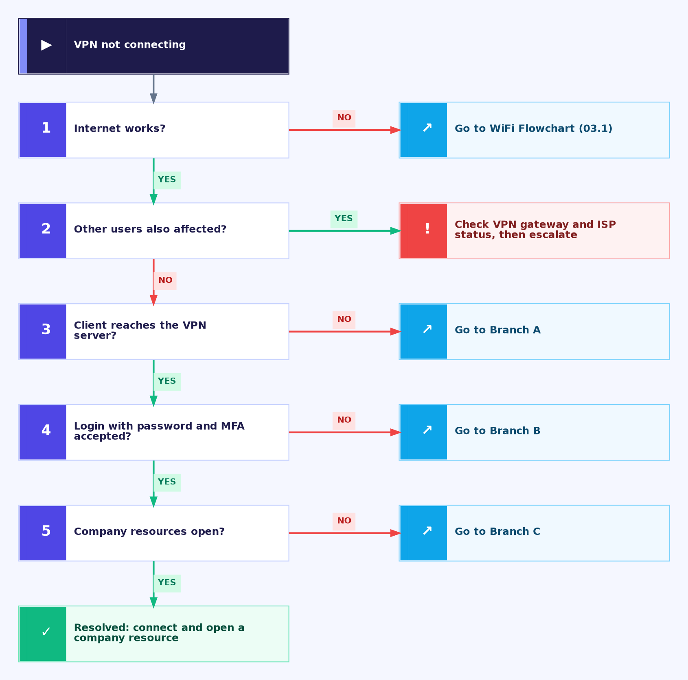

<div align="center">

# 🧭 Troubleshooting Flowcharts

**Folder 03 — Customer Tech Support Portfolio**

Windows Client · Decision Flowcharts · Escalation Decisions


Five decision flowcharts for the most common support tickets. Each one turns a vague complaint such as "WiFi is not working" into a short series of yes/no checks that ends in a fix or a documented escalation.

</div>

---

## 📑 Table of Contents

1. [At a Glance](#at-a-glance)
2. [Flowchart Index](#flowchart-index)
3. [Preview](#preview)
4. [How to Use](#how-to-use)
5. [How Each File Is Built](#how-each-file-is-built)
6. [Quick Escalation Guide](#quick-escalation-guide)
7. [How the Flowcharts Connect](#connect)
8. [Related Folders](#related-folders)
9. [Scope & Limitations](#scope-limitations)
10. [Skills Demonstrated](#skills-demonstrated)
11. [Repo Structure](#repo-structure)

---

<a id="at-a-glance"></a>
## 📊 At a Glance

| 🗺️ Flowcharts | 🖼️ Diagrams | 🌿 Branches | 📨 Escalation Targets |
|:---:|:---:|:---:|:---:|
| **5** | **20** | **15** | **6** |

---

<a id="flowchart-index"></a>
## 📚 Flowchart Index

| # | Flowchart | Customer complaint | Branches | File |
|:---:|---|---|---|---|
| **03.1** | 📶 WiFi | "WiFi is not working" | Cannot connect · No valid IP · No internet or weak signal | [03.1-WiFi-Flowchart.md](03.1-WiFi-Flowchart.md) |
| **03.2** | 📧 Email | "Email is not working" | Cannot sign in · Cannot send · Not receiving | [03.2-Email-Flowchart.md](03.2-Email-Flowchart.md) |
| **03.3** | 🔐 VPN | "VPN won't connect" | Cannot reach server · Login rejected · Connected but no access | [03.3-VPN-Flowchart.md](03.3-VPN-Flowchart.md) |
| **03.4** | 🖨️ Printer | "Printer is offline" | Offline or unreachable · Stuck queue · Test page fails | [03.4-Printer-Flowchart.md](03.4-Printer-Flowchart.md) |
| **03.5** | 🌐 DNS | "Server not found" | Stale cache · Wrong DNS server · Lookup still fails | [03.5-DNS-Flowchart.md](03.5-DNS-Flowchart.md) |

---

<a id="preview"></a>
## 🖼️ Preview

Master flowchart of each file. Click a title to open the full file.

<table>
<tr>
<td align="center" valign="top" width="33%">

**[📶 WiFi](03.1-WiFi-Flowchart.md)**<br>


</td>
<td align="center" valign="top" width="33%">

**[📧 Email](03.2-Email-Flowchart.md)**<br>


</td>
<td align="center" valign="top" width="33%">

**[🔐 VPN](03.3-VPN-Flowchart.md)**<br>


</td>
</tr>
<tr>
<td align="center" valign="top" width="33%">

**[🖨️ Printer](03.4-Printer-Flowchart.md)**<br>


</td>
<td align="center" valign="top" width="33%">

**[🌐 DNS](03.5-DNS-Flowchart.md)**<br>


</td>
<td></td>
</tr>
</table>

---

<a id="how-to-use"></a>
## 🧭 How to Use


<p align="center"><em>The same five stages apply to every flowchart in this folder.</em></p>

1. **Pick the flowchart** that matches the customer's complaint from the [index](#flowchart-index).
2. **Start at the Master Flowchart.** Its first check is always the scope: one device or many.
3. **Follow the Yes/No arrows** in order. The numbers on the checks match the numbered steps next to each chart.
4. **Open the branch** the Master Flowchart points to, and work through it one change at a time.
5. **Verify the customer's real service** (their app, store, file or document), not only a test site.
6. **Escalate with evidence** if a branch ends in escalation. Each file lists exactly what to attach.

---

<a id="how-each-file-is-built"></a>
## 🧱 How Each File Is Built

Every flowchart file has the same layout, so once you know one, you know all five.

| Section | What it gives you |
|---|---|
| **Master Flowchart** | The main path. Checks scope first, then one layer at a time |
| **Branches A, B, C** | One chart per cause, each with a numbered step list beside it |
| **Escalation Evidence** | Who owns the next step and what to attach to the ticket |
| **Command Reference** | The Windows commands used, and what each one tests |
| **Customer Communication** | What to say during the fix, after the fix, and when escalating |
| **Scope & Limitations** | What the flowchart does not cover |

> [!NOTE]
> Each file has its own colour style so the five charts are easy to tell apart. The logic is the same in all of them: a check, a Yes/No exit, and a clear end.

---

<a id="quick-escalation-guide"></a>
## 📨 Quick Escalation Guide

| Problem found | Send to | Seen in |
|---|---|---|
| Router, access point, DHCP, RADIUS, DNS server, firewall, VPN gateway, print server | Network team | WiFi, VPN, Printer, DNS |
| Mail server, filtering, mailbox, delivery bounces | Email / mail admin team | Email |
| Locked account, MFA, password policy | Identity / account admin team | Email, VPN |
| Internet, provider or provider DNS outage | ISP / provider | WiFi, Email, VPN, DNS |
| Driver, adapter, proxy or security software, spooler problems | Endpoint / security team | WiFi, Printer, DNS |
| Printer hardware fault | Printer vendor or repair service | Printer |

---

<a id="connect"></a>
## 🔗 How the Flowcharts Connect

Many tickets cross over, so the charts point to each other instead of repeating steps.

| From | Points to | When |
|---|---|---|
| Email, VPN, Printer, DNS | [WiFi](03.1-WiFi-Flowchart.md) | The internet or network link itself is not working |
| WiFi, VPN | [DNS](03.5-DNS-Flowchart.md) | Pinging an IP works but pinging a name fails |
| DNS | [VPN](03.3-VPN-Flowchart.md) | A VPN or proxy may be changing the DNS path |

---

<a id="related-folders"></a>
## 🗂️ Related Folders

| Folder | How it connects |
|---|---|
| [01-Video-knowledge-base](../01-Video-knowledge-base/) | Video scripts that walk through the same problems |
| [02-Ticket-simulations](../02-Ticket-simulations/) | Practice tickets where these flowcharts are applied |
| [04-Solution-guides](../04-Solution-guides/) | Step-by-step fixes for the problems found here |
| [05-Escalation-scripts](../05-Escalation-scripts/) | Ready-to-send messages for the escalation paths |

---

<a id="scope-limitations"></a>
## 🚧 Scope & Limitations

- **Windows clients only.** Other operating systems use different commands.
- **Decision guides, not live tests.** The flowcharts were not run against a live outage.
- **Support-agent access only.** Changing router, server, firewall or gateway settings is outside these charts, so they end in escalation.
- **Vendor settings vary.** Email, VPN and printer settings depend on the provider or company, so follow their published settings.

---

<a id="skills-demonstrated"></a>
## 🛠️ Skills Demonstrated

- Structured troubleshooting logic for WiFi, email, VPN, printer and DNS faults
- Separating client, network, account, server and provider faults
- Using `ping`, `nslookup`, `ipconfig` and `netsh` for diagnosis
- Building clear decision flowcharts and numbered step guides
- Writing escalation evidence and customer updates

---

<a id="repo-structure"></a>
## 📁 Repo Structure

```text
03-Troubleshooting-flowcharts/
|-- README.md
|-- 03.1-WiFi-Flowchart.md
|-- 03.2-Email-Flowchart.md
|-- 03.3-VPN-Flowchart.md
|-- 03.4-Printer-Flowchart.md
|-- 03.5-DNS-Flowchart.md
`-- screenshots/
    |-- WiFi_Master_Flowchart.PNG
    |-- WiFi_BranchA_Cannot_Connect.PNG
    |-- WiFi_BranchB_No_Valid_IP.PNG
    |-- WiFi_BranchC_No_Internet_Weak_Signal.PNG
    |-- Email_Master_Flowchart.PNG
    |-- Email_BranchA_Cannot_Sign_In.PNG
    |-- Email_BranchB_Cannot_Send.PNG
    |-- Email_BranchC_Not_Receiving.PNG
    |-- VPN_Master_Flowchart.PNG
    |-- VPN_BranchA_Cannot_Reach_Server.PNG
    |-- VPN_BranchB_Login_Rejected.PNG
    |-- VPN_BranchC_Connected_No_Access.PNG
    |-- Printer_Master_Flowchart.PNG
    |-- Printer_BranchA_Offline_Unreachable.PNG
    |-- Printer_BranchB_Stuck_Queue.PNG
    |-- Printer_BranchC_Test_Page_Fails.PNG
    |-- DNS_Master_Flowchart.PNG
    |-- DNS_BranchA_Stale_Cache.PNG
    |-- DNS_BranchB_Wrong_DNS_Server.PNG
    `-- DNS_BranchC_Lookup_Still_Fails.PNG
```

<div align="center">

🌐 **[DNS Basics](https://www.cloudflare.com/learning/dns/what-is-dns/)** · 🪟 **[Windows Commands](https://learn.microsoft.com/windows-server/administration/windows-commands/windows-commands)** · 🧭 **[Flowchart Index](#flowchart-index)**

</div>
