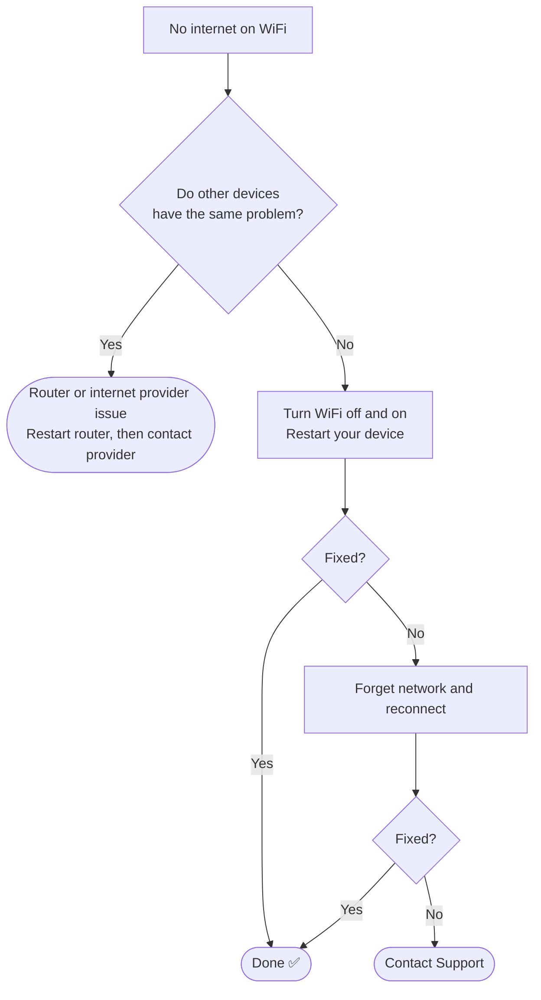

# 📄 Solution Guide: WiFi Connected but No Internet

> Plain-language steps for customers. No special tools needed.

## 🎯 Who This Guide Is For

People whose WiFi shows **"Connected"** but websites and apps will not load, or whose WiFi keeps dropping.

---

## 🔍 Common Symptoms

- "My WiFi says connected, but no websites load."
- "The internet works on my phone but not on my laptop."
- "My connection keeps dropping every few minutes."

---

## ⏱️ At a Glance

| | |
|---|---|
| **Time needed** | About 10 minutes |
| **Difficulty** | Easy |
| **You will need** | Your WiFi password and access to your router |

---

## ✅ Self-Help Steps

### Step 1 — Check who else is affected
Try another phone, tablet or laptop on the same WiFi.
- **Other devices also have no internet:** the problem is most likely the router or your internet provider. Go to Step 4.
- **Only one device has the problem:** the problem is on that device. Continue with Step 2.

### Step 2 — Turn WiFi off and on
Click the WiFi icon in the taskbar, disconnect, wait a few seconds, then reconnect. Also make sure **Airplane mode** is off.

**What you should see:** the WiFi name shows "Connected" and a website opens.

### Step 3 — Restart your computer
A restart clears many temporary network faults. Try a website again once it starts up.

### Step 4 — Restart your router
1. Unplug the router's power cable.
2. Wait **10 seconds**.
3. Plug it back in.
4. Wait about **2 minutes** until the lights settle, then test again.

### Step 5 — Forget the network and join it again
1. Open **Settings → Network & Internet → Wi-Fi → Manage known networks**.
2. Select your network and choose **Forget**.
3. Reconnect and enter the WiFi password again.

Keep your WiFi password nearby before you do this step.

### Step 6 — Try a different website or app
If some sites open and others do not, tell support which ones fail. This helps us decide whether it is a website problem or a connection problem.

<details>
<summary><b>For confident users: clear the saved website-address cache</b></summary>

If WiFi is connected and the internet works on other devices, the computer may be holding an old website-address entry. Open **Command Prompt**, type the line below and press Enter:

```cmd
ipconfig /flushdns
```

You should see "Successfully flushed the DNS Resolver Cache." Then try a website again.

</details>

---

## 🧭 Quick Decision Guide



---

## ⚠️ Please Don't

- Do not press the router's **reset** button. It erases your WiFi name and password settings.
- Do not connect to unknown open WiFi networks just to get online.

---

## 🛡️ How to Prevent It

- Restart your router once a month.
- Keep the router in an open place, away from thick walls and other electronics.
- Keep your WiFi password written down somewhere safe.

---

## 📞 When to Contact Support

Contact us if the steps above did not help. Please have this ready:

- [ ] Does WiFi show "Connected" but pages do not load, or does it fail to connect at all?
- [ ] Is it one device or every device?
- [ ] Which steps from this guide you already tried
- [ ] When the problem started and whether anything changed (new router, power cut, moved the router)

## ❓ Quick FAQ

**Why does it say "connected" when I have no internet?**
Your device is talking to the router, but the router (or the internet provider behind it) is not passing traffic through.

**Is it safe to restart the router?**
Yes. Unplugging and plugging it back in does not erase your settings.

## 🔗 Related Material

- 🎥 [Video knowledge base](../01-Video-knowledge-base/) — the step-by-step lab behind this guide
- 🎫 [Ticket simulations](../02-Ticket-simulations/) — how this issue looks as a real support ticket
- 🧭 [Troubleshooting flowcharts](../03-Troubleshooting-flowcharts/) — the technical decision tree
- 📨 [Escalation scripts](../05-Escalation-scripts/) — what support sends when it needs to escalate

---

[⬅ Back to Solution Guides](./README.md) · [🏠 Portfolio Home](../README.md)
