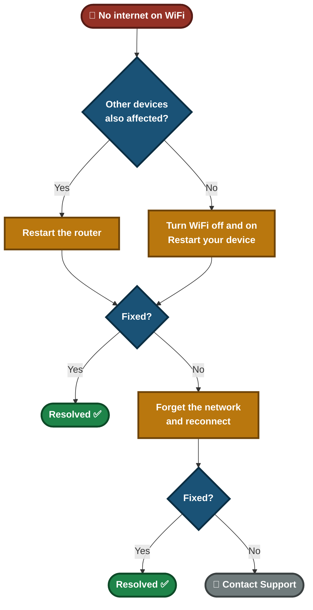
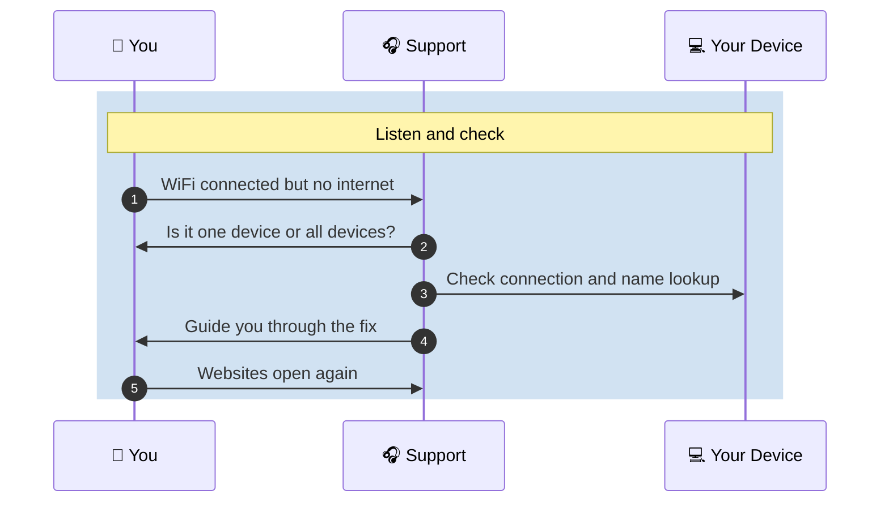

<div align="center">

# 📄 Solution Guide — WiFi Connected but No Internet

**Customer Solution Guide 04.1** · Plain language · No special tools needed


Your device says it is **connected** to WiFi, but websites and apps will not load. This guide helps you find out whether the fault is your device, your router or your internet provider, and fix the common causes yourself.

</div>

---

## 📑 Table of Contents

1. [At a Glance](#at-a-glance)
2. [Who This Guide Is For](#who)
3. [Common Symptoms](#symptoms)
4. [What Is Happening](#what-happening)
5. [Self-Help Steps](#steps)
6. [Quick Decision Guide](#decision)
7. [Quick Reference Card](#quick-ref)
8. [Please Don't](#donts)
9. [How to Prevent It](#prevent)
10. [When to Contact Support](#contact)
11. [Quick FAQ](#faq)
12. [Related Material](#related)

---

<a id="at-a-glance"></a>
## 📊 At a Glance

| ⏱️ Time Needed | 🎚️ Difficulty | 🧰 You Will Need | 🪜 Steps |
|:---:|:---:|:---:|:---:|
| **About 10 minutes** | **Easy** | **WiFi password, access to your router** | **6** |

---

<a id="who"></a>
## 🎯 Who This Guide Is For

People whose WiFi shows **"Connected"** but pages do not load, or whose WiFi keeps dropping. It works for laptops, phones and tablets, at home or in a small office.

---

<a id="symptoms"></a>
## 🔍 Common Symptoms

| What you notice | What it usually means |
|---|---|

| "My WiFi says connected, but no websites load" | The device reaches the router, but traffic is not getting through to the internet |
| "The internet works on my phone but not on my laptop" | The problem is on that one device |
| "Nothing works on any of my devices" | Most likely the router or the internet provider |
| "It keeps dropping every few minutes" | Weak signal, router needs a restart, or interference |

---

<a id="what-happening"></a>
## 🗺️ What Is Happening

WiFi has several links in a chain. **"Connected"** only proves the first links work. The fault can sit further along the chain.


- **Only one device fails:** look at your device and its WiFi settings.
- **Every device fails:** look at the router and the internet provider.
- This guide checks the chain from left to right.

---

<a id="steps"></a>
## ✅ Self-Help Steps

> [!TIP]
> Change one thing at a time and test a website after each step. That way you know which step fixed it.

### Step 1 — Check who else is affected

Try another phone, tablet or laptop on the same WiFi.

> ✅ **You should see:** A clear answer: either **only one device** has no internet, or **all devices** have none.

> ➡️ **If not:** If all devices are affected, go straight to Step 4 (restart the router).

### Step 2 — Turn WiFi off and on

1. Click the WiFi icon in the taskbar and disconnect.
2. Wait a few seconds, then reconnect.
3. Make sure **Airplane mode** is off.

> ✅ **You should see:** The WiFi name shows "Connected" and a website opens.

> ➡️ **If not:** Continue to Step 3.

### Step 3 — Restart your computer

A restart clears many temporary network faults. Try a website again once it has started.

> ✅ **You should see:** Websites open normally.

> ➡️ **If not:** Continue to Step 4.

### Step 4 — Restart your router

1. Unplug the router's power cable.
2. Wait **10 seconds**.
3. Plug it back in.
4. Wait about **2 minutes** until the lights are steady.

> ✅ **You should see:** The internet light on the router is steady and websites open.

> ➡️ **If not:** Continue to Step 5.

### Step 5 — Forget the network and join it again

1. Open **Settings → Network & Internet → Wi-Fi → Manage known networks**.
2. Select your network and choose **Forget**.
3. Reconnect and type the WiFi password again.

> ✅ **You should see:** A fresh connection with a working internet.

> ➡️ **If not:** Continue to Step 6.

### Step 6 — Try a different website or app

If some sites open and others do not, note which ones fail. This helps us tell a website problem from a connection problem.

> ✅ **You should see:** You know whether **everything** fails or only **some** sites.

> ➡️ **If not:** Contact support with that information.

<details>
<summary><b>For confident users: two quick checks in Command Prompt</b></summary>

Open **Command Prompt** and run the lines below, one at a time.

```cmd
ping 8.8.8.8
```
If this gets replies but websites will not open, the connection works and only **name lookup** is failing. Tell support this exact result.

```cmd
ipconfig /flushdns
```
This clears saved website addresses. You should see "Successfully flushed the DNS Resolver Cache." Then try a website again.

</details>


---

<a id="decision"></a>
## 🧭 Quick Decision Guide



---

<a id="quick-ref"></a>
## 🧰 Quick Reference Card

| If this happens | Try this first |
|---|---|
| Only my laptop has no internet | Turn WiFi off and on, then restart the laptop |
| Nobody in the house has internet | Restart the router and wait 2 minutes |
| Some websites open, others do not | Note which ones fail and tell support |
| WiFi drops every few minutes | Move closer to the router, then restart it |
| WiFi name is missing from the list | Restart the router, then check the router lights |

---

<a id="donts"></a>
## ⚠️ Please Don't

> [!WARNING]
> Do not press the router's **reset** button. It erases the WiFi name and password settings.

> [!WARNING]
> Do not join unknown open WiFi networks just to get online.

> [!WARNING]
> Do not unplug and replug the router many times in a row. Wait the full 2 minutes after each restart.

---

<a id="prevent"></a>
## 🛡️ How to Prevent It

- Restart the router about once a month.
- Keep the router in an open place, away from thick walls and other electronics.
- Write your WiFi password down and keep it somewhere safe.
- Update the router when your internet provider tells you to.

---

<a id="contact"></a>
## 📞 When to Contact Support

> [!IMPORTANT]
> If the steps above did not help, contact us. A few details up front saves a lot of time.

**Please have this ready:**

- [ ] Does WiFi show "Connected" but pages do not load, or does it fail to connect at all?
- [ ] Is it one device or every device?
- [ ] Which steps from this guide you already tried
- [ ] When it started and what changed (new router, power cut, moved the router)

**What happens when you contact us:**



---

<a id="faq"></a>
## ❓ Quick FAQ

<details>
<summary><b>Why does it say "connected" when I have no internet?</b></summary>

Your device is talking to the router, but the router or the internet provider behind it is not passing traffic through.

</details>

<details>
<summary><b>Is it safe to restart the router?</b></summary>

Yes. Unplugging and plugging it back in does not erase your settings.

</details>

<details>
<summary><b>How long should I wait after restarting the router?</b></summary>

About 2 minutes. Test only when the lights are steady.

</details>

---

<a id="related"></a>
## 🔗 Related Material

- 🎥 **[Video knowledge base](../01-Video-knowledge-base/)** — the step-by-step lab behind this guide
- 🎫 **[Ticket simulations](../02-Ticket-simulations/)** — how this issue looks as a real support ticket
- 🧭 **[Troubleshooting flowcharts](../03-Troubleshooting-flowcharts/)** — the technical decision tree
- 📨 **[Escalation scripts](../05-Escalation-scripts/)** — what support sends when it has to escalate

---

<div align="center">

[⬅ Back to Solution Guides](./README.md) · [🏠 Portfolio Home](../README.md)

</div>
