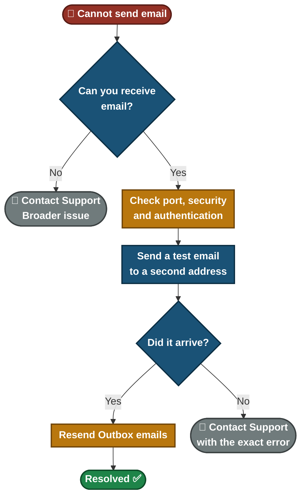
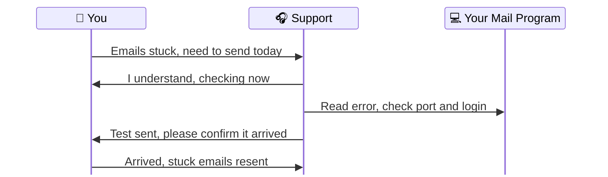

<div align="center">

# 📄 Solution Guide — Email Not Sending

**Customer Solution Guide 04.2** · Plain language · No special tools needed


You can **receive** email but cannot **send** it, or your emails are stuck in the **Outbox**. This guide fixes the common causes one setting at a time and shows you how to prove the email really arrived.

</div>

---

## 📑 Table of Contents

1. [At a Glance](#at-a-glance)
2. [Who This Guide Is For](#who)
3. [Common Symptoms](#symptoms)
4. [What Is Happening](#what-happening)
5. [Self-Help Steps](#steps)
6. [Quick Decision Guide](#decision)
7. [Quick Reference Card](#quick-ref)
8. [Please Don't](#donts)
9. [How to Prevent It](#prevent)
10. [When to Contact Support](#contact)
11. [Quick FAQ](#faq)
12. [Related Material](#related)

---

<a id="at-a-glance"></a>
## 📊 At a Glance

| ⏱️ Time Needed | 🎚️ Difficulty | 🧰 You Will Need | 🪜 Steps |
|:---:|:---:|:---:|:---:|
| **About 15 minutes** | **Easy to medium** | **Email password, a second email address you can check** | **7** |

---

<a id="who"></a>
## 🎯 Who This Guide Is For

People using Outlook, Thunderbird or a phone mail app who can read new mail but cannot send. It also helps when an urgent email is stuck and must go out today.

---

<a id="symptoms"></a>
## 🔍 Common Symptoms

| What you notice | What it usually means |
|---|---|

| "My emails stay stuck in the Outbox" | The mail program cannot reach or log in to the outgoing server |
| "I get an error when I press Send, but new mail arrives" | Receiving works, sending settings are wrong or the password changed |
| "Only one email will not send" | Often a large attachment |
| "It says Sent, but nobody got it" | Delivered to spam, or not really sent |

---

<a id="what-happening"></a>
## 🗺️ What Is Happening

**Receiving** and **sending** email use different servers and different settings. When only sending fails, the fault is usually in the **outgoing (SMTP)** setup.


- Each box is a place your email can fail.
- The **exact error message** usually points at one of them. Always write it down first.

---

<a id="steps"></a>
## ✅ Self-Help Steps

> [!TIP]
> Change one setting at a time and send a short test email after each change. If you change several together you cannot tell which one fixed it.

### Step 1 — Write down the exact error message

Copy or note the full message. It usually names the cause, and support will ask for it.

> ✅ **You should see:** You have the message saved.

> ➡️ **If not:** Take a note of what you did right before the error.

### Step 2 — Make sure the mail program is online

In Outlook, open the **Send/Receive** tab and check that **Work Offline** is **not** switched on.

> ✅ **You should see:** Work Offline is off.

> ➡️ **If not:** Continue to Step 3.

### Step 3 — Check the outgoing port and security

1. Open your account settings and find the **outgoing (SMTP) server**.
2. Compare it with the port table at the end of the steps.

> ✅ **You should see:** Port **587** with **STARTTLS**, or port **465** with **SSL/TLS**.

> ➡️ **If not:** Change it to match your provider's help page.

### Step 4 — Turn on authentication

Tick **"Outgoing server requires authentication"** and use the same email and password as incoming mail. This is the setting people miss most often.

> ✅ **You should see:** The outgoing server now asks for your login.

> ➡️ **If not:** Continue to Step 5.

### Step 5 — Check your password

If you changed your password recently, update it in the mail program. Some providers (for example Gmail) need an **app password** or a **"Sign in with Google"** step instead of the normal password.

> ✅ **You should see:** The program accepts the login.

> ➡️ **If not:** Continue to Step 6.

### Step 6 — Send a test email to a second address

Send a short message to a **different email address you own**. "Sent" on your screen does not prove delivery.

> ✅ **You should see:** The message arrives at the second address (check Spam too).

> ➡️ **If not:** Go back and change the next setting, then test again.

### Step 7 — Send the stuck emails again

1. Open the **Outbox** and resend the waiting emails (in Thunderbird: **File → Send Unsent Messages**).
2. Check that the Outbox is empty afterwards.

> ✅ **You should see:** The Outbox is empty and your recipients receive their emails.

> ➡️ **If not:** Contact support with the exact error message.

<details>
<summary><b>Port reference table</b></summary>

| Port | Security | Notes |
|:---:|---|---|
| **587** | STARTTLS | Standard secure sending port. Try this first. |
| **465** | SSL/TLS | Used by some providers instead of 587. |
| **25** | Usually none | Many internet providers block it. Avoid it. |

</details>

<details>
<summary><b>For confident users: test whether the port is reachable</b></summary>

In **PowerShell**, replace the server name with your provider's outgoing server:

```powershell
Test-NetConnection smtp.example.com -Port 587
```
`TcpTestSucceeded : True` means the connection is open. `False` means the port is blocked on your network. Tell support the result.

</details>


---

<a id="decision"></a>
## 🧭 Quick Decision Guide



---

<a id="quick-ref"></a>
## 🧰 Quick Reference Card

| If this happens | Try this first |
|---|---|
| Emails stuck in the Outbox | Check port 587 + STARTTLS and turn authentication on |
| Error mentions "authentication" or "password" | Update the password, or use an app password |
| Error mentions "cannot connect" | Check the port and your internet connection |
| Only one email fails | Reduce the attachment size (about 25 MB is the usual limit) |
| Email sent but not received | Ask the recipient to check their Spam folder |

---

<a id="donts"></a>
## ⚠️ Please Don't

> [!WARNING]
> Do not send the same email many times. It can fill the Outbox with duplicates.

> [!WARNING]
> Do not share your email password with anyone, including by chat or email.

> [!WARNING]
> Do not type your password into a page you reached from an unexpected message. It may be a fake login page.

---

<a id="prevent"></a>
## 🛡️ How to Prevent It

- Update your saved email password on every device right after you change it.
- Keep large files out of email. Use a sharing link instead.
- Remember that some networks (home and mobile) block port 25.
- Keep your mail program up to date.

---

<a id="contact"></a>
## 📞 When to Contact Support

> [!IMPORTANT]
> Send us the **exact error message**. It usually names the cause and lets us skip many questions.

**Please have this ready:**

- [ ] The exact error message
- [ ] Which mail program you use (Outlook, Thunderbird, phone app)
- [ ] Whether you can receive email
- [ ] What changed recently (new password, new device, new network)
- [ ] Whether an urgent email is stuck right now

**What happens when you contact us:**



---

<a id="faq"></a>
## ❓ Quick FAQ

<details>
<summary><b>I can receive email. Why can't I send?</b></summary>

Receiving and sending use different servers and settings. Sending needs its own correct port, security and login.

</details>

<details>
<summary><b>The email says "Sent" but nobody got it.</b></summary>

It may have been delivered and then filtered. Ask the recipient to check Spam, and send a test to a second address.

</details>

<details>
<summary><b>Which port should I use?</b></summary>

Start with 587 and STARTTLS. If your provider says 465, use that with SSL/TLS.

</details>

---

<a id="related"></a>
## 🔗 Related Material

- 🎥 **[Video knowledge base](../01-Video-knowledge-base/)** — the step-by-step lab behind this guide
- 🎫 **[Ticket simulations](../02-Ticket-simulations/)** — how this issue looks as a real support ticket
- 🧭 **[Troubleshooting flowcharts](../03-Troubleshooting-flowcharts/)** — the technical decision tree
- 📨 **[Escalation scripts](../05-Escalation-scripts/)** — what support sends when it has to escalate

---

<div align="center">

[⬅ Back to Solution Guides](./README.md) · [🏠 Portfolio Home](../README.md)

</div>
