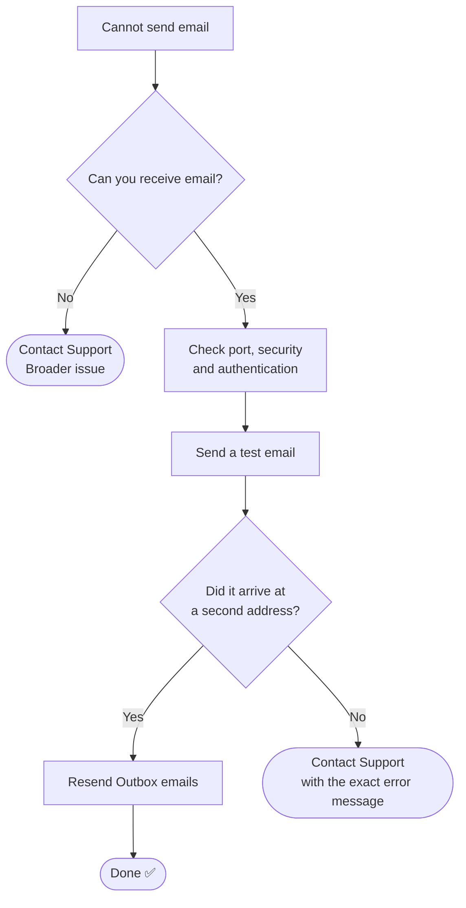

# 📄 Solution Guide: Email Not Sending

> Plain-language steps for customers. No special tools needed.

## 🎯 Who This Guide Is For

People who can **receive** email but cannot **send** it, or whose emails stay stuck in the **Outbox**.

---

## 🔍 Common Symptoms

- "My emails stay stuck in the Outbox and never send."
- "I get an error when I press Send, but new mail arrives fine."
- "I need to send an important email today and it will not go."

---

## ⏱️ At a Glance

| | |
|---|---|
| **Time needed** | About 15 minutes |
| **Difficulty** | Easy to medium |
| **You will need** | Your email password, and a second email address you can check |

---

## ✅ Self-Help Steps

### Step 1 — Write down the exact error message
Copy or note the full message you see. It usually names the cause, and support will ask for it.

### Step 2 — Make sure your mail program is online
In Outlook, open the **Send/Receive** tab and check that **Work Offline** is not switched on.

### Step 3 — Check the outgoing server port and security
Open your account settings and find the **outgoing (SMTP) server**.

| Setting | Usually correct | Why |
|---|---|---|
| Port **587** | Security: **STARTTLS** | The standard secure sending port |
| Port **465** | Security: **SSL/TLS** | Used by some providers instead |
| Port **25** | Avoid | Many internet providers block it |

Your email provider's help page lists the exact values for your account.

### Step 4 — Turn on authentication
Make sure **"Outgoing server requires authentication"** is ticked, using the same email address and password as incoming mail. This is the setting people miss most often.

### Step 5 — Check your password
If you changed your password recently, update it in the mail program. Some providers (for example Gmail) need an **app password** or a **"Sign in with Google"** step instead of your normal password.

### Step 6 — Change one setting at a time and test
Change **one** setting, then send a short test email. If you change several things together, you cannot tell which one fixed it.

### Step 7 — Confirm the email really arrived
"Sent" on your screen does not prove delivery. Send a test message to a **different email address you own** and check that it arrives (look in Spam too).

### Step 8 — Send the stuck emails again
Open the **Outbox** (in Thunderbird: **File → Send Unsent Messages**). When the Outbox is empty, the stuck emails have gone.

### If only one email fails
Check the attachment size. Most providers allow about **25 MB** per email.

---

## 🧭 Quick Decision Guide

---

## ⚠️ Please Don't

- Do not send the same email many times. It can fill the Outbox with duplicates.
- Do not share your email password with anyone, including by email or chat.
- Do not type your password into a page you reached from an unexpected message.

---

## 🛡️ How to Prevent It

- Update your saved email password on every device after you change it.
- Keep large files out of email. Use a sharing link instead.
- If you travel or work from home, remember that some networks block port 25.

---

## 📞 When to Contact Support

Please have this ready:

- [ ] The exact error message
- [ ] Which email program you use (Outlook, Thunderbird, phone app)
- [ ] Whether you can receive email
- [ ] What changed recently (new password, new device, new network)

## ❓ Quick FAQ

**I can receive email. Why can't I send?**
Receiving and sending use different servers and settings. Sending needs its own correct port, security and login.

**The email says "Sent" but my client never got it.**
It may have been sent and then filtered. Ask the recipient to check their Spam folder.

## 🔗 Related Material

- 🎥 [Video knowledge base](../01-Video-knowledge-base/) — the step-by-step lab behind this guide
- 🎫 [Ticket simulations](../02-Ticket-simulations/) — how this issue looks as a real support ticket
- 🧭 [Troubleshooting flowcharts](../03-Troubleshooting-flowcharts/) — the technical decision tree
- 📨 [Escalation scripts](../05-Escalation-scripts/) — what support sends when it needs to escalate

---

[⬅ Back to Solution Guides](./README.md) · [🏠 Portfolio Home](../README.md)
