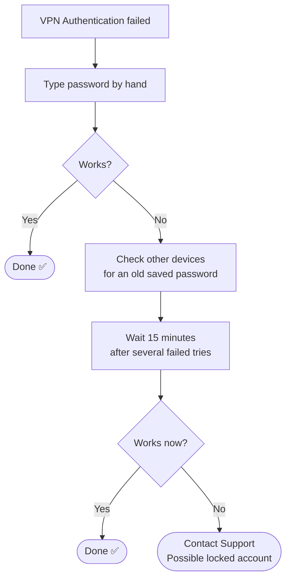

# 📄 Solution Guide: VPN "Authentication Failed"

> Plain-language steps for customers. No special tools needed.

## 🎯 Who This Guide Is For

People who cannot connect to the company VPN, especially when it says **"Authentication failed"** even though the password seems correct.

---

## 🔍 Common Symptoms

- "VPN says Authentication failed, but my password is correct."
- "It worked yesterday, today it will not let me in."
- "I tried a few times and now it keeps rejecting me."

---

## ⏱️ At a Glance

| | |
|---|---|
| **Time needed** | About 15 to 20 minutes (including a short wait) |
| **Difficulty** | Easy |
| **You will need** | Your account password, and your phone or other devices that use the VPN |

---

## ✅ Self-Help Steps

### Step 1 — Type the password by hand
Do not use autofill. Check that **Caps Lock** is off and the keyboard language is correct. Use the "show password" eye icon to check what you typed.

### Step 2 — Check other devices for an old password
A phone, tablet or second laptop may still hold your **old** saved password and keep trying it in the background. Each wrong try counts as a failed attempt, and several failures can lock your account. Update the password everywhere, or remove the saved VPN connection from devices you no longer use.

### Step 3 — Wait before trying again
If you have had several failed attempts, **wait about 15 minutes** before retrying. The exact time depends on your company's rules. Waiting stops you from extending the lockout.

### Step 4 — Restart the VPN app and your computer
Close the VPN program fully and open it again. If the app has been open for a long time, restart the computer too.

### Step 5 — Check that your internet works without the VPN
Open a normal website. If the internet is down, fix the internet connection first (see the [WiFi guide](./04.1-WiFi-Guide.md)).

### Step 6 — Check the date and time on your computer
A wrong clock can make a login fail. Set the time to update **automatically**.

### Step 7 — Contact support if it still fails
Your account may be **locked**, and only support can unlock it.

### After you reconnect
Open the system you actually need (for example a shared drive or work portal) and confirm that it opens. A connected VPN does not always mean every internal system is reachable.

---

## 🧭 Quick Decision Guide

---

## ⚠️ Please Don't

- Do not keep trying again and again. More failed attempts keep the account locked.
- **Never give your password to anyone who contacts you**, even if they say they are from IT. Support does not need your password to unlock your account.
- Do not skip identity checks when support asks. They protect you. Support will confirm who you are before unlocking anything, even if the request is urgent.

---

## 🛡️ How to Prevent It

- After any password change, update it on **every** device straight away.
- Remove old saved VPN logins from devices you no longer use.
- Keep your work password different from your personal passwords.

---

## 📞 When to Contact Support

We can check whether your account is locked, unlock it after verifying your identity, and look at which device caused the failed attempts. Please have this ready:

- [ ] The exact message you see
- [ ] When it last worked
- [ ] Which devices you use the VPN on
- [ ] Whether you changed your password recently

## ❓ Quick FAQ

**Why does a correct password fail?**
If the account is locked, the system rejects even the right password.

**Is a lockout an attack on my account?**
Usually it is an old saved password retrying. Support checks where the failed attempts came from, to be sure.

## 🔗 Related Material

- 🎥 [Video knowledge base](../01-Video-knowledge-base/) — the step-by-step lab behind this guide
- 🎫 [Ticket simulations](../02-Ticket-simulations/) — how this issue looks as a real support ticket
- 🧭 [Troubleshooting flowcharts](../03-Troubleshooting-flowcharts/) — the technical decision tree
- 📨 [Escalation scripts](../05-Escalation-scripts/) — what support sends when it needs to escalate

---

[⬅ Back to Solution Guides](./README.md) · [🏠 Portfolio Home](../README.md)
