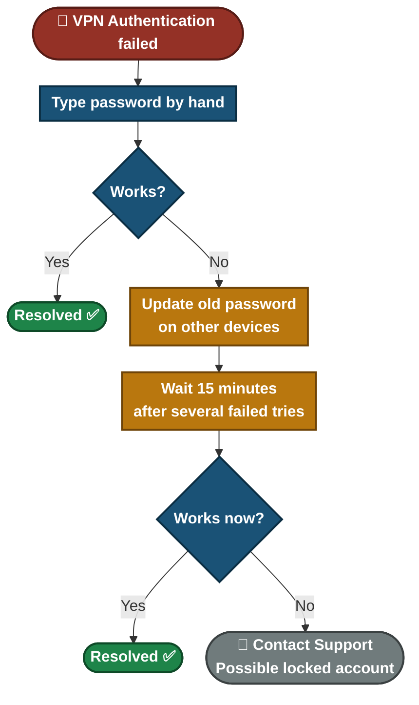
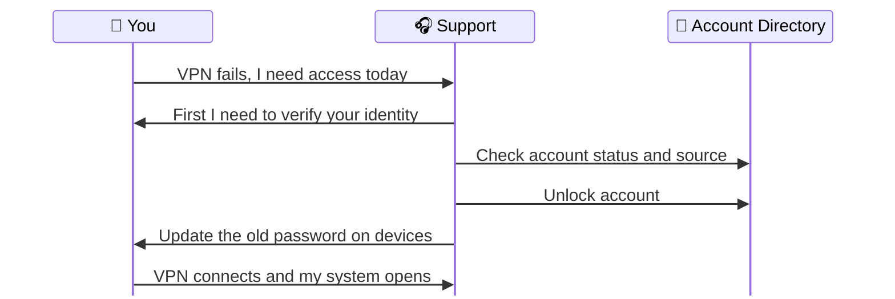

# 📄 Solution Guide — VPN "Authentication Failed"

**Customer Solution Guide 04.3** · Plain language · No special tools needed

The VPN says **"Authentication failed"** even though your password seems right. The usual cause is a **locked account**, often triggered by an old saved password retrying in the background. This guide helps you fix it safely.

---

## 📑 Table of Contents

1. [At a Glance](#at-a-glance)
2. [Who This Guide Is For](#who)
3. [Common Symptoms](#symptoms)
4. [What Is Happening](#what-happening)
5. [Self-Help Steps](#steps)
6. [Quick Decision Guide](#decision)
7. [Quick Reference Card](#quick-ref)
8. [Please Don't](#donts)
9. [How to Prevent It](#prevent)
10. [When to Contact Support](#contact)
11. [Quick FAQ](#faq)
12. [Related Material](#related)

---

## 📊 At a Glance

| ⏱️ Time Needed | 🎚️ Difficulty | 🧰 You Will Need | 🪜 Steps |
|:---:|:---:|:---:|:---:|
| **About 15 to 20 minutes (includes a short wait)** | **Easy** | **Your account password, your other devices that use the VPN** | **8** |

---

## 🎯 Who This Guide Is For

People who cannot connect to the company VPN. It is especially for the case where the password is correct but the login is still rejected.

---

## 🔍 Common Symptoms

| What you notice | What it usually means |
|---|---|

| "VPN says Authentication failed, but my password is correct" | The account may be locked, or an old saved password is retrying |
| "It worked yesterday, today it rejects me" | The password changed on one device, or the account locked overnight |
| "I tried a few times and now it always fails" | Repeated failures lock many accounts for a while |
| "I need to open payroll or records urgently" | Urgent requests still need an identity check |

---

## 🗺️ What Is Happening

A VPN login passes through several checks. A **locked account** rejects even the **correct** password.

- **App side:** autofill or an old saved password.
- **Gateway side:** wrong clock, blocked connection, or sign-in code problems.
- **Account side:** locked, disabled or expired account. This is the most common one.

---

## ✅ Self-Help Steps

> [!TIP]
> Do not keep retrying. Each failed attempt can keep your account locked longer.

### Step 1 — Type the password by hand

1. Do not use autofill.
2. Check that **Caps Lock** is off and the keyboard language is correct.
3. Use the "show password" eye icon to check what you typed.

> ✅ **You should see:** The VPN connects.

> ➡️ **If not:** Continue to Step 2.

### Step 2 — Check other devices for an old password

A phone, tablet or second laptop may still hold your **old** saved password and keep trying it in the background. Each wrong try counts as a failed attempt. Update the password everywhere, or remove the saved VPN connection from devices you no longer use.

> ✅ **You should see:** No device is still using the old password.

> ➡️ **If not:** Continue to Step 3.

### Step 3 — Wait before trying again

If you have had several failed attempts, **wait about 15 minutes**. The exact time depends on your company's rules.

> ✅ **You should see:** The account may unlock on its own and the VPN connects.

> ➡️ **If not:** Continue to Step 4.

### Step 4 — Restart the VPN app and your computer

Close the VPN program fully and open it again. If the app has been open for a long time, restart the computer too.

> ✅ **You should see:** A fresh login screen.

> ➡️ **If not:** Continue to Step 5.

### Step 5 — Check that the internet works without the VPN

Open a normal website. If the internet is down, fix that first (see the [WiFi guide](./04.1-WiFi-Guide.md)).

> ✅ **You should see:** Normal websites open.

> ➡️ **If not:** Fix the connection, then try the VPN again.

### Step 6 — Check the date and time on your computer

A wrong clock can make a login fail. Set the time to update **automatically**.

> ✅ **You should see:** The clock shows the correct time.

> ➡️ **If not:** Contact support.

### Step 7 — Contact support

Your account may be **locked**, and only support can unlock it. We will **verify your identity first**, then unlock the account and check which device caused the failed attempts.

> ✅ **You should see:** An unlocked account and an explanation of what caused the lockout.

> ➡️ **If not:** Tell us the exact message you see.

### Step 8 — Confirm the system you actually need opens

After the VPN connects, open the system you need (for example a shared drive or the payroll portal). A connected VPN does not always mean every internal system is reachable.

> ✅ **You should see:** The internal system opens.

> ➡️ **If not:** Tell support which system fails and we will check that access separately.

---

## 🧭 Quick Decision Guide

---

## 🧰 Quick Reference Card

| If this happens | Try this first |
|---|---|
| Correct password, still rejected | Wait 15 minutes, then try again by typing it by hand |
| Started after a password change | Update the password on every device |
| Several failed tries in a row | Stop, wait, then contact support if it still fails |
| VPN connects but a system will not open | Tell support which system fails |
| Someone asks you for your password | Do not share it. Contact support directly |

---

## ⚠️ Please Don't

> [!WARNING]
> Do not keep trying again and again. More failed attempts keep the account locked.

> [!WARNING]
> **Never give your password to anyone who contacts you**, even if they say they are from IT. Support does not need your password to unlock your account.

> [!WARNING]
> Do not be upset when support asks to verify your identity first, even if your request is urgent. The check protects your account from someone pretending to be you.

---

## 🛡️ How to Prevent It

- After any password change, update it on **every** device straight away.
- Remove old saved VPN logins from devices you no longer use.
- Keep your work password different from your personal passwords.
- Keep your computer clock set to automatic time.

---

## 📞 When to Contact Support

> [!IMPORTANT]
> We can check whether your account is locked, unlock it **after verifying your identity**, and find which device caused the failed attempts.

**Please have this ready:**

- [ ] The exact message you see
- [ ] When it last worked
- [ ] Which devices you use the VPN on
- [ ] Whether you changed your password recently
- [ ] Which system you need to reach once connected

**What happens when you contact us:**

---

## ❓ Quick FAQ

<b>Why does a correct password fail?</b>

If the account is locked, the system rejects even the right password.

<b>Is a lockout an attack on my account?</b>

Usually it is an old saved password retrying. Support checks where the failed attempts came from, to be sure.

<b>Why do you need to verify me when I am in a hurry?</b>

Urgent requests for access are a common trick used by attackers. The check keeps your account safe.

---

## 🔗 Related Material

- 🎥 **[Video knowledge base](../01-Video-knowledge-base/)** — the step-by-step lab behind this guide
- 🎫 **[Ticket simulations](../02-Ticket-simulations/)** — how this issue looks as a real support ticket
- 🧭 **[Troubleshooting flowcharts](../03-Troubleshooting-flowcharts/)** — the technical decision tree
- 📨 **[Escalation scripts](../05-Escalation-scripts/)** — what support sends when it has to escalate

---

[⬅ Back to Solution Guides](./README.md) · [🏠 Portfolio Home](../README.md)

