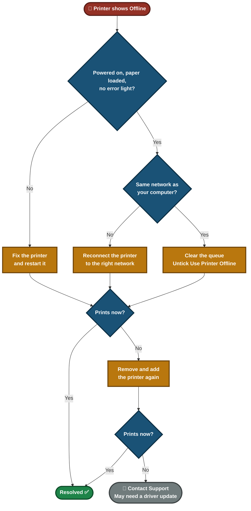
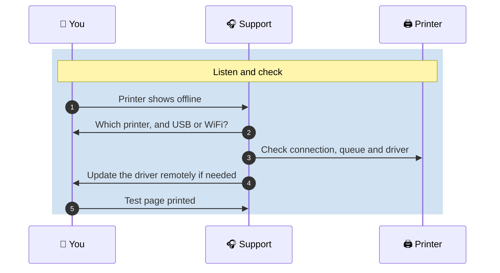

# 📄 Solution Guide — Printer Offline

**Customer Solution Guide 04.4** · Plain language · No special tools needed

Your printer shows **"Offline"** or will not print although it is switched on. Usually your computer simply cannot reach the printer, or a stuck job is blocking the queue. This guide fixes both.

---

## 📑 Table of Contents

1. [At a Glance](#at-a-glance)
2. [Who This Guide Is For](#who)
3. [Common Symptoms](#symptoms)
4. [What Is Happening](#what-happening)
5. [Self-Help Steps](#steps)
6. [Quick Decision Guide](#decision)
7. [Quick Reference Card](#quick-ref)
8. [Please Don't](#donts)
9. [How to Prevent It](#prevent)
10. [When to Contact Support](#contact)
11. [Quick FAQ](#faq)
12. [Related Material](#related)

---

## 📊 At a Glance

| ⏱️ Time Needed | 🎚️ Difficulty | 🧰 You Will Need | 🪜 Steps |
|:---:|:---:|:---:|:---:|
| **About 10 to 15 minutes** | **Easy** | **Access to the printer and your computer** | **8** |

---

## 🎯 Who This Guide Is For

People using a USB or WiFi printer at home or in a small office, whose documents do not print.

---

## 🔍 Common Symptoms

| What you notice | What it usually means |
|---|---|

| "My printer shows offline and nothing prints" | The computer cannot reach the printer, or "Use Printer Offline" is on |
| "My document is stuck in the print queue" | A failed job is blocking everything behind it |
| "It printed yesterday, today nothing happens" | Network change, printer asleep, or a stuck job |
| "Only I cannot print, others can" | A setting or driver on your computer |

---

## 🗺️ What Is Happening

Printing sends your document from the computer, through the **print queue**, to the printer. A fault at any step looks like "offline".

- **Printer side:** power, paper, error lights, connection.
- **Network side:** the computer and the printer must be on the same WiFi.
- **Computer side:** a stuck job in the queue or the "Use Printer Offline" setting.

---

## ✅ Self-Help Steps

> [!TIP]
> After each step, print one short test page. Do not send the whole document each time.

### Step 1 — Check the basics on the printer

1. Powered on.
2. Paper and ink or toner loaded.
3. No error light, jam or message on its screen.
4. For a network printer, the WiFi or network light is on and steady.

> ✅ **You should see:** The printer looks ready.

> ➡️ **If not:** Fix what the printer reports, then continue.

### Step 2 — Make sure you are on the same network

A wireless printer and your computer must use the **same WiFi network**. Check which network each one is joined to.

> ✅ **You should see:** Both are on the same network.

> ➡️ **If not:** Reconnect the printer to the right network.

### Step 3 — Restart the printer

Switch it off, wait **10 seconds**, switch it on, and wait until it is ready.

> ✅ **You should see:** The printer shows ready.

> ➡️ **If not:** Continue to Step 4.

### Step 4 — Check the "Use Printer Offline" setting

1. Open **Settings → Devices → Printers & scanners**.
2. Select your printer and choose **Open queue**.
3. In the **Printer** menu, make sure **Use Printer Offline** is **not** ticked.

> ✅ **You should see:** The printer no longer shows offline.

> ➡️ **If not:** Continue to Step 5.

### Step 5 — Clear stuck print jobs

1. In the same queue window, open the **Printer** menu.
2. Choose **Cancel All Documents**.
3. Print one short test page.

> ✅ **You should see:** The test page prints.

> ➡️ **If not:** Continue to Step 6.

### Step 6 — Set it as the default printer

In **Printers & scanners**, select the printer and choose **Set as default**, then print again.

> ✅ **You should see:** Documents go to the right printer.

> ➡️ **If not:** Continue to Step 7.

### Step 7 — Remove the printer and add it again

1. Select the printer and choose **Remove device**.
2. Choose **Add a printer or scanner** and pick your printer from the list.

> ✅ **You should see:** The printer appears as ready.

> ➡️ **If not:** Continue to Step 8.

### Step 8 — Restart your computer

Restart, then print a test page.

> ✅ **You should see:** The test page prints.

> ➡️ **If not:** Contact support. It may need a driver update.

<b>For confident users: restart the print service</b>

If documents will not leave the queue even after cancelling, restart the **Print Spooler** service: open **Services**, find **Print Spooler**, right-click it and choose **Restart**. Then print a test page.

---

## 🧭 Quick Decision Guide

---

## 🧰 Quick Reference Card

| If this happens | Try this first |
|---|---|
| Shows Offline, printer is on | Check same WiFi, then untick Use Printer Offline |
| Documents stuck in the queue | Printer menu, Cancel All Documents |
| Printer prints for others, not me | Remove and add the printer again |
| Error light or jam | Follow the printer's own instructions |
| Nothing works after all steps | Contact support, it may need a driver update |

---

## ⚠️ Please Don't

> [!WARNING]
> Do not send the same document many times. It fills the queue and can jam it.

> [!WARNING]
> Do not download a driver from a website you do not recognise. Use the printer maker's own site, or ask us.

> [!WARNING]
> Do not pull out a paper jam by force. Follow the printer's own instructions.

---

## 🛡️ How to Prevent It

- Restart the printer when it has been on for many days.
- Keep it on the same WiFi network, and tell us if your router changes.
- Cancel failed jobs from the queue instead of sending them again.
- Keep a spare ink or toner cartridge.

---

## 📞 When to Contact Support

> [!IMPORTANT]
> We can often fix a driver or network setting **remotely**, so please contact us before replacing the printer.

**Please have this ready:**

- [ ] The printer make and model
- [ ] Whether it is USB or network (WiFi) connected
- [ ] The exact message on the printer or on your computer
- [ ] Whether other people can print to it
- [ ] Which steps from this guide you already tried

**What happens when you contact us:**

---

## ❓ Quick FAQ

<b>Why does it say offline when the printer is on?</b>

Your computer cannot reach it. That is usually a network, queue or setting problem, not a broken printer.

<b>Will I lose my documents if I cancel the queue?</b>

Cancelling removes waiting documents. You can send them again.

<b>Do I need to buy a new printer?</b>

Almost never. Offline problems are usually fixed with the steps above or a driver update.

---

## 🔗 Related Material

- 🎥 **[Video knowledge base](../01-Video-knowledge-base/)** — the step-by-step lab behind this guide
- 🎫 **[Ticket simulations](../02-Ticket-simulations/)** — how this issue looks as a real support ticket
- 🧭 **[Troubleshooting flowcharts](../03-Troubleshooting-flowcharts/)** — the technical decision tree
- 📨 **[Escalation scripts](../05-Escalation-scripts/)** — what support sends when it has to escalate

---

[⬅ Back to Solution Guides](./README.md) · [🏠 Portfolio Home](../README.md)

