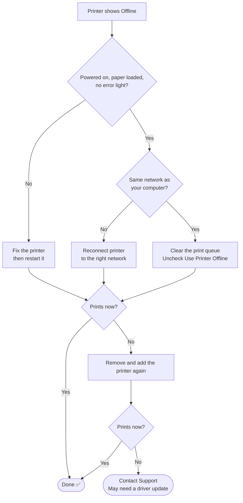

# 📄 Solution Guide: Printer Offline

> Plain-language steps for customers. No special tools needed.

## 🎯 Who This Guide Is For

People whose printer shows **"Offline"** or will not print, although it is switched on.

---

## 🔍 Common Symptoms

- "My printer shows offline and nothing prints."
- "My document is stuck in the print queue."
- "It printed yesterday, today nothing happens."

---

## ⏱️ At a Glance

| | |
|---|---|
| **Time needed** | About 10 to 15 minutes |
| **Difficulty** | Easy |
| **You will need** | Access to the printer and your computer |

---

## ✅ Self-Help Steps

### Step 1 — Check the basics on the printer
- It is powered on.
- It has paper and ink or toner.
- There is no error light, jam or message on its screen.
- For a network printer, the WiFi or network light is on and steady.

### Step 2 — Make sure you are on the same network
Your computer and a wireless printer must use the **same WiFi network**. Check which network each one is joined to.

### Step 3 — Restart the printer
Switch it off, wait **10 seconds**, then switch it on again and wait until it is ready.

### Step 4 — Check the "Use Printer Offline" setting
1. Open **Settings → Devices → Printers & scanners**.
2. Select your printer and choose **Open queue**.
3. In the **Printer** menu, make sure **Use Printer Offline** is **not** ticked.

### Step 5 — Clear stuck print jobs
In the same queue window, open the **Printer** menu and choose **Cancel All Documents**. Then print a short test page.

### Step 6 — Set it as the default printer
In **Printers & scanners**, select the printer and choose **Set as default**. Then try printing again.

### Step 7 — Remove the printer and add it again
1. Select the printer and choose **Remove device**.
2. Choose **Add a printer or scanner** and pick your printer from the list.

### Step 8 — Restart your computer
Then print a test page.

### Step 9 — Contact support
If the printer still shows offline, it may need a **driver update** or a network setting changed, which we can often do remotely.

---

## 🧭 Quick Decision Guide

---

## ⚠️ Please Don't

- Do not send the same document many times. It fills the queue and can jam it.
- Do not download a driver from a website you do not recognise. Use the printer maker's own site, or ask us.
- Do not pull out a paper jam by force. Follow the printer's own instructions.

---

## 🛡️ How to Prevent It

- Restart the printer when it has been on for many days.
- Keep it on the same WiFi network, and tell us if your router changes.
- Cancel failed jobs from the queue instead of resending them.

---

## 📞 When to Contact Support

Please have this ready:

- [ ] The printer make and model
- [ ] Whether it is USB or network (WiFi) connected
- [ ] The exact message on the printer or on your computer
- [ ] Whether other people can print to it

## ❓ Quick FAQ

**Why does it say offline when the printer is on?**
Your computer cannot reach it. That is usually a network, queue or setting problem, not a broken printer.

**Will I lose my documents?**
Cancelling the queue removes waiting documents. You can send them again.

## 🔗 Related Material

- 🎥 [Video knowledge base](../01-Video-knowledge-base/) — the step-by-step lab behind this guide
- 🎫 [Ticket simulations](../02-Ticket-simulations/) — how this issue looks as a real support ticket
- 🧭 [Troubleshooting flowcharts](../03-Troubleshooting-flowcharts/) — the technical decision tree
- 📨 [Escalation scripts](../05-Escalation-scripts/) — what support sends when it needs to escalate

---

[⬅ Back to Solution Guides](./README.md) · [🏠 Portfolio Home](../README.md)
