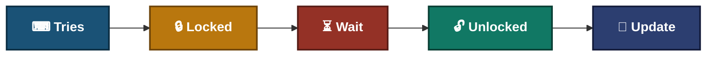
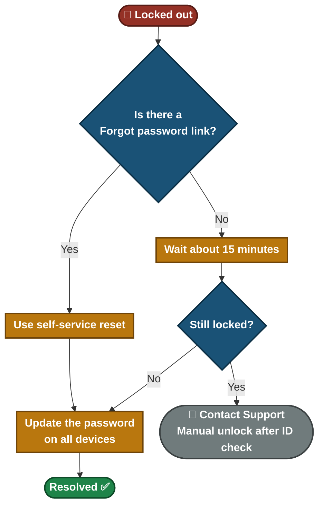
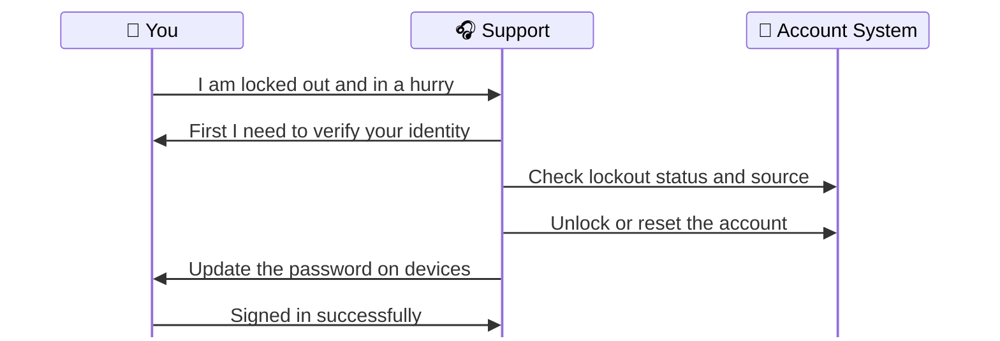

# 📄 Solution Guide — Password Reset and Account Lockout

**Customer Solution Guide 04.5** · Plain language · No special tools needed

You are **locked out** after typing your password wrong a few times, or you forgot it. This guide shows how to recover your account safely and how to stop it from locking again.

---

## 📑 Table of Contents

1. [At a Glance](#at-a-glance)
2. [Who This Guide Is For](#who)
3. [Common Symptoms](#symptoms)
4. [What Is Happening](#what-happening)
5. [Self-Help Steps](#steps)
6. [Quick Decision Guide](#decision)
7. [Quick Reference Card](#quick-ref)
8. [Please Don't](#donts)
9. [How to Prevent It](#prevent)
10. [When to Contact Support](#contact)
11. [Quick FAQ](#faq)
12. [Related Material](#related)

---

## 📊 At a Glance

| ⏱️ Time Needed | 🎚️ Difficulty | 🧰 You Will Need | 🪜 Steps |
|:---:|:---:|:---:|:---:|
| **About 15 minutes (a lockout may need a short wait)** | **Easy** | **Access to your recovery email or phone** | **7** |

---

## 🎯 Who This Guide Is For

People locked out of their work or personal account, or who need to reset a forgotten password.

---

## 🔍 Common Symptoms

| What you notice | What it usually means |
|---|---|

| "I am locked out after a few wrong tries" | The account locked itself to protect you |
| "I forgot my password" | You need a self-service reset or help from support |
| "My password was fine yesterday, now it is rejected" | An old saved password on another device probably keeps retrying |
| "I got a reset email I did not ask for" | Possible fake message. Do not click it |

---

## 🗺️ What Is Happening

After several wrong passwords, most systems **lock the account for a while** to stop someone guessing. The lock usually clears on its own, or support can clear it after checking who you are.

- The lock protects you. It is not a fault of your computer.
- The last step matters: an old password on another device can lock you again.

---

## ✅ Self-Help Steps

> [!TIP]
> Stop typing guesses as soon as you suspect a lockout. Every wrong try counts.

### Step 1 — Stop trying

Every wrong try counts toward the lockout. Do not keep typing guesses.

> ✅ **You should see:** No more failed attempts are added.

> ➡️ **If not:** Continue to Step 2.

### Step 2 — Wait about 15 minutes

Many accounts unlock **on their own** after a waiting time. The exact time depends on your company's rules.

> ✅ **You should see:** The account unlocks and you can sign in.

> ➡️ **If not:** Continue to Step 3.

### Step 3 — Use the "Forgot password" link

If the login page has a **Forgot password** link, use it and follow the steps sent to your recovery email or phone. Only use the link on the real login page you normally use.

> ✅ **You should see:** A reset link or code arrives.

> ➡️ **If not:** Contact support (Step 7).

### Step 4 — Choose a new password carefully

1. Use at least **12 characters**. A short sentence of unrelated words is easy to remember and hard to guess.
2. Do not reuse an old password or one from another website.
3. Do not use your name, birthday or a common word alone.

> ✅ **You should see:** The system accepts the new password.

> ➡️ **If not:** Try a longer, different one.

### Step 5 — Update the password on every device

Phone, laptop, tablet, email app, VPN and saved logins in the browser. An old password saved on one device can lock you out again within minutes.

> ✅ **You should see:** No device still uses the old password.

> ➡️ **If not:** Remove saved logins from devices you no longer use.

### Step 6 — Sign out and sign back in

Close the app or browser, then sign in with the new password. If you use a second sign-in step (a code or an approval on your phone), keep your phone with you.

> ✅ **You should see:** A normal sign-in.

> ➡️ **If not:** Continue to Step 7.

### Step 7 — Contact support

If you cannot reset it yourself, we can unlock the account or reset it **after confirming your identity**.

> ✅ **You should see:** An unlocked account.

> ➡️ **If not:** Tell us the exact message you see.

---

## 🧭 Quick Decision Guide

---

## 🧰 Quick Reference Card

| If this happens | Try this first |
|---|---|
| Locked after wrong tries | Stop, wait 15 minutes, then try once |
| Forgot the password | Use the Forgot password link on the real login page |
| Locked again soon after unlocking | Update the password on every device |
| Unexpected reset email | Do not click it. Contact support |
| Someone asks for your code or password | Never share it |

---

## ⚠️ Please Don't

> [!WARNING]
> **Never share your password**, not even with IT support. We will never ask for it.

> [!WARNING]
> Do not click a reset link in an email you did not ask for. It may be a fake message trying to steal your login.

> [!WARNING]
> Do not give a verification code to anyone who asks for it, even if they sound official.

> [!WARNING]
> Do not write your password on a note stuck to your screen.

---

## 🛡️ How to Prevent It

- Use a password manager, or a different strong password for each account.
- Keep your recovery email and phone number up to date.
- After a password change, update it everywhere on the same day.
- Turn on a second sign-in step if your account offers one.

---

## 📞 When to Contact Support

> [!IMPORTANT]
> For your safety we **verify your identity first**, even if your request is urgent. This protects your account from someone pretending to be you.

**Please have this ready:**

- [ ] Your username or email address (never your password)
- [ ] The exact message you see
- [ ] When you last signed in successfully
- [ ] Whether you changed your password recently

**What happens when you contact us:**

---

## ❓ Quick FAQ

<b>Why do you need to verify me if I am in a hurry?</b>

Urgent requests for access are a common trick used by attackers. The check keeps your account safe.

<b>Why did my account lock when I typed it correctly?</b>

An old saved password on another device probably kept trying in the background.

<b>How long does a lockout last?</b>

Often about 15 to 30 minutes, but it depends on your company's rules. Support can unlock it sooner.

---

## 🔗 Related Material

- 🎥 **[Video knowledge base](../01-Video-knowledge-base/)** — the step-by-step lab behind this guide
- 🎫 **[Ticket simulations](../02-Ticket-simulations/)** — how this issue looks as a real support ticket
- 🧭 **[Troubleshooting flowcharts](../03-Troubleshooting-flowcharts/)** — the technical decision tree
- 📨 **[Escalation scripts](../05-Escalation-scripts/)** — what support sends when it has to escalate

---

[⬅ Back to Solution Guides](./README.md) · [🏠 Portfolio Home](../README.md)

