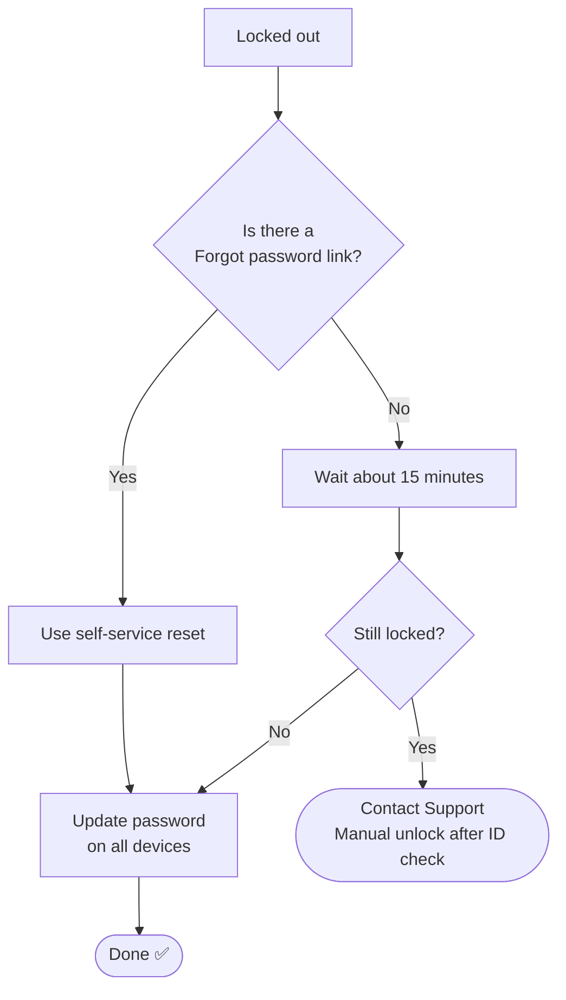

# 📄 Solution Guide: Password Reset and Account Lockout

> Plain-language steps for customers. No special tools needed.

## 🎯 Who This Guide Is For

People who are **locked out** of an account after entering the wrong password several times, or who need to reset a forgotten password.

---

## 🔍 Common Symptoms

- "I am locked out after typing my password wrong a few times."
- "I forgot my password."
- "My password was correct yesterday and now it is rejected."

---

## ⏱️ At a Glance

| | |
|---|---|
| **Time needed** | About 15 minutes (a lockout may need a short wait) |
| **Difficulty** | Easy |
| **You will need** | Access to your recovery email or phone, and a few minutes |

---

## ✅ Self-Help Steps

### Step 1 — Stop trying
Every wrong try counts toward the lockout. Do not keep typing guesses.

### Step 2 — Wait about 15 minutes
Many accounts unlock **on their own** after a waiting time. The exact time depends on your company's rules.

### Step 3 — Use the "Forgot password" link
If the login page has a **Forgot password** link, use it and follow the steps sent to your recovery email or phone. Only use the link on the real login page you normally use.

### Step 4 — Choose a new password carefully
- Use at least **12 characters**. A short sentence of unrelated words is easy to remember and hard to guess.
- Do not reuse an old password or one from another website.
- Do not use your name, birthday or common words alone.

### Step 5 — Update the password on every device
Phone, laptop, tablet, email app, VPN and saved logins in the browser. An old password saved on one device can lock you out again within minutes.

### Step 6 — Sign out and sign back in
Close the app or browser, then sign in with the new password. If you use a second sign-in step (a code or an approval on your phone), keep your phone with you.

### Step 7 — Contact support
If you cannot reset it yourself, we can unlock the account or reset it **after confirming your identity**.

---

## 🧭 Quick Decision Guide

---

## ⚠️ Please Don't

- **Never share your password**, not even with IT support. We will never ask for it.
- Do not click a reset link in an email you did not ask for. It may be a fake message trying to steal your login.
- Do not write your password on a note stuck to your screen.
- Do not give a verification code to anyone who asks for it.

---

## 🛡️ How to Prevent It

- Use a password manager, or a different strong password for each account.
- Keep your recovery email and phone number up to date.
- After a password change, update it everywhere on the same day.

---

## 📞 When to Contact Support

For your safety we will **verify your identity first**, even if your request is urgent. This protects your account from someone pretending to be you. Please have this ready:

- [ ] Your username or email address (not your password)
- [ ] The exact message you see
- [ ] When you last signed in successfully
- [ ] Whether you changed your password recently

## ❓ Quick FAQ

**Why do you need to verify me if I am in a hurry?**
Urgent requests for access are a common trick used by attackers. The check keeps your account safe.

**Why did my account lock when I typed it correctly?**
An old saved password on another device probably kept trying in the background.

## 🔗 Related Material

- 🎥 [Video knowledge base](../01-Video-knowledge-base/) — the step-by-step lab behind this guide
- 🎫 [Ticket simulations](../02-Ticket-simulations/) — how this issue looks as a real support ticket
- 🧭 [Troubleshooting flowcharts](../03-Troubleshooting-flowcharts/) — the technical decision tree
- 📨 [Escalation scripts](../05-Escalation-scripts/) — what support sends when it needs to escalate

---

[⬅ Back to Solution Guides](./README.md) · [🏠 Portfolio Home](../README.md)
