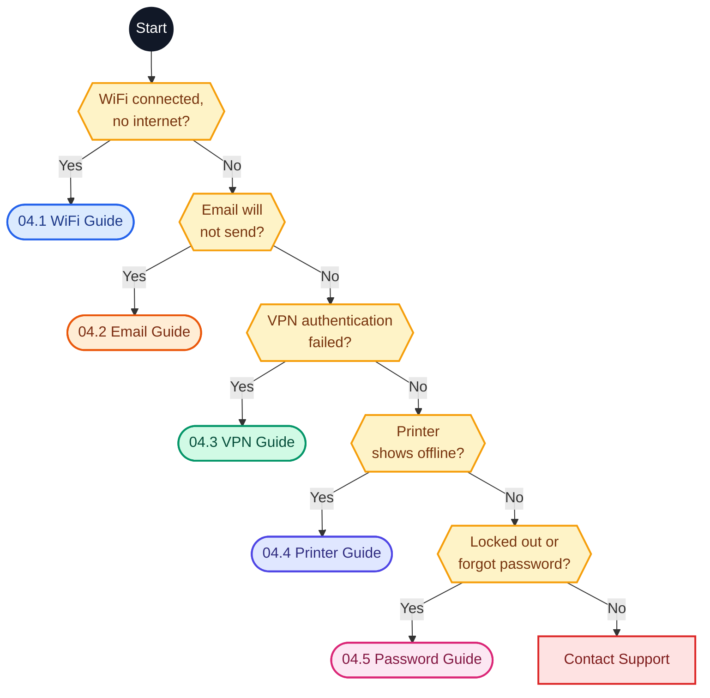

# 📑 Index — 04 Solution Guides

Customer-friendly, step-by-step guides for the five most common support problems. Each guide has a decision flowchart, numbered self-help steps, a quick reference, and what to do if nothing works.

---

## 🗺️ Which Guide Do I Need?



---

## 📚 Guides

| No. | Guide | Topic | Time | Level | What it fixes |
|:---:|---|:---:|:---:|:---:|---|
| 04.1 | [WiFi Connected but No Internet](04.1-WiFi-Guide.md) | WiFi | 10 min | Easy | Your device says it is **connected** to WiFi, but websites and apps will not load. |
| 04.2 | [Email Not Sending](04.2-Email-Guide.md) | Email | 15 min | Easy to medium | You can **receive** email but cannot **send** it, or your emails are stuck in the **Outbox**. |
| 04.3 | [VPN "Authentication Failed"](04.3-VPN-Guide.md) | VPN | 15 to 20 min | Easy | The VPN says **"Authentication failed"** even though your password seems right. |
| 04.4 | [Printer Offline](04.4-Printer-Guide.md) | Printer | 10 to 15 min | Easy | Your printer shows **"Offline"** or will not print although it is switched on. |
| 04.5 | [Password Reset and Account Lockout](04.5-Password-Reset-Guide.md) | Account | 15 min | Easy | You are **locked out** after typing your password wrong a few times, or you forgot it. |

---

## 🔎 Find a Guide by Symptom

| If you see this | Open |
|---|---|
| WiFi shows connected but websites will not load | [04.1 WiFi](04.1-WiFi-Guide.md) |
| Emails stay in the Outbox or cannot be sent | [04.2 Email](04.2-Email-Guide.md) |
| VPN says authentication failed | [04.3 VPN](04.3-VPN-Guide.md) |
| Printer shows Offline | [04.4 Printer](04.4-Printer-Guide.md) |
| Locked out or forgot your password | [04.5 Password Reset](04.5-Password-Reset-Guide.md) |

---

## 🔗 Related Folders

| Folder | Use it for |
|---|---|
| [01-Video-knowledge-base](../01-Video-knowledge-base/) | Video scripts for each problem |
| [02-Ticket-simulations](../02-Ticket-simulations/) | Practice tickets |
| [03-Troubleshooting-flowcharts](../03-Troubleshooting-flowcharts/) | Agent-side flowcharts |
| [05-Escalation-scripts](../05-Escalation-scripts/) | What to send when escalating |

---

## 📁 Folder Structure

```text
04-Solution-guides/
|-- INDEX.md
|-- 04.1-WiFi-Guide.md
|-- 04.2-Email-Guide.md
|-- 04.3-VPN-Guide.md
|-- 04.4-Printer-Guide.md
|-- 04.5-Password-Reset-Guide.md
`-- README.md
```
