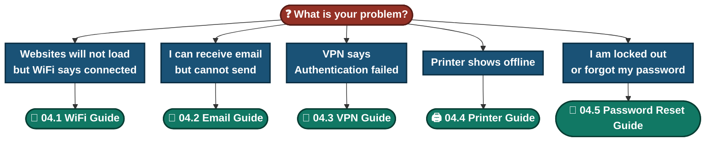

# 📄 Solution Guides

**Customer-facing guides in plain, non-technical language**

Each guide explains what is happening, gives numbered self-help steps with a "what you should see" check, a decision chart, safety warnings, and a checklist to prepare before contacting support.

---

## 📑 Table of Contents

1. [Guides at a Glance](#guides)
2. [Which Guide Do I Need?](#chooser)
3. [What Every Guide Contains](#contains)
4. [How the Guides Connect to the Rest of the Portfolio](#connect)
5. [Writing Approach](#approach)

---

## 📚 Guides at a Glance

| # | Guide | Problem it solves | Time | Difficulty |
|:---:|---|---|:---:|:---:|
| 1 | [📶 WiFi Guide](./04.1-WiFi-Guide.md) | WiFi connected but no internet, or drops | ~10 min | Easy |
| 2 | [📧 Email Guide](./04.2-Email-Guide.md) | Email will not send, stuck in Outbox | ~15 min | Easy to medium |
| 3 | [🔐 VPN Guide](./04.3-VPN-Guide.md) | VPN "Authentication failed", account lockout | ~15 to 20 min | Easy |
| 4 | [🖨 Printer Guide](./04.4-Printer-Guide.md) | Printer offline or not printing | ~10 to 15 min | Easy |
| 5 | [🔑 Password Reset Guide](./04.5-Password-Reset-Guide.md) | Locked out, forgotten password | ~15 min | Easy |

---

## 🧭 Which Guide Do I Need?

> [!TIP]
> Locked out of the VPN and not sure which guide? Start with the **VPN Guide**. It points to the **Password Reset Guide** when needed.

---

## 🧱 What Every Guide Contains

| Section | Purpose |
|---|---|
| 📊 At a glance | Time, difficulty, what you need, number of steps |
| 🎯 Who this guide is for | Helps the customer see if it applies to them |
| 🔍 Common symptoms | The words customers actually use, and what they usually mean |
| 🗺️ What is happening | A simple explanation and a diagram of where the fault can sit |
| ✅ Self-help steps | Numbered steps, each with "You should see" and "If not" |
| 🧭 Quick decision guide | A colour-coded flowchart for the whole fix |
| 🧰 Quick reference card | A one-glance table for repeat problems |
| ⚠️ Please don't | Safety warnings and common mistakes |
| 🛡️ How to prevent it | Habits that stop the problem coming back |
| 📞 When to contact support | A checklist to prepare, and what happens next |
| ❓ Quick FAQ | Short answers in collapsible boxes |
| 🔗 Related material | Links to the lab, ticket, flowchart and escalation script |

---

## 🔗 How the Guides Connect to the Rest of the Portfolio

| Customer guide | Topic | Technical side |
|---|---|---|
| WiFi Guide | Connectivity and name lookup | [Video knowledge base](../01-Video-knowledge-base/), [Troubleshooting flowcharts](../03-Troubleshooting-flowcharts/) |
| Email Guide | Outgoing mail settings | [Video knowledge base](../01-Video-knowledge-base/), [Ticket simulations](../02-Ticket-simulations/) |
| VPN Guide | Account lockout and identity checks | [Video knowledge base](../01-Video-knowledge-base/), [Escalation scripts](../05-Escalation-scripts/) |
| Printer Guide | Queue, network and drivers | [Ticket simulations](../02-Ticket-simulations/), [Troubleshooting flowcharts](../03-Troubleshooting-flowcharts/) |
| Password Reset Guide | Lockout and identity verification | [Ticket simulations](../02-Ticket-simulations/), [Escalation scripts](../05-Escalation-scripts/) |

---

## ✍️ Writing Approach

- **Plain language.** No jargon without a short explanation.
- **One action per step**, with a "you should see" check so the customer knows it worked.
- **Safety first.** Every guide says what not to do, and warns about sharing passwords or codes.
- **Honest limits.** Steps vary by provider and company rules, and the guides say so.
- **Prepared contact.** Each guide ends with a checklist so the first call or message already has what support needs.

---

[🏠 Back to Portfolio Home](../README.md)

