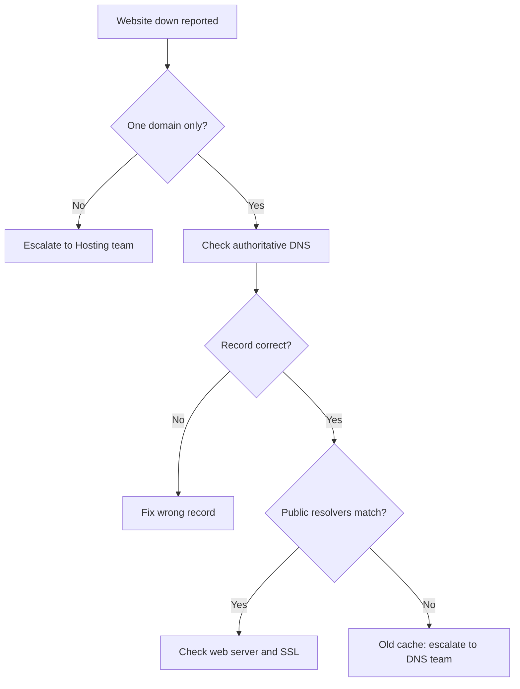

# 📞 Escalation Script — Website Down After DNS Change

**Customer Tech Support Portfolio · 05 Escalation Scripts**

Customer Scripts · Escalation Note · Decision Path

  

A customer's website is unreachable for many visitors after a DNS change. This file gives the scripts a support agent uses: what to say to the customer, when to escalate, and what to write in the escalation note so the next team does not need to ask the same questions again.

> [!NOTE]
> **Simulated.** The customer, domain, IP addresses, ticket numbers and command results are examples. `example.com` and the `203.0.113.x` / `198.51.100.x` IP ranges are reserved for documentation. No real customer data is used.

## 📑 Table of Contents

1. [Scenario](#-scenario)
2. [When to Escalate](#-when-to-escalate)
3. [Customer Scripts](#-customer-scripts)
4. [Internal Escalation Note](#-internal-escalation-note)
5. [Decision Path](#-decision-path)
6. [Common Mistakes to Avoid](#-common-mistakes-to-avoid)
7. [What I Learned](#-what-i-learned)

## 🎯 Scenario

| Field | Value |
|---|---|
| **Escalation #** | ESC-2026-001 (sample) |
| **Priority** | P1 (Critical) — online store is not taking orders |
| **Customer** | Online store owner, Karachi (role-played) |
| **Domain** | `shop.example.com` |
| **What changed** | The A record was changed to a new hosting server about 4 hours ago |
| **Symptom** | Some visitors see the new site, others get "site can't be reached" |

> "My website has been down for 4 hours. I am losing sales every minute. Fix it now."

## 🚦 When to Escalate

Escalate to the **Network / DNS team** when **all** of these are true:

- The problem is limited to one domain, not the whole hosting server.
- The authoritative name server returns a different answer from public resolvers, or returns a wrong answer.
- Tier 1 cannot change the zone or the registrar settings.

Do **not** escalate yet if:

- The DNS record is correct and the customer only needs to wait for the old cache to expire. Give them the time left instead.

## 💬 Customer Scripts

### 1. First reply (within 15 minutes)

> "Hello [Name], I understand your store is not taking orders and I am treating this as urgent. I have started checking your DNS records for `shop.example.com` now. I will update you by [time, 30 minutes from now], even if I do not have a fix yet. Can you confirm the time you changed the A record and the new IP address you set?"

**Why it works:** it acknowledges the loss, gives a real update time, and asks for the one fact needed next.

### 2. Update when the cause is found, fix is waiting on another team

> "Hi [Name], here is where we are. Your DNS record points to the new server, but some visitors' internet providers are still using the old address they saved earlier. I have sent this to our DNS team as a priority. I will update you by [time]. While we wait, visitors can reach the site by [clear workaround, if one exists]. I will not be able to confirm an exact finish time until the DNS team checks the old record's expiry."

**Why it works:** it says what is wrong in plain words, what has been done, and what is not known yet. It does not promise a finish time.

### 3. Update when the cause is a wrong record

> "Hi [Name], I found the problem. The A record for `shop.example.com` points to `198.51.100.20`, and your new server is at `203.0.113.10`. This needs to be changed in your DNS control panel. I can walk you through it now, or our team can do it with your written approval."

### 4. Resolution

> "Hi [Name], your site is loading correctly again. I tested it from [two networks / locations]. Some visitors may still see the old address for a short time until their saved copy expires, which should be fully clear by [time]. I am closing this ticket after [24 hours] if you confirm all is well. For future changes, lower the TTL a day before the move. I can send you the steps."

## 📋 Internal Escalation Note

Copy this into the ticket when you escalate.

| Field | Value |
|---|---|
| **Ticket #** | ESC-2026-001 (sample) |
| **Priority** | P1 (Critical) |
| **Escalated to** | Network / DNS team |
| **Customer** | Online store, `shop.example.com` |
| **Impact** | Orders not coming in for part of the visitors. Started about 4 hours ago |
| **Change made** | A record changed from `198.51.100.20` to `203.0.113.10` at [time] |
| **Customer contacted** | Yes, next update due [time] |

**What I checked**

| Check | Command | Result (sample) |
|---|---|---|
| Authoritative answer | `dig shop.example.com @ns1.example.net +short` | `203.0.113.10` (correct) |
| Public resolver 1 | `dig shop.example.com @8.8.8.8 +short` | `203.0.113.10` (correct) |
| Public resolver 2 | `dig shop.example.com @1.1.1.1 +short` | `198.51.100.20` (old) |
| Old record TTL | `dig shop.example.com @ns1.example.net` | `86400` seconds (24 hours) |
| New server reachable | `curl -I https://shop.example.com --resolve shop.example.com:443:203.0.113.10` | `200 OK` |

**What this tells us**

- The new record is correct at the source.
- Some resolvers still hold the old answer because the old TTL was 24 hours.
- The new server works. This is a cache delay, not a server fault.

**Request to DNS team**

1. Confirm the zone is correct and the name server delegation at the registrar matches.
2. Check whether the old record can be served with a lower TTL going forward.
3. Advise on a workaround for visitors still on the old address, for example keeping the old server forwarding traffic until the cache clears.

**Customer communication status:** first reply sent, next update due [time].

## 🧭 Decision Path

## ⚠️ Common Mistakes to Avoid

- **Saying "DNS propagation" with no detail.** Customers hear "wait and hope". Say whose saved copy is old and when it expires.
- **Promising a finish time.** Cache expiry depends on other companies' servers. Promise the next *update*, not the fix.
- **Giving the raw server IP as a workaround.** On shared hosting or HTTPS sites this often shows the wrong site or a certificate error. Only offer it after testing.
- **Blaming the customer.** State the facts. Do not say "you changed it wrong".
- **Escalating with no evidence.** Always include the commands and results above.

## 🧠 What I Learned

- A DNS "outage" after a change is often a cache problem, not a server problem. Checking the authoritative server first separates the two.
- The old record's TTL decides how long the delay can last, not the new one.
- A good escalation note lets the next team start working without sending a single question back.
- Customers need honest updates on a schedule more than they need a promised fix time.
