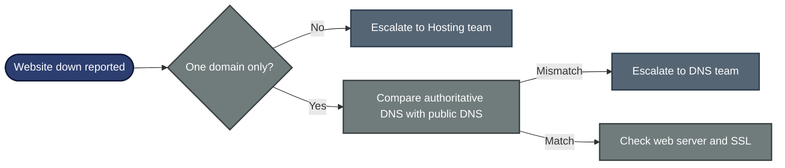

# 📞 Escalation Script — Website Down After DNS Change (ESC-2026-001)

**Customer Tech Support Portfolio — Escalation Scripts**

Customer Scripts · Escalation Note · Decision Path · Update Flow

A customer's website is unreachable for many visitors after a DNS change. This file gives the scripts a support agent uses: what to say to the customer, when to escalate, and what to write in the escalation note so the next team does not need to ask the same questions again.

> [!NOTE]
> Simulated. The customer, domain, IP addresses, ticket numbers and command results are examples. `example.com` and the `203.0.113.x` / `198.51.100.x` IP ranges are reserved for documentation. No real customer data is used.

---

## 📑 Table of Contents

1. [At a Glance](#at-a-glance)
2. [Escalation Record](#escalation-record)
3. [Project Background](#project-background)
4. [Escalation Flow](#escalation-flow)
5. [When to Escalate](#when-to-escalate)
6. [Customer Scripts](#customer-scripts)
7. [Internal Escalation Note](#internal-note)
8. [Decision Path](#decision-path)
9. [Project Summary](#project-summary)
10. [Common Mistakes & Fixes](#mistakes-fixes)
11. [Scope & Limitations](#scope-limitations)
12. [What I Learned](#what-i-learned)
13. [Skills Demonstrated](#skills-demonstrated)

---

## 📊 At a Glance

| 💬 Customer Scripts | 🔍 Diagnostic Checks | 🧭 Flowcharts | 🛠️ Mistakes Covered |
|:---:|:---:|:---:|:---:|
| **4** | **5** | **2** | **5** |

---

## 🎫 Escalation Record

| Field | Value |
|---|---|
| **Escalation #** | ESC-2026-001 (sample) |
| **Priority** | P1 (Critical) — online store is not taking orders |
| **Status** | Escalated to Network / DNS team |
| **Category** | DNS change |
| **Customer** | Online store owner, Karachi (role-played) |
| **Domain** | `shop.example.com` |
| **What changed** | The A record was changed to a new hosting server about 4 hours ago |
| **Symptom** | Some visitors see the new site, others get "site can't be reached" |

> *"My website has been down for 4 hours. I am losing sales every minute. Fix it now."*

---

## 📖 Project Background

After a DNS change, some visitors reach the new server and some still reach the old one. A good escalation proves which case it is, tells the customer the truth in plain words, and gives the next team everything they need.

- **Customer Scripts:** What to say at each stage, without promising things an agent cannot control.
- **Internal Escalation Note:** The facts and command results the DNS team needs.
- **Decision Path:** How to decide between hosting, DNS and web server causes.
- **Update Flow:** When the customer hears from you, from first reply to close.

---

## ⏱️ Escalation Flow

---

## 🚦 When to Escalate

Escalate to the **Network / DNS team** when **all** of these are true:

- The problem is limited to one domain, not the whole hosting server.
- The authoritative name server returns a different answer from public resolvers, or returns a wrong answer.
- Tier 1 cannot change the zone or the registrar settings.

Do **not** escalate yet if the DNS record is correct and the customer only needs to wait for the old cache to expire. Give them the time left instead.

---

## 💬 Customer Scripts

### Script 1 — First reply (within 15 minutes) ✅

> "Hello [Name], I understand your store is not taking orders and I am treating this as urgent. I have started checking your DNS records for `shop.example.com` now. I will update you by [time, 30 minutes from now], even if I do not have a fix yet. Can you confirm the time you changed the A record and the new IP address you set?"

**Why it works:** it acknowledges the loss, gives a real update time, and asks for the one fact needed next.

### Script 2 — Cause found, fix waiting on another team ✅

> "Hi [Name], here is where we are. Your DNS record points to the new server, but some visitors' internet providers are still using the old address they saved earlier. I have sent this to our DNS team as a priority. I will update you by [time]. I cannot confirm an exact finish time until the DNS team checks when the old record expires."

**Why it works:** it says what is wrong in plain words, what has been done, and what is not known yet.

### Script 3 — Cause is a wrong record ✅

> "Hi [Name], I found the problem. The A record for `shop.example.com` points to `198.51.100.20`, and your new server is at `203.0.113.10`. This needs to be changed in your DNS control panel. I can walk you through it now, or our team can do it with your written approval."

### Script 4 — Resolution ✅

> "Hi [Name], your site is loading correctly again. I tested it from two different networks. Some visitors may still see the old address for a short time until their saved copy expires, which should be fully clear by [time]. I will close this ticket after 24 hours if you confirm all is well. For future changes, lower the TTL a day before the move. I can send you the steps."

---

## 📋 Internal Escalation Note

Copy this into the ticket when you escalate.

| Field | Value |
|---|---|
| **Ticket #** | ESC-2026-001 (sample) |
| **Priority** | P1 (Critical) |
| **Escalated to** | Network / DNS team |
| **Customer** | Online store, `shop.example.com` |
| **Impact** | Orders not coming in for part of the visitors, for about 4 hours |
| **Change made** | A record changed from `198.51.100.20` to `203.0.113.10` at [time] |
| **Customer contacted** | Yes, next update due [time] |

### What I checked

| Check | Command | Result (sample) |
|---|---|---|
| Authoritative answer | `dig shop.example.com @ns1.example.net +short` | `203.0.113.10` (correct) |
| Public resolver 1 | `dig shop.example.com @8.8.8.8 +short` | `203.0.113.10` (correct) |
| Public resolver 2 | `dig shop.example.com @1.1.1.1 +short` | `198.51.100.20` (old) |
| Old record TTL | `dig shop.example.com @ns1.example.net` | `86400` seconds (24 hours) |
| New server reachable | `curl -I https://shop.example.com --resolve shop.example.com:443:203.0.113.10` | `200 OK` |

### 🎯 What this tells us

- The new record is correct at the source.
- Some resolvers still hold the old answer because the old TTL was 24 hours.
- The new server works. This is a cache delay, not a server fault.

### Request to the DNS team

1. Confirm the zone is correct and the name server delegation at the registrar matches.
2. Check whether the old record can be served with a lower TTL going forward.
3. Advise on a workaround for visitors still on the old address, for example keeping the old server forwarding traffic until the cache clears.

---

## 🧭 Decision Path

---

## 📝 Project Summary

| Part | Tooling | Key Point |
|---|---|---|
| Customer Scripts | Plain language | Acknowledge, update, fix, close, with real update times and no invented promises |
| Diagnostics | `dig`, `curl` | Compare the authoritative server with public resolvers first |
| Escalation Note | Ticket fields | Evidence and a clear request, so the DNS team starts without questions |
| Decision Path | Flowchart | One domain or many, then DNS match or mismatch |

---

## 🛠️ Common Mistakes & Fixes

| ❌ Mistake | ✅ Fix |
|---|---|
| Saying "DNS propagation" with no detail | Say whose saved copy is old and when it expires |
| Promising a finish time | Cache expiry depends on other companies' servers. Promise the next update time, not the fix |
| Giving the raw server IP as a workaround | On shared hosting or HTTPS sites it often shows the wrong site or a certificate error. Offer it only after testing |
| Blaming the customer | State the facts. Do not say "you changed it wrong" |
| Escalating with no evidence | Always attach the commands and results from the note above |

---

## 🚧 Scope & Limitations

- **Scripts only:** No live lab. Names, IPs, times and command outputs are examples.
- **One scenario:** A website outage after an A record change.
- **Not tested on a real customer:** Wording is based on common support practice, not on a real ticket.
- **Company rules differ:** Real update times, priority levels and team names depend on the company.

---

## 🧠 What I Learned

- **A DNS "outage" after a change is often a cache problem.** Check the authoritative server first to tell cache from a wrong record.
- **The old record's TTL sets the delay,** not the new one.
- **A good note saves a round trip.** The next team should not have to ask a single question.
- **Customers need honest updates on a schedule** more than a promised fix time.
- **Test a workaround before offering it.**

---

## 🛠️ Skills Demonstrated

- Writing clear customer scripts for an urgent outage
- Telling a DNS cache delay from a wrong record with `dig`
- Writing an escalation note with evidence and a clear request
- Setting update times a support agent can actually meet
- Documenting scope and limits honestly

🌐 **[DNS Basics](https://www.cloudflare.com/learning/dns/what-is-dns/)** · 🛠️ **[Decision Path](#decision-path)**

