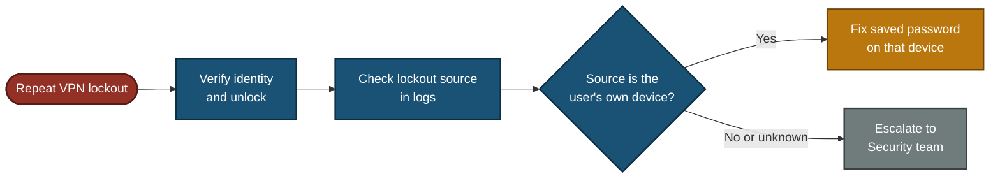

# 📞 Escalation Script — VPN Authentication Failed, Recurring (ESC-2026-002)

**Customer Tech Support Portfolio — Escalation Scripts**

Customer Scripts · Escalation Note · Decision Path · Update Flow

A user's VPN account keeps getting locked, three times in one week. Unlocking it each time does not fix the cause. This file gives the scripts a support agent uses: how to unlock safely, how to find what keeps locking the account, and what to write in the escalation note.

> [!NOTE]
> Simulated. The customer, account name, device names, times and log results are examples. Lockout limits and log names differ between companies. No real customer data is used.

---

## 📑 Table of Contents

1. [At a Glance](#at-a-glance)
2. [Escalation Record](#escalation-record)
3. [Project Background](#project-background)
4. [Escalation Flow](#escalation-flow)
5. [When to Escalate](#when-to-escalate)
6. [Customer Scripts](#customer-scripts)
7. [Internal Escalation Note](#internal-note)
8. [Decision Path](#decision-path)
9. [Project Summary](#project-summary)
10. [Common Mistakes & Fixes](#mistakes-fixes)
11. [Scope & Limitations](#scope-limitations)
12. [What I Learned](#what-i-learned)
13. [Skills Demonstrated](#skills-demonstrated)

---

## 📊 At a Glance

| 💬 Customer Scripts | 🔍 Diagnostic Checks | 🧭 Flowcharts | 🛠️ Mistakes Covered |
|:---:|:---:|:---:|:---:|
| **4** | **5** | **2** | **6** |

---

## 🎫 Escalation Record

| Field | Value |
|---|---|
| **Escalation #** | ESC-2026-002 (sample) |
| **Priority** | P2 (High) — repeated lockouts and a work deadline, but the user can work after each unlock |
| **Status** | Escalated to Senior Network Engineer |
| **Category** | VPN authentication / account lockout |
| **Customer** | Project lead, Islamabad office (role-played) |
| **Account** | `s.ahmed` (sample) |
| **Symptom** | VPN login fails, account locked, 3 times this week |
| **Lockout rule (sample)** | 5 failed sign-ins within 15 minutes locks the account |

> *"I can't connect to the VPN. This is the third time this week. I'm going to miss my deadline."*

---

## 📖 Project Background

A lockout is a result, not the cause. Something keeps sending a wrong password. If support only unlocks the account, it will lock again. A good escalation finds the source of the failed sign-ins and does not hand the customer a promise it cannot keep.

- **Customer Scripts:** What to say, from the first reply to the close.
- **Internal Escalation Note:** The log evidence the next engineer needs.
- **Decision Path:** Whether the source is the user's own device or something unknown.
- **Update Flow:** When the customer hears from you.

---

## ⏱️ Escalation Flow

---

## 🚦 When to Escalate

Escalate to the **Senior Network Engineer** when:

- The account locked 3 or more times in a week, even after unlocks.
- Tier 1 cannot see the lockout source because it needs domain controller log access.

Escalate to the **Security team** instead when:

- The failed sign-ins come from an address or device the user does not own, or from a country the user has not been in. This can be password guessing, not a user mistake.

Do **not** escalate yet if this is the first lockout and the user remembers typing the wrong password.

---

## 💬 Customer Scripts

### Script 1 — First reply and identity check ✅

> "Hi [Name], I'm sorry this has happened again, and I understand you have a deadline. I will get you working first, then find out why it keeps happening. Before I unlock your account, I need to confirm it is you: [verification step set by company policy]. Once that is done, I will unlock the account straight away."

**Why it works:** it acknowledges the frustration, and it does not skip the identity check. An unlock with no check lets anyone who calls claim to be the user.

### Script 2 — After the unlock ✅

> "Your account is unlocked. Please try the VPN one time only. If it fails, do not keep retrying, because each wrong attempt can lock the account again. Tell me right away and I will help. One more question: which other devices do you use for work, for example a phone, a second laptop, or email on your phone? An old saved password on one of them is a common reason for repeat lockouts."

### Script 3 — Escalation update ✅

> "Hi [Name], your account has locked three times this week, so I do not want to only unlock it again. I have sent this to our Senior Network Engineer to find which device or program keeps sending the wrong password. I will update you by [time]. I cannot say how long the fix will take until they check the logs."

**Why it works:** it explains the reason, names the next step, and gives an update time. It does not promise a fix by a set hour.

### Script 4 — Resolution ✅

> "Hi [Name], we found the cause. The lockouts were coming from [your old laptop / your phone], which was still trying to sign in with your old password. We have [removed the saved password / updated it] on that device. The account has been watched for [3 days] with no new lockouts. If it locks again, call me and I will look at it first."

**Use this script only after the logs and the user both confirm the cause.**

---

## 📋 Internal Escalation Note

Copy this into the ticket when you escalate.

| Field | Value |
|---|---|
| **Ticket #** | ESC-2026-002 (sample) |
| **Priority** | P2 (High) |
| **Escalated to** | Senior Network Engineer |
| **Customer** | Project lead, `s.ahmed` |
| **Impact** | Repeated lost work time, deadline pressure |
| **Identity verified before unlock** | Yes, at [time] |
| **Customer contacted** | Yes, next update due [time] |

### What I checked

| Check | Where | Result (sample) |
|---|---|---|
| Lockout count this week | Domain controller security log, Event ID 4740 | 3 lockouts (Mon, Wed, Fri) |
| Where the lockout came from | Event 4740, "Caller Computer Name" field | `LT-OLD-014` (not the laptop in use) |
| Failed sign-in pattern | Event ID 4625 | Repeated failures from `LT-OLD-014`, about every 10 minutes |
| VPN server log | VPN gateway or RADIUS log | Failed sign-ins on the same times, from the same source |
| Password last changed | User account properties | 6 days ago, before the first lockout |

### 🎯 What this tells us

- The failed sign-ins come from one device, not from the user's current laptop.
- The password changed 6 days ago, then the lockouts started.
- **Likely cause:** an old device is still trying the old password. This is not confirmed until the device is checked.

### Request to the Senior Network Engineer

1. Confirm `LT-OLD-014` belongs to the user and find out whether it is still in use.
2. Check the last 7 days of logs for any other source or any outside address.
3. Remove or update the saved password on that device, or disable the device if it is no longer needed.
4. Watch the account for 3 days and report any new lockout.

**Customer communication status:** identity checked, account unlocked, next update due [time].

---

## 🧭 Decision Path

---

## 📝 Project Summary

| Part | Tooling | Key Point |
|---|---|---|
| Customer Scripts | Plain language | Verify, unlock, find the cause, update on a schedule, no promised fix time |
| Diagnostics | Domain controller and VPN logs | The lockout source shows which device sends the wrong password |
| Escalation Note | Ticket fields | Evidence, a likely cause marked as unconfirmed, and a clear request |
| Decision Path | Flowchart | Own device means fix the password, unknown source means Security |

---

## 🛠️ Common Mistakes & Fixes

| ❌ Mistake | ✅ Fix |
|---|---|
| Unlocking the account with no identity check | Verify identity first. Anyone can claim to be a locked-out user |
| Unlocking and doing nothing else | Find the lockout source, or the account locks again |
| Promising "fixed permanently within 24 hours" | Promise the next update time. The fix depends on what the logs show |
| Telling the customer the cause before the logs confirm it | Say "likely" until the device is checked |
| Telling the user to keep retrying | Each wrong attempt can lock the account again. Retry once, then call |
| Offering MFA as the fix for lockouts | MFA adds a second step at sign-in. It does not stop an old device from sending a wrong password. Fix the source |

---

## 🚧 Scope & Limitations

- **Scripts only:** No live lab. Names, devices, times and log results are examples.
- **One scenario:** Repeat lockouts caused by an old saved password on another device.
- **Windows domain assumed:** Event IDs 4740 and 4625 are Windows Active Directory logs. Other systems use different logs.
- **Company rules differ:** Lockout limits, verification steps and priority levels depend on the company.
- **Not tested on a real customer.**

---

## 🧠 What I Learned

- **A lockout is a symptom.** Unlocking gets the user working, but the cause must still be found.
- **Check identity before every unlock.** Skipping it is a security hole.
- **The lockout log names the source device,** so the guessing stops.
- **A source that is not the user's own device is a security question,** not a support question.
- **Do not state a cause as fact before it is confirmed.**

---

## 🛠️ Skills Demonstrated

- Writing clear scripts for a frustrated, deadline-driven customer
- Handling unlock requests safely, with an identity check
- Reading lockout and failed sign-in events to find the source
- Telling a user mistake from a possible attack
- Writing an escalation note that separates evidence from a likely cause
- Documenting scope and limits honestly

🛠️ **[Decision Path](#decision-path)**

