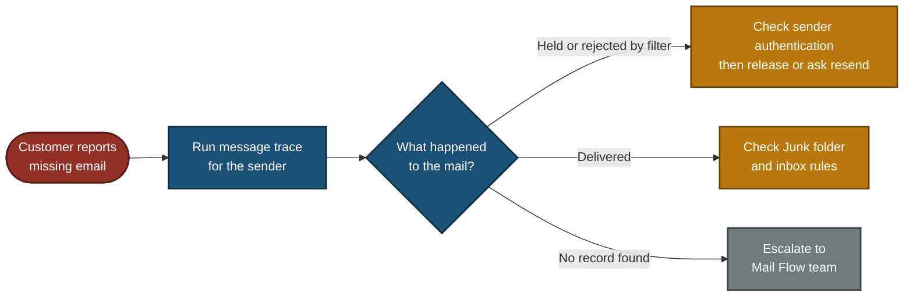

# 📞 Escalation Script — Email Delivery Failure (ESC-2026-003)

**Customer Tech Support Portfolio — Escalation Scripts**

Customer Scripts · Escalation Note · Decision Path · Update Flow

A customer says important emails from a client are not arriving, and contracts are being missed. The mail may be held by a security filter, rejected, or sitting in Junk. This file gives the scripts a support agent uses: how to find out what happened to the mail, how to recover it safely, and what to write in the escalation note.

> [!NOTE]
> Simulated. The customer, domains, email addresses, times and trace results are examples. `example` domains are reserved for documentation. Tool names and rule names differ between companies. No real customer data is used.

---

## 📑 Table of Contents

1. [At a Glance](#at-a-glance)
2. [Escalation Record](#escalation-record)
3. [Project Background](#project-background)
4. [Escalation Flow](#escalation-flow)
5. [When to Escalate](#when-to-escalate)
6. [Customer Scripts](#customer-scripts)
7. [Internal Escalation Note](#internal-note)
8. [Decision Path](#decision-path)
9. [Project Summary](#project-summary)
10. [Common Mistakes & Fixes](#mistakes-fixes)
11. [Scope & Limitations](#scope-limitations)
12. [What I Learned](#what-i-learned)
13. [Skills Demonstrated](#skills-demonstrated)

---

## 📊 At a Glance

| 💬 Customer Scripts | 🔍 Diagnostic Checks | 🧭 Flowcharts | 🛠️ Mistakes Covered |
|:---:|:---:|:---:|:---:|
| **4** | **5** | **2** | **6** |

---

## 🎫 Escalation Record

| Field | Value |
|---|---|
| **Escalation #** | ESC-2026-003 (sample) |
| **Priority** | P1 (Critical) — contract emails are missing, with direct business risk |
| **Status** | Escalated to Email Security Team |
| **Category** | Email delivery / security filtering |
| **Customer** | Sales director, Karachi office (role-played) |
| **Sender** | `contracts@clientcorp.example` (sample) |
| **Symptom** | Emails from this client have not arrived in 24 hours. 3 contract emails are missing |
| **Scope** | Reported by one user. Other users to be checked |

> *"Critical client emails are not reaching me. I've missed 3 important contracts today."*

---

## 📖 Project Background

"Email not arriving" can mean four different things: the mail was held by a filter, rejected, delivered to Junk, or never reached the company at all. The fix is different for each. A good escalation finds out which one it is before saying anything about the cause.

- **Customer Scripts:** What to say at each stage, without stating a cause early.
- **Internal Escalation Note:** The trace evidence the Email Security Team needs.
- **Decision Path:** What happened to the mail, and what to do for each case.
- **Update Flow:** When the customer hears from you.

---

## ⏱️ Escalation Flow

---

## 🚦 When to Escalate

Escalate to the **Email Security Team** when:

- The trace shows the mail was held or blocked by a filter rule, and Tier 1 cannot change filter rules.
- More than one user or more than one sender is affected by the same rule.
- Business-critical mail (contracts, payments) is involved.

Escalate to the **Mail Flow / Network team** instead when:

- The trace finds no record of the mail at all, and other senders are also missing. This can be a mail routing problem, not a filter problem.

Do **not** escalate yet if the mail is sitting in the customer's Junk folder or caught by their own inbox rule. Fix it with the customer.

---

## 💬 Customer Scripts

### Script 1 — First reply (within 15 minutes) ✅

> "Hello [Name], I understand these are contract emails and I am treating this as urgent. I am starting to trace them now. To find them fast, I need three things: the sender's email address, the rough time each email was sent, and any 'message could not be delivered' reply the sender got. While I trace, please check your Junk folder. I will update you by [time, 30 minutes from now]."

**Why it works:** it gives the customer something to do, asks for exactly what a trace needs, and sets an update time. It does not name a cause yet.

### Script 2 — Cause found, releasing the mail ✅

> "Hi [Name], I found your emails. Our security filter held three messages from `contracts@clientcorp.example` in quarantine. I have checked that the sender is genuine and the attachments are clean, and I am releasing them to your inbox now. They should appear within a few minutes. If any other email is missing, tell me the sender and I will check that too."

**Use this script only after the sender check and attachment scan are done.**

### Script 3 — Escalation update ✅

> "Hi [Name], your three emails are delivered. I have also sent this to our Email Security Team to review the rule that held them, so it does not happen again. For now I have added a narrow exception for that one sender, which stays in place until the team finishes the review on [date]. I will update you by [time]."

**Why it works:** it says what is fixed, what is still open, and what the temporary step is and when it ends.

### Script 4 — Resolution, including mail that cannot be recovered ✅

> "Hi [Name], here is the final update. Three messages were held by our filter and are now in your inbox. [One message was rejected before it reached us, so no copy exists. Please ask the sender to send it again, and tell me if it does not arrive.] The Email Security Team has reviewed the rule and [changed it / kept it]. Your sender's exception ends on [date]. If a client email goes missing again, call me with the sender and the time and I will trace it first."

---

## 📋 Internal Escalation Note

Copy this into the ticket when you escalate.

| Field | Value |
|---|---|
| **Ticket #** | ESC-2026-003 (sample) |
| **Priority** | P1 (Critical) |
| **Escalated to** | Email Security Team |
| **Customer** | Sales director, `contracts@clientcorp.example` is the sender |
| **Impact** | 3 contract emails missing for about 24 hours |
| **Customer contacted** | Yes, next update due [time] |

### What I checked

| Check | Where | Result (sample) |
|---|---|---|
| Junk folder and inbox rules | Customer mailbox | Nothing found |
| What happened to the mail | Message trace for the sender, last 24 hours | 3 messages, status "Quarantined" |
| Why it was held | Trace detail | Matched an attachment rule (rule name from the filter) |
| Sender authentication | Message header, `Authentication-Results` | SPF pass, DKIM pass, DMARC pass |
| Attachment content | Filter scan result | PDF files, no malware found |

### 🎯 What this tells us

- The mail reached us and was held by an attachment rule, not lost.
- The sender passes authentication, so it is very likely genuine.
- Whether the rule is too strict is for the Email Security Team to decide. Support only reports what the rule did.

### Actions already taken

1. Released the 3 held messages to the customer after the sender and attachment checks.
2. Added a **narrow, time-limited** exception for `contracts@clientcorp.example` only, ending [date].

### Request to the Email Security Team

1. Review the attachment rule that held PDF contracts from an authenticated sender.
2. Check how many other users and senders were held by the same rule in the last 7 days.
3. Decide whether to change the rule or keep the exception, then close the temporary exception.
4. Do not allow the whole `clientcorp.example` domain.

**Customer communication status:** mail released, next update due [time].

---

## 🧭 Decision Path

---

## 📝 Project Summary

| Part | Tooling | Key Point |
|---|---|---|
| Customer Scripts | Plain language | Ask for the trace details first, state the cause only after the evidence |
| Diagnostics | Message trace, message headers | Find out whether the mail was held, rejected, delivered or never seen |
| Escalation Note | Ticket fields | Evidence, actions taken, and a clear request to the Email Security Team |
| Decision Path | Flowchart | Held or rejected, delivered, or no record, each with its own next step |

---

## 🛠️ Common Mistakes & Fixes

| ❌ Mistake | ✅ Fix |
|---|---|
| Allowing a whole sender domain without checking it | Anyone can fake a domain. Check SPF, DKIM and DMARC, allow the single sender only, and set an end date |
| Calling the exception "temporary" in the reply and "permanent" in the note | Say what it is and when it ends, the same everywhere |
| Releasing held mail without checking the attachment | Look at the filter's scan result first. Held mail may be held for a good reason |
| Saying "all emails are recovered" | Only held mail can be released. Mail rejected before it reached us has no copy, so the sender must resend |
| Telling the customer the cause in the first reply | Trace first. The first reply asks for details and gives an update time |
| Promising a weekly report or a permanent allow-list | Promise only what you control. Rule changes are the Email Security Team's decision |

---

## 🚧 Scope & Limitations

- **Scripts only:** No live mail system. Names, addresses, times and trace results are examples.
- **One scenario:** Contract emails held by an attachment filter rule.
- **Tools differ:** Message trace, quarantine and header names depend on the email system used.
- **Company rules differ:** Who can release held mail, and who can create exceptions, depends on the company.
- **Not tested on a real customer.**

---

## 🧠 What I Learned

- **"Not arriving" has four different causes.** The message trace tells which one.
- **Held mail and rejected mail are different.** Held mail can be released. Rejected mail must be sent again.
- **Check the sender before releasing or allowing.** Domains can be faked, so SPF, DKIM and DMARC results matter.
- **Keep exceptions narrow and time-limited,** and say the end date out loud.
- **Support reports what the rule did.** Whether the rule is wrong is the security team's call.

---

## 🛠️ Skills Demonstrated

- Writing clear scripts for an urgent business-impact ticket
- Tracing a missing email and reading message trace results
- Reading SPF, DKIM and DMARC results to judge a sender
- Releasing held mail safely and setting narrow exceptions
- Writing an escalation note that separates evidence from decisions
- Documenting scope and limits honestly

🛠️ **[Decision Path](#decision-path)**

