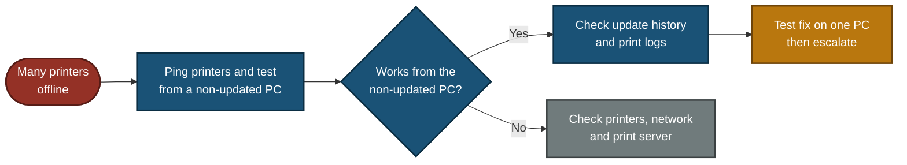

# 📞 Escalation Script — Printers Down After Windows Update (ESC-2026-004)

**Customer Tech Support Portfolio — Escalation Scripts**

Customer Scripts · Escalation Note · Decision Path · Update Flow

An office reports that all 20 printers stopped working after a Windows update, and three departments cannot print. A rollback or a block on the update can fix printing but can also leave computers open to security problems. This file gives the scripts a support agent uses: how to check the evidence, how to talk to the customer without naming a cause too early, and what to write in the escalation note.

> [!NOTE]
> Simulated. The customer, departments, user counts, dates and log results are examples. Update tools and policy names differ between companies. No real customer data is used.

---

## 📑 Table of Contents

1. [At a Glance](#at-a-glance)
2. [Escalation Record](#escalation-record)
3. [Project Background](#project-background)
4. [Escalation Flow](#escalation-flow)
5. [When to Escalate](#when-to-escalate)
6. [Customer Scripts](#customer-scripts)
7. [Internal Escalation Note](#internal-note)
8. [Decision Path](#decision-path)
9. [Project Summary](#project-summary)
10. [Common Mistakes & Fixes](#mistakes-fixes)
11. [Scope & Limitations](#scope-limitations)
12. [What I Learned](#what-i-learned)
13. [Skills Demonstrated](#skills-demonstrated)

---

## 📊 At a Glance

| 💬 Customer Scripts | 🔍 Diagnostic Checks | 🧭 Flowcharts | 🛠️ Mistakes Covered |
|:---:|:---:|:---:|:---:|
| **4** | **5** | **2** | **6** |

---

## 🎫 Escalation Record

| Field | Value |
|---|---|
| **Escalation #** | ESC-2026-004 (sample) |
| **Priority** | P1 (Critical) — three departments, about 75 users, and no working way to print yet |
| **Status** | Escalated to Systems Team |
| **Category** | Printing / Windows update |
| **Customer** | Office manager, Lahore office (role-played) |
| **Affected** | 20 printers, Finance, HR and Sales |
| **Symptom** | Printing failed on the morning after a Windows update |
| **Scope** | To confirm: all PCs or only updated ones, and all printer models or only some |

> *"All 20 printers in our office stopped working after the Windows update. Finance, HR and Sales are all stuck."*

---

## 📖 Project Background

Printers do not get Windows updates. The computers and the print server do. So when many printers fail right after an update, the question is where the update landed and what it changed. Some updates change printing security rules, so drivers that worked before may stop loading. The fix can touch security, so it needs a test and a decision, not a guess.

- **Customer Scripts:** What to say at each stage, without naming a cause before the test.
- **Internal Escalation Note:** The evidence the Systems Team needs.
- **Decision Path:** Whether the fault is on the computers or on the printers and network.
- **Update Flow:** When the customer hears from you.

---

## ⏱️ Escalation Flow

---

## 🚦 When to Escalate

Escalate to the **Systems Team** when:

- Many computers lost printing after the same update, and the fix needs a rollback, a driver push or an update policy change. Tier 1 cannot do these.

Also bring in the **Security team** when:

- The fix means removing a security update. Some updates close real holes, so removing one is a risk decision.

Escalate to the **Network team** instead when:

- The printers do not answer a ping or their web page. That points to a network or printer fault, not an update.

Do **not** escalate yet if only one computer or one printer is affected. Fix it as a normal ticket.

---

## 💬 Customer Scripts

### Script 1 — First reply (within 15 minutes) ✅

> "Hello [Name], I understand three departments cannot print and I am treating this as urgent. I am checking it now. To narrow it down, I need four things: roughly when printing stopped, whether every computer is affected or only some, whether all printers are down or only certain models, and any error message on screen. For urgent documents, if one computer in your office can still print, please use it for now. I will update you by [time, 30 minutes from now]."

**Why it works:** it asks the questions that separate a computer problem from a printer problem, and it gives a workaround without promising a fix.

### Script 2 — Evidence found, test in progress ✅

> "Hi [Name], here is what I have. The printers themselves respond normally. The computers that cannot print all installed the same Windows update the night before, and a computer that has not had the update still prints. This points strongly to the update. I will confirm it by testing a fix on one computer first, because the fix may affect security and I do not want to apply it to everyone untested. I have sent this to our Systems Team. I will update you by [time]. I cannot give a finish time until the test is done."

**Why it works:** it says "points to", not "is the cause". It explains why a test comes first.

### Script 3 — Fix confirmed on the test computer ✅

> "Hi [Name], the fix worked on the test computer. The Systems Team will now apply it department by department. Which department should go first? Each computer may need one restart. I will update you after each department."

### Script 4 — Resolution ✅

> "Hi [Name], printing is working again in all three departments. The Windows update will stay paused for these computers until [date], while we get a compatible driver from the printer maker. You do not need to do anything. If any printer stops again, call me with the computer name and the error, and I will check it first."

---

## 📋 Internal Escalation Note

Copy this into the ticket when you escalate.

| Field | Value |
|---|---|
| **Ticket #** | ESC-2026-004 (sample) |
| **Priority** | P1 (Critical) |
| **Escalated to** | Systems Team (Security team to be consulted) |
| **Customer** | Office manager, Lahore office |
| **Impact** | 3 departments, about 75 users cannot print |
| **Workaround given** | Use one computer that has not taken the update, for urgent documents |
| **Customer contacted** | Yes, next update due [time] |

### What I checked

| Check | Where | Result (sample) |
|---|---|---|
| Scope | Affected users and printers | 20 printers, 3 departments, all computers that took the update |
| Printers reachable | Ping and printer web page | Replies. The printers are up |
| Control test | Test page from a computer without the update | Prints. Printers and print path are fine |
| Error on affected computers | Event Viewer, PrintService Admin log | Driver fails to load (sample message) |
| Update history | Windows Update history | Same update installed on all affected computers the night before |

### 🎯 What this tells us

- The printers and the network are fine. Only computers with the update fail.
- The timing matches the update on every affected computer.
- **Likely cause:** the update changed how printer drivers load. This is not confirmed until a fix works on one test computer.

### Request to the Systems Team

1. Test one fix on a single affected computer: either a compatible or universal driver, or removing the update. Do not push to everyone first.
2. If removing the update is needed, agree it with the Security team before doing it.
3. Apply the fix department by department.
4. Pause the update for this group **with an end date**, not forever.
5. Ask the printer vendor for a compatible driver.
6. Review how the update reached every computer at once, and use a test group first in future.

**Customer communication status:** workaround given, next update due [time].

---

## 🧭 Decision Path

---

## 📝 Project Summary

| Part | Tooling | Key Point |
|---|---|---|
| Customer Scripts | Plain language | Ask scope questions, give a workaround, say "points to" until tested |
| Diagnostics | Ping, test page, Event Viewer, update history | A computer without the update separates a PC fault from a printer fault |
| Escalation Note | Ticket fields | Evidence, a likely cause marked unconfirmed, and a staged fix request |
| Decision Path | Flowchart | Works from a non-updated PC means the update side, otherwise the printers or network |

---

## 🛠️ Common Mistakes & Fixes

| ❌ Mistake | ✅ Fix |
|---|---|
| Naming the update as the cause before testing | Say "points to". Confirm with a fix on one computer |
| Rolling back a security update on every computer at once | Test on one computer and agree it with the Security team. Some updates close real security holes |
| Blocking the update for everyone with no end date | Pause it with an end date and a plan to re-test. Unpatched computers are a risk |
| Promising "one printer per department within the hour" | Promise a workaround and the next update time |
| Pushing a new driver to all computers untested | Test on one, then go department by department |
| Sending staff a guide on checking driver compatibility before updates | IT controls updates, not staff. The fix is a test group and staged rollout |

---

## 🚧 Scope & Limitations

- **Scripts only:** No live lab. Names, counts, dates and log results are examples.
- **One scenario:** Printing fails on computers after a Windows update, and the printers are fine.
- **Managed office assumed:** The company controls Windows updates. Tools such as Group Policy, WSUS or Intune are examples and vary.
- **Company rules differ:** Who can remove an update, and who approves it, depends on the company.
- **Not tested on a real customer.**

---

## 🧠 What I Learned

- **Printers do not take Windows updates, computers do.** Ask where the update landed.
- **A computer without the update is the best test.** It separates a PC fault from a printer fault.
- **Timing points to a cause but does not prove it.** Test a fix on one computer first.
- **Removing a security update is a risk decision,** not a quick fix.
- **Pause updates with an end date.** A block with no end date leaves computers unpatched.
- **Roll out in stages,** starting with a test group.

---

## 🛠️ Skills Demonstrated

- Writing clear scripts for an office-wide outage
- Separating a computer fault from a printer or network fault
- Reading update history and print service logs
- Weighing a quick fix against a security risk
- Writing an escalation note that separates evidence from a likely cause
- Documenting scope and limits honestly

🛠️ **[Decision Path](#decision-path)**

