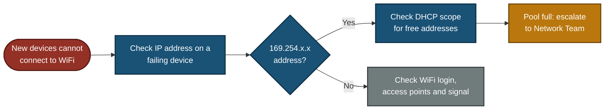

# 📞 Escalation Script — WiFi Down, DHCP Pool Exhausted (ESC-2026-005)

**Customer Tech Support Portfolio — Escalation Scripts**

Customer Scripts · Escalation Note · Decision Path · Update Flow

A whole department cannot connect to WiFi, and a client meeting starts in 30 minutes. New devices join the WiFi but get no IP address, because the DHCP address pool is full. This file gives the scripts a support agent uses: how to prove it is DHCP and not the WiFi itself, how to talk to the customer under time pressure, and what to write in the escalation note.

> [!NOTE]
> Simulated. The customer, subnet, address counts, times and scope results are examples. DHCP tool names and lease settings differ between companies. No real customer data is used.

---

## 📑 Table of Contents

1. [At a Glance](#at-a-glance)
2. [Escalation Record](#escalation-record)
3. [Project Background](#project-background)
4. [Escalation Flow](#escalation-flow)
5. [When to Escalate](#when-to-escalate)
6. [Customer Scripts](#customer-scripts)
7. [Internal Escalation Note](#internal-note)
8. [Decision Path](#decision-path)
9. [Project Summary](#project-summary)
10. [Common Mistakes & Fixes](#mistakes-fixes)
11. [Scope & Limitations](#scope-limitations)
12. [What I Learned](#what-i-learned)
13. [Skills Demonstrated](#skills-demonstrated)

---

## 📊 At a Glance

| 💬 Customer Scripts | 🔍 Diagnostic Checks | 🧭 Flowcharts | 🛠️ Mistakes Covered |
|:---:|:---:|:---:|:---:|
| **4** | **5** | **2** | **6** |

---

## 🎫 Escalation Record

| Field | Value |
|---|---|
| **Escalation #** | ESC-2026-005 (sample) |
| **Priority** | P1 (Critical) — a whole department is offline and a client meeting starts in 30 minutes |
| **Status** | Escalated to Network Team |
| **Category** | WiFi / DHCP |
| **Customer** | Marketing manager, head office (role-played) |
| **Affected** | Marketing floor, about 35 staff |
| **Network (sample)** | `10.10.40.0/24`, Marketing WiFi, address pool `10.10.40.20` to `10.10.40.250` |
| **Symptom** | Devices join the WiFi but have no internet. Devices already connected still work |

> *"Nobody in the marketing department can connect to WiFi. We have a client meeting in 30 minutes."*

---

## 📖 Project Background

When a device joins WiFi, a DHCP server hands it an IP address for a set time called a lease. If the pool of addresses is full, new devices join the WiFi but get nothing, and Windows shows a self-assigned `169.254.x.x` address. Devices already connected keep working until their lease ends. That pattern is the clue.

- **Customer Scripts:** What to say, with short update times because of the meeting.
- **Internal Escalation Note:** The scope and lease evidence the Network Team needs.
- **Decision Path:** DHCP problem or WiFi problem.
- **Update Flow:** When the customer hears from you.

---

## ⏱️ Escalation Flow

---

## 🚦 When to Escalate

Escalate to the **Network Team** when:

- A failing device shows a `169.254.x.x` address and the DHCP scope has no free addresses.
- Tier 1 cannot change DHCP leases or scope settings.

Check these before escalating as a DHCP problem:

- If devices cannot join the WiFi at all, or are asked for a password again and again, it is a WiFi login or access point problem, not DHCP.
- If one device fails and the rest work, handle it as a single-device ticket.

---

## 💬 Customer Scripts

### Script 1 — First reply (within 10 minutes, because of the meeting) ✅

> "Hello [Name], I understand the meeting is in 30 minutes and I am on this now. I will update you in 10 minutes, at [time]. Two quick questions: do the laptops show as connected to the WiFi but with no internet, and are any devices still working? For the people presenting, please have a backup ready: a phone hotspot, or a network cable if there is a wired port at the desk."

**Why it works:** the two questions match the DHCP pattern, and the backup plan protects the meeting while the real fix is found.

### Script 2 — Cause found, escalated ✅

> "Hi [Name], I found the cause. The Marketing WiFi has run out of IP addresses. Devices already connected keep working, but new ones cannot get an address. I have sent this to our Network Team to free up addresses, and I will update you by [time]. I cannot give an exact finish time until they act. Please keep the hotspot or cable backup for the presenters until I confirm."

### Script 3 — Fix applied ✅

> "Hi [Name], the Network Team has freed up addresses. Please turn the WiFi off and on again on your device to reconnect. If a device still does not connect, tell me its name and I will check it right away."

### Script 4 — Resolution ✅

> "Hi [Name], I tested [number] devices on the Marketing floor and all connect and reach the internet. The Network Team has shortened how long addresses are held, so unused ones return to the pool sooner. They are also checking whether the pool needs to be larger. If anyone cannot connect, call me with the device name and I will look at it first."

---

## 📋 Internal Escalation Note

Copy this into the ticket when you escalate.

| Field | Value |
|---|---|
| **Ticket #** | ESC-2026-005 (sample) |
| **Priority** | P1 (Critical) |
| **Escalated to** | Network Team |
| **Customer** | Marketing manager, head office |
| **Impact** | About 35 staff cannot connect new devices, client meeting in 30 minutes |
| **Workaround given** | Phone hotspot or wired port for the presenters |
| **Customer contacted** | Yes, next update due [time] |

### What I checked

| Check | Where | Result (sample) |
|---|---|---|
| IP address on a failing laptop | `ipconfig` | `169.254.x.x`. Connected to WiFi, no address from DHCP |
| Who is affected | Customer report | New connections fail. Devices already connected still work |
| DHCP scope usage | DHCP scope statistics | 231 of 231 addresses in use, 0 free |
| Lease table | DHCP lease list | About 35 leases match staff devices. Many others are phones and visitor devices last seen days ago. Lease time is 8 days |
| Other DHCP server | DHCP server address on a working device | Only the expected DHCP server answers |

### 🎯 What this tells us

- The WiFi login works. The failure is the missing IP address, so this is DHCP.
- About 35 staff cannot account for 231 leases. The long lease time lets old and visitor devices keep addresses for days.
- **Likely cause:** a long lease time, plus many short-visit devices, filled the pool. This is not confirmed until the Network Team checks the lease list.

### Request to the Network Team

1. Free addresses now: remove expired and inactive leases only. Do not delete leases of devices that are still online, as that can cause address conflicts.
2. Shorten the lease time on the WiFi scope, to a value that fits the company policy.
3. Check whether the pool can be extended inside the same subnet. If not, a larger subnet may be needed.
4. Check for a second, unauthorized DHCP server on this floor.
5. Review other floors for the same pattern, and consider an alert when a pool passes a set level, for example 80%.

**Customer communication status:** workaround given, next update due [time].

---

## 🧭 Decision Path

---

## 📝 Project Summary

| Part | Tooling | Key Point |
|---|---|---|
| Customer Scripts | Plain language | Short update times, a backup for the meeting, no invented finish time |
| Diagnostics | `ipconfig`, DHCP scope and lease list | A `169.254.x.x` address and an empty pool prove DHCP, not WiFi |
| Escalation Note | Ticket fields | Evidence, a likely cause marked unconfirmed, and a careful lease cleanup request |
| Decision Path | Flowchart | Self-assigned address means DHCP, otherwise WiFi login or access points |

---

## 🛠️ Common Mistakes & Fixes

| ❌ Mistake | ✅ Fix |
|---|---|
| Blaming "headcount growth" with no lease data | 35 staff cannot fill 231 addresses. Look at the lease list and lease time |
| Deleting all leases older than 7 days | Devices still online can lose their address and cause conflicts. Remove expired and inactive leases only, and shorten the lease time |
| Promising new addresses within 15 minutes | Extending a pool may need a new range or subnet. Promise the next update time |
| Telling users to set a static IP by hand | It can clash with DHCP addresses. Use a hotspot or a network cable |
| Assuming DHCP without checking | If devices cannot join at all, it is a WiFi login or access point fault. Check for `169.254.x.x` first |
| Promising the meeting will go fine, or a monthly report | Promise only what you control: update times and what has been tested |

---

## 🚧 Scope & Limitations

- **Scripts only:** No live network. Subnets, counts, times and scope results are examples.
- **One scenario:** A full DHCP pool on a WiFi network after long leases.
- **Tools differ:** DHCP consoles and scope setting names depend on the system in use.
- **Company rules differ:** Lease times and who can change scopes depend on the company.
- **Not tested on a real customer.**

---

## 🧠 What I Learned

- **A `169.254.x.x` address means the device got no answer from DHCP.** The WiFi login itself worked.
- **Devices already connected keep working.** That is the clue for a full pool.
- **Long lease times fill a WiFi pool** with phones and visitor devices that left days ago.
- **Clear only expired and inactive leases.** Deleting live ones can cause address conflicts.
- **Give a backup for the deadline** while the real fix is made.
- **Do not say the meeting will go fine.** Say what was tested.

---

## 🛠️ Skills Demonstrated

- Writing clear scripts for a customer with a hard deadline
- Telling a DHCP fault from a WiFi login fault with `ipconfig`
- Reading DHCP scope statistics and lease lists
- Giving safe workarounds while a fix is made
- Writing an escalation note that separates evidence from a likely cause
- Documenting scope and limits honestly

🛠️ **[Decision Path](#decision-path)**

