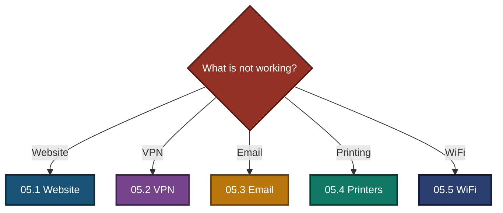
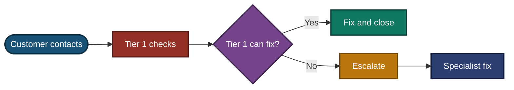

<div align="center">

# 📞 Escalation Scripts — Customer Tech Support Portfolio

**05 — Escalation Scripts**

Customer Scripts · Escalation Notes · Decision Paths · Update Flows

⬅️ **[Back to Portfolio](../README.md)**


Five escalation scripts for common support problems. Each one shows what to say to the customer, when to escalate, what evidence to attach to the escalation note, and how to make decisions without promising things an agent cannot control.

</div>

> [!NOTE]
> Simulated. All customers, domains, devices, ticket numbers, times and log results are examples. Priority levels, team names and tools differ between companies. No real customer data is used.

---

## 📑 Table of Contents

1. [At a Glance](#at-a-glance)
2. [The Five Scripts](#the-five-scripts)
3. [Project Background](#project-background)
4. [Escalation Flow](#escalation-flow)
5. [Which Script to Use](#which-script)
6. [Quick Check Table](#quick-check)
7. [Customer Communication Timeline](#comm-timeline)
8. [Support Tiers](#support-tiers)
9. [What Every Escalation Note Contains](#note-contents)
10. [Rules Used in All Five Scripts](#rules)
11. [Priority Used in These Scripts](#priority)
12. [Project Summary](#project-summary)
13. [Scope & Limitations](#scope-limitations)
14. [What I Learned](#what-i-learned)
15. [Skills Demonstrated](#skills-demonstrated)
16. [Repo Structure](#repo-structure)

---

<a id="at-a-glance"></a>
## 📊 At a Glance

| 📞 Scripts | 💬 Customer Scripts | 🔍 Diagnostic Checks | 🧭 Flowcharts | 🛠️ Mistakes Covered |
|:---:|:---:|:---:|:---:|:---:|
| **5** | **20** | **25** | **13** | **29** |

---

<a id="the-five-scripts"></a>
## 📂 The Five Scripts

| # | Script | Ticket | Priority | Escalated To | Main Evidence |
|:---:|---|---|:---:|---|---|
| 05.1 | [Website Down After DNS Change](05.1-Website-Down.md) | ESC-2026-001 | P1 | Network / DNS team | `dig` on the authoritative server vs public resolvers |
| 05.2 | [VPN Authentication Failed, Recurring](05.2-VPN-Auth-Failed.md) | ESC-2026-002 | P2 | Senior Network Engineer (Security team if the source is unknown) | Lockout events 4740 and failed sign-ins 4625 |
| 05.3 | [Email Delivery Failure](05.3-Email-Delivery-Failure.md) | ESC-2026-003 | P1 | Email Security Team | Message trace, SPF / DKIM / DMARC results |
| 05.4 | [Printers Down After Windows Update](05.4-Printer-Update-Issue.md) | ESC-2026-004 | P1 | Systems Team (Security team consulted) | Control test on a computer without the update |
| 05.5 | [WiFi Down, DHCP Pool Exhausted](05.5-WiFi-DHCP-Exhaustion.md) | ESC-2026-005 | P1 | Network Team | `169.254.x.x` address and DHCP scope statistics |

---

<a id="project-background"></a>
## 📖 Project Background

An escalation fails when the next team has to ask the same questions again, or when the customer is promised something the agent cannot deliver. A good escalation shows the evidence, says honestly what is still unknown, and gives the customer a real time for the next update.

- **Customer scripts:** First reply, evidence update, fix update and resolution, each in plain words.
- **Escalation note:** What was checked, with commands and results, and a clear request.
- **Decision path:** How to choose between causes before escalating.
- **Update flow:** When the customer hears from the agent, from first reply to close.

The DNS script (05.1) connects to the real lab ticket in [02.1 DNS Ticket](../02-Ticket-simulations/02.1-DNS-Ticket.md), where a stopped DNS service was found with client and server evidence.

---

<a id="escalation-flow"></a>
## ⏱️ Escalation Flow

All five scripts follow the same flow.


---

<a id="which-script"></a>
## 🧭 Which Script to Use

Start from the problem the customer reports and follow the line to the right script.



---

<a id="quick-check"></a>
## 🔎 Quick Check Table

| Problem | First check | What it tells you | Escalate to |
|---|---|---|---|
| Website down after DNS change | `dig` on the authoritative server, then on public resolvers | Cache delay or wrong record | Network / DNS team (Hosting team if many sites) |
| VPN keeps locking | Lockout event 4740, caller computer name | Which device sends the wrong password | Senior Network Engineer (Security team if the source is unknown) |
| Email missing | Message trace for the sender | Held, rejected, delivered or never seen | Email Security Team (Mail Flow team if no record) |
| Printing stopped | Test page from a computer without the update | Computer fault or printer fault | Systems Team (Network team if printers do not answer ping) |
| WiFi has no internet | `ipconfig` on a failing device | `169.254.x.x` means DHCP, otherwise WiFi login or access points | Network Team |

---

<a id="comm-timeline"></a>
## 💬 Customer Communication Timeline

| Stage | When | What to say | Used in |
|---|---|---|---|
| First reply | Within 15 minutes (10 when a deadline is close) | Acknowledge the problem, ask for the facts needed, give a workaround, set the next update time | Script 1 in every file |
| Evidence update | When the checks show something | What was found, said as "points to" until confirmed, and what happens next | Script 2 |
| Fix update | When a fix or exception is in place | What was done, how long it lasts, what the customer should do | Script 3 |
| Resolution | After the fix is confirmed by tests | What was tested, what is still open, who to call if it returns | Script 4 |

---

<a id="support-tiers"></a>
## 🏢 Support Tiers

This shows who owns what: support handles the customer, the specialist team handles the fix.



- **Support keeps the customer.** Even after escalation, the support agent owns the customer updates. The specialist team owns the fix.
- Tier and team names differ between companies.

---

<a id="note-contents"></a>
## 📋 What Every Escalation Note Contains

| Part | Why it is there |
|---|---|
| Ticket number and priority | The next team sees how urgent it is |
| Customer and impact | Who is affected and how badly |
| What changed | The last change before the problem, if any |
| What I checked, with results | Commands and results, so nobody repeats the same checks |
| What this tells us | Evidence first, then a **likely cause marked unconfirmed** |
| Request to the team | One clear list of what the next team should do |
| Workaround given | What the customer can do meanwhile |
| Customer communication status | When the customer was contacted and when the next update is due |

---

<a id="rules"></a>
## 🧭 Rules Used in All Five Scripts

- **Promise the next update, not the fix.** Update times are in the agent's control. Finish times usually are not.
- **Say "points to" until it is confirmed.** A timing match is not proof. Test first.
- **Evidence goes in the note.** Commands and results, not "I checked, it looks fine".
- **Give a workaround** while the real fix is made, and test it first.
- **Take the safe action.** Verify identity before an unlock. Allow a single sender, not a whole domain. Test a fix on one computer before the fleet. Clear expired leases, not live ones.
- **Do not blame the customer.** State the facts.
- **Do not promise permanent fixes, reports or guides** that the agent does not control.

---

<a id="priority"></a>
## 🚦 Priority Used in These Scripts

| Priority | Used when | Example in this folder |
|---|---|---|
| **P1 (Critical)** | A business, a department or business-critical work is stopped, and there is no workaround yet | Website down, contract emails missing, printers down in three departments, WiFi down before a client meeting |
| **P2 (High)** | One person is affected repeatedly, or the work can continue after a temporary fix | Recurring VPN lockout, unlocked after each report |

Real priority rules depend on the company.

---

<a id="project-summary"></a>
## 📝 Project Summary

| Script | Key Finding |
|---|---|
| 05.1 Website Down | Check the authoritative server first to tell a cache delay from a wrong record |
| 05.2 VPN Lockout | A lockout is a symptom. Verify identity, then find the device sending the wrong password |
| 05.3 Email Failure | Held mail can be released, rejected mail must be resent, and exceptions stay narrow |
| 05.4 Printers | A computer without the update separates a computer fault from a printer fault |
| 05.5 WiFi / DHCP | A `169.254.x.x` address and an empty pool prove DHCP, not WiFi |

---

<a id="scope-limitations"></a>
## 🚧 Scope & Limitations

- **Scripts only:** No live lab for the escalation scripts. All values are examples.
- **Five scenarios:** One problem each. Real tickets are messier.
- **Tools differ:** Log names, consoles and rule names depend on the company's systems.
- **Company rules differ:** Priority levels, team names, update times and approvals depend on the company.
- **Not tested on real customers.** The wording follows common support practice.

---

<a id="what-i-learned"></a>
## 🧠 What I Learned

- **A good escalation saves the next team a round trip.** Evidence and a clear request are the whole job.
- **Honest scripts are better than comforting ones.** An invented finish time breaks trust when it passes.
- **Correlation is not cause.** Timing points to a cause, and a test confirms it.
- **The quick fix is often the risky one.** Whole-domain allow-lists, fleet-wide rollbacks and bulk lease deletion all need care.
- **Separate what is known from what is likely** in every note.
- **Customers need a workaround and a schedule** more than a promise.

---

<a id="skills-demonstrated"></a>
## 🛠️ Skills Demonstrated

- Writing customer scripts for urgent, frustrated or deadline-driven customers
- Writing escalation notes with evidence, a likely cause and a clear request
- Telling DNS cache delays, lockouts, filter holds, update faults and DHCP faults apart
- Choosing safe actions over fast ones
- Setting update times an agent can keep
- Documenting scope and limits honestly

---

<a id="repo-structure"></a>
## 📁 Repo Structure

```text
05-Escalation-scripts/
|-- README.md
|-- 05.1-Website-Down.md
|-- 05.2-VPN-Auth-Failed.md
|-- 05.3-Email-Delivery-Failure.md
|-- 05.4-Printer-Update-Issue.md
`-- 05.5-WiFi-DHCP-Exhaustion.md
```

<div align="center">

⬅️ **[Back to Portfolio](../README.md)** · 🛠️ **[Escalation Flow](#escalation-flow)** · 📂 **[The Five Scripts](#the-five-scripts)**

</div>
